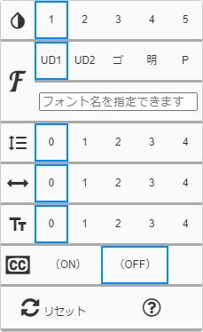

{{first:2020-06-25}}

# このサイトのアクセシビリティツールについて

このサイト左上にあるアクセシビリティアイコン（<i class="fa fa-universal-access" aria-hidden="true"></i>）を押すと、次のようなパネルが開きます。

<figure>

</figure>

青い四角（□）で現在の設定が示されています。

それぞれどういう機能があるかは、ボタンを押してご確認ください。詳しくは次のとおりです。

<table class="bordered slim">
<thead>
  <tr><th>アイコン</th><th>意味</th><th>内容</th></tr>
</thead>
<tbody>
  <tr>
    <th><i class="icon-invert_colors_on label" aria-hidden="true" alt="テーマ"></i></th><th>テーマ</th>
    <td>配色やコントラストの異なるテーマ5種類から選べます。</td>
  </tr>
  <tr>
    <th><i class="icon-font label" aria-hidden="true" alt="フォント"></i></i></th><th style="white-space:nowrap">フォント</th>
    <td>規定のフォント5種類から選ぶか、任意のフォントを指定できます。</td>
  </tr>
  <tr>
    <th><i class="icon-format_line_spacing label" aria-hidden="true" alt="行間隔"></i></th><th>行間隔</th>
    <td>行間隔を5段階で選べます。</td>
  </tr>
  <tr>
    <th><i class="fa fa-arrows-h label" aria-hidden="true" alt="文字間隔"></i></th><th style="white-space:nowrap">文字間隔</th>
    <td>文字間隔を5段階で選べます。</td>
  </tr>
  <tr>
    <th><i class="icon-text_fields label" aria-hidden="true" alt="文字サイズ"></i></th><th>文字 サイズ</th>
    <td>文字サイズを5段階で選べます。</td>
  </tr>
  <tr>
    <th><i class="fa fa-cc" aria-hidden="true"></i></th><th>ルビ</th>
    <td>漢字にふりがなをつけます。この機能はまだ実装されていません。</td>
  </tr>
  <tr>
    <th><i class="fa fa-refresh" aria-hidden="true"></i></th><th>リセット</th>
    <td>初期設定状態に戻します。</td>
  </tr>
  <tr>
    <th><i class="fa fa-question-circle" aria-hidden="true"></i></th><th>説明へ</th>
    <td>この解説ページに移動します。</td>
  </tr>
</tbody>
</table>

## UDフォントの設定について

UDフォントは次の優先度で設定されます。

<table class="bordered slim">
<caption style="text-align:left"><h3 style="margin:0">UD1を選んだ場合</h3></caption>
<thead>
  <tr><th>優先度</th><th>フォント名</th><th>備考</th></tr>
</thead>
<tbody>
    <tr><th style="white-space:nowrap">1 （最優先）</th><td style="white-space:nowrap">UD デジタル 教科書体 N-R</td><td>Windows10に標準でインストールされています。</td></tr>
    <tr><th>2</th><td>BIZ UDゴシック Regular</td><td rowspan="3" style="white-space:initial;">October 2018 Updateが導入されているWindows10にはインストールされています。もしくは<a href="https://www.morisawa.co.jp/products/fonts/bizplus/">こちらの「全3書体MORISAWA BIZ+ 無償版」</a>から無料でダウンロードすることができます。</td></tr>
    <tr><th>3</th><td>BIZ UDGothic</td></tr>
    <tr><th>4</th><td>BIZ UDMincho</td></tr>
    <tr><th>5</th><td>A-OTF UD新丸ゴ Pr6N</td><td style="white-space:initial;">AdobeのCreative Cloudに加入しているとインストールできます。</td></tr>
  </tr>
</tbody>
</table>

<table class="bordered slim">
<caption style="text-align:left"><h3 style="margin:0">UD2を選んだ場合</h3></caption>
<thead>
  <tr><th>優先度</th><th>フォント名</th><th>備考</th></tr>
</thead>
<tbody>
    <tr><th>1 （最優先）</th><td>UDデジタル教科書体 R</td><td style="white-space:initial;"><a href="https://typesquare.com/ja/">TypeSquare</a>に登録し、無料で使わせていただいているWebフォントです。1万ページビューを超えると使えなくなります。</td></tr>
    <tr><th>2</th><td>A-OTF UD新丸ゴ Pr6N</td><td rowspan="4">上表の説明をご参照ください。</td></tr>
    <tr><th>3</th><td>BIZ UDゴシック Regular</td></tr>
    <tr><th>4</th><td>BIZ UDGothic</td></tr>
    <tr><th>5</th><td>BIZ UDMincho</td></tr>
  </tr>
</tbody>
</table>

### 任意のフォントを指定する場合

お使いのPCやスマートフォンにインストールされているお好きなフォント名を、フォント名記入欄に入力してください。

#### OS標準搭載フォント

各OSに標準で搭載されているフォント名の一覧はこちらのサイトで確認できます。

[各OSの標準搭載フォント一覧へのリンク集](https://parashuto.com/rriver/development/preinstalled-font-list-by-operating-system)

<table class="bordered slim">
<caption style="text-align:left">Windows10に標準搭載されている日本語フォント一例</caption>
<thead>
  <tr><th>ファミリー</th><th>フォント名</th><th>設定する</th></tr>
</thead>
<tbody>
  <tr><td rowspan="4">BIZ UD ゴシック</td><td>BIZ UDGothic</td><td><button onclick="a11ySetFontFamily('BIZ UDGothic');">このフォントに設定</button></td></tr>
  <tr><td>BIZ UDGothic Bold</td><td><button onclick="a11ySetFontFamily('BIZ UDGothic Bold');">このフォントに設定</button></td></tr>
  <tr><td>BIZ UDPGothic</td><td><button onclick="a11ySetFontFamily('BIZ UDPGothic');">このフォントに設定</button></td></tr>
  <tr><td>BIZ UDPGothic Bold</td><td><button onclick="a11ySetFontFamily('BIZ UDPGothic Bold');">このフォントに設定</button></td></tr>
  <tr><td rowspan="2">BIZ UD 明朝</td><td>BIZ UDMincho Medium</td><td><button onclick="a11ySetFontFamily('BIZ UDMincho Medium');">このフォントに設定</button></td></tr>
  <tr><td>BIZ UDPMincho Medium</td><td><button onclick="a11ySetFontFamily('BIZ UDPMincho Medium');">このフォントに設定</button></td></tr>
  <tr><td>メイリオ</td><td>Meiryo</td><td><button onclick="a11ySetFontFamily('Meiryo');">このフォントに設定</button></td></tr>
  <tr><td>MS明朝</td><td>MS Mincho</td><td><button onclick="a11ySetFontFamily('MS Mincho');">このフォントに設定</button></td></tr>
  <tr><td rowspan="6">UDデジタル教科書体</td><td>UD Digi Kyokasho N-B</td><td><button onclick="a11ySetFontFamily('UD Digi Kyokasho N-B');">このフォントに設定</button></td></tr>
  <tr><td>UD Digi Kyokasho NK-B</td><td><button onclick="a11ySetFontFamily('UD Digi Kyokasho NK-B');">このフォントに設定</button></td></tr>
  <tr><td>UD Digi Kyokasho NK-R</td><td><button onclick="a11ySetFontFamily('UD Digi Kyokasho NK-R');">このフォントに設定</button></td></tr>
  <tr><td>UD Digi Kyokasho NP-B</td><td><button onclick="a11ySetFontFamily('UD Digi Kyokasho NP-B');">このフォントに設定</button></td></tr>
  <tr><td>UD Digi Kyokasho NP-R</td><td><button onclick="a11ySetFontFamily('UD Digi Kyokasho NP-R');">このフォントに設定</button></td></tr>
  <tr><td>UD Digi Kyokasho N-R</td><td><button onclick="a11ySetFontFamily('UD Digi Kyokasho N-R');">このフォントに設定</button></td></tr>
  <tr><td rowspan="3">游明朝</td><td>Yu Mincho Light</td><td><button onclick="a11ySetFontFamily('Yu Mincho Light');">このフォントに設定</button></td></tr>
  <tr><td>Yu Mincho Regular</td><td><button onclick="a11ySetFontFamily('Yu Mincho Regular');">このフォントに設定</button></td></tr>
  <tr><td>Yu Mincho Demibold</td><td><button onclick="a11ySetFontFamily('Yu Mincho Demibold');">このフォントに設定</button></td></tr>
</tbody>
</table>

<table class="bordered slim">
<caption style="text-align:left">iOS13, macOS Big Surに標準搭載されている日本語フォント一例</caption>
<thead>
  <tr><th>ファミリー</th><th>フォント名</th><th>iOS 13</th><th>macOS Big Sur</th><th>設定する</th></tr>
</thead>
<tbody>
  <tr><td>ヒラギノ丸ゴ</td><td>HiraMaruProN-W4</td><td>〇</td><td>〇</td><td><button onclick="a11ySetFontFamily('HiraMaruProN-W4');">このフォントに設定</button></td></tr>
  <tr><td rowspan="2">ヒラギノ明朝</td><td>HiraMinProN-W3</td><td>〇</td><td>〇</td><td><button onclick="a11ySetFontFamily('HiraMinProN-W3');">このフォントに設定</button></td></tr>
  <tr><td>HiraMinProN-W6</td><td>〇</td><td>〇</td><td><button onclick="a11ySetFontFamily('HiraMinProN-W6');">このフォントに設定</button></td></tr>
  <tr><td rowspan="10">ヒラギノ角ゴシック</td><td>HiraginoSans-W0</td><td>×</td><td>〇</td><td><button onclick="a11ySetFontFamily('HiraginoSans-W0');">このフォントに設定</button></td></tr>
  <tr><td>HiraginoSans-W1</td><td>×</td><td>〇</td><td><button onclick="a11ySetFontFamily('HiraginoSans-W1');">このフォントに設定</button></td></tr>
  <tr><td>HiraginoSans-W2</td><td>×</td><td>〇</td><td><button onclick="a11ySetFontFamily('HiraginoSans-W2');">このフォントに設定</button></td></tr>
  <tr><td>HiraginoSans-W3</td><td>〇</td><td>〇</td><td><button onclick="a11ySetFontFamily('HiraginoSans-W3');">このフォントに設定</button></td></tr>
  <tr><td>HiraginoSans-W4</td><td>×</td><td>〇</td><td><button onclick="a11ySetFontFamily('HiraginoSans-W4');">このフォントに設定</button></td></tr>
  <tr><td>HiraginoSans-W5</td><td>×</td><td>〇</td><td><button onclick="a11ySetFontFamily('HiraginoSans-W5');">このフォントに設定</button></td></tr>
  <tr><td>HiraginoSans-W6</td><td>〇</td><td>〇</td><td><button onclick="a11ySetFontFamily('HiraginoSans-W6');">このフォントに設定</button></td></tr>
  <tr><td>HiraginoSans-W7</td><td>〇</td><td>〇</td><td><button onclick="a11ySetFontFamily('HiraginoSans-W7');">このフォントに設定</button></td></tr>
  <tr><td>HiraginoSans-W8</td><td>×</td><td>〇</td><td><button onclick="a11ySetFontFamily('HiraginoSans-W8');">このフォントに設定</button></td></tr>
  <tr><td>HiraginoSans-W9</td><td>×</td><td>〇</td><td><button onclick="a11ySetFontFamily('HiraginoSans-W9');">このフォントに設定</button></td></tr>
</tbody>
</table>

<table class="bordered slim">
<caption style="text-align:left">Androidに標準搭載されている日本語フォント一例</caption>
<thead>
  <tr><th>ファミリー</th><th>フォント名</th><th>設定する</th></tr>
</thead>
<tbody>
  <tr><td>Noto Sans</td><td>Noto Sans CJK JP</td><td><button onclick="a11ySetFontFamily('Noto Sans CJK JP');">このフォントに設定</button></td></tr>
</tbody>
</table>

#### 任意のインストールフォント

また、ご自身でインストールしたフォントも指定できます。

たとえば、[MORISAWA BIZ+](https://www.morisawa.co.jp/products/fonts/bizplus/)から無償のフォント「MORISAWA BIZ+無償版」をダウンロードしてインストールした場合、次の画像に示したように、フォント名記入欄に「BIZ UD明朝」と記入することで該当のフォントを使うことができます。

<figure>

</figure>
