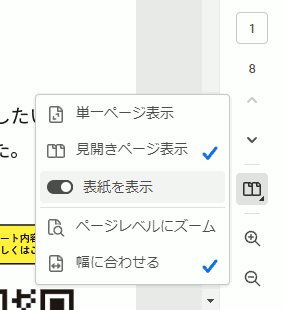

{{first:2023-04-15}}

{{description:小平市議会議員 安竹洋平の政治活動レポート・ふらっとレポートの令和5年春号です}}

# ふらっとレポート令和5年春号

ご覧いただきありがとうございます。拡大ボタンで全画面表示になります。

PCでご覧の場合、フルスクリーンモードのボタンを押してから次のように選んでいただくと見やすくなります。

- 「見開きページ表示」にチェック
- 「表紙を表示」をオン

## 関連リンク

### （P4～P5）小平市議・安竹洋平のハイライト

- [回田町の開発](https://yasutakeyohei.com/books/yasutake/ippan/r1/9-gatu/tochi-jourei-keisi.html)
- [ディスレクシアまとめ](https://yasutakeyohei.com/books/dyslexia/)
- [情緒固定級の請願→開級へ](https://yasutakeyohei.com/books/yasutake/ippan/r4/9-gatu/3-joutyo-kotei-school-bus.html)
- [記録更新が続く合気公園整備](https://sagawa-aiki-park.com/keii-2/)
- [放課後等デイサービス・決議が補助金に](https://yasutakeyohei.com/books/reiwa3/20210907_teireikai/giin-gian-41.html)
- [全会一致のマスク・黙食請願その後](https://www.kodaira-kodomo.com/)
- [いじめ重大事態について（1）](https://yasutakeyohei.com/books/yasutake/ippan/r4/3-gatu/2-ijime-taiou-minaosi.html)
- [いじめ重大事態について（2）](https://yasutakeyohei.com/books/yasutake/ippan/r4/6-gatu/1-judai-jitai-kodomo-chusin.html)
- [いじめ重大事態について（3）](https://yasutakeyohei.com/books/yasutake/ippan/r4/9-gatu/1-judai-hitai-kyogi-toben.html)
- [いじめ重大事態について・いじめ対応フロー図](https://yasutakeyohei.com/books/yasutake/sonota/ijime/ijime-judai-jitai-flow.html)
- [東京サレジオ学園北側土地売却と、その後の大規模開発](https://yasutakeyohei.com/books/yasutake/ippan/r4/9-gatu/2-tokyo-saresio-kaihatu.html)

### （P6）特別支援学級の交通支援

- [羽村市タクシー通学事業についての調査と提案](./pdfs/hamura-taxi.pdf)
- [情緒固定級理想の開設に向けて→まんまる会](https://misaki2893.wixsite.com/manmaru1)

