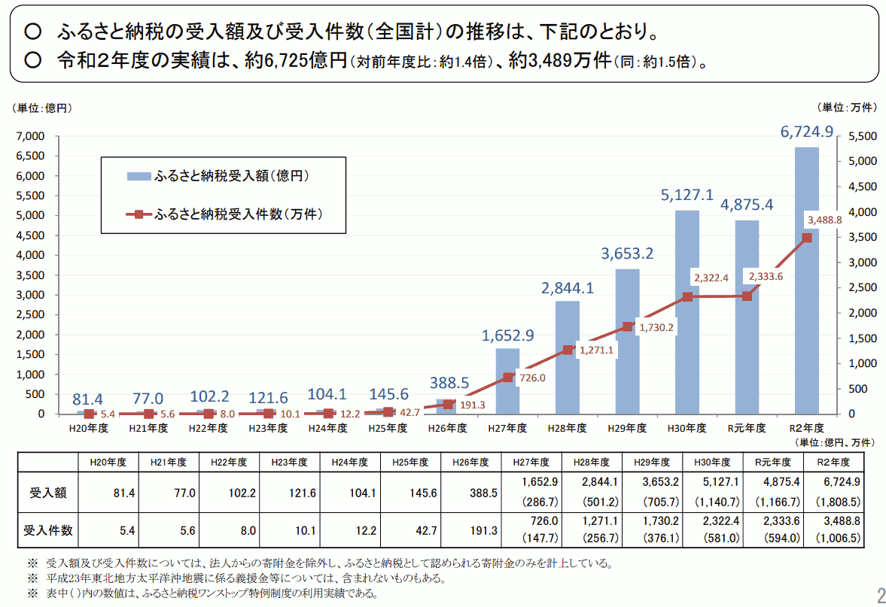
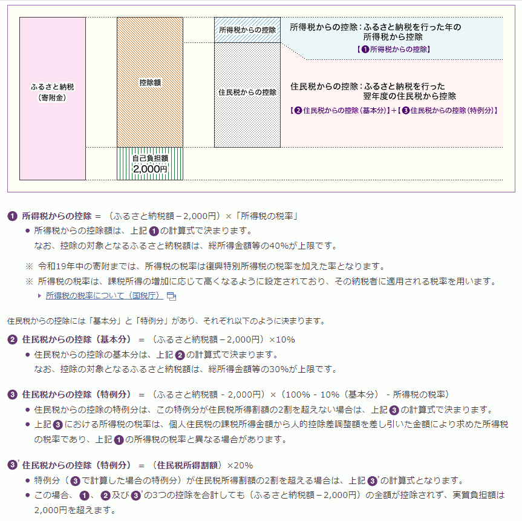
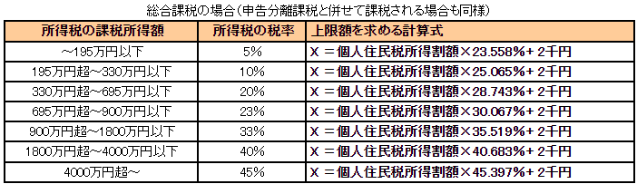

{{first:2020-12-28}}

{{description:小平市議会議員 安竹洋平の令和元年度12月定例会における一般質問の1件目についてまとめています。}}

# （1）ふるさと納税の健全な活用と、指定寄附制度の拡充で市民参加の推進を

<a href="https://ssp.kaigiroku.net/tenant/kodaira/SpMinuteView.html?council_id=1101&schedule_id=17&minute_id=176&is_search=true">📄会議録を見る</a>

<fieldset class="pnt">
  <legend><h2> まとめ </h2></legend>

小平市はふるさと納税制度を活用せず、そのため市税の流出額は、平成30年度までの累計で約6億円に上り、年々流出額は約1億円ずつ増加しています。にもかかわらず「他市の財源を奪う」ため制度を活用しないとしており、その姿勢には大きな問題があります。制度本来の趣旨で活用すれば、よいことずくめなはず。実は流出額の4分の3が交付税として戻されることなど、重要な情報も得ました。なおさら活用すべきです。また、上水南町の旧佐川邸公園にもふるさと納税が活用できるような仕組みを設けるよう訴えました。

ここでの答弁も参考になり、旧佐川邸公園の整備にふるさと納税が活用されるという画期的な結末へ進んでいきます😁

---

- ふるさと納税の大幅流出と増大をどう捉えているか → 市の財政に大きく影響する
- 市民全員がふるさと納税を最大限使った場合、流出額想定は → 約28億円😱
- 対策は → 市報や財政白書で、市の歳入が減少していることを伝えている
- 東京都知事を通じて要請の具体的内容は → 制度見直しを行うよう国への働きかけ
- 地方交付税の交付団体にはふるさと納税流出額の4分の3が戻るのか → そのとおり
- 市民が市にふるさと納税しても交付税で4分の3戻るか → 戻る、トータルプラスか
- 寄附金使途の限定指定が可能な仕組みの導入を → 管理上の課題が多く難しい
- 旧佐川邸公園整備のためふるさと納税制度整備を → 条件つきなので扱いしない

</fieldset>

<button onclick='showPDF("./201912-ippan-situmon-yasutake-1.pdf")' class="pdf-view-button">
<i class="fa fa-file-pdf-o" aria-hidden="true"></i> 一般質問通告書
</button>

## 主な質疑

目次

- **[今回質問する理由](#今回質問する理由)**
  - [ふるさと納税本来の主旨](#ふるさと納税本来の主旨)
  - [制度を批判的に捉えたまま莫大な損失を放置するのか](#制度を批判的に捉えたまま莫大な損失を放置するのか)
  - [小平市からの流出額推移](#小平市からの流出額推移)
  - [発想の転換を](#発想の転換を)
  - [日本は寄附文化が育っていない](#日本は寄附文化が育っていない)
  - [寄附文化が広まることで、みんなが暮らしやすくなる](#寄附文化が広まることでみんなが暮らしやすくなる)
- **[ふるさと納税の大幅な損失とその増大を市はどう捉え、対策しているか](#ふるさと納税の大幅な損失とその増大を市はどう捉え対策しているか)**
- **[東京都市長会に制度の変更を要望している内容は](#東京都市長会に制度の変更を要望している内容は)**
- **[ふるさと納税について詳しく](#ふるさと納税について詳しく)**
  - [控除額と上限額について](#控除額と上限額について)
    - tips:[ふるさと納税の控除額と上限額の計算](#ふるさと納税の控除額と上限額の計算)
    - tips:[目安として「住民税所得割額の2割」は少ないのでは？](#目安として住民税所得割額の2割は少ないのでは？)
  - [市民全員がふるさと納税を最大限使った場合、流出額はどれくらいになるか](#市民全員がふるさと納税を最大限使った場合流出額はどれくらいになるか)
  - [交付団体には、ふるさと納税流出分の4分の3が交付税で返る](#交付団体にはふるさと納税流出分の4分の3が交付税で返る)
  - [小平市民が小平市にふるさと納税するとどうなるか](#小平市民が小平市にふるさと納税するとどうなるか)
  - [企画政策部長の改革アイデアを東京市長会等で訴え、実現しては](#企画政策部長の改革アイデアを東京市長会等で訴え実現しては)
- **[寄附の使途は7つの基金以外に用意されているか](#寄附の使途は7つの基金以外に用意されているか)**
- **[寄附金の使途を限定するなりして、寄附を戸惑う人の懸念をなくしてはどうか](#寄附金の使途を限定するなりして寄附を戸惑う人の懸念をなくしてはどうか)**
- **[旧佐川邸公園はふるさと納税が活用できる絶好の機会、寄附を受け入れるための制度整備を](#旧佐川邸公園はふるさと納税が活用できる絶好の機会寄附を受け入れるための制度整備を)**
  - [旧佐川邸公園について](#旧佐川邸公園について)
  - [年間800万円程度は寄附が見込める](#年間800万円程度は寄附が見込める)
  - [佐川道場は心のふるさと](#佐川道場は心のふるさと)
  - [ふるさと納税の使い方として本来の趣旨にふさわしい](#ふるさと納税の使い方として本来の趣旨にふさわしい)
  - [旧佐川邸公園へのふるさと納税活用のために制度整備をしてほしいがどうか](#旧佐川邸公園へのふるさと納税活用のために制度整備をしてほしいがどうか)

{{#include ../../../partials/ippan-situgi-note.md}}

### 今回質問する理由

#### ふるさと納税本来の主旨

安竹（初） 

ふるさと納税制度（以下、制度と呼ぶ）の問題点として、次のこと等を指摘する声がある。

- 受益者負担の原則から外れる
- 他自治体の財源を奪う
- 返礼品の過当競争が起きている

安竹（初） 

しかし、そもそも制度本来の趣旨は、次のように、社会全体によい影響を与えることにあったはずである。

- 納税者が税金の使われ方を考えるきっかけとなる
- 生まれ故郷やお世話になった地域へ貢献できる
- 市民が市政に参加するきっかけが生まれる
- 人々の感謝の気持ちが具現化される
- 寄附文化が醸成される

安竹（初） 

それなのに、小平市は「他自治体の財源を奪う」という理由から、制度に批判的かつ消極的な態度をとり、上記のよい面を見据えた制度活用への取り組みを行っていない。

#### 制度を批判的に捉えたまま莫大な損失を放置するのか

安竹（初） 

平成30年度に小平市へ寄附されたふるさと納税額は300万円であり、他自治体へのふるさと納税との差し引きで約2億7,000万円の大きな損失が生じている。損失額は年々増加している。この現状が「制度を批判的に捉えているがために有効な手だてが講じられず、損失がふえていく状況をただ眺めるしかない」ということであれば大問題だ。

安竹（初） 

制度に批判的であってもよいが、それならむしろ「本来あるべき姿を示す」態度で積極的な取り組みをしていただきたい。

安竹（再） 

最近、ふるさと納税制度の認知度が上がり、利用率が年々上がっている。総務省調査では、日本全国でのふるさと納税の受け入れ総数が平成26年の約200万件から毎年ほぼ500万件ずつ増え、昨年度で約2,300万件、金額は毎年1,000億円から1,500億円ずつ増え、昨年度で約5,100億円に上っている。

📈 総務省の『ふるさと納税に関する現況調査』

[ふるさと納税に関する現況調査結果の概要（総務省）](https://www.soumu.go.jp/menu_news/s-news/01zeimu04_02000101.html)によると、次図のように、令和元年度に金額はいったん下がったものの、件数と金額は年々増加傾向にあります。

#### 小平市からの流出額推移

安竹（再） 

残念なことに小平市から流出する額も巨額になっている。次のような推移で、累計約6億円と非常に大きい額。
- 平成26年度：約400万円
- 平成27年度：約1,500万円
- 平成28年度：約1億円
- 平成29年度：約2億円
- 平成30年度：約2億7,000万円

安竹（再） 

毎年流出額がいくらになるか分からないのは怖い。世田谷区では昨年度約53億円も流出している。人口比率で小平市に換算すると約10億円相当。

安竹（再） 

1億円の損失は、ちょっとやそっとのコスト削減ではなかなか取り返せない。損失がなければ、これまで要望してきたことが実現できている。早急に何らかの対策が必要。

#### 発想の転換を

安竹（再） 

逆にこれをチャンスに変えたらどうか。制度をうまく活用できれば、趣旨で述べたように、市の財政にプラスに働くだけではなく、次のような効果が期待できる。発想の転換をしてほしい。

- 市民が自分の税金の使い道を選べる
- 市政に参加できるきっかけになる
- 寄附文化の醸成につなげられる

#### 日本は寄附文化が育っていない

安竹（再） 

内閣府の「[共助社会づくり推進のための関係府省連絡会議](https://www.cas.go.jp/jp/seisaku/kyojo/index.html)」でも、ふるさと納税が「寄附文化の醸成に係る施策」として取り上げられている。

安竹（再） 

『[寄付白書](https://jfra.jp/research)』という本によれば、平成28年時点で日本人の個人寄附の総額は約7,800億円。ここからふるさと納税で約2,500億円増えているので、平成30年度時点では総額約1兆円ぐらいだろう。すると名目GDPの約0.18%となる。

安竹（再） 

たとえば寄附大国と言われているアメリカでは、平成28年度の寄附総額は約30兆6,700億円。金額で日本の約40倍、名目GDP比で約10倍。また、韓国は約6,700億円。金額は日本と比べて少ないが、名目GDP比では約4倍もある。

安竹（再） 

つまり、日本はまだまだ寄附に関して遅れている、もしくは寄附文化が醸成され、拡大する余地があるということ。

#### 寄附文化が広まることで、みんなが暮らしやすくなる

安竹（再） 

寄附文化が広がるのは本当によいこと。私は寄附には主に次の2つよい点があり、みんなが暮らしやすくなると思う。

1. 経済の血液であるお金が循環する。応援したい団体などにお金が回ることで、自分の理想実現にもつながる
1. 執着心をなくすことにつながる

安竹（再） 

ふるさと納税は活用の仕方次第で画期的な制度にもなる。市は、お金が出ていく状況を傍観しているだけではなく、発想を転換し、制度を活用し、よりよい社会づくりに貢献してほしい。

### ふるさと納税の大幅な損失とその増大を市はどう捉え、対策しているか

安竹（初） 

ふるさと納税の大幅なマイナス収支（損失）とその増大を市はどう捉え、対策しているか。

市長（小林正則）（初） 

ふるさと納税によって減収した市民税は、本来、小平市民のために活用される財源であり、市民税の減収が大きくなることは市の財政に大きく影響すると捉えている。市としては機会を捉えて、東京都市長会を通じ、東京都とともに国へふるさと納税制度の見直しを要請するとともに、市外へのふるさと納税の抑制のために、市報や財政白書において、ふるさと納税によって市が提供するサービスに使われる歳入が減少していることを伝えている。

安竹（再） 

市も問題意識は持っている、ただ、その対応は消極的。市報には、たしかに欄外に小さく「ふるさと納税で市の歳入2億7,090万円が失われました」と書いてある。しかし、市民が見ても「何のこっちゃ？」と伝わらないのでは。

安竹（再） 

財政白書には1ページ半ぐらい書かれているが、現状説明がされているだけ。読んだ人の中には「小平市の財政は大変だな、他市にふるさと納税するのをやめようか🤔」と思う人もいるかもしれないが、一方で「ふるさと納税、みんなやっているんだ、私もやってみようかな😀」と思う人もいるかも。

安竹（再） 

ひとつはっきり言えるのは、平成29年12月に発行された財政白書に「小平市からお金が流出している」と注意書きされているのに、平成30年度に流出額が前年度と比べて非常に増えている。そこまでの抑止効果はなかったということ。

安竹（再） 

実際問題として、別の施策も考えなくてはならない。

### 東京都市長会に制度の変更を要望している内容は

安竹（初） 

本年5月臨時会の答弁において、東京都市長会として、東京都知事を通じて制度の変更について要請をしているとあるが、この具体的内容は。

市長（小林正則）（初） 

ふるさと納税制度においては、返礼品目当ての寄附が横行し、本来の趣旨から逸脱していること、応益負担の原則が阻害されていることなどの多くの問題を抱えていることから、寄附制度の本来の趣旨に立ち返ることに加え、真の地方分権を推進するために、税控除の対象を住民税から所得税へ変更することも含め、本制度の見直しを行うよう国への働きかけを要請し続けている。

安竹（再） 

要は、税控除の対象を、「市税に係る住民税」から「国税に係る所得税」のほうに移してほしいということかと思う。これに対し国の反応は。

企画政策部長（津嶋） 

国から直接回答はない。我々からすると制度のゆがみがあると思っている。今後も国に訴えかけていく。

### ふるさと納税について詳しく
#### 控除額と上限額について

安竹（再） 

ふるさと納税は複雑な仕組みなので教えてもらいたい。まず、ふるさと納税すると、その額から2,000円を除いた分について、所得税と住民税が一定限度まで控除される。所得税の控除額は所得税率で計算され、住民税の控除額は基本分と特例分の2つに分かれいて、基本分は住民税率の10%で計算され、特例分のほうは住民税の所得割額の20%を限度として控除されると。

安竹（再） 

すでに複雑だが、控除のほとんどが住民税から。所得税の方は、総所得金額等の40%が上限で、住民税の基本分については総所得金額の30%が上限。

安竹（再） 

具体的な数字でいうと、たとえば課税所得が300万円の人がいて、住民税約24万円だったとする。その人がふるさと納税で控除可能になるのは、約6万円。つまり、41万円のうち6万円なので、支払う税の約15%まではふるさと納税で使えることになる。

（議会で述べた金額を一部修正しました）。

🧮 ふるさと納税の控除額と上限額の計算

[総務省ホームページ](https://www.soumu.go.jp/main_sosiki/jichi_zeisei/czaisei/czaisei_seido/furusato/mechanism/deduction.html)に次のように説明されています。

全額控除となるふるさと納税額の上限は、上図にあるように「住民税特例控除の上限額が住民税所得割額の20%」という関係から求まります。

つまり寄附金の上限額（全額控除となる額の上限額）を **U** とすると

(<strong>U</strong> - 2千円) x (90% - 所得税の税率 x 1.021) = 住民税所得割額 x 20% 

となり、式を変形すると、次のようになります。

<strong>U</strong> = 住民税所得割額 x 20% ÷ (90% - 所得税の税率 x 1.021) + 2千円

たとえば所得税の課税所得が300万円で住民税所得割額が約24万円とすると、所得税率は10%なので

<strong>U</strong> = 24万円 x 20% ÷ (90% - 10% x 1.021) + 2千円 = 約6万円

よって、約6万円が、全額控除されるふるさと納税の上限額になります。

次のサイトに分かりやすく解説されています。

[和光市：ふるさと納税の上限額の計算方法](http://www.city.wako.lg.jp/home/kurashi/zeikin/kojinshiminzei/kojinjuminzei/zeigakukoujo/furusatonouzei.html)

安竹（再） 

支払う税金の全額を、ふるさと納税で置き換えできるわけではなく、所得に応じて最大で10%から20%ぐらいまでが置き換え可能かと思う。

安竹（再） 

今述べた6万円のうち、課税所得300万円の人は所得税率が10%なので、所得税分として6,000円、残り5万円強が住民税から控除される。ざっくりとこのような理解でよいか。

市民部長（斎藤） 

ご披瀝のように、3種の計算方法を組み合わせ、最終的に税額控除額を求める仕組み。基本的に住民税所得割額の2割を目安としてと案内している。

🤔 目安として「住民税所得割額の2割」は少ないのでは？

細かいことですが、[和光市：ふるさと納税の上限額の計算方法](http://www.city.wako.lg.jp/home/kurashi/zeikin/kojinshiminzei/kojinjuminzei/zeigakukoujo/furusatonouzei.html)にある図からすると、上限が2割と案内するのは少し少ないように思います。2.5割から3割では。

安竹（再） 

たしかに住民税から控除される割合が大きいので、東京都市長会を通じて出している要望は有効な手だてと思う。

安竹（再） 

市民がふるさと納税制度を最大限活用した場合、市税に対する最大限のダメージは10%から15%ぐらいかと思う。たとえば平成30年度の市税収入は165億円なので、15%は約25億円。

#### 市民全員がふるさと納税を最大限使った場合、流出額はどれくらいになるか

安竹（再） 

小平市の市民全員がふるさと納税を最大限使った場合、流出額はどれくらいになるか。

市民部長（斎藤） 

平成30年度決算の場合、現年課税の調定額をベースにすると、対象となるのは市民税の中でも所得割部分。平成30年度の現年課税で所得割の調定額が約136億円、先ほど述べたように全体の2割が目安になるので、約28億円程度の影響と捉えている。

安竹（再） 

28億円も損失が出たら大変な話。

#### 交付団体には、ふるさと納税流出分の4分の3が交付税で返る

安竹（再） 

一方、明るい話を聞いている。小平市のような交付団体には、ふるさと納税で流出した分の4分の3が交付税として返ってくると。ただし不交付団体には一切返ってこない。そういうことでよいか。

企画政策部長（津嶋） 

そのとおり。最大限28億円であれば、その4分の3は戻り、交付税という形で市のほうに歳入が増える。しかし残り4分の1の、7億円ほどは完全に市の財源が失われる。

企画政策部長（津嶋） 

ふるさと納税の悩ましさは、寄附を受けた側の自治体は、もらった寄附金は交付税の収入には算定されない。丸々お得というか、交付税が減るわけでもなく、純粋に増となる。返礼品競争に走って何とか確保しようということで、過激な形になってきているのではと考えている。

安竹（再） 

たしかに7億円も出ていったら大変。現在ふるさと納税の流出額は2億7,000万円なので、約7,000万円が正味で出ていくことになる。7,000万円あれば、たとえば保育園の使用済み紙おむつを全部保育園で処分するなど簡単なこと。5年分ぐらいはそれで賄える。

安竹（再） 

さらに不交付団体になると、2億円も返ってこない。すべて損失になるということで、本当に何か対策をしなければいけない。

#### 小平市民が小平市にふるさと納税するとどうなるか

安竹（再） 

小平市民が小平市にふるさと納税した場合も、交付税で4分の3返ってくる計算に含まれるのか。

企画政策部長（津嶋） 

まず、自分が住む市にふるさと納税で寄附する場合、返礼品つきの寄附はだめ。返礼品なしで、ふるさと納税を使って市に寄附することはできる。市としては、寄附金としてもらうが、逆に税収は減る。減った部分は交付税で措置される。トータルで見ると、プラスになる可能性がある。

安竹（再） 

私も今回初めて聞く話。寄附した人がその使途を決めてしまうと「市として本当はここに使いたかった」財源を減らすことになるから、市はふるさと納税等の活用に消極的だったのではと思っていた。

安竹（再） 

しかし、小平市民が小平市にふるさと納税しても、交付税の関係で市税にはプラスになる。ポジティブな影響がある。とすればますます、小平市が交付税の交付団体である間は、この制度を積極的に活用しない手はないと思うがどうか。

企画政策部長（津嶋） 

ふるさと納税の趣旨は、今住んでいない、以前育った地域、そういったところのまちづくりに使ってもらいたい、ということで設定された寄附制度。市の財源のために、ある意味、操作、入り繰りをするというのは、市として推奨すること自体、難しさがある。ただ、こういう仕組みなので、これに気付かれた方が寄附していただければ、市にとってはありがたい。

企画政策部長（津嶋） 

市がふるさと納税に消極的と指摘いただいたが、そういうことはなく、市のホームページでも「寄附を心よりお待ちしております」と載せている。これからもPRしていく。

#### 企画政策部長の改革アイデアを東京市長会等で訴え、実現しては

安竹（再） 

意見を交わしているとき、企画政策部長がよいアイデアを主に2つ提示してくれた。

安竹（再） 

ひとつは「返礼品がつくものを税控除の対象から外す」というもの。実質返礼品をなくすことだが、過当競争がなくなり、本来の趣旨に沿った形になると思う。一方、返礼品があるからこそ制度が広く知れ渡っている部分もある。

安竹（再） 

ただ、返礼品がなくなったとしても寄附したいと思う人は絶対いる。返礼品目当てと思われることが嫌で寄附していない人もいるので、このアイデアは有効と思う。

安竹（再） 

もうひとつは「ふるさと納税として受けたものは交付税の算定に含める」というもの。ふるさと納税は、たとえ数百億円受け取ってもその分は交付税の計算に含まれない。過度に集めた交付団体は丸もうけ。ほかの自治体の財源を奪うことになるので、そのアイデアもよいのかなと思う。

安竹（再） 

東京都市長会等でこれらのアイデアを提案し、実現していけばよいと思うが、そのあたりはどう考えるか。

企画政策部長（津嶋） 

大きな災害があったとき、返礼品など特に求めず、皆さん多額の寄附をその自治体に対してやっている。これはまさに何とか支援したいという思いから出た、本当の寄附だと思う。

企画政策部長（津嶋） 

本来の寄附文化に立ち返る必要があると思う。アメリカの場合、多分、税額控除がなくても寄附しようという文化があるのではないか。日本の場合、最終的に2,000円の負担で済むということでかなり広がってきた。あとは返礼品がなくても、自分が応援したい市に寄附していこうという、ここにつながっていくことが一番望ましいと思っている。

企画政策部長（津嶋） 

「返礼品がある場合は税額控除から外そう」というのは、東京都や都市部においては多分賛同を得られる。ただ、全国的に見ると、返礼品をやることで地場産業が助かっているところもあると思う。地域の活性化にもつながっている。東京都市長会としてどう出すかは、今後また市長会の中での話になるが、全国的な中で見ると、完全にそれをなしにしてくれというわけには、なかなかいかないのではと思う。

企画政策部長（津嶋） 

制度そのもののあり方、今ほとんどが地方税でやりくりする形なっているが、制度を伸ばすためには、国税もしっかりそこを支援する仕組みになっていく必要があると思う。財源が足りないことに関しては、市同士でやり取りするのではなく、本来、国から地方に対して交付税の措置があるので、そちらに持っていくのが、税のあり方、地方財政のあり方としては正しいのではと考えている。

安竹（再） 

市として損失が出ている状況。東京都市長会で東京の主張として出していくべきではないかと思うので、検討していただきたい。

安竹（再） 

市報に記載したり、東京都市長会で訴えたりすることもひとつの手。しかし、時間がかかる上に、実効性があるのか定かではない。その間にもお金はどんどん流出していくので、実効性のある策が必要。

### 寄附の使途は7つの基金以外に用意されているか

安竹（初） 

小平市へふるさと納税、寄附をする者がその使途を指定する場合、7つの基金から選択する以外の方法は用意されているか。用意されていない場合、その理由は。

市長（小林正則）（初） 

現在選定している7つの基金によって、市の施策の多くがカバーされており、御寄附の際は、寄附者の御意向に応じて使途が選択できることになっていることから、現在の7つの基金から選択していただくこととしている。

安竹（再） 

カバーされていないものは。

企画政策部長（津嶋） 

学校に対する寄附が基金としてない。育英基金はあるが、学資的な部分に限られ、使い道が限定されている。学校の用具に寄附したいときは、やむを得ず「物」として買って寄附というのがある。二の足を踏むおそれがある。今後、教育委員会の考えも聞きながら、必要があれば研究する。

### 寄附金の使途を限定するなりして、寄附を戸惑う人の懸念をなくしてはどうか

安竹（初） 

7つの基金への寄附がそれぞれ具体的にどう使われるかは不明瞭であり、寄附者が想定した用途に使われない懸念があるという理由から、寄附へ踏み切れない事例が実際に存在している。このような機会損失をなくす方法はあるか。また、たとえば緑化基金を選択した後、さらに◯◯公園の整備、維持費用に充当するというふうに使途を限定することが可能な仕組みとし、余剰が出た場合はその他使途に用いられるような仕組みはどうか、市の見解を伺う。

市長（小林正則）（初） 

寄附者からいただいた寄附金がどの事業にいくら充てられたかということを詳細に示すことはできないが、それぞれの基金の目的に沿って活用させていただいていることを説明し、御理解いただけるよう努めていく。また、個別の事業に充てることを条件とした寄附を受けることについては、基金を管理する上で事務が複雑になるなど、課題が多いことから難しいものと考えている。

安竹（再） 

NPOに寄附すると多くの団体は詳細なレポートを定期的に送ってくれる。逆に何をしているかわからないNPOには寄附しようと思えない。使途については可能な限り細かく示していただきたい。

安竹（再） 

たとえば、市のサイトで緑化基金の使い道を見ると「生け垣設置補助事業」などと書いてあるだけ。これを見て緑化基金に寄附しようとする人がいるのかなと。

もっと寄附する人の立場に立って、たとえば、いただいた寄附を、
- ◯◯公園のベンチに使いました
- ◯◯公園のあずまやに使いました
- ◯◯という樹木を植えました

というふうに記載したほうが、たとえばその公園でデートした、家族でよくピクニックした、昔よく使った、そういう思い入れのある人たちは「私も寄附してみようかな」となると思う。

安竹（再） 

ほかにも、たとえばディスレクシアという文字の読み書き学習が困難な子どもたちがいて、その子たちが学校で勉強に使えるようなタブレットを用意してほしいという要望があるが、なかなか市のほうとして予算がつかない状況がある。

安竹（再） 

それを、本来は市がやることだが、たとえばふるさと納税を活用して賄った場合、そのようにして賄いましたとか。

安竹（再） 

もしくは、保育園が使用済み紙おむつを一括処分することになった際には、一時的におむつを保管しておくごみ箱を、寄附によって用意できましたとか。学校に◯◯というすごくよい楽器を購入しましたとか。

安竹（再） 

寄附の用途が詳細に示されているだけで、自分が寄附したお金が何に使われ、どう貢献しているのかが分かりやすく実感できるので、寄附も集まると思う。

安竹（再） 

寄附制度の活性化を目指し、使途をもっと細かく丁寧に示してほしいという点についてはどうか。

企画政策部長（津嶋） 

どこまで詳細なものを希望されるかもあると思う。多くの方が寄附され、いろんな事業に充ててほしいと言われたとき、ここには何万円充てました、こっちには何万円充てましたと。その年、充て切れなかったものは、その後も管理して、翌々年にいくら充てましたと。できる年もあると思うが、それを継続的にやっていくことを考えると、慎重に判断する必要がある。

安竹（再） 

慎重に判断し、検討して導入していただきたい。

安竹（再） 

寄附金額が少額だと、管理コストのほうがかかる場合があるのでよく考えたほうがよいが、結局は費用対効果。寄附してもらえる額がそれら事務の複雑化によるデメリットを十分に補えるほど大きいと見込める場合は、受け入れたほうがよい。

安竹（再） 

この質問をした背景には「個別の事業に寄附したい」という要望が最近、実際にあったから。

### 旧佐川邸公園はふるさと納税が活用できる絶好の機会、寄附を受け入れるための制度整備を

#### 旧佐川邸公園について

安竹（再） 

上水南町の旧佐川邸公園の件。ここは合気道の先生だった佐川幸義氏の道場があった場所で、ご本人がお亡くなりになった後、ご家族から寄附された土地。

安竹（再） 

市としては、この寄附された土地の一部を売却して、新しくできる公園の整備に使いたいと考えている。

安竹（再） 

一方、周辺住民や道場に通われていた門下生の方々は、土地を売らなくても整備できるのではと今の段階では考えている。

安竹（再） 

つまり、整備コストを精査して削減したり、もしくは資金を募ったりすることで、土地を売らなくても何とか間に合うのではないかと思っている。

#### 年間800万円程度は寄附が見込める

安竹（再） 

その門下生の方々というのは全国に大勢いらっしゃり、公園整備のための資金を出してくれないかと呼びかけたところ、毎年800万円程度は寄附が見込めるという話。ただ、それは条件がついていて、ふるさと納税等の税控除が使え、その公園の整備に使うと用途が限定されている、そういう条件がついていれば集まりますよということ。

安竹（再） 

このように多額の寄附金が見込める状況にあるなら、受け入れればよいのでは。単純にそういう環境を整えてあげればよいと思う。

#### 佐川道場は心のふるさと

安竹（再） 

佐川氏に関して書かれた複数の書籍があり、それを読めば分かるが、門下生の方々にとって、この道場は言ってみれば心のふるさと。

安竹（再） 

だからこそ、御本人が亡くなってもなおたくさんのエネルギーと、皆さんお忙しいのに時間をかけ、生まれ故郷でも何でもない遠い小平市にやってきて、公園の整備の話にせっせと参加している。

#### ふるさと納税の使い方として本来の趣旨にふさわしい

安竹（再） 

そういう思いが詰まった貴重なお金をいただき、道場の跡地を整備をするというのは、ふるさと納税本来の趣旨そのものだと思う。

安竹（再） 

年間800万円というのは、事務が複雑になるコストをかけてもよい金額。

安竹（再） 

旧佐川邸公園の話は、私が市議会議員になってからまだ数ヵ月くらいのときに、たまたまご縁があって参加した会で出会った話。確率的に考えると、ほかにもこのようなケース、小平市を心のふるさととして感じていたり「きっかけがあったら寄附をしてもよいな」と考えている方はたくさんいらっしゃるのでは。

#### 旧佐川邸公園へのふるさと納税活用のために制度整備をしてほしいがどうか

安竹（再） 

こういった寄附を受け入れるための制度整備をしてほしいが、どうか。

企画政策部長（津嶋） 

いただいた寄附は最大限活用したいと思っている。コストがかからないというのは寄附者の意向にも沿う形。

企画政策部長（津嶋） 

上水南町の寄附物件は、ちょっと特殊な事例。これは負担つき寄附ではないということで、公園にしてほしいという希望はあった。なので、必ずしも全部公園にする必要はない寄附。

企画政策部長（津嶋） 

亡くなられたのは武道家ではなく、武道家だった方の息子さんが亡くなっている。その方は特にそういった門下に入って何かやっていた方ではない。高齢になった息子さんが亡くなられ、小平市に寄附をしたいということで、遺言執行書によって寄附を受けたもの。

企画政策部長（津嶋） 

今回、門下生の方が寄附したいというのは伺っているが、寄附する代わりに土地を売るのをやめてほしいという、市に対する行為の制限を加えようという寄附だった。

企画政策部長（津嶋） 

そうすると、我々としては、亡くなられた遺贈者の希望をかなえるため、市の負担なしで土地を売却してもかまわないということで、これは弁護士にも確認しているので、売却することでその希望をかなえていく、これが遺言書の中身に沿った取り組みであろうということでやってきた。

企画政策部長（津嶋） 

なので、その方々は寄附をされるけれども、丸々寄附ということでなく、その代わり市の収入がなくなるということになるので、市にとっては、財源的にもし寄附額が集まらなければ、これは逆に負担が増えるということになるので、今回はそういった扱いをしていない。

企画政策部長（津嶋） 

先ほど来あるとおり、ふるさと納税でやると、結局ほかの市の負担に回っていく。寄附者の方は、そういう負担をかけないで整備してもらいたいという意向があるので、今回はそういう制度はとらず、土地を売却してやっていこうということで考えている。

安竹（再） 

今回のことについてはいろいろ条件があってということだが、もしそういう前提条件がなければ、多額の寄附をしたいという要望があったら、用途を限定して多額の寄附を受け入れるという考えはあるか。

企画政策部長（津嶋） 

それは、特に負担をつけるようなものではなく、将来、たとえば大きな公園を整備する際、遊具に使ってほしいとか、そういったものであれば、場合によっては、今後、大規模な事業が待っているとき、特別にもうひとつ基金等をつくってやっていくというのは、今後研究する意味はあると考えている。

安竹（再） 

ぜひそれをやってほしい。もしそういう制度ができたら明示しないと意味がない。

安竹（再） 

毎年、巨額の損失が出ていて、実効性のある対策がとれていない状態。早急に手を打ってほしい。制度を整えれば現状でも多額の寄附が得られる可能性が高いのに、制度が整っていないために機会損失が生じている。

安竹（再） 

大口の寄附が見込めるものに限ってもよいと思うが、使途の限定といった寄附制度の拡充と、寄附金の使い道の詳細を、見た人が寄附したくなるような形で情報提供してほしい。

以上

