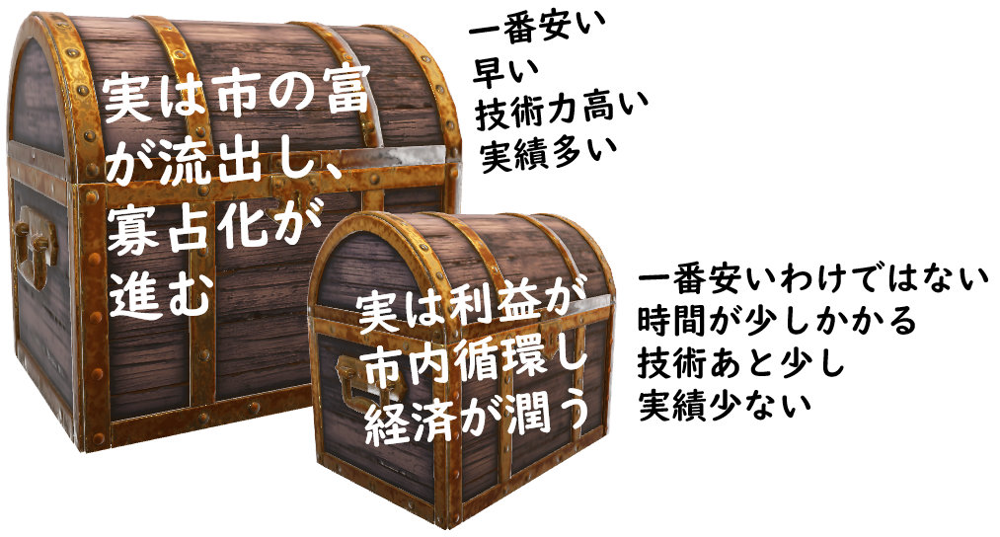
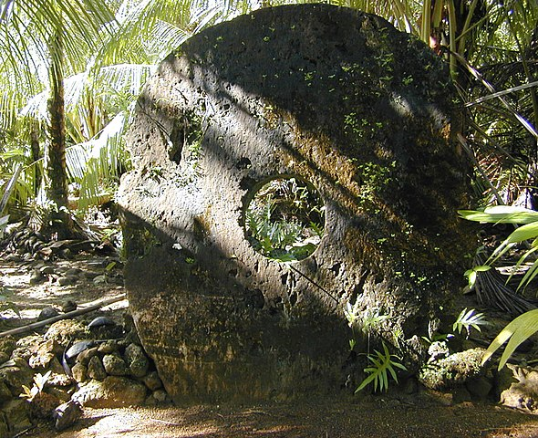
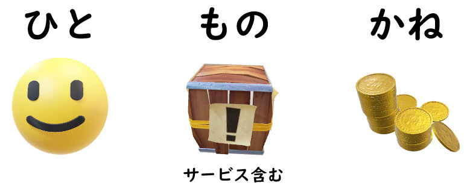
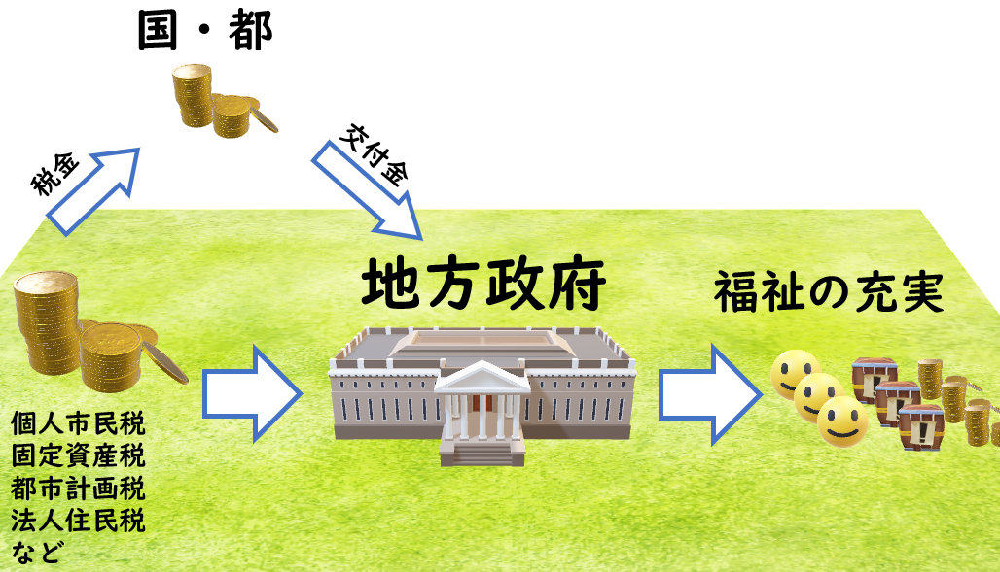
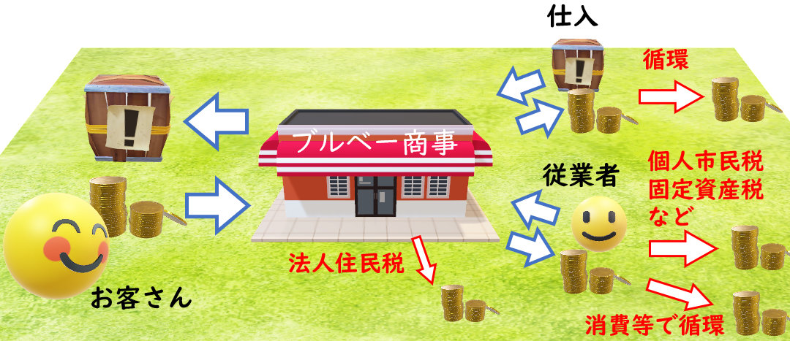
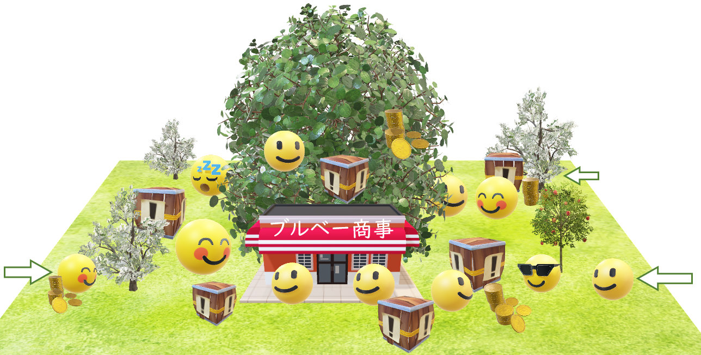

<a href="../../../index.md">小平市議 安竹洋平の主張等</a> > <a href="../../index.md">一般質問</a> > <a href="./index.md">令和2年12月定例会</a> > 1件目

{{first:2020-12-28}}

{{description:小平市議会議員 安竹洋平の令和2年度12月定例会における一般質問の1件目についてまとめています。}}

{{og-image:https://yasutakeyohei.com/books/yasutake/ippan/r2/12-gatu/images/tudura.jpg, 718, 386}}

<figure style="margin:1rem 0 4rem 0">

</figure>

# （１）小平市内の事業者でできることを第一に考えよ

<a href="https://ssp.kaigiroku.net/tenant/kodaira/SpTop.html">📄会議録を見る（まだ公開されていません）</a>

<fieldset class="point">
  <legend>
    <h2 class="point"> まとめ </h2>
  </legend>
  
コロナ禍を前にし、<a href="https://yasutakeyohei.com/books/reiwa2/20200803_rinjikai/gian-44.html">危機感が欠如した市の補正予算</a>を前にして、「経済とはなにか」を日々考えさせられています。私は、市民が生み出した富を外部に流出させるのではなく、市内の経済圏を豊かにすることがまず大切だと考えています（詳しくは下記、<a href="#%E5%86%8D%E8%B3%AA%E5%95%8F%E7%AD%94%E5%BC%81">再質問・答弁</a>のところをご参照ください）。小平市の姿勢は、上記補正予算の問題だけではなく、給食センター事業、キャッシュレスポイント事業の問題にも現れています。「小平市を豊かにしてこう」という意気込みが感じられません。そこで、市にも経済について良く考えてもらいたいという思いから質問を行いました。

  
✔ 入札より前の、事業計画を作る段階で、市内事業者を優先する仕組みはあるか → ない

  
✔ 計画策定時に<a href="#tudura">小さなつづら</a>を選ぶための検討をする必要はないのか → 大変重要なテーマ

  
地方自治法の「最少経費・最大効果」をクリアする具体的な数値が出せるかが大きな課題

  
✔ 経済波及効果の計算が間違えている。要因ごとに分解し積算すべきだが見解は → 研究する

  
✔ 市内事業者との連絡協議会等を設置してはどうか → 考えていないが、観点は非常に大切

  
直近の例として学校給食センター更新事業について

  
✔ 弁当併用外注方式なら市内業者で対応できたのでは。市内調理業者数の把握は → してない

  
✔ 弁当併用外注方式は検討したのか → していない

  
企画政策部長の答弁は「市として問題を認識しているものの、地方自治法をクリアするための具体的な手段が想定できていないため、対応しきれていない」というものでした。しかしその認識は誤りです。具体的な手段は後からついてきます。考え方さえしっかりしていれば、学校給食センターの問題も、経済波及効果の計算間違いも、このような形では起こらないはずです。地方自治法の「最少経費・最大効果」の目的は「自治体を豊かにする」ことです。まずこれを職員共通の認識にする必要があると感じました（本来市長に訴える内容ですが、現市長は来年の春に辞めることが決まっているため、職員に訴えました）。

</fieldset>

<h3 style="margin-top:0"> 初回質問・初回答弁</h3>

　小平市の経済活性化のためには、市内事業者が市の様々な事業を優先的に担える仕組みをもつことが重要だ。すでに一定の考慮がなされている入札時点だけではなく、それ以前の計画策定の段階から組み込む必要がある。経済とは利益の循環であり、市内事業者の育成にもつながるためだ。

　市内事業者が市内で利益を上げた場合、利益の大半は、税金、雇用、消費、投資といった形で市に還元される。一方、市外事業者が市内で利益を上げた場合、利益の大半は市外へ流出し、市内へはほとんど還元されない。これは支店や営業所が市内にある場合であっても、本店が市外にあれば状況はほぼ同じである。

　理想的には、たとえば事業計画を策定する際、総費用を見積る時に、将来に渡って市内でどれだけの利益循環が見込めるかを考慮した計算を行うことが望ましいと考える。

　以上の趣旨に基づいて、直近の例を挙げながら、市の方針を問う。

Q1. 市内の事業者が優先的に市の事業に携われるように、入札で事業者選定をするより前の、事業計画策定の段階で設けられている仕組みは何かあるか。

<fieldset class="touben">
<legend>A. 市長（小林 正則）</legend>
事業計画策定の段階で設けている仕組みは特にないが、契約を行う際は、小平市調達の基本指針に基づき、競争性が確保され、履行可能な調達は市内事業者を優先しており、実績を満たす市内事業者が一定数いる場合は、市内事業者のみでの競争を実施している。

また、工事請負契約では、指名基準において実績要件を緩和しているほか、総合評価方式における落札者決定基準では、企業の信頼性・社会性の評価項目において、地域密着度や地域貢献の項目を設定し、市内事業者を高く評価できるようにするなど、市内事業者に対して一定の配慮をしている。
</fieldset>

Q2. [小平市チャレンジ企業応援事業](https://www.city.kodaira.tokyo.jp/reiki/reiki_honbun/g135RG00001156.html)以外に、市内の事業者を育成するための取り組みはあるか。

<fieldset class="touben">
<legend>A. 市長（小林 正則）</legend>

小平市チャレンジ企業応援事業は、昨年度から[ものづくり・商業・サービス生産性向上支援事業](https://www.city.kodaira.tokyo.jp/reiki/reiki_honbun/g135RG00001267.html)に制度を変更し、事業者による生産性向上に向けた設備投資等に対する支援を行っている。

また､市の支援によって小平商工会が実施している[市内店舗改修等補助事業](https://www.city.kodaira.tokyo.jp/reiki/reiki_honbun/g135RG00001228.html)では、市内の建設事業者等を活用して店舗の改修等を行った場合に、工事費の一部を助成する仕組みとしている。
</fieldset>

Q3. 一般会計補正予算第4号審査の答弁では、予算2.6億円のキャッシュレスポイント事業について、その経済波及効果額を次のように計算していた。

30%還元のため、予算2.6億円 × 130/30 = 11.3億円、これを[総務省の経済波及効果を計算するエクセルシート](https://www.soumu.go.jp/toukei_toukatsu/data/io/hakyu.htm)に入れて算出し、13.8億円。

しかし本来、経済波及効果は「新規需要分」に関するものであり、また、小平市内での効果を考えるのであれば、市外への流出分を省かなくてはならない。つまり、市内の経済波及効果額は、

予算2.6億円 × 予算消化率 × （1 - 手数料率） × 130/30 × 新規需要率 × 小平市内での使用率

といった式から算出された値を基にするべきと考えるが、見解は。

<fieldset class="touben">
<legend>A. 市長（小林 正則）</legend>
指摘の算出方法は、新規の需要率や、市内での消費率を正確に捉える必要があることから、値の算出は難しいものと考えている。
</fieldset>

Q4. 学校給食センターの更新事業について、入札予定価格57億円を契約期間15年、総給食数71万食で割ると535円となり、食材費が仮に300円であれば1食あたり835円。この金額であれば小平市内の複数の配食事業者（1校当たり500食程度で8校分もしくはそれ以上の業者数）で対応できたのではないかと考え、決算特別委員会でも質問を行った。弁当併用外注方式であればさらに対応可能性は上がる。この事業は市内事業者育成の観点からも好機であったと考えるため、ここで再度伺う。市内の調理業者数は把握しているか。

<fieldset class="touben">
<legend>A. 教育長（古川 正之）</legend>
学校給食法、及び学校給食衛生管理基準に基づく、学校給食の調理業務を担える事業者は市内にはないものと認識。また、いわゆる産業弁当を提供する市内の調理事業者数は把握していない。
</fieldset>

Q5. 続いて学校給食センターの運営について、弁当併用外注方式については検討してきたか。

<fieldset class="touben">
<legend>A. 教育長（古川 正之）</legend>
これまで学校給食センターは、一括して大量調理を行うセンター方式によるスケールメリットを生かしながら、38年に渡り市内の中学校に給食を提供してきた。保護者を対象とする試食会や共同調理場運営委員会等における意見からも、一定の評価を得ているものと認識。そのため、今後も、センター方式による学校給食の提供を継続することが望ましいと考えており、弁当併用外注方式につきましては検討していない。
</fieldset>

Q6. 様々な事業において、計画策定の段階で、市内事業者が優先的に事業に携われる計画となるよう、市内事業者との連絡協議会等を設置してはどうか。

<fieldset class="touben">
<legend>A. 市長（小林 正則）</legend>
事業内容の検討に当たっては、現在も必要に応じて市内外の事業者からヒアリング等を行いながら進めており、新たに連絡協議会を設置することは考えていない。

しかしながら、ご指摘のような、市内事業者に市の事業を担っていただくことにより、市内経済の活性化や､市内での利益の循環を図るという考え方は、市として非常に大切な観点であると捉えており、事業内容や実施方法の検討に当たっては、そうした観点も可能な限り踏まえていく必要があるものと認識している。
</fieldset>

### 再質問・答弁

コロナ禍を受け「経済とはなにか」を再度考えた人もいるのではないか。そんな余裕がないという人も沢山いると思うが。経済のことを深く考えることも政治家の役割。また、市の補正予算がおかしかったので、考えざるを得なかったこともある。

経済とは「誰かが誰かの役に立つ活動をすること」が基本。人類の歴史において、最も初期の経済を想像すると、小さな集団で、もともと自然に役割分担ができていたはず。対価を求めず「できる人が皆の役にたつことをする」ところから始まったのではないか。

ちなみに、学校では、経済は「物々交換」から始まったと習った。おもしろいことに、最近はこれを否定する学説が主流のようだ。物々交換で経済が成り立っていた証拠は見つかっていないらしい。信用で成り立っていたという別の学説が主流だとか。

<link href="../../../css-each/calilapi.css" rel="stylesheet" type="text/css" />

<fieldset class="tosyokan" style="margin-top:4rem">
<legend>参考書籍</legend>

<a href="https://calil.jp/book/4492654658">21世紀の貨幣論（2014）　フェリックス マーティン（著）</a>
 
小平市立図書館：

</fieldset>

<figure style="margin:4rem 0">

<figcaption>所有権のみが移行するとされている、<a href="https://ja.wikipedia.org/wiki/%E7%9F%B3%E8%B2%A8_(%E3%83%A4%E3%83%83%E3%83%97%E5%B3%B6)">ヤップ島の石貨</a></figcaption>
</figure>

歴史で何が正しいかは分からないが、とにかく現在は貨幣経済。その中で、なにが多くの人にとって良いことなのかを考える。フィールド、プレイヤー、ルールから考える。フィールドは自治体。プレイヤーは主に、人（ひと）、物（もの）、金（かね）の三者。これら三者のうち、自治体を越えて移動するものもあるし、自治体の中にとどまるものもある。

もう一つ重要なプレイヤーは、地方政府。これは自治体の領域内にあって、外に出ることはない。地方政府としてのたとえば小平市は、小平市内において、個人市民税、固定資産税・都市計画税、法人市民税といった税金を徴収し、また、領域外である国や都から交付金等を得る。それらを原資にすることで、市内の福祉を充実させるというのが、地方政府である小平市のひとつ重要な役割。

<figure style="margin:4rem 0">

<figcaption>税金や交付金によって福祉の充実を行うことが行政のひとつ重要な役割です</figcaption>
</figure>

税金についてもう少し考えてみる。法人市民税（法人住民税）は市内事業者の所得にかかる税金で、個人市民税と固定資産税・都市計画税の合計に対し、12分の1くらいの規模。令和元年度決算では、固定資産税と都市計画税の合計が約145億、個人市民税約141億、法人市民税約24億。

法人市民税の金額が比較的低いからといって「市内事業者の経済に関する貢献が少ない」と結論づけてはならない。なぜなら、法人市民税は事業者の所得にかかる。所得は、簡単に言えば、売上から経費や控除を除いた部分で、以下のようなものが含まれる。

- 市内の従業員に支払う賃金
- 市内で材料などの購入にかかる費用
- 経営者が市内で消費活動に使う分

つまり、市内事業者の活動が市内の経済をどんなに良くしていても、法人市民税には表れない。経済活動の状況は、賃金にかかる個人市民税や、家賃を介して固定資産税の方に出てくる。

<figure style="margin:1rem 0 4rem 0">

<figcaption>事業者が経済活動に与える影響は、法人住民税だけに現れるわけではない</figcaption>
</figure>

市内事業者が利益を上げ、また新規に育つことで、法人市民税だけじゃなく、他のさまざまな税金の形としても小平市にお金が入る。このお金を回すことで、市内の福祉が充実する。税金の面からはそういう循環構造がある。

また、市内事業者が強くなれば、多くの人が市内で働くことができる。たとえば子どものいる市民が領域の外に出て働く必要がなくなり、通勤時間が短縮され長時間保育の必要性が下がる。障害者や高齢者も身近な場所で働く機会が増える。朝・昼・夕食を食べ、飲み会をするのも市内になる。日常生活にかかるお金が市内に落ちる。働く場所が地域にあれば、地域のコミュニティ活動も促進される。いいことづくめだ。

再度視点を上の方に戻してみる。人、物、金は自由に自治体と他の自治体の間を移動できるが、市内事業者のほとんどは移動しない。移動しないところに人が集まり、モノとカネがその近くで回ることになる。つまり、市内事業者は、森の木々のような役割を果たすことで、生態系である人、物、金が回転し、豊かな経済圏が育まれる。

<figure style="margin:1rem 0 4rem 0">

<figcaption>市内事業者は市内経済において森の木々のような役割も果たす</figcaption>
</figure>

その逆に、市内ではなく外部の事業者に利益が流れるようになると、カネがそこにとどまらずに外に出ていく、税金は少なくなって福祉の質が下がり、市民が転出する。モノも集まらなくなって、どんどん悪いサイクルが回り、生態系は育まれず、そのうち木も枯れてしまう。

安いからとか、技術力があるからといった理由で外部の事業者に依存していると、そういう意味での、経済圏としての生態系が貧弱になる。また、大資本による寡占化も進む。地域の事業者が参加する余地がなくなってくる。雇用の場所は限られ、多様性も損なわれてくる。

しかし、落ち着いて考えてみると、寡占化が進んだとしても、それで市民が良いということであれば良い。大資本や政府による寡占化を極端なまでに進めれば、エネルギー消費の観点からは最も効率が良い。

しかし、私は、いわゆるビックテックなどの限られた人々に富が集中する仕組みを前提にした寡占化は、（人類の理想では）ないと思う。

<strong style="color:red">🕵️‍♂️ 外部事業者の支店が市内にあっても状況は同じ</strong>

外部の事業者に委託する際、支店が市内にある事業者であっても、本店が市外にあれば状況は同じです。なぜなら、法人住民税の法人税割の部分が、法人全体の所得を分割基準（主に従業員数）により按分した分にかかる、という方法になっているからです。

たとえば、市内の支店に従業員が1人、本店に99人いる場合を考えてみると、市内で利益を上げ、100万円の法人住民税が発生したとしても、市に入るのはそのうち約1万円程度になります。

（今回のキャッシュレスキャンペーンのように、他の自治体でもポイント分が使えるとなると、市の税金がそれだけ外部に流れ出すことになる。）

理想的には、市内でのみ有効な流通通貨があると良いように思う。自治体の領域外に出ていかない通貨。地域商品券はそのひとつ。もっと考え方を進め、たとえば市が行う事業の支払いの一部を市内の流通通貨にしてみるなどの社会実験をしても良いと思う。

今までの話をまとめると、昔話にある舌切り雀のつづら。大きいつづらの方として「安い、技術力が高い」といった、見た目が良いものを選んでいると、実は市外にお金が流れていく流れになり、長期的な市の発展にはつながらない。小さいつづらの方として「少し高い、技術力はもう少し」といったものを選ぶと、実は、市内の経済発展につながって、長期的には市を豊かにする。

計画策定の段階から、大きいつづら、小さいつづら、どちらになるかを確認して計画しているのかを確認したくて質問している。

<figure style="margin:1rem 0 4rem 0">

<figcaption>小さなつづらを選ぶ事業計画になっているか</figcaption>
</figure>

Q. たとえば、事業計画策定の際、AプランとBプランが発想できたとする。単純な計算で、Aプランは100万円、Bプランは150万円のコストがかかるとする。特に考えなければAプランで行こうとなる。しかし市内還元分まで考えると、Aプランは20万円戻ってくる、Bプランは100万円戻ってくるとなった場合、実質的にはそれぞれは80万円50万円のコストになる。だったらBプランの方で計画を策定しましょう、そういういう風に、小さなつづらを選ぶための検討をする必要はないのか。

<table class="simple">
<tr><th>プラン</th><th>単純費用</th><th>市内還元</th><th>実質的コスト</th><th>つづら</th></tr>
<tr><td>A</td><td>100万円</td><td>20万円</td><td>80万円</td><td>大きい方</td></tr>
<tr><td>B</td><td>150万円</td><td>100万円</td><td>50万円</td><td>小さい方</td></tr>
</table>

<fieldset class="touben">
<legend>A. 企画政策部長（津嶋 陽彦）</legend>

今回取り上げて頂いたことは大変重要なテーマと考えている。市内経済活性化を広い視点で見るのは大切。一方、地方自治法において「地方自治体は最小の経費で最大の効果を挙げること」が求められている。物の調達でいえば、競争性に基づいて極力安価なものを調達することが原則。

ご指摘のように、トータルで見ればどうかということは、具体的な数値として明確に出せるかが大きな課題。それができないまま高い方を調達した場合、公費の使い方としてどうかと批判を浴びることもある。それを十分考えながら行きたいと思っている。

工場や事業を誘致することで税金を免除するなどの策を取ることもある。税金は入ってこないが、工場が来ることで法人税や、雇用の創出が期待できると政策を打つところもある。市の置かれた状況に応じ、地域経済のことも踏まえながら考えていくことは大変重要と認識している。
</fieldset>

<strong style="color:red">😅 『最少の経費で最大の効果を挙げること』とは</strong>

津嶋部長が述べたのは、[地方自治法第2条第14項](https://elaws.e-gov.go.jp/document?lawid=322AC0000000067_20201201_430AC0000000095&keyword=#Mp-At_2)のことで、以下のように書かれています。

> 地方公共団体は、その事務を処理するに当つては、住民の福祉の増進に努めるとともに、最少の経費で最大の効果を挙げるようにしなければならない。

これは「単に一番安いものを選べ」という意味ではありません。しかし条文解釈の問題から、職員には「一番安いものを選んでおけば大丈夫」というバイアスが働いてしまいます。この問題は、たとえば[こちらの論文](https://www.jstage.jst.go.jp/article/uhs/2019/104/2019_111/_pdf)などでも、入札に絡んだ問題として指摘されています。

私はさらに一歩進んで、「入札より前の計画策定の段階」で、「市内に還元する利益を最大化する」仕組みをつくれ、という趣旨にて質問しています。入札の時点と違い、計画の時点ではブラックボックスが許されるところがあるからです。具体的にはどうするかを、給食センターの例を挙げて説明しています。

Q. 育成という面も重要。ゼロから育成は大変だが、あと少し技術力があれば、ノウハウがあれば、実績があれば、という業者は結構あるのではないか。ノウハウを情報で提供したり、あと一押しというところのサポートはしているか。

<fieldset class="touben">
<legend>A. 地域振興部長（余語 聡）</legend>
ものづくり・商業・サービス生産性向上支援事業は、市内の中小企業者が行う先端設備等の導入に係る経費の一部を補助しているもの。こういった設備の導入により、事業をもう一歩グレードアップするという内容。
</fieldset>

（計画策定の段階で検討が足りていないことについて）、直近で言うと、キャッシュレスポイント事業は最たる例。事業自体は良いが。
経済波及効果の計算が間違えていると、何度も指摘してきた。余語さんを責めているわけではない。

Q. 経済波及効果の計算式自体、（上記の因数分解をした）考え方で合っていると認識でよいか。

<fieldset class="touben">
<legend>A. 地域振興部長（余語 聡）</legend>
議員がお示しの考え方もあると。
</fieldset>

<strong style="color:red">😅 なぜか答弁でははっきり言えないようです</strong>
事前の確認では「計算は間違えていた、経済波及効果は普段使う分は含まない。おっしゃる計算方法が正しい」と言っていました。このあたりの答弁、まぁ仕方ないですね・・・。

なぜビシッと言えないのか分からないが。だれも「予算消化率、新規需要率を正確に出せる」とは思っていない。ただ、ある程度の推測はできる。たとえば以下のように。

- 現時点で得られるリアルタイムな情報から「予算消化率」を推定
- 昼間人口、夜間人口、小平市内の滞在割合から「小平市内での使用率」を推定

Q. そういう見積りを立てることで、どの因子をどうやって上げようかと、要因ごとに因数分解し、個別具体の対応ができる。どう考えるか。

<fieldset class="touben">
<legend>A. 地域振興部長（余語 聡）</legend>
様々な統計データを使用して経済波及効果は計算できると考える。
</fieldset>

具体的な計算式があって、推計をどう行っているかも分かれば、我々も納得できる。「総務省の経済波及効果を計算する式に入れて算出した」と言われると、不信感がわく。むしろ細かく具体的に示した方が良い。

Q. プレミアム商品券については、こうした経済波及効果額の計算は行ったか。

<fieldset class="touben">
<legend>A. 地域振興部長（余語 聡）</legend>
発行額に対する消費額で、プレミアム商品券で使われたものが経済波及効果という捉え方で計算した。
</fieldset>

Q. ほかの事業も同様。事業策定の段階で、こうした因数分解を行い、それぞれのプリミティブな要因を分析し、はたしてそれが大きなつづらなのか、小さなつづらなのか、多くの人が納得できる形で示していくべきではないか。

<fieldset class="touben">
<legend>A. 地域振興部長（余語 聡）</legend>
様々な前提条件などを定めながら、ある式を組立て、経済波及効果を計算していくことになるが、どういった形で式を作っていくのかは、検討、研究が必要になっていく。今後そういったことが可能か研究する。
</fieldset>

余語さんに考えてくださいと言っているわけではなく、市の事業全体の話。因数分解できることは多い。大きなつづら、小さなつづらの検討ができる仕組みを入れていく必要がある。

学校給食センターの事業についても同様。「弁当を持たせたい」と考えている家庭もあるため、弁当併用外注方式にすれば、給食の数を減らすことができる。数が減れば、市内事業者でも対応できる、となる。
学校給食センターではひとつのプランしかない。大きなつづらも小さなつづらもない。それはあまりにもお粗末。

計画策定の段階で複数プランがでることは重要。職員の方は自分で事業をした経験がある人は少ない。事業を行い、まちで稼いでいる人たちはアイデアが豊富。たとえば、以下のようなアイデアもある。

> 小平駅の南口にある自転車駐車場が撤去される。その跡地に、アーケードのようなものを作り、小平駅から西友までつながるような、雨が降っても傘を差さず歩いていける屋根を作り、そこに期間限定的にでも小規模店舗を入れることで活性化していってはどうか。北口の再開発が行われることにより、南口が元気をなくしていく状況も緩和できるのではないか。

> 小平駅の中、改札を入ったところにちょっとしたスペースがある。西武鉄道と協議し、市民の方々で、たとえばクッキーを焼くのが上手な方などが、安く試験的に出店できるような場を設ける。

Q. このように、事業者から「こういう事業をやればいい」とか、「ここがなくなるなら、代わりにこういうことをやればいい」といったアイデアを受け止めるような場面はあるのか。

<fieldset class="touben">
<legend>A. 地域振興部長（余語 聡）</legend>
商工会からは色々な話を聞いているが、そのような具体的な案については把握していない。
</fieldset>

具体的な案を活用しないといけない。うちができると言うと利益誘導になるが「こういう形で小平市内の事業者で対応できるのではないか」と。

Q. 連絡協議会がコストもかからず良いと思うが、再度意見を伺う。

<fieldset class="touben">
<legend>A. 地域振興部長（余語 聡）</legend>
大きくまちが変わるような段階では、市民、事業者の声を聞きながら進めていくことになると考える。
</fieldset>

余語さん、津嶋さんの答弁では、結局そうなる。最終的に決めるのは市長。

今回の一般質問で「市長にやってほしいこと」を松岡議員が挙げていたが、私は、そんなにすべて出来る人はスーパーマンしかいないと思うところもある。

私が考える市長の一番大事な仕事は「すべての責任は自分にあるということを示すこと」だと考えている。

次に市長になる方がここにいるか分からないが、なるべく積極的に自分で発信してもらうこと、市長が答えるべきことも部長が答えてしまうようだと、部長は責任を終えない。
市長が常に前にでて、私が責任を取るという態度を見せてもらいたかった。また、もっと市長と討論したかった。
