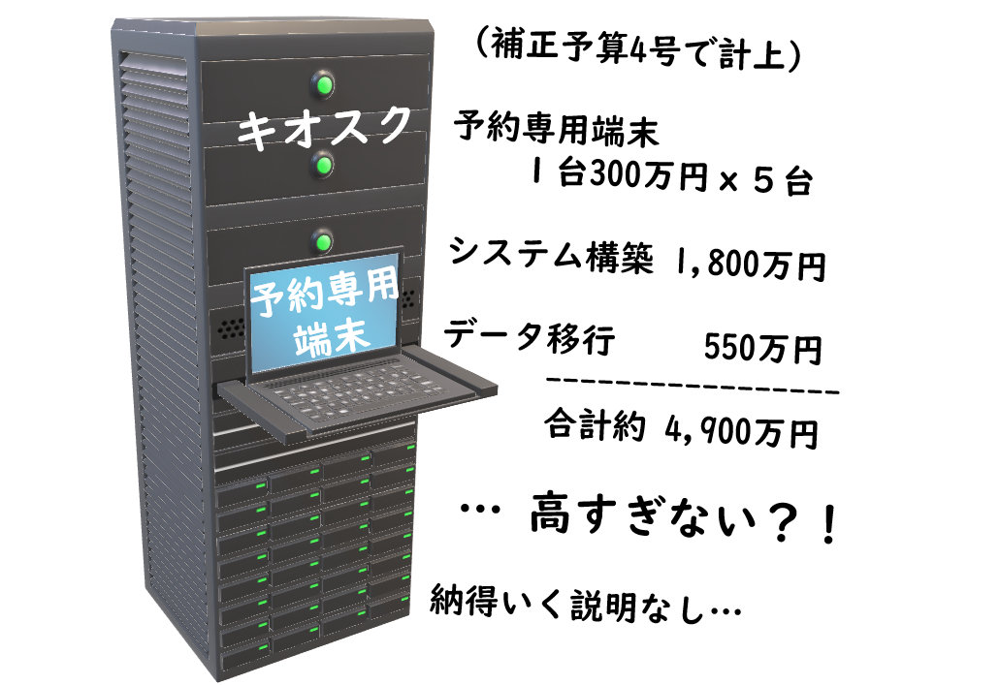

{{first:2020-12-28}}

{{description:小平市議会議員 安竹洋平の令和2年度12月定例会における一般質問の2件目についてまとめています。}}

{{og-image:https://yasutakeyohei.com/books/yasutake/ippan/r2/12-gatu/images/kiosk.jpg, 1031, 707}}

# （2）公共施設予約システム改修の内容は

<figure>

</figure>

<a href="https://ssp.kaigiroku.net/tenant/kodaira/SpMinuteView.html?council_id=1175&schedule_id=5&minute_id=128&is_search=true">📄会議録を見る</a>

<fieldset class="pnt">
  <legend><h2> まとめ </h2></legend>

補正予算4号で、公共システム予約システムの改修に約4,900万円が計上されました。Webサービス開発を担ってきた立場からは、信じられないほど巨額の予算です。補正予算の総務委員会では特に質問がなく、これまで詳しい説明もなかったため、質問しました。

---

- 4,900万円の内訳は → <a href="#uchiwake">下記表を参照</a>
- キオスク（端末）はいくらを想定か → <a href="#uchiwake">1台300万円</a>
- 専用端末ではなく、PCやタブレットを使えば → 場合によっては違うタイプになる
- キャッシュレス決済の方式は → システム上でクレジットカード決済
- 事業者は → プロポーザル方式を予定。クレジットカード以外の支払も検討する
- 期待する効果は → 窓口に出向く必要がない、感染症対策に寄与、利便性の向上

---

時代遅れとも言えるキオスク端末1台で300万円を5台分予定したり、システム構築費に1,800万円やデータ移行費に550万円など、驚くべき数字が次々と明らかになりました。なぜそんなに巨額になるのか、納得の行く説明は一切ありませんでした。窓口に出向かなくてよいという話とも逆行します。これは追求すべき問題です。

</fieldset>

<button onclick='showPDF("./202012-ippan-situmon-yasutake-2.pdf")' class="pdf-view-button">
<i class="fa fa-file-pdf-o" aria-hidden="true"></i> 一般質問通告書
</button>

<h3>初回質問・初回答弁</h3>

　一般会計補正予算（第4号）で約4,900万円が計上された「公共施設予約システム利用対象施設拡大事業」について、示された改修内容から考えると金額が異常に大きいと感じるため、以下を問う。

Q1. 予算の内訳は。

<fieldset class="touben" id="uchiwake">
<legend>A. 市長（小林 正則）</legend>
システムの構築費としては次のとおり。

<table class="bordered slim">
<thead><tr>
<th>項目</th>
<th>費用（約）</th>
</tr></thead>
<tr>
<td>
既存システムからのデータ移行 
クレジットカード決済機能の追加 
キオスク端末の設置 
など
</td>
<td>3,993万円</td>
</tr>

<tr>
<td>統合収納システムの電子決済対応改修</td>
<td>550万円</td>
</tr>

<tr>
<td>地域センター13館分の回線開設</td>
<td>40万円</td>
</tr>

<tr>
<td>
地域センター19館分の端末 
プリンターなどの備品購入費
</td>
<td>284万円</td>
</tr>

<tr>
<th>合計</th><th>4,867万2千円</th>
</tr>

</table>

</fieldset>

Q2. キャッシュレス決済はどのようなもので、どの事業者を想定しているか。

<fieldset class="touben">
<legend>A. 市長（小林 正則）</legend>
現行の施設予約システムは、施設利用日の前日までに各施設窓口に出向いて、現金で使用料を支払う方法。今回の改修では、クレジットカード決済機能を有するものを想定しており、各施設窓口に出向くことなく、システム上で決済が完結できる仕組みを考えている。

事業者は、施設予約のパッケージシステムを有する事業者を想定。

システムの調達は、プロポーザル方式を考えており、事業者からの提案などを踏まえ、クレジットカード以外の支払い方法についても検討する。
</fieldset>

Q3. この改修により、どういった効果を期待しているか。

<fieldset class="touben">
<legend>A. 市長（小林 正則）</legend>
施設予約の申し込みや使用料の支払い時、各施設の窓口に出向く必要がなくなることで、初日受付における密集を避けることができるほか、接触の機会が減少するなど、新型コロナウイルス感染症対策に寄与するとともに、利用される方の利便性向上につながると考えている。
</fieldset>

### 再質問・答弁

Q. キオスクとは何か。

<fieldset class="touben">
<legend>A. 企画政策部長（津嶋 陽彦）</legend>
公共施設予約システムは、利用者所有のPCやスマートフォンからの予約が可能だが、所有していない方が専用の端末から予約する。5台分を公共施設等に設置予定。
</fieldset>

Q. データ移行、クレジットカード決済はほとんどコストかからないはず。キオスク5台でいくらか。

<fieldset class="touben">
<legend>A. 企画政策部長（津嶋 陽彦）</legend>
予算の見積もりは、1台300万円を想定。
</fieldset>

<strong style="color:red">😲 1台300万円の端末って、いつの時代ですか！！</strong>

インターネット経由で予約できるようになっているのであれば、タブレットでそのサイトを表示するだけで十分と思います。何が起きているのでしょうか、驚きです。

Q. キオスクは、（専用端末ではなく）PCやタブレットではダメなのか。

<fieldset class="touben">
<legend>A. 企画政策部長（津嶋 陽彦）</legend>
PC等では使えない。現在すでに公共施設等に配置しているタイプのものが必要。
</fieldset>

Q. PCではダメな理由は何か。

<fieldset class="touben">
<legend>A. 企画政策部長（津嶋 陽彦）</legend>
想定しているシステムはキオスク端末を想定している。事業者との契約はこれから先、プロポーザル方式を予定しているので、場合によっては違うタイプになることも考えられる。
</fieldset>

Q. 残りの2,400万円が、データ移行とクレジットカード決済の費用になるということか。

<fieldset class="touben">
<legend>A. 企画政策部長（津嶋 陽彦）</legend>
システムの構築費として約1,800万円ほど、データ移行で550万円ほどを見込む。
</fieldset>

システムをやっている側として信じられない金額。小平市の詳しい人（事業者）に聞けば、もっと安くできるアイデアがあるはず。問題がある。

Q. 利用者が約60パーセント減っていて、急激な回復の見込みがないと言っているが、年間どれくらいの人がこの予約システムを使うことになるか。

<fieldset class="touben">
<legend>A. 地域学習担当部長（安部 幸一郎）</legend>
公民館は、平成30年度実績として、予約システムアクセス件数が合計で13,404件。施設予約はこのシステムに入力し、すべてを把握する、このシステムがなければ事務に滞りが生じる。
</fieldset>

<fieldset class="touben">
<legend>A. 地域振興部長（余語 聡）</legend>
地域センターは、予約以降のアンケートを実施した際、「予約システムがあるなら利用したいと思うか」という問いに対し、66.7%の人が「利用したい」と回答しており、それくらいは考えられる。
</fieldset>

キオスク端末は窓口に出向かなくてよいという話と逆行している、時間がないのでまた別の機会に聞く。

<strong style="color:red">🤔 詳細がまったく分からない計画</strong>

1台300万円の端末、システム構築費で1,800万円、この時代になぜこんなにお金をかけるのか。あり得ないと感じます。時間がなかったため、これ以上のことはまた別の機会に追求していきます。

</fieldset>

以上
