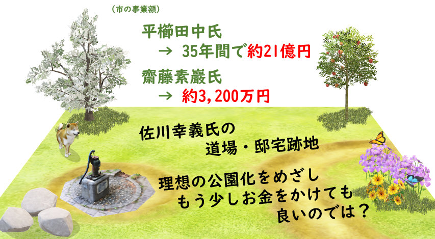

<a href="../../../index.md">小平市議 安竹洋平の主張等</a> > <a href="../../index.md">一般質問</a> > <a href="./index.md">令和2年12月定例会</a> > 3件目

{{first:2020-12-28}}

{{description:小平市議会議員 安竹洋平の令和2年度12月定例会における一般質問の3件目についてまとめています。}}

{{og-image:https://yasutakeyohei.com/books/yasutake/ippan/r2/12-gatu/images/risou-kouen.jpg, 853, 469}}

# （３）市内の歴史的人物を発掘し、まちに物語を持たせよう

<figure style="margin:1rem 0 4rem 0">

</figure>

<a href="https://ssp.kaigiroku.net/tenant/kodaira/SpTop.html">📄会議録を見る（まだ公開されていません）</a>

<fieldset class="point">
  <legend>
    <h2 class="point"> まとめ </h2>
  </legend>
  
平櫛田中氏、齋藤素巖氏の他にも、小平市には歴史的人物が数多く暮らしていました。そういった方々を発掘し、市内各地で暮らした痕跡を人々の記憶に残すことで、まちにストーリーを持たせることを提案しました。上水南町には、合気道の第一人者である佐川幸義氏が、自宅兼道場を構えてらっしゃいました。氏の死後、ご遺族がその跡地を小平市に寄附してくださり、現在、理想の公園整備に向け、周辺住民と道場関係者が頑張ってらっしゃいます。市は、この公園の整備に充てるお金を、寄附して頂いた土地の一部売却により捻出しようとしています。しかし、周辺住民と道場関係者は反対しています（私も反対です）。平櫛田中氏や齋藤素巖氏の事業には市の巨額な予算を投じていながら、なぜ同様な歴史的人物といえる佐川氏のことにはお金を出さないのか、一貫性のなさを感じたため、質問しました。

  
✔ 歴史的人物を取り上げる際、選定基準はあるか → 特に明確な基準はない

  
✔ 把握している市の歴史的人物は → 市史編さん事業で刊行の書物に記載の人物を把握

  
✔ 歴史的人物発掘のため、市民アンケート調査を行ってはどうか → なじまないと考えている

  
✔ 地域毎に歴史的人物の暮らしぶり等をまとめ、観光・教育に活かしては → 一部やっている

  
✔ 合気道の第一人者、佐川氏も歴史的人物に → 歴史的資料から辿るため、現在考えていない

  
市がこれまで平櫛田中氏の事業に投じた金額は、昭和59年からの35年間で総額約21億円、齋藤素巖氏の事業には総額約3,155万円（年数は不明）です。特定の人物だけに資源を集中する理由は分かりません（これらの方々にお金を使うなということではありません）。もっと沢山の人々にスポットを当てることができれば、市民は小平市に愛着がわきますし、観光や定住のために人々が集まります。子ども達も、仕事・生き方・多様性などについて学べるはずです。これも継続して訴えます。

</fieldset>

<h3 style="margin-top:0"> 初回質問・初回答弁</h3>

　小平市内には、日本や世界中から多くの人を引き付けるような魅力のある歴史上の人物（以下歴史的人物という）がこれまで何人も暮らしていた。そこで、遺跡などの建造物や自然環境だけではなく、歴史的人物に焦点を当てることにより、まちに物語（ストーリー）を持たせると良いと考える。観光や移住によって人が集まるだけではなく、地元愛へもつながると考え、以下質問する。

Q1. 市内の歴史的人物のうち、主に平櫛田中氏の邸宅や彫刻、斎藤素巖氏の彫刻などが市の財産となり、観光の柱にもなっている。市として、このように特定の歴史的人物を取り上げる際、人物の選定基準はあるか。また、どのように選定を行うか。

<fieldset class="touben">
<legend>A. 市長（小林 正則）</legend>
特に明確な基準はないが、彫刻家の平櫛田中や齋藤素巖については、ともに市内に居住し、その芸術が高く評価された彫刻家であり、ご遺族から市へ作品等の寄贈をいただいた経緯などから、市ゆかりの芸術家として市民に親しんでいただいている。
</fieldset>

Q2. 市は、市の歴史的人物をどれだけ把握しているか。

<fieldset class="touben">
<legend>A. 市長（小林 正則）</legend>
小川九郎兵衛をはじめ郷土の開発や発展に努力、貢献した先人については、主に市制施行50周年を記念する取組として、平成20年度に始めた市史編さん事業により、平成24年度刊行の<a href="https://trc-adeac.trc.co.jp/WJ11D0/WJJS05U/1321105100/1321105100100020">小平市史近世編</a>、及び<a href="https://trc-adeac.trc.co.jp/WJ11D0/WJJS05U/1321105100/1321105100100030">近現代編</a>に記載されている人物として把握している。
</fieldset>

Q3. 市ホームページや、こだいら観光まちづくり協会などと連携し、歴史的人物を発掘するための市民アンケート調査を行ってはどうか。

<fieldset class="touben">
<legend>A. 市長（小林 正則）</legend>
歴史的人物の把握は、文書など歴史的史料の検証からたどるものであり、市史編さん事業による調査、検証も行っているため、市民アンケート調査はなじまないと考えている。
</fieldset>

Q4. 地域ごとに、どういう歴史的人物がどのように暮らしていたか等をまとめ、観光や教育に活かしてはどうか。

<fieldset class="touben">
<legend>A. 市長（小林 正則）</legend>
こだいら観光まちづくり協会では、小平まち巡りを実施し、小平の歴史や地形、自然、文化などを掘り起こしており、その中で歴史的人物にスポットを当てることもある。引き続き、こだいら観光まちづくり協会等と連携し、歴史的人物を含む市の魅力発信に取り組む。
</fieldset>

<fieldset class="touben">
<legend>A. 教育長（古川 正之）</legend>
市立小・中学校では、社会科副読本わたしたちの小平市、及び東京都道徳教育郷士資料集に掲載されている、小川九郎兵衛、平櫛田中の功績や生き方について、児童・生徒が社会科や特別の教科道徳の授業で学習している。今後も、児童・生徒に、郷士の伝統や文化を大切にする心を育むことができるよう努める。
</fieldset>

### 再質問・答弁
Q. 平櫛田中氏や齋藤素巖氏は、文書などから辿った歴史的人物ではないですよね？

<fieldset class="touben">
<legend>A. 文化スポーツ担当部長（篠宮 智己）</legend>
平櫛田中は市の名誉市民。齋藤素巖は、市内に居住し芸術が高く評価された彫刻家、その辺も含めて歴史的人物という位置づけ。文書等により検証していくものと考えている。
</fieldset>

上水南町、合気道の第一人者であった佐川幸義氏が住まれていて、道場もあった。佐川氏については、資料もたくさん残っている、書籍も沢山出版されている。ファンの方も多い。
亡くなられたあと、ご本人の意思を通じて、ご遺族から、小平市に邸宅・道場とその土地が寄付された。（建物は取り壊され、樹木の多くは伐採され）公園化が予定されている。

Q. 佐川幸義氏は、歴史的人物の一人として、市で取り上げても良い好例だと思うがどうか。

<fieldset class="touben">
<legend>A. 文化スポーツ担当部長（篠宮 智己）</legend>
文書などの歴史的資料から辿ることになるので、今後長い年月をかけて、そういうことが必要であれば認定し、歴史的人物となると思うが、現状では考えていない。
</fieldset>

<strong style="color:red">🥱 結局基準は良く分からず</strong>

平櫛田中氏、齋藤素巖氏は、文書から辿った方ではないものの、歴史的人物となっています。市内に居住し、芸術が高く評価されたということですが、注目しているのは「芸術」だけなのでしょうか。このあたりの基準が良く分かりません。特に明確な基準はない、ということなのだと思います。時間切れになってしまいましたので、また確認していきたいと思います。

