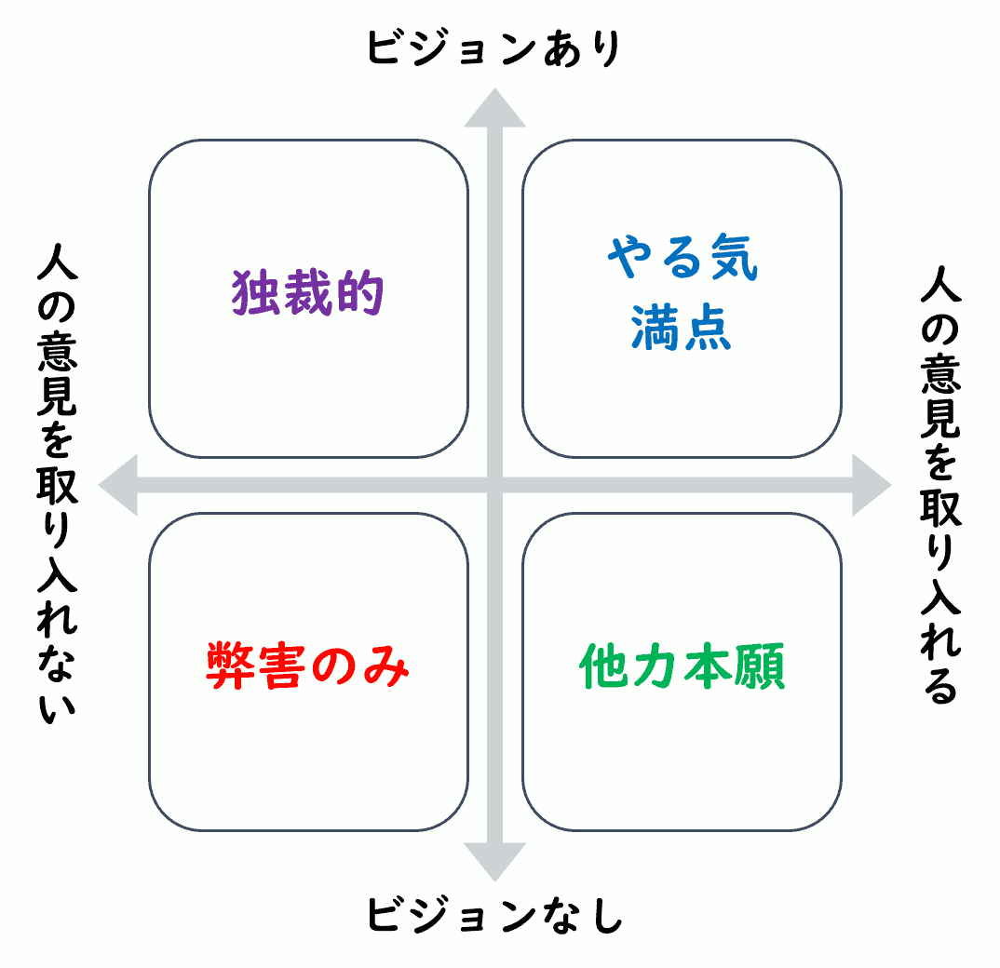
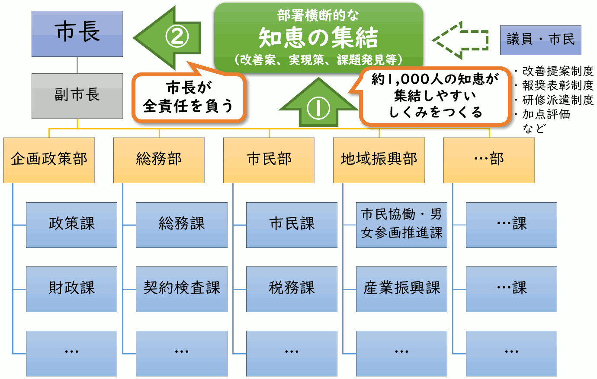

{{first:2020-12-28}}

{{description:小平市議会議員 安竹洋平の令和2年度9月定例会における一般質問の1件目についてまとめています。}}

{{og-image:https://yasutakeyohei.com/books/yasutake/ippan/r2/9-gatu/images/sityou-vision-eyecatch.png, 1591, 913}}

# （1）市長責任でビジョン構築を急げ。ICT整備の好機を逃すな

<a href="https://ssp.kaigiroku.net/tenant/kodaira/SpMinuteView.html?council_id=1151&schedule_id=5&minute_id=56&is_search=true">📄会議録を見る</a>

<fieldset class="pnt">
  <legend><h2> まとめ </h2></legend>

コロナ禍で市税収入はどれくらい減少するか、その事態にどう対応するか、公共施設の縮小を加速することにならないか、などを確認しました。また、地域活動を維持するために、オンライン・ハイブリッド開催の推進と、[情報格差](https://ja.wikipedia.org/wiki/%E6%83%85%E5%A0%B1%E6%A0%BC%E5%B7%AE)が広がらないよう、市のサポートが必要であることを訴えました。また、市長に対しては、補正予算4号の内容があまりにもひどかった理由が、職員約千人の知恵が集結する仕組みがないこと、市長が責任を取る態度を見せないことが原因であると指摘しました。市長はこれに対し「[（発言を）撤回していただきたい](#sityou-kyouben)」という答弁をしたので、とても驚きました。市長が議員という立場を軽く見ていることが伺えました。

<ul>
<li class="chk">現時点で、市税歳入の減少見込みは → 厳しい状況にある</li>
<li class="chk">歳入減少で公共施設の規模縮小を早めるか → 当面の歳入減少への対応で早める予定はない</li>
<li class="chk">コロナ禍で公共施設の1日平均利用者数は → 7月は図書館が約2割減、他は6～9割の大幅減</li>
<li class="chk">↑ 今後の見込みは → 感染状況にもよるが、図書館以外は急激な回復なしを見込む</li>
<li class="chk">公共施設のWi-Fi設置状況は → 中央公民館・中央図書館・仲町テラスのみ設置している</li>
<li class="chk">↑ 今後の整備予定は → 小川駅西口地区市街地再開発事業公共床の複合施設のみ設置予定</li>
<li class="chk">市民活動がオンライン化する動きの把握は → オンライン化を開始する団体があるのは把握</li>
<li class="chk">↑ オンライン化の課題は → 通信環境等整備や、システムを使いこなせる人員確保など</li>
<li class="chk">↑ 希望者にタブレット等を貸与し、ネット併用開催を実験しては → 貸与は考えていない</li>
<li class="chk">市の委員会、審議会、協議会のオンライン開催状況は → 4つの委員会・審議会で8回開催</li>
<li class="chk">↑ 課題は → 職員の習熟度や参加者の通信環境によりオンライン参加が不能な場合がある</li>
<li class="chk">市民1人1台タブレット完備の小平市を目指しては → 市民への配布は現在考えていないが、</li>
<li>経済的理由で情報端末を保有できない方への対応などは今後の課題になる</li>
<li class="chk">Web図書館については検討しているか → 検討はしていないが、情報収集に努める</li>
</ul>

公共施設の縮小が早まる可能性は十分あるでしょう。コロナ禍は、「人々のつながりを分断」したり、「市民活動を抑制」する働きがあるため、オンライン化などによって対抗する必要があります。ICT機器が苦手な方も参加できるように現地とオンラインの併用でハイブリッド開催にしたり、身近な人が教えるなどの仕組みも必要です。しかし、市の動きは遅いです。継続して訴えていきます。

</fieldset>

<button onclick='showPDF("./202009-ippan-situmon-yasutake-1.pdf")' class="pdf-view-button">
<i class="fa fa-file-pdf-o" aria-hidden="true"></i> 一般質問通告書
</button>

<h3>初回質問・初回答弁</h3>

　8月臨時会に提出された補正予算第4号は、新型コロナウイルス感染症対応地方創生臨時交付金という自由度の高い資金が活用できる局面であったにもかかわらず、エレベーターの改修やルネこだいら入り口の自動ドア設置など、不要不急の事業に巨費を投じるという内容のまま可決されてしまった。単に各部署の要望を寄せ集めて予算化したかのような内容からは、市のビジョンが欠如していることや、市長がプラン構築の段階から職員に丸投げし、自ら進んで責任を取る態度がないことがうかがえる。

　職員に丸投げをすればすべてうまくいくという考え方は、たとえ職員がどんなに優秀だとしても間違いである。職員は市民に選ばれるわけではなく、4年間の任期もない。失敗した場合の責任を負えないため、客観的に無難な選択肢を選ぶバイアスがあり、それはある程度仕方のないことである。そのため、市長のひとつ大きな役割としては、ビジョンやプランの構築に積極的に関わり、すべての責任を取る決意を示すことによって、職員が余計な心配をしなくて済むようにするということがある。さもなければ、危機的状況においても抜本的な取組は行われず、寄せ集めの無難な事業だけが行われ、先細りになるだけである。

　地方創生臨時交付金が次回も交付される可能性は高い。次の機会を無駄にしないためにも、市長はあらためて責任の所在がすべて自らにあることを示し、全庁一丸となって明確なビジョンとプランを構築し、投資計画の準備を進めていただきたい。その一環として、特にICT環境の整備に投資をしていただきたい。コロナ禍への対応としてだけではなく、福祉の充実、誰一人取り残さない教育環境の整備、収入による教育格差の是正、その他さまざまな問題解決につながることを考えれば、ICT環境整備こそ急を要する事業である。

　以上の理由から、市の現状とICT環境整備に関連して以下質問を行う。

Q1. 現時点で、当初予算に対して市税歳入の減少はどの程度見込んでいるか。

<fieldset class="touben">
<legend>A. 市長（小林 正則）</legend>
現時点での市税全体の推計では、当初予算に計上した額の確保は厳しい状況にあると見込んでいる。
</fieldset>

Q2. 歳入の減少に対応して、市公共施設の規模縮小を早める予定はあるか。

<fieldset class="touben">
<legend>A. 市長（小林 正則）</legend>
市が進めている公共施設マネジメントは、単に施設を閉鎖し、歳出を抑制するのではなく、長期的な人口構成の変化や財政状況の動向を見据えて、持続可能な施設総量にする取組であり、当面の歳入減少に対応するための施策ではないため、現在のところ時期を早める予定はない。
</fieldset>

Q3. コロナ禍前と比較して、再開後の市公共施設の1日平均利用者数の状況と今後の見込みは。

<fieldset class="touben">
<legend>A. 市長（小林 正則）</legend>
主な公共施設の7月の昨年同月比で示すと、地域センターでは、1館当たりの平均で、昨年度が107人、本年度が48人で、55.1％の減、福祉会館内の集会施設では、昨年度が355人、本年度が130人で、63.4％の減、ルネこだいらでは、昨年度が842人、本年度が38人で、95.5％の減。今後の見込みについては、感染状況の動向によるが、当面は、急激な回復はないものと見込んでいる。（次の表参照）
</fieldset>

<fieldset class="touben">
<legend>A. 教育長（古川 正之）</legend>
7月の昨年同月比で示すと、公民館では、部屋の利用者数が全館の合計で、昨年度が1,513人、本年度が547人で63.8％の減。今後の見込みは、感染状況の動向によるが、当面は急激な回復はないものと見込んでいる。また、図書館では全館の貸出者数の合計が、昨年度が1,876人、本年度が1,548人で、17.5％の減。今後の見込みは、こちらも感染状況の動向に影響されるものと思われるが、先月の貸出者数が回復傾向にあることから、徐々に回復していくものと見込んでいる。（次の表参照）
</fieldset>

<strong style="color:red">😨 公共施設の利用者減が著しく、縮小加速の懸念も</strong>

以上の答弁をまとめると次の表になります。図書館のみが比較的ましで、それ以外の公共施設は利用者数が大幅に減少しています。公共施設は、市民活動に大切な場所です。しかし「なくても大丈夫」と行政に判断されてしまえば、市の大幅な歳入の減少を理由に、公共施設縮小の流れが加速する可能性もあります。

市民活動を継続し活性化するためには、可能な限り会合のオンライン化を推進するなど、何らかの対策を講じる必要があります。

  

    <table class="simple" style="margin-top:1rem;">
      <thead>
        <tr><th rowspan="2">管理</th><th rowspan="2">施設</th><th colspan="3">1館当たり平均利用者数（人）</th><th rowspan="2">今後の見込み</th></tr>
        <tr><th>昨年7月</th><th>今年7月</th><th>減少率</th></tr>
      </thead>
      <tbody>
        <tr><th rowspan="3">市</th><th>地域センター</th><td>107</td><td>48</td><td> - 55.1 %</td><td>急激な回復なし</td></tr>
        <tr><th>福祉会館集会施設</th><td>355</td><td>130</td><td> - 63.4 %</td><td>急激な回復なし</td></tr>
        <tr><th>ルネ小平</th><td>842</td><td>38</td><td> - 95.5 %</td><td>急激な回復なし</td></tr>
        <tr><th rowspan="2">教育 委員会</th><th>公民館</th><td>1,513</td><td>547</td><td> - 63.8 %</td><td>急激な回復なし</td></tr>
        <tr><th>図書館</th><td>1,876</td><td>1,548</td><td> - 17.5 %</td><td>徐々に回復</td></tr>
      </tbody>
    </table>
  

Q4. 市公共施設のWi-Fi設置状況と今後の整備予定は。

<fieldset class="touben">
<legend>A. 市長（小林 正則）</legend>
第3点目で示した主な公共施設においては、現在、Wi-Fiは設置していないが、今後は、小川駅西口地区市街地再開発事業の公共床の複合施設への導入を検討している。（次の表参照）
</fieldset>

<fieldset class="touben">
<legend>A. 教育長（古川 正之）</legend>
中央公民館、中央図書館、なかまちテラスの3施設に設置。今後は、市長からも答弁したとおり、小川駅西口地区市街地再開発事業の公共床の複合施設への導入を検討している。（次の表参照）
</fieldset>

<strong style="color:red">😨 ほんとんどの公共施設にWi-Fiの設置がない</strong>

以上の答弁をまとめると次の表になります。ほとんどの公共施設にはWi-Fiがなく、市民活動をオンラインにシフトした際、ハイブリッド開催などがすぐに行える環境にありません。

  

    <table class="simple" style="margin-top:1rem;">
      <thead>
        <tr><th>管理</th><th>施設</th><th>Wi-Fi整備状況</th><th>今後のWi-Fi整備予定</th></tr>
      </thead>
      <tbody>
        <tr><th rowspan="3">市</th><th>地域センター</th><td>なし</td><td>なし</td></tr>
        <tr><th>福祉会館集会施設</th><td>なし</td><td>なし</td></tr>
        <tr><th>ルネ小平</th><td>なし</td><td>なし</td></tr>
        <tr><th rowspan="2">教育 委員会</th><th>公民館</th><td>中央公民館のみ</td><td>なし</td></tr>
        <tr><th>図書館</th><td>中央図書館、 なかまちテラスのみ</td><td>なし</td></tr>
      </tbody>
    </table>
  

Q5. コロナ禍に対応して、これまで施設を利用していた市民団体の活動がオンライン化する動きは把握しているか。また、市民活動をオンライン化する場合の課題は。

<fieldset class="touben">
<legend>A. 市長（小林 正則）</legend>
オンラインの活動を開始している団体があることは把握している。課題は、通信環境等の整備やシステムを使いこなせる人員の確保など。
</fieldset>

Q6. 委員会、審議会、協議会のインターネット開催状況と課題は。

<fieldset class="touben">
<legend>A. 市長（小林 正則）</legend>
緊急事態宣言以降、先月末までの間で、次の審議会・委員会において、合計8回、Web会議の方式を取り入れて開催。

- [小平市長期総合計画基本構想審議会](https://www.city.kodaira.tokyo.jp/kurashi/076/076738.html)
- [小平市行財政再構築推進委員会](https://www.city.kodaira.tokyo.jp/kurashi/058/058102.html)
- [小平市公共施設マネジメント推進委員会](https://www.city.kodaira.tokyo.jp/kurashi/076/076396.html)
- [小平市環境審議会](https://www.city.kodaira.tokyo.jp/kurashi/075/075751.html)

これらの会議では、一時的に通信が途絶えることはあったものの、大きな支障はなかった。

課題は、機器の操作等に関する職員の習熟度や、外部参加者の通信環境整備状況などによっては、オンラインで参加いただけないことなどがある。

</fieldset>

Q7. 市公共施設を利用する市民団体の希望者にタブレットを貸与等し、オンライン開催やハイブリッド（公共施設からの参加者と自宅等からの参加者がオンラインでつながる）開催を実験的にでも進めてはどうか。

<fieldset class="touben">
<legend>A. 市長（小林 正則）</legend>
公共施設でのタブレットの貸与は現時点では考えていないが、市民団体等が主催するオンライン講座などの情報については、市民活動支援センター等を通じて提供していく。
</fieldset>

<fieldset class="touben">
<legend>A. 教育長（古川 正之）</legend>
公民館でのタブレットの貸与は現在のところ考えていないが、公民館が主催する講座について、体験活動を伴わない講義形式の座学の場合には、受講者が自宅で参加できるオンラインでの講座は、有効な手段になるものと考えている。近隣各市の状況等の情報収集に努め、市民への学習機会の提供方法の新たな選択肢として研究していく。
</fieldset>

Q8. 希望する市民にタブレットを順次配布するなどし、市民1人1台タブレット完備の小平市を目指してはどうか。GIGAスクール構想の実現で児童・生徒等に用意される約1万4,000台のタブレットは、今後、定期的に更新、購入等する必要があり、その使用期限が過ぎたものも活用できると思うが、どうか。

<fieldset class="touben">
<legend>A. 市長（小林 正則）</legend>
社会全体でデジタル化が進んでいく中で、今後、行政サービスにおいても利便性の向上と行政の効率化を図る上で、デジタル化が進んでいくものと認識している。行政のデジタル化に伴い、より利便性の高いサービスを利用するためには、パソコン等の情報端末を保有していることが求められると考える。

市民の皆様への配布等については、現在のところ考えいないが、社会のデジタル化の進展に伴い、経済的な理由により情報端末を保有できない方に対しての対応などについては、今後の課題となると捉えている。
</fieldset>

Q9. コロナ禍に対応して、対面を防ぐという名目で、窓口に複数台のタブレットを準備し、読むことが困難な方のために、書類に記載されている注意事項等の文字を拡大したり、音声で読み上げられるようにしてはどうか。

<fieldset class="touben">
<legend>A. 市長（小林 正則）</legend>
その方の身体の状況等に応じ、丁寧な対応に努めている。現時点では窓口へタブレットを整備する予定はないが、障害のある方を始め、配慮が必要な方への窓口対応の向上に向けて、必要性や効果などについて研究をしていく。
</fieldset>

Q10. 千代田区が実施しているようなWeb図書館については検討しているか。している場合、課題は。

<fieldset class="touben">
<legend>A. 教育長（古川 正之）</legend>
電子書籍の導入については、蔵書数の確保や蔵書構成のバランスなどの課題があると認識しており、具体的な検討はしていないが、昨今の電子書籍の動向も変化していることから、今後も導入のメリットやデメリットなど、情報収集に努めていく。
</fieldset>

### 再質問・答弁

　今回この質問をしているのは、[補正予算4号があまりにひどかった](https://yasutakeyohei.com/books/reiwa2/20200803_rinjikai/gian-44.html)ことが発端。補正予算4号の問題点を以下述べる。

#### 1. ツケ払いの事業費が多い

　まず、当会派の伊藤央議員の表現を借りれば『ツケ払い』の事業費が多いということ。問題があるのに予算がつかずに放置されていた、「過去の不作為の埋め合わせ」のための事業。たとえば：

- 故障が頻発する空調設備の改修
- 運行中にエンジンが停止してしまうコミュニティタクシー（安全性は大丈夫か）
- 公園遊具の修繕、砂場の砂が足りていない分を追加

#### 2. 不要不急・コスト高の事業費が多い

　もうひとつは、不要もしくは不急、もしくはアイデア次第で大幅なコスト削減が可能な事業。たとえば：

- ルネこだいらの自動ドア設置
- 公共施設予約システム
- トイレの手洗い自動水栓化
- ホームページのリニューアル

以上、1と2をざっと合計すると[3.5億円ぐらいになる](https://yasutakeyohei.com/books/reiwa2/20200803_rinjikai/gian-44.html#%E3%83%84%E3%82%B1%E6%89%95%E3%81%84%E3%81%A8%E4%B8%8D%E6%80%A5%E4%BA%8B%E6%A5%AD%E3%81%AB%E7%B4%843%E5%84%845%E5%8D%83%E4%B8%87%E5%86%86-)。

#### 3. 見積りが甘い

##### ① 公共予約システムが高すぎる

　加えて、予算の見積りが甘い問題がある。約5,000万円かける公共施設の予約システムは、キャッシュレス決済を組み込んだとしても、プログラムをしている身としてはちょっと考えられないほどの高額。クレジットカードの決済を入れるとしても、予約システムはそんなに難しくない。詳しい人だったら、高校生でも、1人で半年もあれば、最低限のものを作れる。

##### ② キャッシュレスポイント事業で、経済波及効果の計算が間違えている

　もうひとつは、2.6億円のキャッシュレスポイント事業。あれは経済波及効果の計算を間違っている。答弁では、キャッシュレス決済の経済波及効果は、2.6億円の予算に、30％ポイント還元があるから30分の100を掛けて8.7億円であると最初に答えた。その後、答弁を修正し、総務省の計算式に当てはめて13.8億円相当と言った。これは、30分の100じゃなくて30分の130を掛けて、それを総務省のExcelシートに入れて計算したものと思う。しかし、いずれにしても、どちらも計算間違い。どこが間違えか、分かるか。

　経済波及効果というのは新規需要に対する分。キャッシュレス決済で普段の買い物をする人は、新規需要を生み出さない。そのため、普段から買っているものに関しては計算に入れてはいけない。仮に、極端なケースで、全員が普段の買い物だけしかしないなら、経済波及効果は、投入した金額である2.6億円が最大値になる（それを総務省の計算式に入れれば、金額が少し増えるとは思うが）。そういった計算をしなくてはならない。

　もし正確に経済波及効果を計算するなら、まず、2.6億円の予算から手数料のぶんを引き、それに30分の130を掛ける。さらに、この2.6億円をどれだけの人が使ったかという消化率を掛ける必要がある。さらに、新規需要率、普段の買い物に使わない新規で発生する需要、つまり、30％のポイントがつくから買おうというところで発生する需要分を掛ける。さらに、付与されたポイントを小平市内で使用する分も計算に含める必要がある。これを最後に総務省の計算式に当てはめて計算する。そうすると、（経済波及効果の）数字はずいぶん下がる。コロナ禍にあって、「普段買わないものを買おう」なんていう人は、そんなにいないかもしれない。

予算2.6億円 × （1 - 手数料率） × 130/30 × 予算消化率  × 新規需要率 × 小平市内での使用率

以上を計算すれば、経済波及効果は（13.8億円というのは大きな間違いで）、だいたい5億円ぐらいじゃないか。2.6億円を真水で入れるよりは効果はあるが、計算があまりにもずさんということ。

　このことで分かるように、伊藤議員も指摘していたように、『エビデンスに基づいた事業計画』を立てなくてはならないのに、さらに、第4号補正予算の中で最も大きな2.6億円という金額を使うのに、最も重要な経済波及効果の部分の計算ができていない。これはどういうことか。

（市長が発言撤回を要求した部分のため、次の四角で囲んだ部分は、会議録にある文章のまま記します）

<h4 style="margin-top:1rem">4. 危機感がない</h4>

　さらに、予算に本気度を感じないんです。危機感がないんです。

　今回の9月定例会の初日の本会議でも質問したんですけれども、今回の第5号補正予算で、新型コロナウイルス対策の事業というのはワイヤレスガイドぐらいなんです。

　小平市東京オリンピック・パラリンピック子ども夢・未来基金についても100％残すという判断と。危機的状況なんだから、5,000万円を全部、ほかに使えないお金として固定するんじゃなく、その一部でも少なくとも減額すればよいんじゃないかという質問をしたんです。そうしたら市長が思いを語られて、第2答弁だったので、私は再々質問できなかったんですけれども、それで終わってしまったんですけれども、私は100％なくせと言ったわけじゃなくて、しかも、オリンピックが100％なくなるみたいなことは言っていないんです。じゃなくて、市長の思いは分かるけれども、減額すればよいんじゃないですかと。たとえば100万円でも基金に残せばよいじゃないですか。それで示せますよね。私の夢はこういうところにあるんだということを示せるじゃないですか。来年度は一般財源から出せばよいんですよ、どうせ予算が通るんだから。そうすれば、市長は危機感を持っているんだなと分かるじゃないですか、ほかの職員の人たちも。

　家賃が払えない人たちがたくさんいる状況なのに、市が自由に使えるはずのお金を5,000万円も確保しておくって、ちょっとおかしくないですか。職員だって、そんなことを市長がしていたら、そんなんだったら市の予算は大丈夫なのかなと、普段どおりの予算で行けるんじゃないかなと思ってしまうと思うんです。

　以上まとめると、ツケ払いと不急の事業に3.5億円が予算計上されていて、さらにほかの予算も見積りが甘いと、本気が感じられない。

特に第4号補正予算は、私が議員になってから最もひどい補正予算で、本当に驚きました。

<strong style="color:red">😲 おどろき</strong>

市長はこの発言を問題視し、[「撤回していただきたい」](#sityou-kyouben)と強弁しました。驚きました。

<strong><u>こんなにひどい予算になった理由</u></strong>

　これはなぜだろうと。職員の方々と話していると、頭のよい方々だと感じることが多い。毎日朝から遅くまで仕事をされて、市民のために一生懸命、真面目に仕事をされているのに、どうしてこんなひどい予算が出てきてしまうのか。じっくり考えた。仮説だが、出た結論が、要旨で述べたこと。他にも原因はあるが、まず「市長が責任を取る態度を見せていない」ことが私は大きいと考えている。

　今回の一般質問でも、私たち議員がいろいろ質問し、なんでやらないのかとか、提案を行っても、なかなか要領を得た回答が得られない場合も多い。それは、仕組み上、ある意味仕方のないことでもある。職員には決められないことを職員に聞いてもしょうがないからだ。たとえば企画政策部長に聞いて「分かりました、やりましょう」などと言ったら、民主主義のルールとして大変な問題になる。それは市長の役割。

　市長はほとんど自分から答弁しないことも含めて、そういった「発言の責任も職員に強いている」ということをしっかり認識してほしい。自分で責任をもつということの意味をもっと考えてほしい。

　さらに言えば、質問に対する本質的な回答が得られない状況が続くというのは議会軽視である。私たち議員のほうも、責任を伴うような大きな決断に関しては、職員に質問してもしょうがない。市長に問うべきと思う。

　そういう背景があっての質問だが、とにかく次の地方創生臨時交付金を無駄にしないためにも、いまやるべきことは、ICT環境整備への投資と、それに向けたプランづくりを急ぐことと考える。

　以上が質問の背景。

Q. 市税歳入の減少に対して非常に厳しい状況だということだが、来年度、「最低でもこれぐらいは減少する」といった数値はないか。市として見込みを立てておく必要があると思うが、想定はないのか。

<fieldset class="touben">
<legend>A. 市民部長（柳瀬 正明）</legend>

毎年、次年度の市税歳入を見込むにあたっては、毎月国から発表されている[月例経済報告](https://www5.cao.go.jp/keizai3/getsurei/getsurei-index.html)や[毎月勤労統計調査](https://www.mhlw.go.jp/toukei/list/30-1.html)に目を通している。その中で、ここのところ、月例経済報告では、総合的な景気判断について、依然として厳しい状態にあるというコメントが続いている。また、毎月勤労統計調査にある現金給与総額のデータでは、本年4月からのここ数ヵ月は、前年比で減少している状況が続いているとあり、こちらも依然として厳しい状態にあるという想定が見て取れる。

具体的な数字については現時点では積算は難しいが、来年度の市税歳入については厳しい状況にあると考えている。

</fieldset>

Q. 来年度の計画を立てる前提として、具体的な数字がすごく重要なはずだが、いつごろまでにそういったものを計算してフィックスするのか。

<fieldset class="touben">
<legend>A. 市民部長（柳瀬 正明）</legend>

新年度の市税歳入の見込みは、毎年度、予算編成時期の前、おおむね12月、1月ぐらいの直近の、国の発表している資料等に基づいて見込みを立てている。

</fieldset>

Q. 以前、どこかの会合で、「財政の健全化を行うには何が一番効果的か」という話が出たとき、財政課の職員から「公共床が縮小できれば、一番早い」といった話があったように思うが、そうなのか。

<fieldset class="touben">
<legend>A. 企画政策部長（津嶋 陽彦）</legend>

小平市は公共施設が多いというのは、事実としてあろうかと思う。その一方、使用料はほとんどいただけていない状況があるので、公共施設に関して、もし今後使用料が入ってこない場合は、たとえば施設のひとつに相当する分などによって経費の削減が図れるというのは、ひとつの例だが、考えとしてあるかと考える。

</fieldset>

Q. 財政上の危機的状況に対応する、取組が行いやすいものは何か。

<fieldset class="touben">
<legend>A. 企画政策部長（津嶋 陽彦）</legend>

まずはすべての経常経費削減をしっかり見ていくところと、大型の事業は、多少スケジュールをずらすことができるようなものであれば検討しながら、市税収入が回復する時期等を見定めて事業の再開を図るというようなことも、今後検討課題になると考える。

</fieldset>

Q. 経常経費の削減は具体的にイメージがしづらい。例を挙げてもらえるか。

<fieldset class="touben">
<legend>A. 企画政策部長（津嶋 陽彦）</legend>

具体的にこれということはないが、すべての経費を見直す。たとえば、東京都は、すでに来年度の予算編成に対する考え方を示している。経常経費にマイナスのシーリングをかけてやっていくところもある。我々も今までもかなり経常経費の削減に努めてきたが、今後さらにそれを深める必要がある。あるいは、それ以外の、すでに実施している事業の内容等も見ながら、その事業規模や水準も、しっかり見直す機会になると考えている。

</fieldset>

コミュニティタクシーのエンジンが止まってしまうのに予算がつかないような状況で、さらに経常経費を削減するとなると、プランを一つ一つ見直し、早急に対応する必要がある。「市民からの要望があるのに、予算がなくてどうしようもない」という状況が、すぐそこに訪れると考える。

公共施設は、平均利用者数が半減、ルネこだいら95.5％減で、非常に厳しいということ。企画政策部長が以前「また新しい感染症が広がる可能性もある」と答弁していたように、こういう状況が今後も続く可能性がある。

Q. 公共施設は、市民の活動の場としての役割を維持しつつ、選択と集中を早める必要があるのではないか。

<fieldset class="touben">
<legend>A. 行政経営担当部長（有川 知樹）</legend>

公共施設は、コロナの影響で、活動自体そのものにも大きな影響が出ている。将来的に、たとえばコミュニティーの在り方、文化芸術の発信の仕方、学習や教育の在り方そのものが大きく変わるということになれば、施設の在り方も変わると考えるが、現時点では、市民の活動の場を基本に施設サービスを考えていきたい。将来的に技術革新等も含めて大きな変革が見込まれるようであれば、見直しも必要と考えている。

</fieldset>

そうすると、やはりICT化を進めていくのが現在の選択肢の中ではベストと考える。

Q. 中央公民館では、インターネットの回線容量、スピード、同時に何人まで接続できるかを教えていただきたい。

<fieldset class="touben">
<legend>A. 地域学習担当部長（安部 幸一郎）</legend>

回線速度は1Gbps、最大利用人数については手元に資料がない。

</fieldset>

すでにインターネット回線が入っているところは整備しやすい。同時に何人接続できるかの制限もあり、1Gbpsで足りるのかといったこともあるが、

Q. たとえば中央公民館を「ICTの拠点」にし、高速大容量のWi-Fi環境を導入するなどはどうか。また、それ以外の公共施設は、予算がつかないのであれば、最大手の通信会社で、会員登録するだけでWi-Fiを無料で使えるというサービスも始まっている。そういうものを活用してはどうか。

<i class="fa fa-wifi" aria-hidden="true"></i><strong style="color:red"> これはd Wi-Fiのことです</strong>

ドコモが提供している[d Wi-Fi](https://www.nttdocomo.co.jp/service/d_wifi/?icid=CRP_SER_wifi_docomo_wifi_img_to_CRP_SER_d_wifi&d=1&p=3,6
)を使えば、誰でも会員登録することで無料のインターネット接続ができます。これを公共施設に導入することはできないのでしょうか。最大接続人数や月額料金等についても要確認です。

<fieldset class="touben">
<legend>A. 地域学習担当部長（安部 幸一郎）</legend>

中央公民館は、建物自体が古くなっており、新建物への移行が検討されている。既存施設の中でそういう投資をしていくのは難しいと思っているが、新建物でどのような技術を導入できるかは、今後研究していきたい。

</fieldset>

新しい設備といっても、LANケーブルを引いたり、スイッチングハブを入れたりするぐらいでよい。そんなにお金もかからないし、次の地方創生臨時交付金に間に合うかもしれない。そういうことをやってもらいたい。

中央公民館に若者が集まり、大容量の回線を使ってゲームをやってもよい。人が集まり、いろいろな世代が集まって自然と交流が生まれる、そういう方向で考えていかなければならないと思う。

Q. 市民団体活動をオンライン化する動きに関して、市の役割としては、たとえば、インターネット環境が整わない人に対し、誰か詳しい人が教えてくれる仕組みを作るとか、そういったサポートをすることが市の役割だと思うが、どうか。

<fieldset class="touben">
<legend>A. 地域学習担当部長（安部 幸一郎）</legend>

公民館では、各種サークル活動や、講座の開催等を行っている。今後の講座の中で、そのようなテーマを取り上げていくだとか、あるいは講座も、来館者が少ない状況、今後どのような推移になるか分からないが、そのようなオンラインの講座などは将来的には当たり前になる時代が来るかもしれない。そういったことに備え、情報収集に努めていく。

</fieldset>

今後というが、地方創生臨時交付金の次のタイミングを無駄にしてはならない。今から急いでやる必要がある。そういうことを考え、予算要望を出してもらいたい。

Q. 委員会、審議会、協議会をインターネットで開催しても、特に問題がなく進められたということだが、参加者の評価は。

<fieldset class="touben">
<legend>A. 地域学習担当部長（安部 幸一郎）</legend>

すでに何回かWebでの会議を行っている。最初使ったことがなく不安な方も、やってみるとストレスなくできた。慣れてくると、使い勝手はよいと思っている。

ただ、一方、途中で通信が途絶えるケースや、会場の声がWebで参加している方に届かなかったりについて、適した機材が必要になるのではなど課題はある。

</fieldset>

機材に関しては、次回の地方創生臨時交付金が出るなら、そこで計上してもらいたい。

Q. オンラインで傍聴できるようにはならないのか。

<fieldset class="touben">
<legend>A. 企画政策部長（津嶋 陽彦）</legend>

現在、Web上での傍聴は考えていない。セキュリティの問題や、参加されている方が勝手に発言してしまうおそれがあるなどの課題もあることから、今後、研究課題になると考える。

</fieldset>

勝手な発言は普通の傍聴席でもあり得る。むしろオンラインの方が簡単で、変な発言をした人はカットできる。ぜひ傍聴もオンラインでできるようにしてもらいたい。必要な経費は、次回の地方創生臨時交付金を充ててほしい。

タブレットの貸与は考えていないということだが、市民活動にオンライン参加するためには非常によい。普段参加できない人も、遠方から参加できる。会場に歩いていかなくてもよい。参加率が普段より高くなる状況もある。コストもかからない。一方で、たしかに課題はある。自由に使えない人がいる。会うことを楽しみにしている人もいる。そういう方はリアルに参加すればよいと思う。

公共床という考え方もあるが、今後は、バーチャルな場での「仮想空間での床面積」という考え方をしていくのも、ひとつありと思う。

タブレットを市民1人1台と言ったが、1世帯に1台でもよい。タブレットがあればいろんなことができる。市のお知らせも、早くたくさんの情報を送れたり、アンケートも取りやすい。申請式にして、すでに家にタブレットがある人にはそれを使ってもらう。所得の低い方に関する課題については、地方創生臨時交付金にぶつけていける部分が少しでもあるのではないか。

計算すると、小平市でだいたい9万世帯あり、そのうちたとえば7割の人が申請したとしても、5年間ぐらいタブレットを使えると考えて、1台4万円とすると年間5億円ぐらい。年間5億円ぐらいの費用対効果はすぐ生まれるのではないか。こういったことがいかにして実現できるかということに優秀な職員の方たちの頭を使ってほしいといつも思う。

市長は昨日、（他議員の一般質問で）、アイデアをどんどん出してくださいよと言った。では、職員からアイデアが上がっていくような、それを集約する仕組みはあるのか聞きたい。

（市長が発言撤回を要求した付近であるため、以降は会議録にある文章のまま記します）

職員1,000人いる英知を集結するための仕組みはありますか、ということなんですけれども、その前段として、世の中の首長には4種類いらっしゃると思うんです。

- 1つ目は、自分のビジョンがあって、他人の意見を取り入れない人
- 2つ目は、自分のビジョンがあって、他人の意見を取り入れる人
- 3つ目は、自分のビジョンがなくて、他人の意見も取り入れない人
- 4つ目は、自分のビジョンがなくて、他人の意見は取り入れる人

市長はどれに該当するのかなと思うんですけれども、

<figure style="margin:4rem 0">

<figcaption>はたして市長は4タイプのうちどれに該当するのでしょうか</figcaption>
</figure>

「東京オリンピック・パラリンピック子ども夢・未来基金」を減額したらどうですかと聞いたら、さも私が「オリンピックの可能性がない」と言ったかのように思っていらっしゃって、しっかり意図を酌み取ってもらえていないという状況から考えると、非常に懸念を感じるんですけれども、それは置いておいて、市長自身に要はビジョンがなくてもよいのかなと。他人の意見をとにかく取り入れられればよいのかなと思うんです。逆に変なビジョンがあって変なことをやられたら困りますからね。

要は、市長にアイデアがなかったとしても人のアイデアを生かせればよいと。そのために必要なことは2点だと思います。1,000人の職員がアイデアを上げやすくなるような英知を集結する仕組みを作ることですよね。たとえば多くの企業が行っている『改善提案』のようなもの、よいアイデアには報酬をつけたり、シンプルな報酬でもよいんですよ。仲間内で楽しめれば、飲み会の資金になったりとか、焼き肉のチケットだったりとか、そういった報酬を与えればよいのかなと思うんですけれども、あとは自由に有志が参加できる勉強会を作って、たとえばICTの専門家を呼んで、先進自治体とか他国事例の研究とか発表を行うと。もしくは、伊藤議員も言っていたように出張させるとか、そういった仕組みができたら、同じところに議員からのアイデアも投げていけばよいと思うんです。

もうひとつは、アイデアを集約する仕組みを作るということと、市長は、そこから上がってきた、せっかくできてきたアイデアを潰すんじゃなくて、上がってきたアイデアを採用して全責任を取ると、自分が責任を取りますというふうに、この2つですよ。この2つをやってはどうかなと思うんです。

<figure style="margin:4rem 0">

<figcaption>①知恵が集結しやすいしくみ、②市長が全責任を負う姿勢、この2つはあるか</figcaption>
</figure>

せっかくの優秀な頭脳を、ツケ払いのことを考えさせたりとか、他市と同じことをしてリスクがないかなということを考えさせるよりは、要は過去のことに頭を使わせるんじゃなくて、いかにして未来のアイデアを実現するかというところに集中させてほしいです。

市長は本当に人から愛されるお人柄なんですから、オリンピックもよいんですけれども、残される職員のために、あと半年ですか、任期最後、ぜひそういうことをやってほしいなと思うんですけれども、いかがでしょうか。

<fieldset class="touben">
<legend>A. 市長（小林 正則）</legend>

前回の補正予算、ずいぶん厳しい意見をおっしゃいましたけれども、最悪の予算とか言われましたけれども、我々、1,000人の職員を抱えて、この間、かなり厳しい日程の中で、新型コロナウイルス感染症対応地方創生臨時交付金、これは使途が、そんなに狭くはないですけれども、使途の制約があります。そういう中で、今、市が抱えている課題の中で、最大限その事業効果が生かされるものは何かということを、庁舎一丸になってお互い意見を出し合って出したものですから、それはあまりにも言い過ぎだと、市の職員に対して失礼だと私は思います。ぜひそれは撤回していただきたいと思います。

それから、私のタイプでございますが、我々は御存じのように選挙をやっていますから、私は特に抽象的なものを何か掲げてやっているのではなくて、ちゃんと目指すべき方向性を示して、前回立候補したときに64歳でしたので、64のマニフェストを出しました。それは一部できなくて批判を受けている部分もあります。しかし私は、しっかりとしたビジョンを出して、しっかりとした個別の事業を掲げて、そして多くの皆さんに理解を得て当選をしてきているわけです。

ですから、市の職員が一生懸命になってそれを実現するために努力しているわけです。大きく言えば、市民の皆さんが持っておられる限りない可能性をそれぞれ生かしながら、そしてお互い協力し合いながら、そしてその町を、皆さん自身ができる限り、市に依存や要求や、あるいは委ねるのではなくて、我々自身の地域を我々自身が治めていくんだと、参加、協働、自治をやっていくんだということでやっているわけでありますので、そういう意味では、私の方向性が理解できたのではないかと思っております。

</fieldset>

議員の立場として予算をしっかりチェックして、それに対して問題がありますというのは、民主主義の前提なんですよ。それを撤回しろという発言は非常に問題だと思います。私は残念ながら、人の話を聞かない市長なのかなと判断せざるを得ないんです、今の話を聞いて。私はそんな趣旨で言っているわけじゃないんです。分かりますか。

ちょっと時間がないので次に移ります。

<strong style="color:red">😤 市長の問題発言は、与党が甘すぎることも原因では</strong>

市長は、[私の発言](#odoroki)に対して「撤回していただきたいと思います」と強弁しました。これは議論を深めることにはならない上に、議員を委縮させることにもなるため、問題発言です。

私自身はこんな発言で委縮することはありません。しかし、これを許してしまうこともよくないため、当会派の議員からの提案で、市長答弁を撤回してもらうよう要求しました。

議会は中断し、市長が述べた「最悪の予算」という発言を探すために、議会事務局が録音テープを確認しました。私は「最悪の予算」という発言をしていなかったため、見つからないということで確認にかなりの時間がかかり、再開は深夜になりました。

結局、市長は発言を撤回しませんでした。しかし、この経緯があったことで、今後そういった答弁は抑制されることでしょう。

それにしても、

> 『特に第4号補正予算は、私が議員になってから最もひどい補正予算で、本当に驚いた。』

これは、いま考えても、何の問題もない発言だと思います。日々、特に与党の追求が甘すぎることが原因なのではないでしょうか。市長は議員という立場を軽く見ています。

以上
