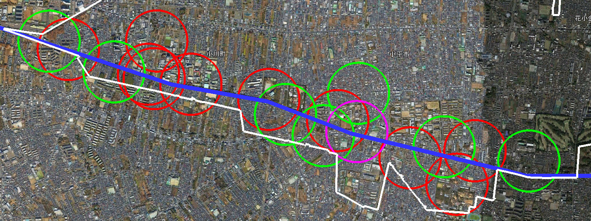
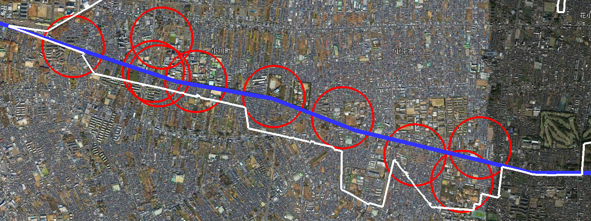
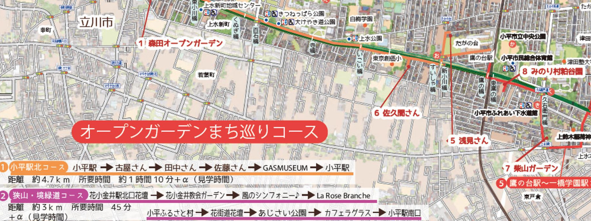

{{first:2022-05-06}}

{{description:小平市議会議員 安竹洋平の令和3年度12月定例会における一般質問の3件目についてまとめています。}}

# （3）公共トイレの重要性を認識し、協力店事業を行ってはどうか

<a href="https://ssp.kaigiroku.net/tenant/kodaira/SpMinuteView.html?council_id=1258&schedule_id=4&minute_id=6&is_search=true">📄会議録を見る</a>

<fieldset class="pnt">
<legend><h2> まとめ </h2></legend>

- 👷‍♂️作成中です🚧

</fieldset>

<button onclick='showPDF("./20211202-ippan-situmon-yasutake-3.pdf")' class="pdf-view-button">
<i class="fa fa-file-pdf-o" aria-hidden="true"></i> 一般質問通告書
</button>

## 主な質疑

👷‍♂️作成中です🚧

目次

- **[今回質問する理由](#今回質問する理由)**
    - [玉川上水沿いには公共トイレの空白地帯がある](#玉川上水沿いには公共トイレの空白地帯がある)
        - tips:[玉川上水周辺の公衆トイレ（小平市内）](#玉川上水周辺の公衆トイレ小平市内)
    - [高齢化社会やコロナ禍において、散歩や、公園で過ごすことの効用が認められてきている](#高齢化社会やコロナ禍において散歩や公園で過ごすことの効用が認められてきている)
- **[まちづくりを計画する際、高齢者の歩行速度まで想定しているか](#まちづくりを計画する際高齢者の歩行速度まで想定しているか)**
- **[配布物におけるユニバーサルデザインをどう捉え、委託先と共有しているか](#配布物におけるユニバーサルデザインをどう捉え委託先と共有しているか)**
    - tips:[小平グリーンロード＆オープンガーデンマップでは公共トイレの表記が小さい](#小平グリーンロードオープンガーデンマップでは公共トイレの表記が小さい)
- **[小平市防災マップアプリに公共トイレの場所も入れてはどうか](#小平市防災マップアプリに公共トイレの場所も入れてはどうか)**
    - [災害時に公共トイレが使えなくなる可能性について](#災害時に公共トイレが使えなくなる可能性について)
    - [地図情報まちだのような地図情報を集約したアプリをつくる方法もある](#地図情報まちだのような地図情報を集約したアプリをつくる方法もある)
- **[町田市、国立市が行っているような公共トイレ協力店事業を検討してはどうか](#町田市国立市が行っているような公共トイレ協力店事業を検討してはどうか)**
    - [補助金を出すわけではなく、ステッカーと地図上への掲載のみといったやり方だが、どうか](#補助金を出すわけではなくステッカーと地図上への掲載のみといったやり方だがどうか)

### 今回質問する理由

#### 玉川上水沿いには公共トイレの空白地帯がある

安竹（初） 

これまで複数の議員から、玉川上水緑道沿いの公共トイレ設置に関する要望があった。

安竹（初） 

しかし、市の答弁は、「公共トイレは一定の配置がなされており、新たに整備する予定はなく、また、こだいら観光まちづくり協会が出している[小平グリーンロード＆オープンガーデンマップ](https://www.city.kodaira.tokyo.jp/kurashi/007/007479.html)に公共トイレの場所は記載されている」といったものであった。

安竹（初） 

たしかに、玉川上水沿いにある公共トイレの間を結べば、いずれも徒歩15分以内の距離にあり、つまり、どこにいても7分ほど歩けばトイレに到着できることになる。

安竹（初） 

しかし、これは時速5キロメートルで計算した場合だ。歩く速度がゆっくりで（小さい字で描かれたマップを見ることにも難がある）、公共トイレの利用率が高い高齢者のことが忘れられているのではないか。

安竹（初） 

なお、最も公共トイレの設置間隔が長いのは、平櫛田中彫刻美術館の周辺である。同美術館は、入場料が必要であることや開館時間が限られていることから、入場のハードルがあり、この施設を公共トイレに含めることは不適切と考える。

安竹（初） 

これを省いて考えると、上水本町地域センターもしくは四小東公園から西に進む場合、次はみよし公園になり、徒歩約20分の距離になる。

安竹（初） 

つまり、このあたりでは、最長で10分ぐらいは歩く必要があり、たとえば時速2.5キロメートルで歩かれる高齢者の場合、20分程度かかることになる。さらに、どこにトイレがあるかも分からない状況では、不安で散歩ができないという話もよく分かる。

🚻 玉川上水周辺の公衆トイレ（小平市内）

小平市内で、玉川上水近辺のトイレから徒歩約5分（時速5kmで歩いた場合=417m）のエリアを、地図上に描いてみました。

- 赤色：公園にある公衆トイレ
- 緑色：地域センターや下水道館など公共施設
- ピンク色：平櫛田中記念館（入館は有料）

<figure>

</figure>

この地図から分かるように、公共トイレの空白エリアは、新小川橋の周辺、また、平櫛田中記念館は有料施設のため公共トイレに含めない場合は小平第4中学の周辺が該当します。この付近を散歩していてトイレに行きたくなった場合、ローソンやロピアがあるアクロスプラザのトイレを使わせてもらうことになります。

また、公共施設のトイレは開館時間にしか使えません。いつでも、トイレが使える公園のみを選択して地図上に描くと、次のような状況になります。

<figure>

</figure>

この場合、上記のエリアに加えて、上水新町地域センターの周辺と津田塾大学の南東部がトイレ空白エリアになります。いざという時は、いなげややファミリーマートを使わせてもらうことになります。

ということで、玉川上水沿いに関し、公共トイレへの協力をお願いするとなると、次の事業所が候補になるかと思います。

- いなげや小平小川橋店
- ローソン小平たかの台店
- ファミリーマート小平上水本町店
- アクロスプラザ小平（ただし開館時間あり？）

#### 高齢化社会やコロナ禍において、散歩や、公園で過ごすことの効用が認められてきている

安竹（初） 

高齢化社会やコロナ禍において、安心して散歩ができることや近くの公園で過ごすことの効用が非常に大きいことは、日本だけではなく海外でも認められるようになってきている。

安竹（初） 

高齢者でも安心して散歩ができるよう、新市長のもとで、公共トイレの在り方からいま一度見直す必要があると考え、質問する。

### まちづくりを計画する際、高齢者の歩行速度まで想定しているか

安竹（初） 

市のまちづくりを計画する際、高齢者の歩行速度まで想定するような基準はあるか。

市長（小林洋子）（初） 

高齢者の身体の状態などにより歩行速度は異なってくることから、想定する基準はない。

安竹（再） 

歩行速度が異なるのは分かるが、高齢者になるとゆっくり歩く（人も多い）。これから高齢者は増える。私たちも高齢者になる。高齢者のことを考えたまちづくりを進めてもらいたい。

### 配布物におけるユニバーサルデザインをどう捉え、委託先と共有しているか

安竹（初） 

最も必要としている高齢者が使いにくいような小平グリーンロード＆オープンガーデンマップでは意味がない。市は、配布物におけるユニバーサルデザインをどう捉え、委託先と共有しているか。

市長（小林洋子）（初） 

市では、年齢等にかかわらず多様な方が利用しやすいよう、マニュアルに基づきユニバーサルデザインに配慮し、各所管課で配布物を作成している。

市長（小林洋子）（初） 

また、配布物を作成委託する際についても、マニュアル等に基づき仕様書に明記するなど、各所管課で対応している。

市長（小林洋子）（初） 

既存のマニュアルがしばらく改訂されていないことから、今後は見直しの検討を行うとともに、職員への周知を徹底し、誰に対しても見やすく分かりやすい情報を発信していけるよう努める。

安竹（再） 

トイレは一応記載されているが、表記が非常に小さい。高齢者の方は、小さな表記を見てトイレがあるとは分からない。

🔍 小平グリーンロード＆オープンガーデンマップでは公共トイレの表記が小さい

次のような具合です。トイレの表記は非常に小さく、この地図を見てトイレを探せと言われても、難しいかと…。

<figure>

</figure>

安竹（再） 

こだいら観光まちづくり協会を訪れて、トイレの表記を大きくしたらどうか提案もしたので、そういう話が出てきた際には対応を。使いやすくしてもらいたい。

### 小平市防災マップアプリに公共トイレの場所も入れてはどうか

安竹（初） 

小平市防災マップアプリに公共トイレの場所も入れてはどうか。

市長（小林洋子）（初） 

小平市防災マップアプリは、主に紙媒体で配布している小平市防災マップのデジタル版であり、スマートフォン端末にダウンロードして閲覧することができるサービス。

市長（小林洋子）（初） 

小平市防災マップは、防災行政無線や防災倉庫などの防災関係設備のほか、避難所やいっとき避難場所及び給水拠点に指定している施設などの災害時に拠点となる施設を掲載するものであり、災害時に使用できなくなる可能性のある公共トイレを掲載することは考えていない。

#### 災害時に公共トイレが使えなくなる可能性について

安竹（再） 

災害時に公共トイレが使用できなくなる可能性があるというのは（あまり知られていないと思う）、むしろ災害時に公共トイレが使えるような状況にしていく、そういう方向もあるかと。

#### 地図情報まちだのような地図情報を集約したアプリをつくる方法もある

安竹（再） 

地図情報を活用したマップが、小平市にもあればよいと思う。

安竹（再） 

町田市には「[地図情報まちだ](https://machida.kukanjoho.jp/webgis/?bt=0&p=1)」というサイトがあり、町田市内の地図情報が集約されている。公共トイレや公園の位置、防災マップもそこに入っている。

安竹（再） 

生きもの発見レポート分布マップや、投票所、ポスター掲示所など、いろんなものが入っている。小平市も同様のマップアプリをつくってはどうかと聞きたいが、具体的事例を集めてからまた提案する。

### 町田市、国立市が行っているような公共トイレ協力店事業を検討してはどうか

安竹（初） 

町田市、国立市が行っているような公共トイレ協力店事業を検討してはどうか。

市長（小林洋子）（初） 

現在のところ事業の検討はしていないが、散歩を含めた高齢者の健康維持や介護予防については、引き続き高齢者が自ら継続して取り組めるよう工夫していく。

安竹（再） 

これはどういう事業かというと、トイレを一般の方に開放してくれる協力店を募るという事業。協力してくれた店舗にはステッカーを掲示してもらう。町田市の場合だと、ホームページや地図情報に掲載される。

#### 補助金を出すわけではなく、ステッカーと地図上への掲載のみといったやり方だが、どうか

安竹（再） 

市から補助金を出しているわけではなく、ステッカーと地図上への掲載のみのようだ。飲食店は衛生面で難しいかもしれないが、薬局や大規模な食料品店などはよいと思うがどうか。

健康福祉部長（滝澤） 

高齢者の介護予防について、今、地域包括支援センターのほうで狭い地域ではあるが、外に出て運動しようということで、ウォーキングラリーを実施している。

健康福祉部長（滝澤） 

その際にもやはり高齢者のことを考え、トイレだったり、休憩できる場所、水飲み場、そういったところは必ずそのコースの中に入れていこうといったところで取り組んでいる。

健康福祉部長（滝澤） 

市内全体という広い範囲になると、なかなか難しいところではあるが、そういった高齢者の介護予防など実施する事業を検討する際には、トイレというところは必ず頭の中に入れながら事業を組み立てている。

以上
