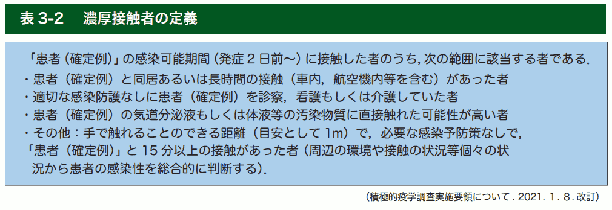

{{first:2022-05-06}}

{{description:小平市議会議員 安竹洋平の令和3年度9月定例会における一般質問の2件目についてまとめています。}}

# （2）データに基づき、コロナ禍の子どもたちを日常生活に

<a href="https://ssp.kaigiroku.net/tenant/kodaira/SpMinuteView.html?council_id=1240&schedule_id=5&minute_id=647&is_search=true">📄会議録を見る</a>

<fieldset class="pnt">
<legend><h2> まとめ </h2></legend>

新型コロナウイルスワクチンの接種がもたらす状況や、各国のワクチン接種の効果もデータが出そろってきました。厚生労働省が8月18日に国会へ提出した新型コロナウイルス感染症による7月の期間致死率は0.14%で、インフルエンザ並みとなっています。その状況変化に応じてコロナ対策を撤廃する国が増えてきており、日本も対応を緩めていくべきと考えます。

子どもたちの一日一日はとても貴重です。私たち大人は、リスクを過剰に恐れ、過剰な対応をすることで、子どもたちからさまざまな経験の場を奪い取ってはなりません。子どもたちは、重症化したり、亡くなる可能性は非常に低いにもかかわらず、大人たちよりも制約の多い状況で過ごしています。そのような状況を改善すべく、質問しました。

国の方針は、解釈次第で「ゆるい制限」に受け取れるのですが、市が勝手に忖度して、厳しい制限を子どもたちに課している状況だと私は見ています。職員には、おかしいことはおかしいと言うだけの矜持を持っていただき、子ども中心の視点で考えてほしいものです。

---

- 世界各国で、マスクなし行動制限なしとする状況については → 各国で状況異なる
- マスクが感染予防に有効とする根拠は → 分からない中で対策、今後対策も変わる
- 子どもの心身健康状態の把握は → 定期健診、毎日の健康調査、担任等の相談で
- 子どもの心身健康状態に異常は → 特別な変化はない、体力調査はこれから
- 子どもの自殺者がコロナ禍で増加の状況について → 認識している、ケアと相談で

</fieldset>

<button onclick='showPDF("./20210910-ippan-situmon-yasutake-2.pdf")' class="pdf-view-button">
<i class="fa fa-file-pdf-o" aria-hidden="true"></i> 一般質問通告書
</button>

## 主な質疑

目次

- **[今回質問する理由](#今回質問する理由)**
    - [各国がコロナ規制撤廃を行う中、日本は過剰な対策を続けている](#各国がコロナ規制撤廃を行う中日本は過剰な対策を続けている)
    - [主要なメディアが、特定の目的を持ち、世の中の空気をつくりだしていると感じる](#主要なメディアが特定の目的を持ち世の中の空気をつくりだしていると感じる)
    - [子どもたちには情報に関する教育が必要](#子どもたちには情報に関する教育が必要)

- **[世界各国でマスクもせず行動制限も特にない事例をどう捉えているか](#世界各国でマスクもせず行動制限も特にない事例をどう捉えているか)**
    - [規制がほぼ何もない国々でも、陽性者数や死者数は問題になっていない](#規制がほぼ何もない国々でも陽性者数や死者数は問題になっていない)
    - [対策の程度が高いイスラエルやスコットランドで陽性者数が増えている](#対策の程度が高いイスラエルやスコットランドで陽性者数が増えている)

- **[マスクが感染予防に有効としている根拠は](#マスクが感染予防に有効としている根拠は)**
    - tips:[マスクを着けていないと濃厚接触者になるのか](#マスクを着けていないと濃厚接触者になるのか)

- **[市は、子どもたちの心身健康状態をどう把握しているか](#市は子どもたちの心身健康状態をどう把握しているか)**
    - [過剰な対策で負担を強いられている子どもたちがいる](#過剰な対策で負担を強いられている子どもたちがいる)
    - [夏休み明けに自殺が増えているのは、勉強に追いつけないことが背景でもあるのでは](#夏休み明けに自殺が増えているのは勉強に追いつけないことが背景でもあるのでは)

- **[児童・生徒の、心身の健康状態が反映される各種指標に、異常な兆候はないか](#児童生徒の心身の健康状態が反映される各種指標に異常な兆候はないか)**

- **[コロナ禍において、子どもの自殺者数が増えている状況をどう考えるか](#コロナ禍において子どもの自殺者数が増えている状況をどう考えるか)**

{{#include ../../../partials/ippan-situgi-note.md}}

### 今回質問する理由

#### 各国がコロナ規制撤廃を行う中、日本は過剰な対策を続けている

国内の新型コロナウイルスワクチン接種がもたらす状況や、各国のワクチン接種の効果などもデータが出そろってきた。厚生労働省が8月18日に国会へ提出した新型コロナウイルス感染症による7月の期間致死率は0.14%であり、インフルエンザ並みとなっている。

8月27日には、デンマークがすべてのコロナ規制撤廃を表明し、コロナパスも9月10日までで終了する。スウェーデンも9月から規制撤廃。それ以外にも、フィンランド、イギリス、米国の各州、ロシア、中国等、他国の例もある。

さまざまなデータが、日本国内や市内における対応の過剰さを物語っている。世界的な状況は変わっているものの、新型コロナウイルス感染症対策に関する対応は以前より大きく変わることがない。

特に、子どもたちにとっての一日一日はとても貴重だ。私たち大人は、リスクを過剰に恐れて、過剰な対応をすることで、子どもたちからさまざまな経験の場を奪い取ってはならない。

市は、感情や報道によるのではなく、冷静にデータを洗い直し、各国の対応状況も参考にしながら、対応を緩めていくべきである。

#### 主要なメディアが、特定の目的を持ち、世の中の空気をつくりだしていると感じる

私は、今の時代もこれまでも、主要なメディアが、特定の目的を持ち、その目的に沿わない情報は一切報道しなかったり、恐怖心をあおるような報道をしたりして、世の中の空気をつくり出していると思う。

都合の悪いデータや、外国の状況を正確に伝えない状況がある。または、特定のグループにレッテルを貼るなどして、分断の思想を持ち込むこともよくある。ワクチン派・反ワクチン派というレッテルを貼るなどは最たるもの。

メディアの多くは、普段は「多様性が重要」と言いながら、一方ではそういうことをしている。これは、第二次世界大戦に日本が参戦することになったころの状況と何も変わっていない。国民・非国民というレッテル貼りと同じこと。

#### 子どもたちには情報に関する教育が必要

余談だが、子どもたちには、「情報の教育」が必要と思う。

主要メディアの報道だからといって、それをデータも調べずすぐに信じるようなことのないよう、また、戦前や戦中に新聞やテレビが何を報道してきたのか、今、どれだけ偏った情報を流しているのか。

そういう風に、「メディアが情報をどう扱っているか」といったことも、本当は勉強してもらったほうがよい。

いずれにしろ、特に、私たち政治家は、おかしいことはおかしいと言わなければいけない立場だ。そのために質問している。

#### 世界各国でマスクもせず行動制限も特にない事例をどう捉えているか

市は、世界各国で、マスクもせず、行動制限も特にないような事例について、どう捉えているか。

今年に入り、複数の国が制限措置の緩和に取り組んでいるが、その成果はまちまち。たとえばワクチンの接種スピードが速い国では、国民のマスク着用をやめ、店舗やレストラン、ホテル、映画館が完全に営業を再開するなど、以前の日常生活に戻ったが、最近では一部の国において、従来株より感染力の強いデルタ株の拡大により、屋内でのマスク着用の義務化や入国する全員を対象とした隔離措置など、多くの制限が再導入されている状況もある。

各国で状況が異なるため、一方では行動制限等がない国もあるものと捉えている。感染症対策は、国や都道府県が中心となり、広域的な対策、対応および措置を講じていくことが重要と捉えている。

市においても、東京都全体で取り組んでいくことが重要と認識しているので、引き続き、新型コロナウイルス感染拡大防止のための東京都における緊急事態措置等に沿った対応をしていく。

日本の主要メディアがほとんど報道しないが、ちょっと調べると、マスクもせず、人が密集して、コロナ前のような、新型コロナウイルス感染症がなくなったかのような暮らしをしている国や地域がたくさんある。

##### 規制がほぼ何もない国々でも、陽性者数や死者数は問題になっていない

だからといって、マスクをしっかりし、触ったものを全部アルコールで消毒し、行動を自粛している日本などと比べて、陽性者数や死者数が問題になっているかというと、けっしてそんなことはない。

特にスウェーデンが象徴的。ストックホルムの学校の状況などを見ても、検索するとすぐ画像もいっぱい出てくるが、もう誰もマスクなんてしていない。

スウェーデンはもともとコロナ対策をほとんどしないところで、当初、死者数が増えたりして大失敗だとかさんざん言われていたが、結局その方式が今は成功事例になっている。ほとんどこれも報道されない。

学校の子どもたちは一切マスクもしていないし、ワクチン接種は進んでいるが、自粛の強要やマスクの強要、ワクチンの強要も一切なくやってきて、9月からはコロナ規制がほぼ完全撤廃される。

私は、これこそ日本がまねするべきケースだと考えている。

ロシアや中国も、一般に思われているよりかなり緩い。ロシアは、マスクしている人なんか全然いない。アメリカも一部の厳しい措置をしている州だけが取り上げられて報道されているが、実際は、多くの州でマスクなしで、スタジアムに人々が殺到したりしている状況もある。

##### 対策の程度が高いイスラエルやスコットランドで陽性者数が増えている

逆に、最もワクチンの接種が進んでいるイスラエルで、今、非常に陽性者数が増えている。マスク着用が義務化されているスコットランドも、今、陽性者数が増えているといった状況。

これが、メディアもよく引用するオックスフォードのサイトのデータ。人口100万人当たりの陽性者数。赤で書いたのが、ワクチン接種がかなり進んでいるイスラエル。

イスラエルの感染者数が非常に増えている。ワクチン接種が進んだイスラエルでこれだけ増えているということは、要は感染予防効果はほとんどないということ。

下のほうに日本も入っている。マスクをほぼしない、自粛もしない、感染予防の対策などをほとんどしない国々の陽性者数が、日本と同じ、もしくはそれ以下だ。こういうデータを見れば、何が起きているかは分かると思う。

#### マスクが感染予防に有効としている根拠は

マスクが感染予防に有効としている根拠は何か。

マスクであったり、手洗いであったり、人との距離というところは今言われている。感染症の歴史からも、さまざま分からないことの中で対策をしているという事実はあると認識をしているところ。

いずれにしても、今、国においては、研究者等もさまざまなデータを検証していく中で、今後、マスクの対応、そのほかの対策も変わってくるのではないかと認識をしているところだが、現状では、国民全体でマスクをしましょうということになっているので、その対応を市としても進めている。

小平市として単独でなかなか動くことはできないというのは分かっているが、マスクがないと濃厚接触と定義されてしまったりする*ので、そういったところがあると思う。東京都にはそういった基準を見直してほしい。

*❓ マスクを着けていないと濃厚接触者になるのか

厚労省に電話で確認したところ、次のとおり、マスクを着けていないことからといってすぐに濃厚接触者とみなされるわけではありませんでした。

**Q（安竹）：** 濃厚接触者の定義として「マスクをつけずに15分以上近くにいた場合」という話を耳にした。この「マスクをつけずに」というところは、その場にいる双方ともマスク着用が必要なのか。それとも、片方がマスクをしていればよいのか。

**A（厚労省）：** [「新型コロナウイルス感染症COVID-19 診療の手引き 第7.2版」の28ページ表3-2](https://www.mhlw.go.jp/content/000936655.pdf#page=28)を見てほしい。
これらの状況を踏まえて総合的に判断するものであり、マスク非着用だからといって、そこを切り取って判断するものではない。
つまり、片方がマスクをつけている、両方がマスクをつけている、というところだけで判断はしない。

（厚労省：新型コロナウイルス感染症対策推進本部　戦略班　自治体対応窓口・令和4年7月5日に確認）

ここで示された資料には、次のとおり、マスクのマの字も書かれていません。

<figure>

</figure>

#### 市は、子どもたちの心身健康状態をどう把握しているか

国立成育医療研究センターのグループが定期的に行っているアンケート調査等に、コロナ禍での子どもたちや保護者たちの心理的ストレスが表れている。市は子どもたちの心身健康状態をどう把握しているか。

定期健康診断や、毎日行っている健康調査のほか、担任、スクールカウンセラーおよび養護教諭等による相談の中で、心身の健康状態の把握に努めている。

##### 過剰な対策で負担を強いられている子どもたちがいる

心身健康状態に関しては、特に発達障害のあるお子さんの御家庭など、そういったところには、できれば子どもだけではなくて保護者にも、アンケートを取ったり、さまざまなお話を伺ったほうがよい。

学校が休校になった場合は、宿題がいっぱい出たりする。オンラインでやる場合、一日の最初に先生が話し、課題が出る。そういったことを全部家の中でやらなきゃいけない。発達障害の子たちの中にはそれが大変な子たちがいる。

##### 夏休み明けに自殺が増えているのは、勉強に追いつけないことが背景でもあるのでは

推測だが、夏休み明けに自殺者が増えてくる状況は、「勉強に追いつけていない」ところもひとつあるのでは。夏休みに勉強に追いつこうと思ったけれども追いつけなかったとか、そういうこともあるのではないか。

#### 児童・生徒の、心身の健康状態が反映される各種指標に、異常な兆候はないか

市内で、
- 不登校
- いじめ
- （その他）問題行動
- 家庭内暴力
- 熱中症の件数
- 成績

など、児童・生徒の心身の健康状態が反映される各種指標に、異常な兆候は表れていないか。

学校生活に関わる問題行動や熱中症の件数に、新型コロナウイルス感染症の拡大以前と以後で特別な変化はない。成績等についても、全国学力調査結果において特別な変化は見られない。

体力調査結果については、本年度の実施結果がこれから示されるため、コロナ禍において運動の機会が減っていることを踏まえ、調査結果を注視していく。

#### コロナ禍において、子どもの自殺者数が増えている状況をどう考えるか

本年6月25日に開催された児童・生徒の自殺予防に関する調査研究協力者会議などで指摘されているように、児童・生徒（高校生を含む）の自殺者数がコロナ禍において増えている状況について、市はどう考えるか。

新型コロナウイルス感染症の拡大の影響で、子どもたちの日常生活や学校生活にこれまでと異なる状況が長期に及んでいることが背景のひとつであると認識している。

小平市立学校では、子どもたちの大切な命を守るために、長期休業日明けの子どもたちの小さな変化を見逃すことなく、必要なケアを行うとともに、安心して相談できるよう取り組んでいく。

小・中学生というよりは、データを見ると、実際は高校生の増加が多いと思う。思春期で、今言ったような夏休み明けになかなか勉強に追いつかないとか、そういったことがあるのではないか。

何かあったらすぐ学級閉鎖とか自宅学習とかになってしまうと、学習障害の子どもや、共働きの世帯、社会的に弱い立場にある方々にしわ寄せが来るので、そういったことはなるべくやらないでいただきたい。

以上
