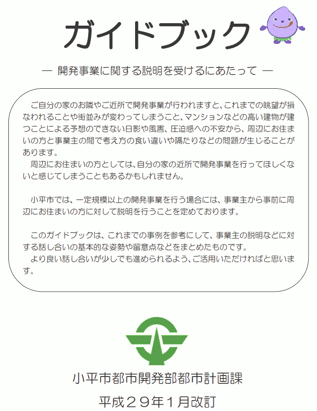

{{first:2023-01-05}}

{{description:小平市議会議員 安竹洋平の令和4年度12月定例会における一般質問の1件目についてまとめています。}}

# 市民とともにまちづくりを行う条例を運用に耐えうるものに

～条例や運用の不備、市長の不作為が市民や職員を苦しめており、すぐに改善が必要です～

<a href="https://smart.discussvision.net/smart/tenant/kodaira/WebView/rd/speech.html?council_id=30&schedule_id=4&playlist_id=6&speaker_id=37&target_year=2022">🎞️動画を見る（令和5年2月末頃まで）</a>

<a href="">📄会議録を見る（まだ公開されていません）</a>

<fieldset class="pnt">
<legend><h2> まとめ </h2></legend>

[前回の一般質問](../9-gatu/2-tokyo-saresio-kaihatu.md)に引き続き、東京サレジオ学園の北側にある土地（同学園から事業主であるトヨタホーム㈱に売却された土地）の大規模開発について問いました。また、関連して、回田町で行われている開発についての対応も問いただしました。

前回一般質問をしたころには、事業主は周辺住民や市から再三の要求があってもなお自主的協議に一切応じてきませんでした。それがここへきて急きょ事業主の態度が軟化し、周辺住民と事業主の間で十分な意見交換が行える（ように私からは見えていますが）自主的な説明会が開かれています。事業主からは、周辺住民の意向を取り入れた新しい計画案が何度も提示されるなど、今のところは理想的な形に落ち着いています。

しかし、このように状況が好転したのは、主に周辺住民の働きかけが奏功した結果です（私はある特殊な事情が強く作用したものと考えています）。市の催促も意味があったでしょう。しかし、市の条例に不備がある状況や、それを運用でカバーしきれていない状況は何も変わっていません。このままでは今後も同じことが起きます。

そこで今回は、今後のために、条例の不備や運用の不備を改善するための提案という形で質問しました。

担当課は前向きに改善を検討する姿勢はあります。しかし条例の改正となると及び腰です。さらに、条例や運用を改善するためには職員が頻繁に現場に足を運び、情報を収集することが非常に重要だと私は思うのですが、残念なことに、市の職員は、事業主と周辺住民との間で行われる自主的説明会に（参加を要請されながらも）傍聴者としてすら参加することを拒んでいます。

私から見るとこれは『義を見てせざるは勇無きなり』の状況です。市の職員が、市民だけではなく「同僚が苦しんでいる姿を目の当たりにしてもなお」情報収集にすら出て来ないのは、勇気がないからだと感じてしまいます。悲しい文化です。まずはとにかく現場に出ることから改善してほしいです。聞くところによると、かつての小平市は職員が頻繁に現場に来ていたそうです。最近は（コロナ禍前も）めっきり現場に出てこないそうです。

また、条例の不備を運用でカバーする際の最後の砦は市長です。しかし市長がこれまでアクションを起こしてきたようには思えません。子どもたちの命に関わる問題が生じて、行き詰まりになっている回田町の開発も、条例の不備とその不備を運用でカバーしきれていないことがひとつ大きな原因になっています。それに対して市長は関係者と協議を行うなど行動をしてきたのかも問いました。残念ながらいつものとおり「職員が指示を受けてちゃんとやっている」といった答弁でした。市民だけではなく部下が苦しむ姿を見ても行動に移せない市長は、やはり勇無きなりと感じざるを得ません。市長の任期はあと2年。子どもたちのために、市民のために、そして部下のために、自分にできることを考え直していただきたいと思います。

---

- 自主的協議等が事業主の責務だと条例に明記しては → [今考えていないが研究する](#周辺住民と自主的協議を行うこと等が事業主の責務だと条例に明記しては)
- なぜ今は考えていないのか → [事業主に不要な負担を強いる可能性がある](#なぜ今のところ明記を考えていないのか)
- 条例の主旨をいつ指導しているか → [大規模開発では土地利用構想の手続き中に](#事業主に対して条例の主旨を指導しているのはいつの時点か)
- 自主的協議に応じなければ条例違反だと伝えているか → [条例違反とは伝えてない](#指導の際に自主的協議をしない場合は条例違反になると伝えているか)
- 土地購入前に、自主的協議が必要と知らせないと → [土地売買に絡むので難しい](#事業主が土地を購入するより前に自主的協議が必要と分かるようすべきでは)
- なぜすぐ対応しないか → [行政指導は相手の任意協力が前提なので書き方が難しい](#問題が明確で関係者に心理的負担が生じている状況でなぜすぐ対応しないのか)
- 少なくともガイドブックを事業主にも配布しては → [配布していきたい](#条例を変えるのが難しいならまずガイドブックの扱いと内容を変えては)
- ガイドブックの市ホームページ掲載は工夫を → [事業主の目に留まるよう検討する](#条例を変えるのが難しいならまずガイドブックの扱いと内容を変えては)
- ガイドブックに事業主の責務の定義を明記しては → [もう少し検討したい](#ガイドブックに事業主の責務の具体的内容を記載しては)
- 現状を整理すると[こうなる](#現在の状況を整理するがその認識で正しいか)がその認識でよいか → [大方そうだが市も限界が](#現在の状況を整理するがその認識で正しいか)
- 自主的協議を行う時点を条例に明記しては → [過度な負担となる恐れから慎重に](#自主的協議を行うタイミングを条例に明記してはどうか)
- 過度な負担と言いつつ、なし崩し開発を容認する意図は → [そういう考えはない](#自主的協議を遅らせることでなし崩しに事業を完遂させる意図があるのでは)
- 調整会中に新案が提示されたことへの見解は → [事前説明が不十分で混乱を招いた](#調整会中に事業主から新案が提示されたことをどう考えているか)
- 事業主に対し、土地利用構想の変更届を出すよう促しては → [なかなか難しい](#市から事業主に土地利用構想の変更届を出すよう提案してはどうか)
- 変更届が出たら、市長はさかのぼって手続きを求めるか → [再審議を検討する](#事業主から土地利用構想の変更届が出たら市はさかのぼって手続きを求めるか)
- 新案に対する土地利用審議会を改めて開くべきだが → [届出がないと再審議しない](#変更届出に関係なく土地利用審議会を再度開く必要があるのでは)
- 「市長が認めたとき」は「東京都審査基準による」と書けば → [最終合意は市長](#市長が認めたときと書かず東京都の審査基準によると書いてはどうか)
- 土地価格や流動性が一時下がっても条例明記は意味があるのでは → [制約がきつい](#一時的問題が生じても長期には条例に合った土地の売買や開発が行われるのでは一時)
- 傍聴人の定員は10人と限定せず可能な限り配慮すると書けば → [議長が柔軟に判断](#調整会の傍聴人定員は可能な限り配慮すると要領に書けばよいのでは)
- 最後の砦の市長が自主的協議を促すこともできたが → [行政指導しており不必要](#条例の不備を運用でカバーする最後の砦は市長だが今回出てこなかったのはなぜか)
- 回田町の開発で市長は関係者と協議するなどしたか → [行政指導しており不必要](#回田町の開発を巡る問題でも市長は何らかの行動を起こしたのか)
- 子どもの命に関わる問題に市長は人事を尽くしているか → [指示受けた職員で対応](#子どもたちの命に関わる問題でもあるのに市長は人事を尽くしているのか)

</fieldset>

<button onclick='showPDF("./20221202-ippan-situmon-yasutake-1.pdf")' class="pdf-view-button">
<i class="fa fa-file-pdf-o" aria-hidden="true"></i> 一般質問通告書
</button>

## 主な質疑

目次

- [今回質問する理由](#今回質問する理由)
    - [前回に引き続いて](#前回に引き続いて)
    - [条例と運用を見直し、「市民とともにまちづくり」を実のあるものに](#条例と運用を見直し市民とともにまちづくりを実のあるものに)
    - [サレジオ学園北側の土地開発はやっと自主的協議が始まった](#サレジオ学園北側の土地開発はやっと自主的協議が始まった)
    - [今後同様のことが起きないように](#今後同様のことが起きないように)
- [周辺住民と自主的協議を行うこと等が事業主の責務だと条例に明記しては](#周辺住民と自主的協議を行うこと等が事業主の責務だと条例に明記しては)
    - [なぜ今のところ明記を考えていないのか](#なぜ今のところ明記を考えていないのか)
    - [事業主に対して条例の主旨を指導しているのはいつの時点か](#事業主に対して条例の主旨を指導しているのはいつの時点か)
    - [指導の際に、自主的協議をしない場合は条例違反になると伝えているか](#指導の際に自主的協議をしない場合は条例違反になると伝えているか)
    - [事業主が土地を購入するより前に、自主的協議が必要と分かるようすべきでは](#事業主が土地を購入するより前に自主的協議が必要と分かるようすべきでは)
    - [問題が明確で関係者に心理的負担が生じている状況でなぜすぐ対応しないのか](#問題が明確で関係者に心理的負担が生じている状況でなぜすぐ対応しないのか)
    - [条例を変えるのが難しいならまずガイドブックの扱いと内容を変えては](#条例を変えるのが難しいならまずガイドブックの扱いと内容を変えては)
    - [ガイドブックに事業主の責務の具体的内容を記載しては](#ガイドブックに事業主の責務の具体的内容を記載しては)
    - [現在の状況を整理するがその認識で正しいか](#現在の状況を整理するがその認識で正しいか)
- [自主的協議を行うタイミングを条例に明記してはどうか](#自主的協議を行うタイミングを条例に明記してはどうか)
    - [逐条解説にも自主的協議はできるだけ早い時期にと書いてある認識でよいか](#逐条解説にも自主的協議はできるだけ早い時期にと書いてある認識でよいか)
    - [なるべく早い段階で協議をした方が事業主にとっても負担が少ないのでは](#なるべく早い段階で協議をした方が事業主にとっても負担が少ないのでは)
    - [自主的協議を遅らせることで、なし崩しに事業を完遂させる意図があるのでは](#自主的協議を遅らせることでなし崩しに事業を完遂させる意図があるのでは)
- [調整会中に事業主から新案が提示されたことをどう考えているか](#調整会中に事業主から新案が提示されたことをどう考えているか)
    - [再度周辺住民への説明会が必要になる著しい変更では](#再度周辺住民への説明会が必要になる著しい変更では)
    - [手続きを改めて実施してもらうよう市長から依頼できる変更では](#手続きを改めて実施してもらうよう市長から依頼できる変更では)
    - [改善は変更届の対象としていないというのはおかしな話](#改善は変更届の対象としていないというのはおかしな話)
    - [一部の住民だけに変更プランが示されている状況](#一部の住民だけに変更プランが示されている状況)
    - [市から事業主に土地利用構想の変更届を出すよう提案してはどうか](#市から事業主に土地利用構想の変更届を出すよう提案してはどうか)
    - [土地利用構想の変更届を出す条件は明文化されているか](#土地利用構想の変更届を出す条件は明文化されているか)
    - [事業主から土地利用構想の変更届が出たら市はさかのぼって手続きを求めるか](#事業主から土地利用構想の変更届が出たら市はさかのぼって手続きを求めるか)
    - [変更届出に関係なく、土地利用審議会を再度開く必要があるのでは](#変更届出に関係なく土地利用審議会を再度開く必要があるのでは)
    - [土地利用審議会を意味なきものにするのか](#土地利用審議会を意味なきものにするのか)
- [市長が認めたときと書かず、東京都の審査基準によると書いてはどうか](#市長が認めたときと書かず東京都の審査基準によると書いてはどうか)
    - [6メートルの幅員さえあれば、袋路状道路で転回広場がなくても法律違反ではない](#6メートルの幅員さえあれば袋路状道路で転回広場がなくても法律違反ではない)
    - [「袋路状道路には開発許可出さない」と条例に書いてもよいという弁護士見解も](#袋路状道路には開発許可出さないと条例に書いてもよいという弁護士見解も)
    - [一時的問題が生じても長期には条例に合った土地の売買や開発が行われるのでは](#一時的問題が生じても長期には条例に合った土地の売買や開発が行われるのでは)
- [調整会の傍聴人定員は可能な限り配慮すると要領に書けばよいのでは](#調整会の傍聴人定員は可能な限り配慮すると要領に書けばよいのでは)
- [まちづくりは土地売却より前に始まるという観点を施策に取り入れては](#まちづくりは土地売却より前に始まるという観点を施策に取り入れては)
- [条例の不備を運用でカバーする最後の砦は市長だが、今回出てこなかったのはなぜか](#条例の不備を運用でカバーする最後の砦は市長だが今回出てこなかったのはなぜか)
- [回田町の開発を巡る問題でも市長は何らかの行動を起こしたのか](#回田町の開発を巡る問題でも市長は何らかの行動を起こしたのか)
    - [人事を尽くすことで大きく状況を動かしている小平市民の事例を紹介する](#人事を尽くすことで大きく状況を動かしている小平市民の事例を紹介する)
    - [子どもたちの命に関わる問題でもあるのに、市長は人事を尽くしているのか](#子どもたちの命に関わる問題でもあるのに市長は人事を尽くしているのか)
- [条例と運用の不備や、市長の不作為が多くの関係者を不幸にしている、すぐに改善を](#条例と運用の不備や市長の不作為が多くの関係者を不幸にしているすぐに改善を)

{{#include ../../../partials/ippan-situgi-note.md}}

### 今回質問する理由

#### 前回に引き続いて

[前回](../9-gatu/2-tokyo-saresio-kaihatu.md)に引き続き、東京サレジオ学園の北側にある土地（同学園から事業主に売却された土地）の大規模開発について問う。関連して最後に請願第18号の回田町の開発について問う。

前者の開発においては、周辺住民や市からの再三の協議要請に事業主が応じてこなかったことから、市としても初めて直面する課題がいくつも生じてきたと捉えている。

#### 条例と運用を見直し、「市民とともにまちづくり」を実のあるものに

私の認識では、問題は、条例に不備があることと、その不備を運用でカバーしきれていないことにある。

周辺住民から具体的に問題が指摘されており、市も改善に着手し始めているであろう。

今回のことを契機に、市の開発条例（小平市開発事業における手続及び基準等に関する条例）を運用に耐えるものに改良し、カバーする運用面も整え、同第5条に明記された「市民とともにまちづくりを行う」という思想を実のあるものにしてほしい。

<blockquote>

事業主は、安全で快適なまちづくりを推進するため、開発事業を行うに当たっては、その内容を[都市計画マスタープラン](https://www.city.kodaira.tokyo.jp/kurashi/index07005003.html)の方針に適合させ、自らも地域社会の一員としての社会的使命を自覚し、市民とともにまちづくりを行うものとする

<a href="https://www.city.kodaira.tokyo.jp/reiki/reiki_honbun/g135RG00001187.html#e000000117">小平市開発事業における手続及び基準等に関する条例 第5条（事業主の責務）</a>

</blockquote>

#### サレジオ学園北側の土地開発はやっと自主的協議が始まった

サレジオ学園北側の土地開発については、やっと事業主のトヨタホームが話し合いに応じる状況になった。

第2回目の調整会は前半と後半に分け、前半の最後に周辺住民と事業主が話し合う時間を設けてもらった。

その後、別の日程で事業主の自主的説明会が開かれ、やっと自主的協議ができる環境になってきた。私が見た限りでは今のところ理想的雰囲気。もっと早くから開かれていればとは思うが。

#### 今後同様のことが起きないように

これは住民の方々のさまざまな働きかけがあった結果。市からの再三の催促もあった。しかし条例に不備があることは変わっておらず、今後も同様な事例が起きる可能性は十分ある。

今回よく分かったのは、条例に不備があると、市民や開発事業者が混乱するうえに、その間に挟まれている市の職員にも大きな負担がかかるということ。

今後同様の事態が起きないよう条例や運用を改善しよう、という提案の形で質問する。

#### 周辺住民と自主的協議を行うこと等が事業主の責務だと条例に明記しては

[本年9月定例会の答弁](../9-gatu/2-tokyo-saresio-kaihatu.md#jisyu-kyougi)で「市民とともにまちづくりを行う」の意味は「事業主と周辺住民が、相手の立場を尊重し、譲り合いの精神を持って自主的に協議を行うこと」等とあった。

しかしこれが条文にないため、事業主は自主的協議を行わないことが条例違反になるという認識がない。

条例にある事業主の責務について、前回答弁のとおり事業主と周辺住民が自主的に協議を行うこと等を明記すべきでは。

市の開発条例第5条の事業主の責務については、周辺住民からの意見や要望に対して自主的に協議を行うことや課題解決のために相互に建築協定などの検討をすることを想定しており、地域ごとのまちづくりの課題に即した対応を事業主に指導している。

また、条例第18条の市民への周知では、紛争が生じた場合は事業主と周辺住民が相互の立場を尊重し、譲り合いの精神をもって自主的に解決するよう努めなければならないこととしている。

<blockquote>

事業主と周辺住民との間に紛争が生じた場合は、当該事業主及び周辺住民は、相互の立場を尊重し、互譲の精神をもって、自主的に解決するよう努めなければならない。

<a href="https://www.city.kodaira.tokyo.jp/reiki/reiki_honbun/g135RG00001187.html#e000000339">小平市開発事業における手続及び基準等に関する条例 第18条（周辺住民への周知等）の3</a>

</blockquote>

市としては、開発事業の手続きの際には、事業主に対して条例の主旨を指導しており、現在のところ事業主の自主的な協議を条例に明記することは考えてないが、地域住民のまちづくりへの意識の変化などもあることから、今後の運用における取扱いを含め、研究していく。

##### なぜ今のところ明記を考えていないのか

なぜ今のところ明記を考えていないのか。

本来、周辺住民の揉めごとが起こらずスムーズに進められることが一番よい。

条例に自主的な説明会を求めることを明記するのは不要な負担を強いることになるのではと考えている。明記してもその方法を選ぶ権利は事業主の方にある。説明会の指定という強い指導をすることはなかなか難しい。

市としては運用の中で行政指導として指導していきたい。

その点はのちほど指摘する。

##### 事業主に対して条例の主旨を指導しているのはいつの時点か

開発事業の手続きの際に事業主に対して条例の主旨を指導していると答弁したが、いつの時点で指導しているか。

一般的な開発では、事前相談の段階で伝えている。

今回のサレジオ学園北側の開発は大規模開発事業なので、その前段の土地利用構想に関わるところの手続きの中でも伝えている。

##### 指導の際に、自主的協議をしない場合は条例違反になると伝えているか

その指導の際に、「自主的な協議をしない場合は、条例第5条の事業主の責務に違反する」と伝えているか。

条例違反になるということではなく、周辺住民から声があった場合は必ず説明をし対応してほしいという旨を口頭で伝えている。

事業主は条例違反かどうかをとても気にしていることが今回分かった。条例違反でないなら問題はないというスタンスであることも、調整会等の会議録等を読むと分かる。つまり、事業主に対しては「条例違反になる」と伝えることが重要。

しかし条例には「市民とともにまちづくりを行ってください」と書いてあるが「自主的な協議をしてください」とは書いてない。もし事業主が土地を買った後、市が事業主に対して自主的な協議に応じるよう指導するなら、事業主は土地を買ってから初めてそれを知らされることになる。

これは事業主にとってフェアではない。土地を買った後に後付けでコストがかかることをさせられている。場合によっては訴訟を起こされて市が負ける可能性もある。

##### 事業主が土地を購入するより前に、自主的協議が必要と分かるようすべきでは

そのため、条例に明記するなどして、事業主が土地を買う前の段階で「小平市で大規模開発をするなら、自主的協議に応じる必要がある」と分かるようにしなければならないと思うがどうか。

土地を買う前には相互の売買に対してあまり不利益にならないよう注意が必要。伝え方は非常に難しい。行政指導の範囲になってくるので、明記して確実に出すとなると条例上難しい。

今までどおりのやり方で、運用の中での方法でなんとか試みさせてもらいたい。

事業主の負担になるという点はまたのちほど指摘する。

##### 問題が明確で関係者に心理的負担が生じている状況でなぜすぐ対応しないのか

今後の運用における取扱いを含め研究していくという市長答弁だが、市の言う「研究」は皆さんご存じのようにスピーディーに進まない。

今回うまくいかなかったことが明らかになっており、周辺住民の方々から具体的な指摘があり問題点も明確になっている。市長の部下である職員にもかなり心理的負担がかかっている。なぜすぐに対応しないのか。

今回、事業主がなかなか自主的協議に応じなかったところが最大の問題だったと思う。

自主的協議は、基本的には双方を思いながらやっていかなければいけない。たしかに条例にはその主旨はあるが、自主的協議自体がお願いをしてやっていただくこと。

市の方も、行政指導を行う過程では、あくまで相手の任意の協力によってのみ実現されるということが行政手続法にも明記されている。書きぶりは非常に難しい。

<blockquote>

行政指導にあっては、行政指導に携わる者は、いやしくも当該行政機関の任務又は所掌事務の範囲を逸脱してはならないこと及び行政指導の内容があくまでも相手方の任意の協力によってのみ実現されるものであることに留意しなければならない。

<a href="https://elaws.e-gov.go.jp/document?lawid=405AC0000000088#Mp-At_32">行政手続法　第32条（行政指導の一般原則）</a>

</blockquote>

しかし開発条例には、説明会や調整会を開くことなど、事業主に対して強制と思えるような手続きが書かれています。自主的協議についても同様に設定すればよいだけなのでは…。今後深掘りしていきます。

##### 条例を変えるのが難しいならまずガイドブックの扱いと内容を変えては

条例を変えることがどうしても難しいなら、最悪というか、消極的な手段として次のような対応もある。

市には『[開発事業に関する説明を受けるにあたって](https://web.archive.org/web/20220707155859/https://www.city.kodaira.tokyo.jp/kurashi/043/043425.html)』というガイドブックがある。そこには、自主的協議が必要で、それが基本になるといったことが書かれている。

<blockquote>

<a href="https://web.archive.org/web/20220707155859/https://www.city.kodaira.tokyo.jp/kurashi/043/043425.html">小平市『開発事業に関する説明を受けるにあたって（平成29年1月改訂）』</a>

</blockquote>

ただしこれは市民向けと書かれている。タイトルも「説明を受けるにあたって」だ。事業主がこれを積極的に読むことはないと思う。

また「自主的な協議を行うことが事業主の責務」といったことも書かれていない。

条例を変えることが難しいなら、このガイドブックを次のようにしてはどうか。
- 市民向けではなく「事業者と市民向け」として市ホームページに載せる
- 開発の手引きが掲載されているページと同じところに、関連リンクとしてではなく同じコンテンツとして並列の扱いで置く
- ガイドブックの中に「条例にある事業主の責務とは自主的な協議を行うことである」と明記する

これは最後の手段であり、上記の対応をしたところで事業主に対してフェアではないことに変わりはないが。どうか。

たしかに事業主にはガイドブックを配布していない。

周辺住民から声があった場合は必ず説明してほしいと口頭で伝えていることもあるので、このガイドブックを事業主にも配布していきたい。

また、ホームページの掲載についても、箇所を工夫するなど、事業主の目に留まるよう検討していきたい。

ガイドブック、手引きについては引き続き、分かりやすく、誤解の生じない記載方法を検討していきたい。

##### ガイドブックに事業主の責務の具体的内容を記載しては

ガイドブックの中に「条例にある事業主の責務は自主的な協議を行うこと」や「相互に建築協定などの検討をすること（前回市長答弁にあったこと）」も明記しては。

表記の仕方もあるので、具体的なことについては、もう少し検討したい。

ガイドブックに書くだけなら、気にしている行政手続法のことも問題ないのでは。

##### 現在の状況を整理するがその認識で正しいか

もう一度今の状況を整理する。

条例には「事業主が市民とともにまちづくりを行う」と書いてある。これを周辺住民が読めば、計画が固まる前から事業主と自主的な話し合いを重ね、お互いに共通認識のようなものが形成できると理解（期待）するはずだ。

一方で事業主が条例を読めば「手続きにある説明会や調整会を行うことで市民とともにまちづくりを行ったことになる」と理解するはずだ。これは自然の成り行きである。

市の職員がいくら事業主に対して自主的な協議に応じるよう依頼しても、事業主としては、なぜ市は条例にないことを強要してくれるのか、という意識になる。

ここで住民と事業主の間に挟まれた市の担当職員は疲弊する。条例の記載があやふやなため、住民も事業主も認識に間違いがない中で、職員が誠心誠意尽くそうと頑張っても、どちらからも責められて疲弊してしまう。

そういった状況にあるという認識でよいか。

その認識で大方そういう形で我々も捉えている。

ただ、開発事業については、基本的には東京都が許可を出す。その間の中継と言うか、市は同意を出していく。そこはあくまでも行政指導のレベルで、かなりの限界がある。

住民の方にとってみれば、行政指導に強い権限があると思われる。そのあたりはきちんと説明をしていきたい。行政指導の難しさを、もう少し住民の自分の方に理解していただくような説明の仕方や書き込みについては工夫していきたい。

#### 自主的協議を行うタイミングを条例に明記してはどうか

自主的な協議を行うタイミングは特に定めがないため、初めて協議に応じるのが工事着工段階であっても事業主の責務を果たすことになる。

この抜け穴を塞ぐため、たとえば「周辺住民から協議の要求があった場合、できる限り速やかに、遅くとも3週間以内に」など、具体的に協議を行うタイミングについて条例に明記しては。

事業主が周辺住民から協議の要求を受けた場合、速やかに対応できるとは限らず、開発事業の事業主に対する過度な負担を課す恐れもあることから、条例への明記は慎重に取り扱う必要があると考えている。

##### 逐条解説にも自主的協議はできるだけ早い時期にと書いてある認識でよいか

事業主に「自主的な協議に応じないと条例違反だ」ということを土地購入より前に伝わるようにすることは大前提。その次に必要なのは、自主的な協議をどの段階で行うかということ。

開示請求で入手した開発条例の逐条解説に重要な記載がある。

開発条例9条（土地利用構想の公開等）の土地利用構想の縦覧や説明会について書いてあるところ。

<blockquote>

開発事業を実施する場合、事業主から周辺住民に対して行われる事業計画の説明が、一般的には変更不可の状態（計画を固めて用地取得するため。）にて行われることが多く、市や住民からの要望等があっても計画変更が困難であり、このため住民と軋轢が生じて紛争となる事例が増大している。よってできるだけ早い時期（構想の段階で計画変更が可能な時期まで。）に、周辺住民に対して説明会を開催し、計画内容を公表するとともに、周辺住民等と調整協議を行うことにより紛争の発生を減少させることを目的に、当該規定を設けている。

小平市開発事業における手続及び基準等に関する条例小平市開発事業における手続及び基準等に関する条例施行規則　逐条解説

</blockquote>

つまり事業主はほぼ計画を固めた状態で用地を買っているので、できるだけ早い時期に、説明会だけではなく周辺住民等との調整協議を行うことにより紛争の発生を減少させる必要があると書いてある。

つまり、のんびりしていたら計画が固まってしまう。だから自主的な協議を行う時期はできるだけ早い時期でなければならない。そう逐条解説に書いてあると思うが、正しいか。

早いうちにそのあたりの主旨を理解していただくという趣旨はそのとおり。

ただ、基本的には土地利用構想の段階からその後の窓口協議に入っていく。その段階でも基本的には説明の機会や変更は可能。そういうふうに全体を見た中での書きぶりになっている。

##### なるべく早い段階で協議をした方が事業主にとっても負担が少ないのでは

つまり、進んだ段階でも変更は可能だけれども、なるべく早い段階で協議に応じてもらった方が、事業主にとっても周辺住民にとってもよいということ。

先ほど「事業主に対する過度な負担になる恐れがある」と答弁したが、自主的協議をなるべく早い段階で行わなければならないと理解していた方が、事業主にとっても負担が少ないと思う。

今回のように、後の段階になってから自主的協議を行うことになると、そこで出た意見を取り入れ、修正、修正とやっていく。時間もコストも余計にかかる。そうではないか。

コストについては事業者の考え方などで場合によってはかかってくる可能性もある。市としては、なるべく早い段階での自主的な協議を促している。

ということは、事業主に過度な負担を課す恐れという話も、状況に応じてそうではないかもしれない。

事業主はかなり強い立場にある。いつ話し合いをしようと、住民には計画を変更させる強制力がない。早めに話し合いがなされても、事業主にとっては不利益は何もないのでは。

むしろ話し合いが後になればなるほど住民の不信が募り、軋轢が生じ易くなったり紛争も起きやすくなるのではないか。

##### 自主的協議を遅らせることで、なし崩しに事業を完遂させる意図があるのでは

「過度な負担にならないように」といつも言うが、事業主が協議のタイミングをなるべく後にずらせることで、なし崩し的に開発を進められるようにすることが事業主の利益になるという意識があるのでは。

なし崩し的にして事業を完遂させるというような考えは市にはない。事業者もそういう考えはないと市は考えている。

ただ、自主的な協議と説明で、人員や会場の手配だとか、時期がなかなか合わないとか、そういう事情も事業主にはあるので、それを踏まえてある程度場合によっては少し後ろになってしまうこともあるのではと考えている。

つまり会場の設営や時間を合わせる必要があるから、早め早めにと言うと事業主に過度な負担になるという話か。

であれば、そういうことが解決する時間軸の中で最大限早めてもらう、うまい表現の仕方はあると思う。今パッと思いつかないが。そういうところを検討し、考えていただきたい。

#### 調整会中に事業主から新案が提示されたことをどう考えているか

今回、土地利用構想に係る手続きの中で事業主が新しい図面を2度提示した。どちらの案も説明会はなく、うち1回は土地利用構想に係る調整会の中で提示されるなどし混乱を招く事態となったことについて、市の見解を問う。

上水・南町4丁目（サレジオ学園北側の土地）の開発事業では、土地利用構想に係る手続において、縦覧などを経て見解書の提出と調整会が行われている。

見解書の提出の際と調整会の際に、事業主から事業計画を説明する補足資料として提示したい旨の要望があり、これを認めたもの。

しかしながら結果として事前説明が不十分なため、混乱を招いたと認識している。

今後は、新しい図面等の資料を提示する際には、周辺住民に対して十分に説明を行うよう、事業主に指導していく。

周辺住民は、調整会では意見書の話しかしてはならないという結構厳しいルールを守ってきた。そういう中で、事業主から調整会の中で出してよい資料ではなかった。

事業主が調整会の中で修正案を出せるようにしてしまうと、現行のルールでは2回しかない調整会を、うまい出し方をすることで恣意的に無駄にすることもできてしまう。

ただ、調整会が2回までというルールがあるのは「自主的協議が行えていることは普通である」という前提に立っての話で、今回は普通ではない状況での運用だったというところもあるとは思うが。

##### 再度周辺住民への説明会が必要になる著しい変更では

調整会の中で今回出てきた修正案は、土地利用構想変更の届け出が必要になるような修正案だと私も思う。

先日の事業主による自主的説明会の場でも、事業主も変更届を出すかどうかは会社に持ち帰って検討するという話だった。

逐条解説を読むと、土地利用構想の変更届出が必要になるのは「再度周辺住民説明会を開催しなくてはならないような著しい変更である場合」とある。

今回は次のようなことから、再度周辺住民への説明会が必要になる事例と思う。
- 通行地役権が設定された通路が新設された
- 地盤面の高さが大きく変わった
- 周辺住民のプライバシー侵害につながる懸念や防犯上の懸念が新しく発生した
- クルドサックが設けられて車の運行状況が変わった

##### 手続きを改めて実施してもらうよう市長から依頼できる変更では

なお、市長は、事業主から変更届出が出された時に、改めて手続きの最初の方からやってくださいと事業主に求めることもできるようになっている。

このように改めて手続きを求められる条件としては「たとえば公園の位置とか道路の配置変更などで、周辺住民への影響が大きいものなどの場合」と逐条解説に書いてある。

クルドサックを設けて通行地役権を設定した通路を設けるといったことは、道路の配置変更などに当たるのではないか。

逐条解説には続けて「周辺住民との協議による変更で流動的であるケースについては届出不要として運用している」とあるが、これは自主的協議が行われていることが前提。今回のように調整会の場で突然変更案が出てくるようなケースには当たらない。

このあたりの解釈で職員もかなり悩んだのではないか。

##### 改善は変更届の対象としていないというのはおかしな話

逐条解説の最後の方に「事業主が計画変更する場合は、一部の計画改善により、その他の部分が改悪にならないよう工夫している。これまでの運用では改善は変更届の対象としてない」と書いてある。

担当課が今回のケースは変更届を出す必要はないと言ってきたのは、この最後の「改善は変更届の対象としてない」を論拠としているのでは。

でも考えてみると、改善は変更届の対象とならないというのもおかしな話。一部の人にとっては改善かもしれないが、それ以外の多くの人にとっては愛悪になっている変更だってある。

##### 一部の住民だけに変更プランが示されている状況

さらに、今の状況では、調整会に出ている一部の住民だけを対象に変更プランが示されている。それ以外の人たちは新しいプランをまったく知らないまま開発が進んでしまう。

##### 市から事業主に土地利用構想の変更届を出すよう提案してはどうか

市からも、こういったことを背景に、事業主に対して、土地利用構想の変更届を出してはどうかと提案してみてはどうか。

土地利用構想の変更届は、事業主の都合による変更があった場合に提出を求めるものであり、今回の事業のように周辺住民の意見を受けて変更したものは対象外としている。

事業主都合で図面を大幅に変更した場合というのは、
- 公園の位置が変わった
- 道路の配置というのは、本数が増えたりのこと
- 計画内容が異なってくる、たとえばマンション計画から宅地分譲に変わる

そういう大きな変更があった場合などを考えている。

事業主から変更の届け出があれば、市は受理するが、市の方から変更になるので届けを出してというところまではなかなか難しい。

##### 土地利用構想の変更届を出す条件は明文化されているか

今の答弁にあった変更届を出すときの条件は明文化されているか。逐条解説には書いてなかったが。

逐条解説には、土地利用構造の変更ということで、著しい変更である場合は届出が必要ということ、周辺住民との協議での変更で流動的であるケースについては届出不要として運用していると。

あと、その変更の程度が著しいということで、公園の位置だとか道路の配置変更などで周辺住民の大きいものなどを指す、という形で明文化している。

今回の場合は、道路の中にツリーサークル、スピードを抑制するようなクルドサック的なものをですね、道路のところにつけているので、道路の配置が変更したというところまではいかないのかなという認識を持っている。

周辺住民への影響が大きいというのは分かりにくい。通行地役権を設置した通路の設置は道路の配置変更に当たると考えてもよいのではないか。

逐条解説に記載されていない条件を答弁していましたが、何を根拠に言っていることなのか。過去の事例集などがあるのでしょうか。確認します。

開発条例の逐条解説・抜粋

逐条解説には具体的には次のように書かれており、村田開発部長の答弁とは違う解釈もできると思います。市民とともにまちづくりという考え方に従えば、市から事業主に対して変更届けの提出を検討してもらうくらいはやってもよいのではないでしょうか。

<blockquote>

1. 「**土地利用構想に変更**」とは、再度周辺住民説明会を開催しなくてはならない様な、著しい変更である場合は届出が必要。周辺住民との協議による変更で、流動的であるケースについては、<del>説明会が必要でない限り</del>届出不要として運用している。  
また、市長の助言、周辺住民の要望を反映したものは、事前相談書の中で図面に反映してもらう。  
なお、事前相談書の提出に至ったものは、市長の助言、周辺住民とのやりとりを経過した内容であるため、土地利用構想の変更届を提出する必要はない。
1. 「**変更の程度が著しい**」とは、主に周辺住民への影響が大きいもの（公園の位置、道路の配置変更などで周辺住民への影響が大きいものなど）を指す。
なお、周辺住民の要望を反映させる<del>改善させる</del>計画変更の場合は、事業主の負担が増えることが多いため<del>で</del>、事業者が変更に応じないことも考えられるため、運用に注意が必要である。計画変更により、他の周辺住民へ負担が生じない場合は、そもそも届出不要として運用すべきである。
1. 「**第8条から第11条までの規定による手続**」とは、大規模開発事業が既にトラブルになっている場合、2回の調整会を終えているものと想定される。調整会は、相互の意見・見解の内容を確認、整理するものであり、この段階では相互にある程度理解されているものと考えられるため、調整会の開催は必要ないものと考えている。  
過度な負担は、事業主が計画変更に応じなくさせる可能性もある。これまでの事例においても、その後の協議は任意の協議となっていく。  
（事業主が計画変更する場合は、一部の計画改善により、その他の部分が改悪にならない様工夫している。これまでの運用では、改善は変更届の対象としていない。）

小平市開発事業における手続及び基準等に関する条例小平市開発事業における手続及び基準等に関する条例施行規則　逐条解説　（土地利用構想の変更の届出）に関する項

</blockquote>

##### 事業主から土地利用構想の変更届が出たら市はさかのぼって手続きを求めるか

もし事業主が土地利用構想の変更届を出すことになったら、市長はその事業主に対し、さかのぼって手続きを行うよう求めるか。たとえば、新プランの縦覧や意見書の提出などから始めるよう求めるか。

事業主から土地利用構想の変更届が出てくれば、再審議を検討する。

##### 変更届出に関係なく、土地利用審議会を再度開く必要があるのでは

変更届を出す出さないと関係なく、ここまでプランが変わると、土地利用審議会を再度開く必要があるのではないか。

これから出る土地利用審議会の答申は、以前のプランに対するもの。新プランに対する答申をもらう必要があると思うがどうか。

事業主から土地利用構想の変更届が出てくれば、再審議を検討し、再度土地利用審議会を開くかどうか検討となる。

ただ、土地利用目的に変更がなく、住民との協議による変更内容だけであれば、再審議はしないということでの運用をしている。

土地利用構想の届出が出てきた時に検討という形と考えている。

私が図面を見ても、大きく変わっていると感じる。

通行地役権を設定して、周遊するような通路が設定されると、周辺住民にとってかなり影響が大きいと思う。変更届が出されなくても土地利用審議会を開かないと。

##### 土地利用審議会を意味なきものにするのか

小平市の国民健康保険運営協議会（国保運協）はまったく意味をなさなくなっているという指摘があったように、土地利用審議会も、一部で意味のない答申を出してしまうことになる。考えていただきたい。

#### 市長が認めたときと書かず、東京都の審査基準によると書いてはどうか

小平市開発事業における手続及び基準等に関する条例施行規則の別表第6に「道路の両端が他の道路に接続すること。ただし、市長が周囲の状況により避難及び通行の安全上支障がないと認めたときは、袋路状道路とすることができる。」とある。

前回、市長が認めたときというのは、東京都の審査基準を満たすときという旨の答弁だったが、そのことは条例のどこにも記載がない。

市の開発事業の手引きに「隅切り、道路幅員及び転回広場等は、東京都の基準及び市との協議による。」と注釈があるが、これをもって「市長が認めるのは、東京都の審査基準を満たす場合」と解釈するのは無理がある。

市長の裁量権逸脱を指摘する声もある。市長が認めたときと書くよりも、東京都の審査基準によると書いてはどうか。

開発事業において最終的に合意するのは市長であることから、市長が認めたときとの記述で整理をしている。

なお審査基準等の実務上の内容は開発事業の手続に記載しており、内容は東京都の審査基準を基本としている。

結局、市長が認めたときというのは、東京都の審査基準によるといういこと。

でも東京都の審査基準を見てもわからないことが多い。電話をして問い合わせをして、しばらく待って、深掘りしていくとやっと分かる。

##### 6メートルの幅員さえあれば、袋路状道路で転回広場がなくても法律違反ではない

これは都市計画法と建築基準法が元になっている話で、驚くことに6メートルの幅員が道路にあれば、袋路状道路であっても、転回広場がなくても、法律に違反していることはならない。

でもそれだと袋路状道路ばかりで転回広場もないまちになってしまう。そこで建前として袋路状道路はダメですと。もしどうしても袋路状になる場合は、転回広場を設けなくてはならないと建前で言っている状況だと私は理解した。

##### 「袋路状道路には開発許可出さない」と条例に書いてもよいという弁護士見解も

ただ、先日、まちづくりアドバイザーの弁護士相談会にいらした弁護士の方から、条例で「長い袋路状道路を設けたら開発の許可を出さない」としても法的には問題なく、市長の裁量権逸脱にならないということだった。

法律解釈はさまざまあると思うので、今聞いても答弁は難しいと思うのでまた別途確認するが、今の時点でコメントがあれば。

（コメントなし）。

この辺は難しいことなので、また確認する。

もし市の条例で「長い袋路状道路はダメ、開発許可を出さない」と言っても法的に問題ないのなら、そう言ってしまえばよい。

そんなことをしたら土地が売れなくなり土地の価格や流動性が大幅に下がるという懸念がひとつあると思うが、それならそれでよいという考え方もひとつできる。

##### 一時的問題が生じても長期には条例に合った土地の売買や開発が行われるのでは

つまり、そういう縛りがあれば、土地を売ろうとする人は、袋路状道路を設けなくて済むような土地の形で売ろうとする。

土地を買おうとしている開発事業者は、袋路状道路を設けなくて済むような土地利用の仕方を考える。

さらに、土地を買おうとしている開発事業者は、土地を売ろうとする人に「こういう形なら、うちはこれくらいの金額で買える」とアドバイスする。

条例に「自主的協議が必要。長い袋路状路はダメ」と明記されていればどういうことが起こるか。住民と自主協議を行い、長い袋路状路を設けず、それでも利益をきちんと出せる開発事業者だけが土地を購入できることになる。

一時的に土地の価格が安くなり、流動性も下がるかもしれない。しかし長い目で見れば、そういった優良な事業者が増え、よいまちがつくられる。多少高くついたとしても住みたいという住民が集まり、土地の売買価格も上がり、同じような機会を狙う事業者が集まれば流動性も上がってくるのではないか。

そういう可能性もひとつ考えられるのでは。

市としては袋路状道路が駄目とは思っていない。基本的には袋路状道路でも条件を整えれば合法な扱いでできる。

小平市の土地柄、なかなか短冊状の土地ということで、袋路状ができやすいというか、そういう土地柄なので、これを袋路状が駄目と言うと、土地の売買に影響してくると考えている。

制約がかなりきつくなると考えている。そこはなかなか書きぶりをそのように書くこと自体はなかなかできないと考えている。

このあたりはシミュレーションをしてみないと分からないが。

#### 調整会の傍聴人定員は可能な限り配慮すると要領に書けばよいのでは

本年10月に行われた土地利用構想に係る調整会第1回目で傍聴人数が当初制限されていたため混乱があった。

[小平市審議会等の会議の公開に関する事務取扱要領（第3条）](https://www.city.kodaira.tokyo.jp/reiki/reiki_honbun/g135RG00000509.html#e000000027)には「傍聴人の定員は、原則として10人以内とする。ただし、会議の議長が特に認める場合は、この限りでない。」とある。

しかし当初、議長（市）は超過人数を認めない状況だった。要領を「傍聴人の定員は、場所、日時、当日の状況に応じて、可能な限り配慮する」とすればよいのではないか。

小平市審議会等の会議の公開に関する事務取扱い要領では、庁舎内の会議室を前提とし、その広さや定員から、傍聴人の定員を10人以内と定めている。

また、傍聴人に会議資料等を配布する場合には、事前に準備している配布部数を超過する傍聴人を当日、急遽受け入れることは難しいという事情もある。

現行の規定でも、庁舎以外の施設を利用して開催する場合や、事前に多くの傍聴者が見込まれる場合など、会議の状況に即した議長の柔軟な判断・配慮を制限するものではなく、当該要領を改正するには及ばないと考えている。

今、議長の柔軟な判断でしていただけるという言葉があったのでよいと思う。

#### まちづくりは土地売却より前に始まるという観点を施策に取り入れては

今回、まちづくりは土地が売却される前から始まっていることが分かった。この観点を施策に取り入れてはどうか。

条例においては、事業主の責務として開発事業の内容を都市計画マスタープランの方針に適合させることを定めており、内容は土地取引行為を計画している段階の事業主も認識しているものと考えている。

（この質問については）土地をどういう形で売れば市の条例に合致し、周辺住民が快適に暮らせる開発にできるのかといったことを、土地を売る前から周辺住民と話し合って考えることも必要と思い、たとえばそういうことができるアドバイザーを派遣したらどうかという意味で提案した。

それに対して（担当課とやり取りした中では）土地の売買においては、事前にその土地が売られることが知られてしまうと、いたずらに利益を求めるような事業者が出てきて、たとばその周辺を購入する業者が現れたりするので、相当慎重に進めなければならないといった話を聞いた。たしかにそうだなと思った。

しかしよく考えてみると、条例に「袋路状道路はダメです」ときちんと書いてあって、開発許可は出さないということが確定しているなら、土地を売る際も袋路状道路にならない売り方を考える。条例を変更すれば、そういうよい影響もあるのかなとも思う。

#### 条例の不備を運用でカバーする最後の砦は市長だが、今回出てこなかったのはなぜか

条例の不備を運用でカバーする際、最後の砦は市長だ。たとえば今回、市長が直接事業主に対し協議に応じるよう促すこともできたはずだ。市長の見解は。

市としては事業主に対し、周辺住民と話し合いの場を自主的に持ち協議を行うよう行政指導をしていることから、私が直接指導を行う必要はないものと考えている。

今回、とある事情がなければ、行政指導を続けていても、事業主は自主的協議に応じてくれなかったと私は思っている。

そういったとき、市長は会社で言えば社長。社長が出てきて一言、自主的協議を行ってくださいとお願いするだけで、ずいぶん状況が変わる。

そういったことをしていただきたい。

#### 回田町の開発を巡る問題でも市長は何らかの行動を起こしたのか

回田町の開発でも、市民とともにまちづくりという点がひとつの焦点だ。子どもたちの安全が脅かされている状況の打開に向け、開発条例では対応し切れない部分で、運用でのカバーという観点から、市長は、関係者と協議することは行ってきたか。協議していない場合、他に何らかの行動を取ってきたか。

市としては、事業主と法令や基準に沿った整備を行う協議をするとともに、必要に応じて条例では対応しきれないフットパスや避難通路など公共施設等の設置についても行政指導をしていることから、私が直接協議等を行う必要はないものと考えている。

いつも思うが、市長はできることを最大限しているのかが疑問。

##### 人事を尽くすことで大きく状況を動かしている小平市民の事例を紹介する

マスクと黙食の請願、今年3月に前回一致で採択された請願第12号「市立小中学生の健全な成長発達のために教育活動における制限の緩和を求めることについて」が出されたとき、お名前を出してよいとおっしゃったのでお名前を出すが、請願者の小平市民、小野真帆さんの話をちょっとさせてもらう。

マスクや黙食について国が求めているよりも過剰な制限を子どもたちに課しているという状況が、小平市内だけではなく全国的にも解消しないから、小野さんが、全国の同じような問題意識をもつお母さん方とつながり、全国規模で子どもたちの声をアンケートで集めて、まとめてそれを全国の自治体に送付して改善を要望した（併せて質問状を送った）。

つい先日は伊藤議員と一緒に文部科学省の副大臣のところに要望書を出しに行った。そこで時間を取ってお話もされた。そうしたら、ほどなく、文科省から、黙食は必ずしも必要ではないといった通知が出た。

さらに、コミュニケーション能力にも影響が出るという話があるといったことも通知の中に書いてある。

人事を尽くして天命を待つということわざがある。私も、この請願の活動のとき、なるべく人事を尽くせるように頑張って皆さんと一緒にできる限り活動してきた。

それが最終的に議会で全会一で採択していただくに至ったと思っている。

##### 子どもたちの命に関わる問題でもあるのに、市長は人事を尽くしているのか

市長は、回田町の開発のところで、こういった人事を尽くすようなことはしてきたか。

関係者と土地の関係で難しいところがあるという話を聞いているが、誠意を持って市長が関係者のところにお願いしに行ったら、状況が打開されるかもしれない。

市長に対してあまりよいイメージを持っていない関係者かもしれないが、そういう時は、関係者とつながりの深い方を介して話されてもよい。

そのような、子どもたちの交通の安全、命に関わるようなことについて、市長は人事を尽くしてきたか。

回田町の開発については、周辺住民から市長へ直接連絡もあり、状況等をきちんと確認するようにと我々も指示を受けている。

その指示を受け、請願18号も受け、市の中で関係する5課を課長筆頭にいろいろなアイデア出し等を行い、いろいろ調整している。

市長には適宜、その状況報告も担当職員が説明しているが、内容は市長の意向を受けての説明なので、基本的には同じ意向で行われていると考えている。

市長が実際に顔と顔を合わせて、誠心誠意お願いすれば状況が変わってくると思う。

#### 条例と運用の不備や、市長の不作為が多くの関係者を不幸にしている、すぐに改善を

まとめると、現状の条例は、言ってしまえばおためごかし。「市民とともにまちづくり」とか「袋路状道路は認めない」といったことが書かれている。

市民から見ればすばらしい条例だと思うが、実際はそうではない。事業主は自主的協議になかなか応じないし、袋路状道路もつくられる。市民を期待させて裏切る条例。

一方で事業主にとっては後出しルールになっている。自主的協議をしなければならないことや、いつの時点でしなければならないといったことは、条例のどこを読んでも書いていない。

事業主は、手続きにある説明会や調整会だけやっていれば開発が進んでいくと思って土地を買ったのに、後から自主的協議を早くしてくれとしつこく言われてしまう。これはフェアでないと感じるはず。

さらに市の職員にとっては、市民から責められ、事業主もまったく対応してくれず、間に挟まれ条例のおためごかしに苦しめられる状況。

さらに言えば、担当職員に任せているからという理由で、上司がその場に来て助けてくれることもないように見えます。

これはすぐにでも改善が必要。市長は住民が苦しんでいることだけではなく、部下が苦しんでいる状況を見て、何も行動を起こさない。人事を尽くさないのは本当に冷たい。

条例をすぐに改善できなくてもよいが、自分が出て行って運用でカバーすればよい。そういったこともしてくれないのは本当に残念。ぜひ改善していただきたい。

以上

