{{first:2022-05-07}}

{{description:小平市議会議員 安竹洋平の令和4年度3月定例会における一般質問の2件目についてまとめています。}}

# （2）いじめの対応を見直し、教育長への手紙を設けよう

<a href="">📄会議録を見る（まだ公開されていません）</a>

<fieldset class="pnt">
<legend><h2> まとめ </h2></legend>

- 👷‍♂️作成中です🚧

</fieldset>

<button onclick='showPDF("./20220304-ippan-situmon-yasutake-2.pdf")' class="pdf-view-button">
<i class="fa fa-file-pdf-o" aria-hidden="true"></i> 一般質問通告書
</button>

## 主な質疑

👷‍♂️作成中です🚧

目次

安竹（初） 

いじめに関して、市教育委員会による一連の対応を見ていると、すぐに改善しなければならない点が多くあると感じる。

安竹（初） 

状況に応じて対応を変える必要もあるが、共通する手法も多いため、できる限り対応策をまとめてガイドライン等で共有した方がよい。

安竹（初） 

たとえば、いじめの調査においては、まず本質的原因を多面的な切り口で分析すること。そのために、たとえば
- 子どもの特性
- 子ども同士の関係性
- 学級や学校のルールや風土・文化などの環境的問題
- 先生の特性
- 学校や教育委員会の組織に関する問題

など、具体的な切り口でそれぞれ要因を深掘りし、それぞれに対して対策を立てること。

安竹（初） 

また、被害側家族との情報共有については、その方法や頻度、注意することをまとめておくこと。特に、情報共有をする際は口頭ベースだと誤解が生じ易く、網羅的になりにくいなどの問題があるため、必ず文書ベースで行うこと。

安竹（初） 

また、個人情報の取り扱いに関しても、過剰な対応にならないためにも、例示的なケースをまとめておくことなどである。

安竹（初） 

こうした共通の手法や指針がなければ、その都度、現場の判断で対応することになる。するとリスクを避ける心理が働くため、対応の質は低くなり、全体的な改善にもつながっていかない。

安竹（初） 

いじめの本質的な解決事例を全体として積み重ねていくことは、当事者である子どもや家族の苦しみをなくしたり軽減したりすることに役立つだけではない。校長、教員、そして教育委員会にとっても、これまでずっと続いているであろう困難な状況を軽減することにもつながる。そのためにも、少なくとも上記のような見直しを行っていただきたく、質問する。

安竹（再） 

余談として、先日、夢みる小学校という映画を観た。これからの学校の在り方として理想的な形がひとつ表されているのではと感じた。

安竹（再） 

この学校では、児童・生徒を最大限信頼し、子どもたちの自主性や自発性に任せるところが特徴的。教育委員会や教育関係者には観ていただきたい。

安竹（再） 

映画が終わってから、白梅学園大学の名誉学長である汐見先生のトークショーがあった。請願第12号の委員会審査で使用した資料の中でも記事を紹介させていただいた方。

安竹（再） 

汐見先生のお話が興味深かった。「不登校」は以前は「登校拒否」としていた。「不登校」というと悪いことをしているような印象。「登校拒否」は、自ら選択して行かない印象。

安竹（再） 

だから「登校拒否児」や「登校拒否」という表現のほうが好ましい、という趣旨の話。なるほどと思った。

安竹（初） 

小平市いじめ防止基本方針には見あたらないが、いじめ発生から解決に至るまでの、関係者との情報のやりとりも含めた、指針となる具体的な対応フローはあるか。

教育長（古川正之）（初） 

小平市いじめ防止基本方針において、いじめの解消に向けた取組を
- 被害児童・生徒への対応
- 加害児童・生徒への対応
- 関係児童・生徒への対応
- 組織的な対応

の4つに分け、取り組むべき内容を示している。

安竹（再） 

今回、やり取りの中で、フローの必要性を強く感じた。

安竹（再） 

フローがないと、解決に当たる人たちだけではなく、当の子ども本人も、保護者も、どういうふうに解決に至っていくかの全体像がなかなか見えない。その場その場で対応されているのではという不信感につながるところがある。

安竹（再） 

フローをつくるなら、最初に来るのは「いじめの認知」かと。周りの人たちがいじめを認知するところから始まる。次のステップに来るのは、そのいじめが重大事態かの判断では。

安竹（再） 

調べたところ、この重大事態に当たるかどうかの判断がすごく重要だと気付いた。多くのいじめは、重大事態として取り扱わなければいけないのではないか。

重大事態とは

[いじめ防止対策推進法](https://elaws.e-gov.go.jp/document?lawid=425AC1000000071) [第5章「重大事態への対処」](https://elaws.e-gov.go.jp/document?lawid=425AC1000000071)に記載のある、次のいずれかの事態。

1. いじめにより当該学校に在籍する児童等の生命、心身又は財産に重大な被害が生じた疑いがあると認めるとき。
1. いじめにより当該学校に在籍する児童等が相当の期間学校を欠席することを余儀なくされている疑いがあると認めるとき。

前者を「自殺等重大事態」、後者を「不登校重大事態」と呼ぶこともあるそうです。

上記の条件が満たされていなくとも、保護者や当事者の子どもから申請があったときには、重大事態が発生したと認める必要があります。

安竹（再） 

「いじめにより発生した」ことが条件ではあるものの、ひとつのポイントは「疑いがある」という文言。いじめの発生が疑いにすぎなくとも、重大被害が発生したと疑われるときには、この要件が満たされる。

[こちらの資料によれば](https://www.mext.go.jp/b_menu/shingi/chousa/shotou/116/shiryo/1367335.htm)

安竹（再） 

自殺等重大事態になるのは、
- 自殺未遂や自殺など命に危険がある行動があるといった生命被害
- おおむね30日以上の加療を要すると見込まれる重大な障害等などの身体被害
- 財産被害
- 精神被害

安竹（再） 

精神被害は、いじめを苦にした結果、精神性の疾患を新たに発症し、または従前からの精神性疾患が一層悪化した場合。これは医師の診断に基づき判断する必要があるとされているが、たとえばPTSDも医師の診断が出る部分なのではと思う。

安竹（再） 

不登校の重大事態に定義されている「相当期間」というのは、年間30日くらいが目安とされている。つまり、いじめで欠席を余儀なくされた疑いがある期間が年間30日程度に達したときには、不登校重大事態の要件が満たされる。

安竹（再） 

あとは児童・生徒や保護者から申立てがあったときには、疑いが生じたものと解して、重大事態に該当するとの判断を下す必要があるとされている。

安竹（再） 

重大事態が発生したときにどうするかというと、公立学校については、当該学校を設置する地方公共団体の教育委員会を経由して当該地方公共団体の長へまず報告しなきやいけないですね。

つまり市長に報告が上がると。報告内容としては、学校名とか対象の児童・生徒の氏名、学年、性別、重大被害の具体的内容、報告の時点における対象児童・生徒の状況、それから重大事態に該当すると判断した根拠とか、そういったものを報告に上げます。要は市長に報告します。この報告は、重大事態が発生したと判断した後、直ちに行うものとされています。

安竹（再） 

さらに、その調査の機関を設けなきやいけないんですね。学校もしくは学校の設置者、学校の下もしくは市の下に、いじめに関する調査の組織をちやんと設けて、そこで調査を行う。組織的に調査を行っていくということになります。

重大事態に認定されると、例えば情報共有をしっかりしなきゃいけなくなって、各教育委員に説明したりとか、総合教育会議の場でそういったことを話し合ったりしたほうがよいというふうにされているんですけれども、とにかく重大事態と認められた場合には、組織的に対応していかなきやいけないという話なんです。

これはなぜかというと、今回やり取りしていても、教育委員会の困難が、苦難が非常に伝わってきたんですけれども、その調査をされている担当の先生とかに負荷が集中しちやうわけです。

そうすると、その担任の先生も対応し切れなくなって、日常の業務に追加してそういった対応をしなきやいけなくなったりするので、対応し切れなくなって、最悪の場合にはその先生が担当できなくなっちゃったりとかする場合があるわけじやないですか。

あとは、さらに言えば、教育委員会のほうでも、保護者の方との対応に時間を費やさなければいけない状況になるわけですから、ふだんの職務に加えてそういったことが入ってくると、組織としてどうしてもストレスが非常にかかってくる状況になると。ということは、個々人の職員個人という問題とか、先生個人に委ねてしまうと、無理があるというか、限界があるんですね。なので、重大事態と認定されたときには、なるべく組織的に対応することにしましょうということで決まっている仕組みなんです。担任の先生が熱心であればあるほど、自分の中で抱え込まれたりとか、自分が解決しなければならない、迷惑はかけられないとか、そういったことを思つちやいますので、そういったことは組織で共有していきましょうということなんですね。これが重大事態というものです。さっき言ったように、ちやんと組織をつくって調査を進めていかなければならないということです。

安竹（初） 

いじめの本質的原因を見つける際、どのような切り口で調査分析しているか。

教育長（古川正之）（初） 

学校がいじめを認知した際には、いじめの行為をすぐにやめさせた上で、把握した事実関係をもとに、背景と考えられる
- 児童・生徒の心理面や発達課題
- 家庭状況や進路への取組
- 学級・学年や学校外活動に関する状況
- 教員との関係

等の視点で原因を調査分析し、解決策を探って対応する。

安竹（初） 

特にいじめ被害側家族との情報共有は、口頭ではなく文書ベースで行うべきと考えるが、どうか。

教育長（古川正之）（初） 

いじめを認知した際には、学校が加害児童・生徒や関係児童・生徒への聞き取り等による事実確認を迅速かつ丁寧に行い、被害児童・生徒の保護者に確認した状況等をお伝えすることが必要。

教育長（古川正之）（初） 

継続して対応することを要する場合などには、状況等に応じて報告の仕方を選ぶ必要があると捉えており、保護者との情報共有を必ず文書で行うべきとの考えはない。

安竹（初） 

校長や教員の個人情報保護に対する認識が過剰なため、原因追究や共通認識の形成に不可欠な情報が被害側家族との間で共有されないケースもあると考えられるが、どう考えるか。

教育長（古川正之）（初） 

いじめの問題の解決に向けて、被害児童・生徒保護者と情報共有することは重要だが、個人情報に配慮することも必要と考えている。

安竹（初） 

いじめ問題では、教育委員会や学校組織が抱える構造的問題が本質的原因の一端であるケースも多いのではないか。

安竹（初） 

そういった問題等に関し、担当者とのやり取りでは状況の改善につながらないため、教育長に直接相談できる仕組みが欲しいという声が多い。

安竹（初） 

市長への手紙のように、教育長への手紙を設け、その制度を通じて相談も受けてはどうか。

教育長（古川正之）（初） 

現在、法の規定に基づき、教育総務課に、教育行政に関する事務の全般に関する意見や要望を受け付ける教育行政相談窓口を設けており、それぞれの相談等の内容に応じて窓口で対応するほか、必要に応じて担当の部署を御案内している。

教育長（古川正之）（初） 

今後も、市民の皆様からの意見、御相談を丁寧にお伺いし、教育行政の推進を図っていく。

安竹（再） 

これまでに教育委員会として重大事態として扱ってきたいじめの件数は。

教育指導担当部長（国富） 

○教育指導担当部長（国富尊） 5年以上遡っての過去はちょっと分からないんですけれども、
5年以内において申し上げれば2件でございます。

安竹（再） 

○5番（安竹洋平） 今回の背景になっている事例については、重大事態としては扱っていらっ
しゃらないですよね、今回の質問の背景。そうですよね。
2件あったということなので、それは私から見ると、今回の件は重大事態に該当すると思うん
ですけれども、重大事態ではないというふうに判断する理由はどういったことになりますでしょ
うか。

教育指導担当部長（国富） 

○教育指導担当部長（国冨尊） 先ほど議員御披瀝ありました3件の重大事態の要件がまず一
つの判断であります。あと、我々が対応している中で実際に感じている問題点としまして、いじ
めの対応というのは、重大事態であるか否かによって変わるべきものではなくて、重大事態等を
いじめ防止対策推進法において行っていくことで生じる課題もございます。それは、これも議員
が御披瀝いただいたものと同様でございますが、現場においては、子どもたちに実際に対応する
時間等が必要であるんですけれども、その時間が、報告書の作成だとか、様々な情報交換等で奪
われてしまうということも、これも事実としてございます。膨大な時間がかかります。その中で、
いじめへの対応が実際は遅れてしまうということもございますので、これはケースによって判断
すべきものと考えております。

安竹（再） 

○5番（安竹洋平） 多分、対応が遅れてしまうとかというのは、やはり組織的な問題なのかな
と思うんですね。リソースが足りていなかったりとかすることが一番大きな問題だと思うんです。
そのリソースが足りていないところをどうやって改善していけばいいかというと、一つは教育長
の判断で、人を追加するとかというところもあるんですけれども、教育委員会の中でのリソース
は限られているところもあるので、それは市長の問題で、市長のほうで、教育委員会のほうでリ
ソースが足りていないんだったら、市のほうからも協力しますよみたいな話が出てこなきやいけ
ないと思うんです。そのための仕組みなんですよ、この重大事態に扱うというのは。
なので、ほとんどのケースは重大事態として扱ったほうが、最終的には教育委員会のリソース
を圧迫しないことにつながると思うんです。そのあたり、教育長、どうですか。御認識を聞かせ
てください。

教育部長（川上） 

○吉晴） リソースのことでございます。いじめ問題の解決に向けましては、物
すごく調査の時間を要しますし、正確性も求められます。また、様々な意見というものもありま
して、報告書にまとめていくに当たりましては、この委員会の中で、様々な関係各位からの意見
をいただいた中で報告書をまとめていくと、このような作業を行っております。それに事務局と
して当然関わってくるものが多くなってくるわけでございますけれども、ちょっと言い訳じみた
話になってしまいますけれども、昨今のコロナ禍において陽性報告があって、その報告を第一に
受ける部署といじめ問題の対応をする部署が同じところでございまして、そういったところの業
務逼迫というのは確かにございます。
今現在、そういったことにも対処すべく、どういうふうにマンパワーを振り分けていくかとい
うところで、組織的な対応を図っているところでございます。

安竹（再） 

○5番（安竹洋平） その組織的な問題は、市長も含めて考えなきやいけないし、教育長がそう
いったところは先導してやっていっていただかなければいけないと思うんです。
一つは、重大事態に本当に該当していないのかなというところがすごく疑問で、30日間不登
校と言える状態が続いていたら、重大事態に認めなきやいけないんですね。そのあたり大丈夫で
すか。
語弊を恐れずに言うと、例えばいじめ防止対策推進法に実は違反している行いがあったとする
と、重大事態に認めなければいけないのに、重大事態ではないというふうに扱って対応していた
とすると、場合によっては訴訟になったりとか、当事者だけではなくて先生方からも、もしかす
ると訴訟を起こされる可能性も一つあるのかなと思うんですけれども、そのあたりは大丈夫です
か。
Protect Chi ldrenというNP○の方、御存じだと思うんですけれども、その
方は、別に保護者の味方であるとか、もしくは教育委員会の味方であるとかという立場の方では
なくて、本当に子どもの味方で、子どものことを第一に考えて、この重大事態とかの話をしっか
り詳しくしていただけるみたいなんですけれども、そういった方と一度話す機会も設けていただ
きたいなと思っているんです。本当に法律に違反せず、重大事態ではないと認めたことが、要は
教育委員会の都合上、重大事態ではないと認めたのか、それともちやんと法に照らして重大事態
ではないと認識したのか、その点、確認させてください。

教育指導担当部長（国富） 

○教育指導担当部長（国富尊） 個別具体の事例については、ここで申し上げることはできま
せんけれども、基本的な対応としては、やはり法に基づいて行うべきものであります。その中で、
まず前提として法の立てつけを考えなくてはいけないのが、そもそもいじめの対応というのは、
教育の場において、教育的な対応における方針を策定するところでありまして、責任追及の場で
はないということ。実は対応の中で責任追及が主眼になっていって、そのことにおいて、いじめ
の重大事態の対応が非常に困難になっていくという、そういった経験則がございますので、ここ
も踏まえて、事案に対応するのに何が適切なのかということは判断すべきと考えております。

安竹（再） 

○5番（安竹洋平） このあたり、Protect Chi ldrenの方によると、かなり誤
解が多いところのようですので、今後、またこれでやり取りさせてください。
いじめというのは市全体の問題でもあるんですよね。今回のいじめの件というわけではないで
すけれども、新型コロナウイルス感染症の関係で、例えばマスクをしているときに鼻マスクして
いたりとかというところで、いじめの原因になっちゃったりするわけです。要は市全体で、前か
ら総務部にも言っているように、そういった差別とか起こらないような情報周知をしっかりして
くださいと言ってもいるんですけれども、結果として子どもたちにいじめの発生のきっかけとな
るようなことになっちやったりしているので、市全体として共有してもらうためにも、重大事態
という仕組みはちやんと考えられた仕組みなので、重大事態の取扱いに関してもちやんと向き合
っていただきたいと思います。

以上
