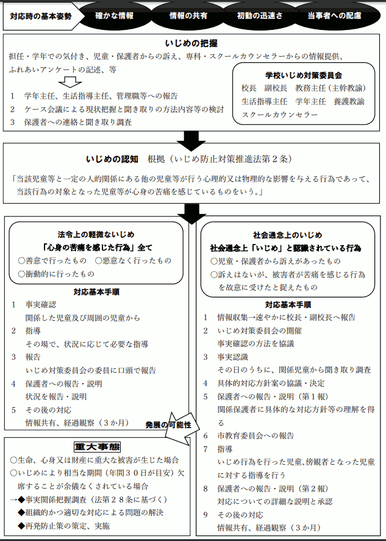
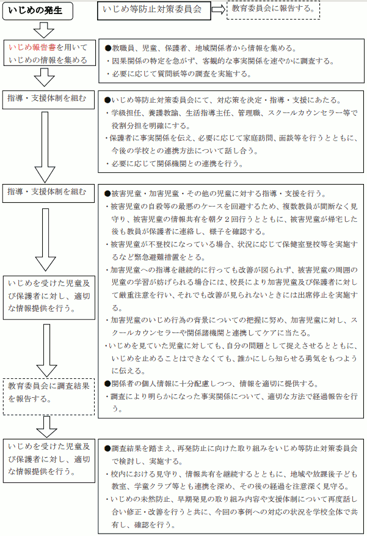
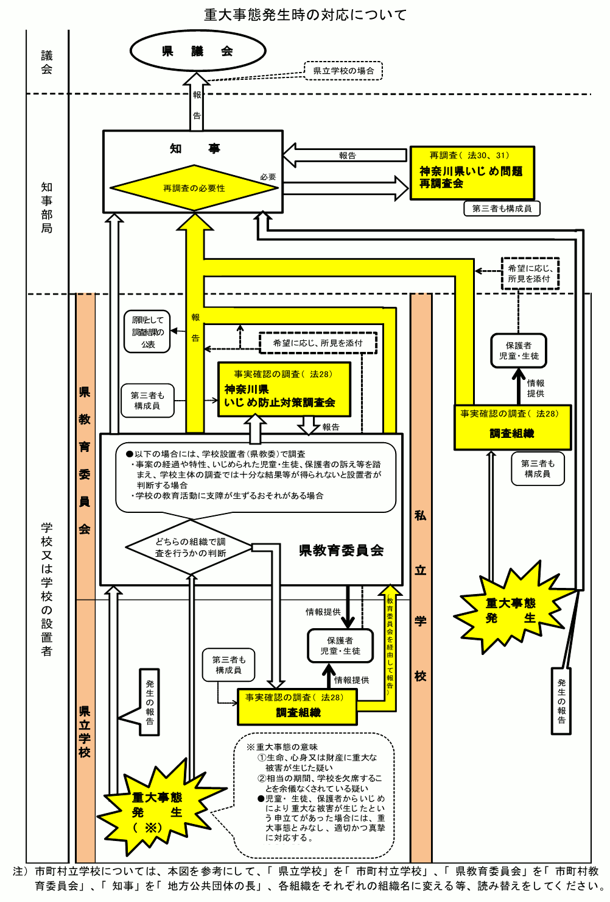
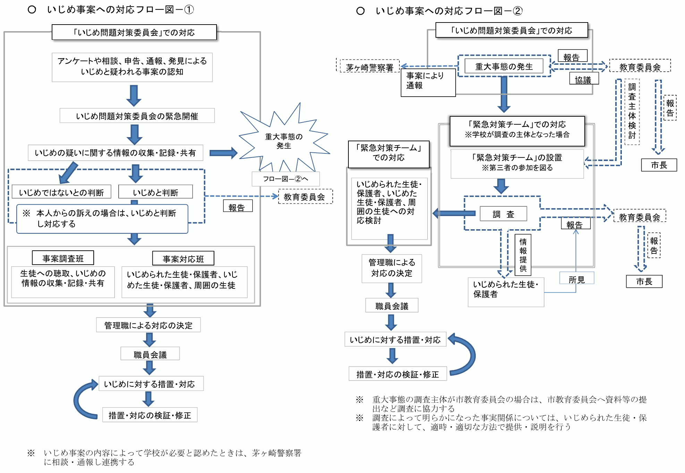
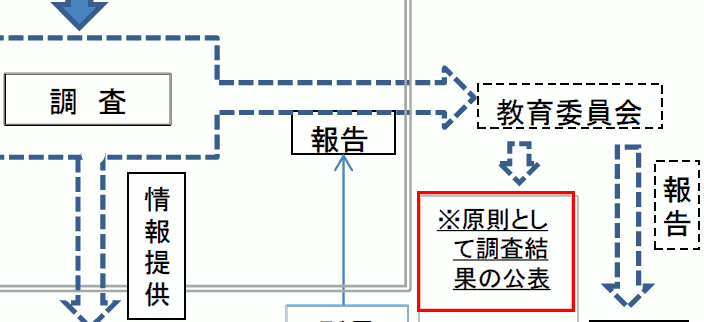
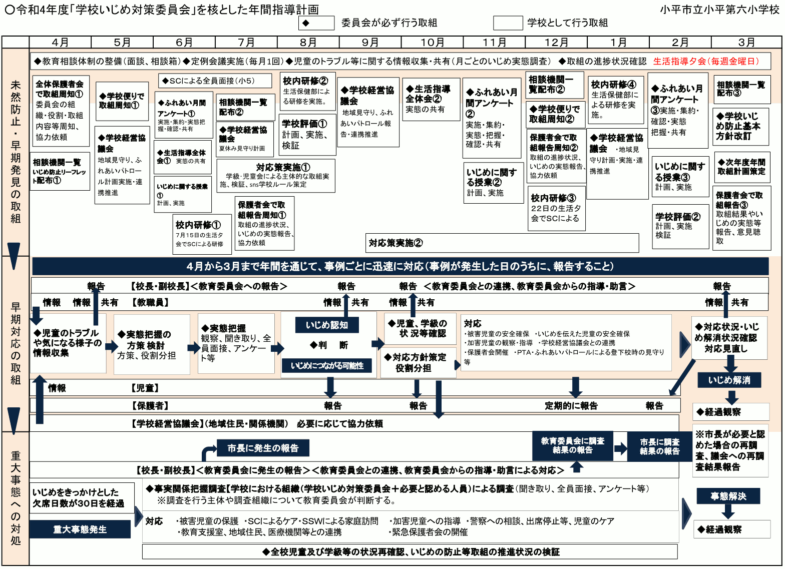

{{first:2022-07-20}}

{{description:小平市議会議員 安竹洋平の令和4年度6月定例会における一般質問の1件目についてまとめています。}}

# （1）「重大事態」への認識を改め、子ども中心のいじめ対策へ

～ いじめ被害者のみならず、多くの関係者のためになるよう、重大事態のスムーズな運用を ～

<a href="">📄会議録はまだ公開されていません</a>

<fieldset class="pnt">
<legend><h2> まとめ </h2></legend>

[3月定例会の一般質問](https://yasutakeyohei.com/books/yasutake/ippan/r4/3-gatu/2-ijime-taiou-minaosi.html)に引き続き、学校でのいじめ対策について市に問いました。主に、[いじめ防止対策推進法](https://elaws.e-gov.go.jp/document?lawid=425AC1000000071)に定められている「[重大事態](https://elaws.e-gov.go.jp/document?lawid=425AC1000000071#Mp-Ch_5)」について深掘りして質問しました。

この重大事態は、教職員や保護者に周知するよう国の方針として決められています。しかし、小平市ではほぼまったく周知が行われていません。そのためほとんどの人が重大事態という扱いの存在を知りません。しかし、いじめ対策においてはとても重要な制度だと私は思います。

いじめの問題は、通常、まず担任の先生が対応します。それでも対応しきれず、いじめの被害を受けた子に自傷行為が始まったり、不登校が連続したり、もしくは被害を受けた本人や保護者からの申立てがあると、重大事態の扱いが始まります。重大事態の扱いになると、先生が個人的に抱え込んで対応するのではなく、第三者で構成される組織が対応することになります。

重大事態について、詳しくはたとえば[文科省のガイドライン](https://www.mext.go.jp/component/a_menu/education/detail/__icsFiles/afieldfile/2019/06/26/1400030_009.pdf)をご参照ください。私は、この制度は、子どもたちを守ることにつながるだけではなく、保護者、先生方、教育委員会のための仕組みでもあると考えています（もし認識が違うというなら、教えていただきたいです）。

一般質問（1時間）1回だけでは、到底追求し切れないテーマです。

－　－　－　－　－

4月に着任した新任の教育指導担当部長が、大半の答弁を担当しました。新任の方でしたので、事前に私の方から質問予定の資料を渡し、趣旨を説明してありました。また、答弁には不慣れだろうから（やさしく）、という心づもりで臨みました。

しかし、とても残念なことに、明らかに事実と反することや、論点をずらして何も答えない答弁が多くなされました。議員になって3年間一般質問をしてきて、ここまで「デタラメに答えている」と感じる答弁をされたことは初めてです。

そのため、途中から答弁がまったく信用できなくなりました。事実確認のために、同じことを何度も視点を変えて聞かざるを得なくなったため、とても無駄な時間を費やしました。大変残念です。

私は、ご相談いただいた被害家族のためになることを念頭に置きながら、市立学校の教育環境を改善し、職員の方々が働く環境の改善にもつながると思って質問しています。無駄なやり取りが発生しないように準備し、真剣に質問しています。このような態度をされては、時間が浪費されるばかりで、何の改善にもつながりません。教育委員会の一部職員はここを読んでいるようですので、そのような態度の方は、猛省してください。

大人が真面目に対応しない限り、そのしわ寄せはすべて、弱い立場の子どもに行きます。

今回の質問をするに当たり、重大事態についてさらに理解を深めました。市の教育委員4名にも手紙を書き、各戸に投函しました。市のこれまでの対応を見ていても、議会での答弁を聞いても、教育委員会の定例会を傍聴していても、重大事態の理解が進んでいるとはまったく思えません</strong>。事態を重く受け止め、関係各所には真剣になっていただき、もっと勉強し、改善してほしいです。

次回以降もこの問題を追求し、別のアプローチで周知もしていきます。

---

**<u>重大事態について</u>**

- 重大事態の扱いを否定的に捉えているか → [肯定否定ではなく要件に当てはめ対応](#重大事態という仕組みを肯定的に捉えているのか否定的に捉えているのか)
- 「3要件以外の条件でも判断する」とした答弁は間違いか → [法に沿って判断](#3月定例会での答弁は間違えていたということでよいか)
- 対応に時間かかるなら従来法と並行では → [いじめはすべて迅速対応してる❌](#時間がかかるならこれまでの対応と並行して重大事態の対応をすればよいのでは)
- 学校方針に3要件についての記載がある学校は → [すべての学校で記載あるはず❌](改めて聞くが重大事態の3要件について記載があるのはすべての学校ではないでよいか)
- 保護者会で重大事態のことを説明しているか → [している](#保護者会で重大事態のことは説明しているか)↓
- 保護者会で3要件や重大事態とは何か説明しているか → [内容を把握していない](#保護者会で重大事態のことは説明しているか)
- 教職員の研修会で3要件や重大事態とは何か説明しているか → [きちんとしている](#教職員の研修会でも重大事態のことを正確に理解できるようちゃんと説明をしているのか)
- 入学や各年度開始時に行うとされている説明をしているか → [守り進めている](#入学時や各年度の開始時に児童生徒保護者関係機関等に重大事態の説明をすることは守られているか)
- なぜ重大事態ということを知らない保護者の方がいるのか → [答弁できない](#守っているのになぜ重大事態ということを知らない保護者がいるのか)
- これまでの重大事態の累計件数は → [3件](#これまで重大事態として扱ったいじめの累計件数とそれぞれの詳細は)
- 調査開始から最終報告までの期間は → [個別事案特定につながるので答弁控える](#これまで重大事態として扱ったいじめの累計件数とそれぞれの詳細は)
- なぜ対応期間を知ることが個別事案特定につながるか → [おそれがあると](#重大事態としての対応期間が分かるとなぜ個別事案の特定につながるのか)
- 調査報告書は公開するか → [内容、被害側意向、公表の影響を勘案し判断](#重大事態の調査結果は公開されるか非公開なら理由は)
- 調査報告書は情報開示請求で出るか → [開示請求可能は本人に関わることのみ❌](#被害者本人が報告書の開示を拒んだ場合でも情報開示請求すれば公開されるか)
- 調査報告書を公表することが望ましいと考えているか → [そう考えている](#国のガイドラインにあるように調査結果を公表することが望ましいと考えているか)
- 専門家等から重大事態として扱う助言受けても扱わなかった件数は → [0件❌](#これまで要件を満たしながらまたは重大事態として扱うよう専門家等から助言を受けながら重大事態として扱わなかった事例の件数は)
- 検証結果と提言は誰の責任でどう教育行政に反映か → [市教委が学校に指導助言](#重大事態の最終的な検証結果と提言は誰の責任においてどのような方法で教育行政に反映するか)

**<u>いじめ対策・全般的に</u>**

- 専門家等から助言を得る会議の会議録をつくっていないのは → [つくっている](#専門家等から重要な助言が得られる会議の会議録を作成していない理由は)
- 会議録等と答弁したが「等」とは何か → [資料などが含まれる❌](#会議録等の等とは何か)
- いじめ対策の委員会名簿を積極公開してないのは → [公平中立に慎重な議論のため](#小平市いじめ問題対策連絡協議会や小平市教育委員会いじめ問題対策委員会の委員名簿を積極的に公開していない理由は)
- いじめ事案への対応フロー図をつくり周知活用しては → [今後研究していく](#いじめ事案への対応フロー図をつくり周知活用してはどうか)
- リソースの問題で組織的対応図るとした内容は → [外部委託できる業務は検討する](#リソースの問題についてどうマンパワーを振り分けるか組織的な対応を図っているとした対応の具体的内容は)

❌をつけたものは、事実に反する虚偽の答弁です。それ以外も、事実に基づかずに答弁した疑いがあります。追求します。

</fieldset>

<button onclick='showPDF("./20220610-ippan-situmon-yasutake-1.pdf")' class="pdf-view-button">
<i class="fa fa-file-pdf-o" aria-hidden="true"></i> 一般質問通告書
</button>

## 主な質疑

目次

- **[今回質問する理由](#今回質問する理由)**
    - [前回に引き続いての質問](#前回に引き続いての質問)

- **[重大事態への対処についてどう捉えているか](#重大事態への対処についてどう捉えているか)**
    - [重大事態という仕組みを肯定的に捉えているのか、否定的に捉えているのか](#重大事態という仕組みを肯定的に捉えているのか否定的に捉えているのか)
    - [重大事態として扱うべきものを扱わなかったら法律違反、判例あり](#重大事態として扱うべきものを扱わなかったら法律違反判例あり)
    - tips🏛️:[さいたま地方裁判所・平成30年（ワ）第1465号の損害賠償請求事件](#さいたま地方裁判所平成30年ワ第1465号の損害賠償請求事件)
    - [先生が教育委員会を訴える可能性も](#先生が教育委員会を訴える可能性も)
    - [法的な枠組みの中で、いかに子ども中心にできるか](#法的な枠組みの中でいかに子ども中心にできるか)

- **[市独自の判断によって重大事態にならないのはどういうケースか](#市独自の判断によって重大事態にならないのはどういうケースか)**
    - [3月定例会での答弁は間違えていたということでよいか](#3月定例会での答弁は間違えていたということでよいか)
    - [教育委員会の勝手な判断で重大事態として扱うか否かを決めてよいのか](#教育委員会の勝手な判断で重大事態として扱うか否かを決めてよいのか)
    - [時間がかかるなら、これまでの対応と並行して重大事態の対応をすればよいのでは](#時間がかかるならこれまでの対応と並行して重大事態の対応をすればよいのでは)

- **[重大事態という扱いがあることについて、周知はどう行っているか](#重大事態という扱いがあることについて周知はどう行っているか)**
    - [重大事態についての記載がほぼ皆無な資料を持ち出して、周知を図っているとは何か](#重大事態についての記載がほぼ皆無な資料を持ち出して周知を図っているとは何か)
    - [現状の学校いじめ防止基本方針では、重大事態の周知はできない](#現状の学校いじめ防止基本方針では重大事態の周知はできない)
    - [欠席日数に関する記述にも誤りがある](#欠席日数に関する記述にも誤りがある)
    - tips🔶:[学校の基本方針にフロー図を掲載しているのは2校のみ](#学校の基本方針にフロー図を掲載しているのは2校のみ)
    - [きちんと載せていると強弁するが、すべての学校ではない、ということでよいか](#きちんと載せていると強弁するがすべての学校ではないということでよいか)
    - [虚偽の答弁](#虚偽の答弁)
    - tips🔍:[市内全校の「学校いじめ基本方針」を調べました。やはり虚偽の答弁でした](#市内全校の学校いじめ基本方針を調べましたやはり虚偽の答弁でした)
    - [保護者会で、重大事態のことは説明しているか](#保護者会で重大事態のことは説明しているか)
    - [改めて聞くが、重大事態の3要件について記載があるのは、すべての学校ではない、でよいか](#改めて聞くが重大事態の3要件について記載があるのはすべての学校ではないでよいか)
    - [教職員の研修会でも、重大事態のことを正確に理解できるようちゃんと説明をしているのか](#教職員の研修会でも重大事態のことを正確に理解できるようちゃんと説明をしているのか)
    - [重大事態への認識が、市として間違えている](#重大事態への認識が市として間違えている)
    - [国からも、重大事態についてしっかり周知するよう通知が出ている](#国からも重大事態についてしっかり周知するよう通知が出ている)
    - [入学時や、各年度の開始時に、児童・生徒、保護者、関係機関等に重大事態の説明をすることは守られているか](#入学時や各年度の開始時に児童生徒保護者関係機関等に重大事態の説明をすることは守られているか)
    - [守っているのに、なぜ重大事態ということを知らない保護者がいるのか](#守っているのになぜ重大事態ということを知らない保護者がいるのか)
    - [市には、重大事態のことを保護者に知らせたくないバイアスがある](#市には重大事態のことを保護者に知らせたくないバイアスがある)
    - [重要なことは守らないのに、制限は拡大解釈して過剰にするのはなぜか](#重要なことは守らないのに制限は拡大解釈して過剰にするのはなぜか)

- **[これまで重大事態として扱ったいじめの累計件数と、それぞれの詳細は](#これまで重大事態として扱ったいじめの累計件数とそれぞれの詳細は)**
    - [重大事態としての対応期間が分かると、なぜ個別事案の特定につながるのか](#重大事態としての対応期間が分かるとなぜ個別事案の特定につながるのか)
    - [個別事案が特定されると何が問題か](#個別事案が特定されると何が問題か)
    - [可能な限り調査結果を共有することとの整合性は](#可能な限り調査結果を共有することとの整合性は)
    - tips🔑:[いたずらに、個人情報を盾にして、情報の開示を怠ってはならない](#いたずらに個人情報を盾にして情報の開示を怠ってはならない)

- **[重大事態の調査結果は公開されるか。非公開なら理由は](#重大事態の調査結果は公開されるか非公開なら理由は)**
    - [被害者本人が報告書の開示を拒んだ場合でも情報開示請求すれば公開されるか](#被害者本人が報告書の開示を拒んだ場合でも情報開示請求すれば公開されるか)
    - tips📄:[情報開示（公開）には2種類ある](#情報開示公開には2種類ある)
    - [国のガイドラインにあるように、調査結果を公表することが望ましいと考えているか](#国のガイドラインにあるように調査結果を公表することが望ましいと考えているか)

- **[これまで、要件を満たしながら、または重大事態として扱うよう専門家等から助言を受けながら、重大事態として扱わなかった事例の件数は](#これまで要件を満たしながらまたは重大事態として扱うよう専門家等から助言を受けながら重大事態として扱わなかった事例の件数は)**

- **[専門家等から重要な助言が得られる会議の会議録を作成していない理由は](#専門家等から重要な助言が得られる会議の会議録を作成していない理由は)**
    - [会議録等の「等」とは何か](#会議録等の等とは何か)
    - [会議録、議事録、要旨の定義を細かく分けているか](#会議録議事録要旨の定義を細かく分けているか)
    - tips📘:[公文書管理運用ガイドライン](#公文書管理運用ガイドライン)
    - [誰が何を話したかという記録は非常に重要](#誰が何を話したかという記録は非常に重要)
    - [この会議は要旨でよい、この会議は会議録が必要など、記録方式はどういう基準に基づいているのか](#この会議は要旨でよいこの会議は会議録が必要など記録方式はどういう基準に基づいているのか)

- **[小平市いじめ問題対策連絡協議会や、小平市教育委員会いじめ問題対策委員会の委員名簿を積極的に公開していない理由は](#小平市いじめ問題対策連絡協議会や小平市教育委員会いじめ問題対策委員会の委員名簿を積極的に公開していない理由は)**

- **[協議会や対策委員会の会議録は作成しているか](#協議会や対策委員会の会議録は作成しているか)**

- **[市のいじめ対策に当たる各組織の委員も、職能団体の推薦による選任にすべきでは](#市のいじめ対策に当たる各組織の委員も職能団体の推薦による選任にすべきでは)**

- **[いじめ事案への対応フロー図をつくり、周知活用してはどうか](#いじめ事案への対応フロー図をつくり周知活用してはどうか)**
    - tips✨:[神奈川県の一部公立校で使われているいじめ事案への対応フロー図が参考になります](#神奈川県の一部公立校で使われているいじめ事案への対応フロー図が参考になります)

- **[重大事態の最終的な検証結果と提言は、誰の責任において、どのような方法で教育行政に反映するか](#重大事態の最終的な検証結果と提言は誰の責任においてどのような方法で教育行政に反映するか)**

- **[リソースの問題について、どうマンパワーを振り分けるか組織的な対応を図っているとした対応の具体的内容は](#リソースの問題についてどうマンパワーを振り分けるか組織的な対応を図っているとした対応の具体的内容は)**

- **[参考資料](#参考資料)**

{{#include ../../../partials/ippan-situgi-note.md}}

### 今回質問する理由
#### 前回に引き続いての質問

本年[3月定例会で行った一般質問](https://yasutakeyohei.com/books/yasutake/ippan/r4/3-gatu/2-ijime-taiou-minaosi.html)に引き続き、学校でのいじめ対策について市に問う。

[前回解説した](https://yasutakeyohei.com/books/yasutake/ippan/r4/3-gatu/2-ijime-taiou-minaosi.html#%E9%87%8D%E5%A4%A7%E4%BA%8B%E6%85%8B%E3%81%AE%E6%89%B1%E3%81%84%E3%81%8C%E9%87%8D%E8%A6%81)重大事態という扱いは、調べた限り、いじめの当事者である子どもたちのためだけではなく、保護者の方々、担任の先生方、教育委員会職員のためになる制度。

### 重大事態への対処についてどう捉えているか

市は、いじめ防止対策推進法にある重大事態への対処が「必ずしも子どものためにならない」と捉えているようだ。重大事態への対処をどう捉えているか。

いじめを受けた児童・生徒とその家族にできる限り配慮し、重大事態の原因等の究明および解決に向けて取り組むものと捉えている。

質問に対する答えになっていない。「必ずしも子どものためにならないと捉えているように感じるが」の前置きが無視されている。

#### 重大事態という仕組みを肯定的に捉えているのか、否定的に捉えているのか

要は、市は重大事態という仕組みを肯定的に捉えているのか、それとも否定的に捉えているのか。

肯定的に捉えていて、たとえば「現在は運用の面で慣れていないため時間がかかってしまう課題はあるが、今後、運用をスムーズにできるようにしていきたい」など捉えているのか。

または否定的に捉えていて「リソース不足の問題があるので、できれば重大事態の扱いはしないほうがよいこともある」などと捉えているのか。そのあたりの見解をもらいたい。

重大事態が子どものためにならないという考えではけっしてない。また、肯定や否定ということではなく、その要件に当てはまるものは、きちんと当てはめて対応していくことが大切。

これまでの答弁では「重大事態の扱いをすると時間がかかり、本来のいじめ対策が進まない」というようなことを言っていたので、否定的に捉えていると感じる。

#### 重大事態として扱うべきものを扱わなかったら法律違反、判例あり

もし、市が制度を否定的に捉えているがために、本来は重大事態として扱わなければいけない事態を重大事態として扱っていなかった場合は、法律違反になる。訴訟になった場合は敗訴する。

判例がある。さいたま地方裁判所で令和3年12月15日に判決が言い渡された、[平成30年（ワ）第1465号の損害賠償請求事件](https://www.courts.go.jp/app/files/hanrei_jp/831/090831_hanrei.pdf)。重大事態として扱うべきものを扱わなかったことで被害児童の保護者が訴訟を起こし、埼玉県川口市が敗訴し損害賠償の支払いが命じられた。

[判決文](https://www.courts.go.jp/app/files/hanrei_jp/831/090831_hanrei.pdf)を読むと、小平市で私が相談を受けていることと同様の状況であることが分かる。

🏛️ さいたま地方裁判所・平成30年（ワ）第1465号の損害賠償請求事件

この訴訟は、[3月定例会でも取り上げた](https://yasutakeyohei.com/books/yasutake/ippan/r4/3-gatu/2-ijime-taiou-minaosi.html#%E3%81%BB%E3%81%A8%E3%82%93%E3%81%A9%E3%81%AE%E3%82%B1%E3%83%BC%E3%82%B9%E3%82%92%E9%87%8D%E5%A4%A7%E4%BA%8B%E6%85%8B%E3%81%A8%E3%81%97%E3%81%A6%E6%89%B1%E3%81%A3%E3%81%9F%E6%96%B9%E3%81%8C%E6%9C%80%E7%B5%82%E7%9A%84%E3%81%AB%E6%95%99%E8%82%B2%E5%A7%94%E5%93%A1%E4%BC%9A%E3%81%AE%E3%83%AA%E3%82%BD%E3%83%BC%E3%82%B9%E3%82%92%E5%9C%A7%E8%BF%AB%E3%81%97%E3%81%AA%E3%81%84%E3%81%AE%E3%81%A7%E3%81%AF)、[Protect Children（プロテクトチルドレン）](https://protectchildren-eternity.jimdofree.com/)の代表である森田氏が起こした訴訟です。教諭と教育委員会が、いじめ防止義務や不登校解消義務など職務上の義務に違反したということで起こされたものです。

令和3年12月15日に判決が言い渡され、550万円の請求に対し、55万円と遅延損害金を支払うことが命じられました。

[判決文](https://www.courts.go.jp/app/files/hanrei_jp/831/090831_hanrei.pdf)から一部を抜粋すると次のとおりです。重大事態の認知について、小平市で発生した今回のケースとほぼ同じ状況です。

> **（原告の主張）**  
> 原告母は、平成28年10月12日、市教委に対し、原告について重大事態が発生したとの申立てをし、同月24日には原告の年間欠席日数が不登校1と合わせ30日に達した。しかし、市教委は、平成29年1月10日まで本件を重大事態と認識せず、重大事態の調査を行わなかった。  

> **（被告の主張）**  
> 市教委は、本件中学校から原告母及び原告に関する事情や本件の経緯を聴取し、原告の不登校の原因はいじめではないと判断したものである。本件中学校の教諭らの判断と同様、その判断に裁量の逸脱・濫用はない。

> **争点2（市教委の行為の違法性の有無）について**  
> （1） 原告は、市教委が原告について重大事態の調査を行わなかったことを職務上の義務に違反し違法であると主張する。
> 「川口市いじめの防止等の基本的な方針」は、重大事態の発生が認められるときは、市教委において、当該学校が重大事態の発生を認めないときでも、重大事態が発生したものとして、報告・調査等に当たるものと定めている（甲2・12頁）。そして、市教委は、遅くとも同年10月24日までに、原告母からの連絡や本件中学校の教諭らの報告等により、本件中学校の教諭らの認識する事実を概ね知らされていた（認定事実⑵ト）。したがって、市教委は、重大事態の発生を認知すべきであったにもかかわらず、重大事態としての調査を怠り、また、同調査の必要について本件中学校の教諭らに対する指導を行わなかった（同ト）のであるから、職務上の義務に違反したものと認められる。これに対し、被告は、市教委が、本件中学校の教諭らから聴取した事情に基づき原告の不登校の原因はいじめではないと判断したのであり、その判断に裁量の逸脱・濫用はないと主張するが、その判断が合理的根拠を欠くことは争点2の説示と同様である。重大事態の発生を認知すべきときに認知しない裁量があるとは解されず、被告の主張は採用できない。

#### 先生が教育委員会を訴える可能性も

この事例は保護者からの訴えだが、場合によっては先生から訴えられる可能性もある。

つまり、重大事態として扱えば組織で対応することになるのに、扱わないことで先生個人に負担が集中してしまう。それで先生にたとえば心身の不調が出てしまった場合（は訴えるべき事例だと思う）。

#### 法的な枠組みの中で、いかに子ども中心にできるか

もちろん、いじめ対策は「訴訟がどうの」を気にしてやるべきではなく、子どものことを中心に考えなくてはならない。しかし、そういう法的な縛りがあることはしっかり押さえておく必要がある。

### 市独自の判断によって重大事態にならないのはどういうケースか

[本年3月定例会の答弁](https://yasutakeyohei.com/books/yasutake/ippan/r4/3-gatu/2-ijime-taiou-minaosi.html#%E4%BB%8A%E5%9B%9E%E3%81%AE%E8%83%8C%E6%99%AF%E3%81%A8%E3%81%AA%E3%82%8B%E4%BA%8B%E4%BE%8B%E3%81%AF%E3%81%AA%E3%81%9C%E9%87%8D%E5%A4%A7%E4%BA%8B%E6%85%8B%E3%81%A7%E3%81%AF%E3%81%AA%E3%81%84%E3%81%A8%E5%88%A4%E6%96%AD%E3%81%97%E3%81%9F%E3%81%AE%E3%81%8B)で、報告書作成や情報交換等に膨大な時間がかかり、いじめへの対応が遅れることもあるため、重大事態はケースによって判断するとあった。

しかし、いじめ防止対策推進法にはそのような判断を下す余地の記述はない。判断によって重大事態にならないのはどういうケースか。

いじめ防止対策推進法では、重大事態は：
- いじめにより当該学校に在籍する児童等の生命、心身または財産に重大な被害が生じた疑いがあると認めるとき、および
- いじめにより当該学校に在籍する児童等が相当の期間学校を欠席することを余儀なくされている疑いがあると認めるとき

とされている。

また、文部科学省が定めたいじめの重大事態の調査に関するガイドラインによると、
- 被害児童・生徒や保護者からいじめにより重大な被害が生じたという申立てがあったときには、重大事態が発生したものとして調査すること

とされている。

これらに該当しない場合は、重大事態と判断しない場合がある。

[前回こちらから詳しく説明していること](https://yasutakeyohei.com/books/yasutake/ippan/r4/3-gatu/2-ijime-taiou-minaosi.html#%E9%87%8D%E5%A4%A7%E4%BA%8B%E6%85%8B%E3%81%AE%E6%89%B1%E3%81%84%E3%81%8C%E9%87%8D%E8%A6%81)を繰り返しているだけの意味のない答弁です。事前の打ち合わせでも、時間をかけて質問の趣旨を伝えています。こうした時間の無駄はすべて子どもたちにしわ寄せがいくと、心に刻んでほしいものです。

#### 3月定例会での答弁は間違えていたということでよいか

答弁の担当者が入れ替わっている（国冨氏→岡崎氏）ので、思いが変わっているのか。3月定例会での「今回の事例はなぜ重大事態ではないと判断したのか」という問いに対し、当時の教育指導担当部長は[次のように答弁した](https://yasutakeyohei.com/books/yasutake/ippan/r4/3-gatu/2-ijime-taiou-minaosi.html#%E4%BB%8A%E5%9B%9E%E3%81%AE%E8%83%8C%E6%99%AF%E3%81%A8%E3%81%AA%E3%82%8B%E4%BA%8B%E4%BE%8B%E3%81%AF%E3%81%AA%E3%81%9C%E9%87%8D%E5%A4%A7%E4%BA%8B%E6%85%8B%E3%81%A7%E3%81%AF%E3%81%AA%E3%81%84%E3%81%A8%E5%88%A4%E6%96%AD%E3%81%97%E3%81%9F%E3%81%AE%E3%81%8B
)。

> 議員が述べた3件の重大事態の要件がまずひとつの判断。

> また、我々が対応している中で実際に感じている問題点として、いじめの対応は、重大事態であるか否かによって変わるべきものではない。重大事態等をいじめ防止対策推進法において行っていくことで生じる課題もある。

> 議員の指摘と同様だが、現場においては、子どもたちに実際に対応する時間等が必要。しかし、その時間が、報告書の作成や、さまざまな情報交換等で奪われてしまうということも、事実としてある。膨大な時間がかかる。その中で、いじめへの対応が実際は遅れてしまうこともあるので、これはケースによって判断すべきものと考えている。

なお、ここでいう3要件は、先ほど答弁にもあった次の3つ。
- 不登校重大事態
- 自殺等重大事態
- 本人や保護者からの申請があった場合

つまり、3月定例会では「3要件とは関係ないところで、ケースによって判断する」という答弁。これが間違っていたということか。

過去の答弁で、重大事態として扱うか否かはケースによって判断すると述べたのは、個別の案件において、何を優先して対応するか案件ごとに判断をする必要があるということ。

一義的には、（いじめ防止対策推進）法第28条の重大事態の定義に沿って判断すべきであると認識している。

答弁を間違えたということか。3件の重大事態の要件がひとつでも満たされれば、重大事態として扱わなければいけない。

#### 教育委員会の勝手な判断で重大事態として扱うか否かを決めてよいのか

逆に、その要件を満たさなかったら重大事態にはならないはず。教育委員会の判断で、勝手に重大事態にすることがあるのか。

教育委員会の判断でということではなく、法第28条の重大事態の定義に沿って判断すべきであると認識している。

つまりは答弁を間違えたということ。

#### 時間がかかるなら、これまでの対応と並行して重大事態の対応をすればよいのでは

もし、時間がかかるという課題があることで、重大事態として扱わないことがあれば問題。

そういう考えでいるなら、時間がかからない対応をしながら、並行して重大事態の扱いをすることは可能だと思うが、どうか。

重大事態の調査を開始するに当たって、一定の時間を要するところはある。

要は、これまで重大事態として扱わなかった場合にやっているようなやり方をしつつ、重大事態としても扱う、というやり方ができるのではないか。

重大事態の有無にかかわらず、すべてのいじめの問題については、迅速に対応をしている。

日本語が伝わらないことがもどかしく、質問しているときはこの答弁の意味に気付きませんでしたが、私が相談を受けているいじめの問題は、まったく迅速に対応していません。数ヵ月放置などの状況です。それを迅速だと強弁したことになります。次回追求します。

並行して扱うことが可能なら、やはり3月の定例会の答弁は間違いだったということ。

### 重大事態という扱いがあることについて、周知はどう行っているか

重大事態という扱いがあることやその内容について、当事者、保護者、校長も含めた教職員への周知はどう行っているか。

保護者等に対しては、重大事態の対応についても記載している「学校いじめ防止基本方針」を学校ホームページ等で公開している。

また、各学校においては本基本方針を保護者会等において説明している。教職員に対しては、研修会等の機会を捉え、重大事態の扱いを含めた学校いじめ防止基本方針について共通理解を図っている。

#### 重大事態についての記載がほぼ皆無な資料を持ち出して、周知を図っているとは何か

周知を図っているということだが、重大事態に関する説明は、市のいじめ防止基本方針を見てもA4の1ページだけしか書かれていない。内容がほとんど書かれてない。これだけを見ても、何が書いてあるか分からない。

学校いじめ防止基本方針にも、重大事態についてはほぼ何も書かれてない。ホームページでいろいろ見たが、数行の言葉しか書かれていない。重大事態というものが何なのか、先ほどの3要件も書かれてない。

#### 現状の学校いじめ防止基本方針では、重大事態の周知はできない

つまり、学校いじめ防止基本方針を出しても、重大事態の周知はできない。

特に、小平市いじめ防止基本方針には、「本人や保護者からの申立てがあったら重大事態として扱わなければならない」という重要なことが書かれていない。

<blockquote>

その判断の基準（重大事態の基準）を以下のように示しているが、児童・生徒や保護者からの申立て等に基づき、適切かつ真摯に対応する

<a href="https://web.archive.org/web/20220709123510/https://www.city.kodaira.tokyo.jp/kurashi/files/61064/061064/att_0000001.pdf">小平市いじめ防止基本方針（平成30年6月改訂）</a>

</blockquote>

と書いてあるだけ。

これを読んで分かる人がいるとは思えない。重大事態のことを知っている人でないと「本人や保護者からの申立てがあったら重大事態として扱わなければならない」ということは分からない。

いろいろ読むと、どうしても「重大事態の扱いを意図的に隠したいのでは」と感じる。

#### 欠席日数に関する記述にも誤りがある

小平市いじめ防止基本方針に書かれている重大事態のことについて、もうひとつ問題点を挙げるなら、7の重大事態への対処。（1）の一番下に、

> 年間30日を目安とする連続した欠席がある場合

とあるが、連続して30日というのは何を根拠に書いているのか。

議員が今述べた、重大事態の内容が各校の基本方針にもほとんど触れられていないということについてだが、分量の差はあるかもしれないが、きちんと触れているし、学校によっては対応のフロー図もつけて保護者に示しているところもある。

後述するように、学校の基本方針は、いじめの重大事態については、まったくといってよいほど説明がありません。

フロー図をつけているのもたったの2校（八小と鈴木小）で、しかも重大事態について意味がまったく分からない図です。

すぐにウソだと分かるようなことを、なぜこのように強弁するのか意味がわかりません。聞いている人や、会議録を読んだ人に、間違えた認識を与えることになってしまう不当な行為です。

🔶 学校の基本方針にフロー図を掲載しているのは2校のみ

現時点（令和4年6月10日）で、学校の基本方針にフロー図を記載している小平市立校は、次に示したとおり、八小と鈴木小の2校のみです（図はクリックで拡大します）。

なお、6小と4中の年間指導計画には、別のフロー図が掲載されています（[後述します](#神奈川県の一部公立校で使われているいじめ事案への対応フロー図が参考になります)）。

これらのフロー図には、重大事態を**いつの時点で、どう判断するか**という重要な情報が書かれていません。鈴木小は3要件の記載があるのでよいのですが、それ以外の学校については、そもそも重大事態についての詳しい記載がないため、フロー図があっても役に立ちません。

<figure>

<figcaption>
<a href="https://www.kodaira.ed.jp/08kodaira/">小平市立第八小学校</a>の<a href="https://www.kodaira.ed.jp/swas/index.php?id=kodairadai8&frame=frm613f00b76da83">学校いじめ防止基本方針</a>（令和4年6月1日版）に記載のフロー図
</figcaption>
</figure>

<figure>

<figcaption>
<a href="https://www.kodaira.ed.jp/18kodaira/">小平市立鈴木小学校</a>の<a href="https://www.kodaira.ed.jp/swas/index.php?id=suzuki&frame=oshirase">学校いじめ防止基本方針</a>（令和4年4月版）に記載のフロー図
</figcaption>
</figure>

あと、意図的に隠したいのかというところについては、けっしてそのような意図はない。

事実と異なる発言がなされた直後に、これを信じろというのは無理です。

あと、年間30日を目安とする連続した欠席がある場合ということについて。小平市いじめ防止基本方針にはそのような記載で載せているが、これはあくまで判断の基準であり、30日連続した欠席がなければ重大事態としないという意味ではない。

であれば、そう記載するべきです。

#### きちんと載せていると強弁するが、すべての学校ではない、ということでよいか

（重大事態の内容を）載せている（きちんと触れている）と言うが、すべての学校ではない、でよいか。

学校によっては、学校いじめ防止基本方針に重大事態のことをちゃんと書いている、フロー図も書いているところがあると言ったが、どれぐらいの学校か。

私が昨日確認した限りではまったく見つからなかった。どれぐらいの学校が書いているか。すべての学校ではないということでよいか。

たしかに、フロー図までつけて分かりやすく示しているところは、すべての学校ではない。

先述しましたが、フロー図がついていても、まったく分かりやすいものではありません。

#### 改めて聞くが、重大事態の3要件について記載があるのは、すべての学校ではない、でよいか

重大事態の3要件について書いている学校は、すべてではない、でよいか。私が見た学校は、すべて、その3要件については書いていなかった。

すべての学校が記載をしているはず。ただ、議員はそれを確認しているということなので、改めて私どもも確認をする必要があると今認識した。

（*後述するように、虚偽の答弁です）。

#### 虚偽の答弁

昨日見たが、書いてなかった。

🔍 市内全校の「学校いじめ基本方針」を調べました。やはり虚偽の答弁でした

令和4年6月10日に、市内全校の「学校いじめ基本方針」を調べて、次のPDFに表としてまとめました。

<button onclick='showPDF("./20220610-gakko-ijime-taisaku-list.pdf")' class="pdf-view-button" style="margin:0">
<i class="fa fa-file-pdf-o" aria-hidden="true"></i> 小平市・各校の学校いじめ基本方針調査結果
</button>

この調査結果から分かるように、

- 3要件の記載があるのは、1校のみ
- 本人・保護者による申し立ての記述があるのは、1校のみ
- フロー図が掲載されているのは、2校のみ
- 重大事態についての記載行数は、2校が22行、それ以外の学校は10行程度のみ

です。つまり、ここまでの答弁で、次の2つが虚偽であったことになります。

- **「すべての学校が記載をしているはず」と答弁したが、実際は1校しか記載されていなかった**
- **「きちんと触れている」と答弁したが、ほぼすべての学校が文書中で10行程度しか触れていないなかった（重大事態のことがきちんと伝わる可能性はゼロ）**

これら虚偽の答弁について、本来はすぐに発言の訂正をしなければならないのですが、6月議会中には訂正がなされませんでした。虚偽の答弁のまま確定してしまい、会議録としてもそのまま虚偽の記録が残ります。会議録は、期をまたいでの訂正はできないということですので、9月定例会で訂正することもできません。市の公文書記録に残すためには、9月定例会で再度一般質問し、間違いを認める発言をしてもらうしかありません。

一般質問が終わってから、担当課に抗議しました。確認して返事をするということでしたが、1ヵ月してやっと教育指導担当部長が間違いを電話口で認めました（すべての学校が記載をしているはずという答弁について）。

教育委員会として猛省すべき事態です。また、内部統制の対象になるべき事案とも思います。議会で追求していきます。

この時点で、教育委員会が「嘘をついてもかまわないという態度で、でたらめに答えている」ことが判明したため、以降の答弁はまったく信用できなくなりました。

#### 保護者会で、重大事態のことは説明しているか

保護者会において重大事態のことは説明しているか。

説明している。

ちゃんと、3要件のことや、重大事態がどういうものか説明しているということでよいか。

すべての学校の保護者会の内容を把握していないので、今ここで答えることは難しい。

把握していないのに、なぜ「説明している」と言い切っているのでしょうか。答弁に一貫性がなく、まったく信用できません。

相談された方は重大事態のことをご存じではなかった。ほとんどの人が重大事態について知らないのではないか。このあたり、真摯に、誠実に答えてほしい。

この時点で、私の中では「またでたらめな答弁をしている。保護者に重大事態のことは実質的に説明していないだろう」と判断しています。

#### 教職員の研修会でも、重大事態のことを正確に理解できるようちゃんと説明をしているのか

教職員の研修会では、3要件のことや、具体的に重大事態のことを説明しているか。

「小平市いじめ防止基本方針の中には、重大事態という言葉が含まれています」といった簡単な話ではなく、その研修を受ければ、重大事態が何なのか、どういったことが行われるのか、必要な要件は何かといった（ことを認識できる）研修が行われているのか。

特に生活指導主任を対象とするものにおいては、きちんと説明をしている。また、初任者研修等でも説明をしている。

この答弁も、まったく信用できませんでした。その後確認し、研修リストを見せてもらいましたが、再度確認します。

重大事態という扱いがあることやその内容について、周知はどう行っているかという話なのだが、結局、ちゃんとした回答を得られない。どういうふうに重大事態を説明しているのか把握していないのか。

#### 重大事態への認識が、市として間違えている

つまり、説明も、しっかり研修も行っていないと感じる。重大事態についての認識が、市として間違えている。

先ほども言ったが、（重大事態の扱いというものは）、当事者、先生方、職員の負担を軽減することになるものと私は認識している。それが間違えた認識であれば、そうではないと言ってほしかったが、そういった話もない。

いじめの件数がかなり上がっており、今後、認知が広まれば「うちも重大事態として対応してください」という保護者の方も増える可能性がある。

そういったことに備え、周知徹底を行い、運用の見直しを、早くしておく必要がある。

#### 国からも、重大事態についてしっかり周知するよう通知が出ている

国からも、重大事態についてしっかり周知してくださいという通知が出ている。

<blockquote>

「いじめの防止等のための基本的な方針」に「児童生徒や保護者から、いじめにより重大な被害が生じたという申立てがあったときは、その時点で学校が「いじめの結果ではない」あるいは「重大事態とはいえない」と考えたとしても、重大事態が発生したものとして報告・調査等に当たる」とあるので、この点は正しい認識が得られるよう特に留意されたい。このことは、学校の理解が浸透しにくく、失念しやすい部分であるため、<u>定期的に教育委員会をはじめとする学校の設置者、私立学校主管部局等が、この周知徹底を図る</u>とともに、学校や被害者等から相談を受けた場合は、同法に基づき学校に調査を実施するよう指導する必要がある。

<a href="https://www.mext.go.jp/a_menu/shotou/seitoshidou/1302902.htm">児童生徒の問題行動・不登校等生徒指導上の諸課題に関する調査結果について（文科省）</a>
<a href="https://www.mext.go.jp/a_menu/shotou/seitoshidou/1422178_00002.htm">令和2年度通知</a>

</blockquote>

#### 入学時や、各年度の開始時に、児童・生徒、保護者、関係機関等に重大事態の説明をすることは守られているか

<blockquote>

学校いじめ防止基本方針については、各学校のホームページヘの掲載その他の方法により、保護者や地域住民が学校いじめ防止基本方針の内容を容易に確認できるような措置を講ずるとともに、その内容を必ず入学時、各年度の開始時に、児童・生徒、保護者、関係機関等に説明する。

 
<a href="https://www.mext.go.jp/a_menu/shotou/seitoshidou/__icsFiles/afieldfile/2018/01/04/1400142_001.pdf">いじめの防止等のための基本的な方針（文科省）</a>

</blockquote>

ここに記載されているように、入学時や、各年度の開始時に、児童・生徒、保護者、関係機関等に説明するということは守られているか。

守って、そのように進めている。

この答弁も信用できるものではありません。

#### 守っているのに、なぜ重大事態ということを知らない保護者がいるのか

守っているのに、なぜ重大事態ということを知らない保護者の方がいるのか。

すべての保護者にきちんと理解いただくよう説明すべきと認識しているが、どういうことで情報が行き渡らなかったのかは、申し訳ないが、ここでは答弁ができない。

「説明することを守って進めているが、情報が行き届いていない」ということはつまり「保護者が悪い」と言っているのと同じことと思います。

要は、小平市いじめ防止基本方針を読んでも、重大事態のことが全然分からない。そんな分からない資料をもとに説明しても分からない。

#### 市には、重大事態のことを保護者に知らせたくないバイアスがある

私は、客観的に見て、小平市は、重大事態のことをなるべく保護者に知らせたくないバイアスがあると思う。

#### 重要なことは守らないのに、制限は拡大解釈して過剰にするのはなぜか

小平市は、こういった重要なことは守らない。つまり、最終的に子どもたちのためになるような制度なのに、それを活用することはない。しかも、法律違反で訴えられる可能性があるようなことも起きているのに、放置している。

一方で、マスクなどについては、文部科学省の通知を（拡大）解釈して、制限を強くしている。不思議でしょうがない。仮に、マスクを着用していないために新型コロナウイルスに感染したという訴訟が起きたとしても、小平市が負けることはない。しかし、いじめ対策において、重大事態として扱うべきものを扱わなかった場合は、訴訟で負ける。法的な扱いから見ても、なぜこういう態度でいるのか、すごく不思議。

### これまで重大事態として扱ったいじめの累計件数と、それぞれの詳細は

これまでに市が重大事態として扱ったいじめの累計件数は。また、それぞれについて、時期、自殺等か不登校かの区別、重大事態としての扱い開始から最終的な市長報告までの期間は。

件数は3件。それぞれの時期、区分、市長報告までの期間については、個別事案の特定につながるおそれがあることから、答弁を控える。

#### 重大事態としての対応期間が分かると、なぜ個別事案の特定につながるのか

重大事態としての扱い開始から最終的な市長報告までの期間が分かると、なぜ個別事案の特定につながるのか。

そのようなおそれがあるということ。

論点のすり替えです。失礼な態度と感じます。

#### 個別事案が特定されると何が問題か

特定されると何が問題か。

個別の事案に関することは、子どもたち、そして家族、保護者の方の意向というところがあるので、事案の特定につながることは控えたいと考えている。

#### 可能な限り調査結果を共有することとの整合性は

なぜ期間が分かると事案の特定につながるのか。そういうふうに、個人情報を盾にして情報を出さないようなことはやめてくださいと、文部科学省のほうにもちゃんと書いてある。

先ほど述べた令和2年度通知の中でも、

<blockquote>

いじめの重大事態の調査は、事案の対処や再発防止に資するために行うものであることから、個人情報等に配慮しながら、<u>可能な限り当該学校を越えて広く調査結果を共有し、いじめの認知や組織的対応の改善、いじめ防止基本方針の改善等に積極的に活用することが強く求められる</u>

<a href="https://www.mext.go.jp/a_menu/shotou/seitoshidou/1302902.htm">児童生徒の問題行動・不登校等生徒指導上の諸課題に関する調査結果について（文科省）</a>　<a href="https://www.mext.go.jp/a_menu/shotou/seitoshidou/1422178_00002.htm">令和2年度通知</a>

</blockquote>

と書いてある。今の答弁と文部科学省の通知との整合性についての説明を。

今、議員が述べたとおり。ただ、個別の事案については、やはりさまざまな事情を勘案する必要がある。

🔑 いたずらに、個人情報を盾にして、情報の開示を怠ってはならない

じめの防止等のための基本的な方針（文科省）には、次のように書かれています。

<blockquote>

これらの情報の提供に当たっては、学校の設置者又は学校は、他の児童生徒のプライバシー保護に配慮するなど、関係者の個人情報に十分配慮し、適切に提供する。

ただし、いたずらに個人情報保護を盾に説明を怠るようなことがあってはならない。

<a href="https://www.mext.go.jp/a_menu/shotou/seitoshidou/__icsFiles/afieldfile/2018/01/04/1400142_001.pdf#page=42">いじめの防止等のための基本的な方針（文科省・最終改定 平成29年3月14日）P38</a>

</blockquote>

これは、被害児童およびその保護者に対する説明についてのことですが、今後のいじめ対策に活かすためには、重大事態に関して、いたずらに個人情報保護を盾にして説明（情報開示）を怠ってはならないと思います。

<blockquote>

可能な限り当該学校を越えて広く調査結果を共有し、いじめの認知や組織的対応の改善、いじめ防止基本方針の改善等に積極的に活用することが強く求められる

<a href="https://www.mext.go.jp/a_menu/shotou/seitoshidou/1302902.htm">児童生徒の問題行動・不登校等生徒指導上の諸課題に関する調査結果について（文科省）</a>　<a href="https://www.mext.go.jp/a_menu/shotou/seitoshidou/1422178_00002.htm">令和2年度通知</a>

</blockquote>

この考え方が、とても重要だと思います。

### 重大事態の調査結果は公開されるか。非公開なら理由は

重大事態の調査結果は公開されるか。非公開なら理由は。

事案の内容や重大性、被害児童・生徒、保護者の意向、公表した場合の児童・生徒への影響等を総合的に勘案して、適切に判断していく。

#### 被害者本人が報告書の開示を拒んだ場合でも情報開示請求すれば公開されるか

報告書について、本人が公開してほしくないといった場合でも、情報開示請求すれば出てくるのか。

小平市の情報公開条例においては、開示請求ができるのは、本人に関わることについてのみであると認識している。

それは個人情報の開示請求。本人に関わる情報だけというのは個人情報のほう。情報開示には2つあるでしょう。

明らかに誤った答弁を、堂々とするのは、どういうことなのでしょうか。でたらめな答弁をされていては、時間が浪費され、まったく質問が進みません。議会の場で許されてよいことではないです。

📄 情報開示（公開）には2種類ある

小平市では、情報開示（公開）請求に関しては、次の2種あります。

- [公文書の公開請求](https://www.city.kodaira.tokyo.jp/kurashi/000/000104.html)
- [保有個人情報開示請求](https://www.city.kodaira.tokyo.jp/kurashi/000/000105.html)

普通の情報の開示請求は、名前を塗り潰したりして、個人情報を消して開示できる。（当たり前のことだが）それでよいか。

小平市個人情報保護条例の第16条で、保有個人情報の開示義務に該当すると思われるところ。

実施機関は、開示請求があったときは、開示請求に係る保有個人情報に次の各号のいずれかに該当する情報が含まれている場合を除き、開示請求者に対し、当該保有個人情報を開示しなければならないということがある。

この第16条の（1）から（8）までを照らし合わせて、その対応をしていく必要があると考えている。

ということは、当事者の名前を塗り潰すなりして、報告書はちゃんと開示できる、公開されるということでよいか。

これは事前に渡している（質問な）ので、しっかりした答弁をしてくれないと困る。

情報公開の請求があった際、非開示情報になるのか開示情報になるのかは、その内容を確認したうえで対応になる。

そのことから、公開請求が来た場合、我々のほうと総務のほうで確認したうえで、実際に非公開になるのか、それとも一部塗り潰しで出すのかを整理したうえで、請求者に返答することになる。

教育部長は、なぜ、教育指導担当部長が間違えた答弁をしたときに訂正しなかったのでしょうか。すぐに訂正すべきです。正しい答弁を得るまでに、無駄な時間を過ごさざるを得ませんでした。

#### 国のガイドラインにあるように、調査結果を公表することが望ましいと考えているか

市長答弁は、文部科学省のガイドラインをコピーしたもの。しかし、ガイドラインには、続きがちゃんとある。

<blockquote>

**（調査結果の公表、公表の方法等の確認）**

○ いじめの重大事態に関する調査結果を公表するか否かは、学校の設置者及び学校として、事案の内容や重大性、被害児童生徒・保護者の意向、公表した場合の児童生徒への影響等を総合的に勘案して、適切に判断することとし、<u>特段の支障がなければ公表することが望ましい</u>。学校の設置者及び学校は、被害児童生徒・保護者に対して、公表の方針について説明を行うこと。

<a href="https://www.mext.go.jp/component/a_menu/education/detail/__icsFiles/afieldfile/2019/06/26/1400030_009.pdf#page=15">いじめの重大事態の調査に関するガイドライン（平成29年3月・文科省）P13</a>

</blockquote>

「特段の支障がなければ公表することが望ましい」という部分を省いて教育長答弁を行った理由を…（知りたいが、ちゃんと答えないだろう）。

公表することが望ましいと考えているか。

そのように考えている。

### これまで、要件を満たしながら、または重大事態として扱うよう専門家等から助言を受けながら、重大事態として扱わなかった事例の件数は

これまで、要件を満たしながら、または専門家や有識者から重大事態として扱うよう助言を受けながら、重大事態として扱わなかった事例の件数は。

教育委員会としては、そのような事例はないものと捉えている。

また嘘の答弁を行いました。私がご相談を受けた件が該当しますので、少なくとも1件の事例があります。

別途確認したところ「現在は重大事態として扱っているので、該当しない」とのことでした。しかし、明らかにこれは間違いです。

過去形での質問ですので、「事例はある、件数は●件」と答えなければなりません。

⭕ 重大事態として<u>扱っていない</u>事例は → ない  
❌ 重大事態として<u>扱わなかった</u>事例は → ない  
⭕ 重大事態として<u>扱わなかった</u>事例は → **ある**

教育長答弁であっても、まったく信用に値しないことがよく分かります。

再質問の時間が3分もないので、この再質問は飛ばし次に行く。

### 専門家等から重要な助言が得られる会議の会議録を作成していない理由は

専門家等から重要な助言が得られる会議の会議録を作成していない理由は。

この質問をした理由は、ご相談いただいている事案で「弁護士から重大事態として扱うよう助言を受けながら、教育委員会がその時点では重大事態として扱わなかった」ことが判明しているからです。どうも、この重要な弁護士の発言を記録した会議録が存在しないようなのです。

訴訟になった際のことを恐れ、隠ぺいするために、会議録をつくっていないのではないでしょうか。

教育委員会で設置している協議会等においては、会議録等は作成するが、条例で非公開とされている協議会等や個人情報に配慮が必要な協議会等については、会議録は非公開としている。

#### 会議録等の「等」とは何か

会議録等の「等」とは何か。

会議録等の等には、資料などが含まれるという認識。

のちほど記載するように、この答弁は不正確です。

#### 会議録、議事録、要旨の定義を細かく分けているか

会議録や議事録、要旨の定義を細かく分けているか。会社員時代に会議録といえば、誰が何を話したか細かく書いてあるもの。議事録は、要点をかいつまんで議事が書いてあるもの。そういった文書の定義は分けているか。教育委員会内で、もしくは市の内部で。

私が調べたところでは、小平市教育委員会公文書管理規程での表記が会議録、また、小平市教育委員会会議規則での表記が議事録となっている。こちらは双方とも会議等の記録ということだった。

ここで、なぜ[小平市教育委員会公文書管理規程](https://www.city.kodaira.tokyo.jp/reiki/reiki_honbun/g135RG00000405.html)と[小平市教育委員会公文書管理規則](https://www.city.kodaira.tokyo.jp/reiki/reiki_honbun/g135RG00001319.html)を挙げたのでしょうか。

[公文書管理運用ガイドライン](https://www.city.kodaira.tokyo.jp/kurashi/095/095838.html)には会議録の定義が明記されています。このような答弁になった理由を考えると、次の4点が思いつきます。今後確認します。

1. 公文書管理運用ガイドラインの存在が教育委員会に伝わっていない
    - tips&#xf0a9;:現教育部長は、元総務部長です。さすがにこれはないので、次の可能性になります
1. 担当部長と教育委員会内の情報のやり取りが行えていない（担当部長が情報共有において孤立している可能性） 
1. 日が浅いのでまだ分からない
    - tips&#xf0a9;:分からないことは手を挙げて答えず、分かっている教育部長が代わりに答えるべきです。自らの組織内評価を優先するのではなく、正確な答弁の方を優先しなければなりません
1. 答弁を舐めている

📘 公文書管理運用ガイドライン

会議録の定義などは、小平市の「[公文書管理運用ガイドライン（令和4年2月）](https://www.city.kodaira.tokyo.jp/kurashi/095/095838.html)」に明記されていました。

<blockquote>

**イ 作成すべき会議録等**  
**（ア） 会議録と会議要旨**  
会議要旨とは、会議の名称、開催日時、開催場所、出席者、議題、主な発言内容、議事の結果、配布資料、記録の作成者等を記録したものをいう。会議録とは、会議要旨に記録する各項目に加え、発言については主なものにとどまらず、個々の発言内容（一言一句でなく、概要でも可）及びその発言者まで記録したものをいう。  

<a href="https://www.city.kodaira.tokyo.jp/kurashi/095/095838.html">公文書管理運用ガイドライン（令和4年2月）P6</a>

</blockquote>

これは私が知っている会議録の定義と同じです。また、会議録等というのは、会議録もしくは会議要旨のことであって、答弁にあったように「資料などが含まれる」という意味ではありません。

なお、会議録の作成が必要な会議等についても明記されています。これらの会議では必ず会議録を作成しなければなりません。

<blockquote>

**（イ） 会議録の作成が必要な会議等**  
会議録等を作成すべき会議等のうち、次の会議等であって、市としての意思決定に関係する内容の検討がされたものについては会議録を作成するものとする。
- 地方自治法第138条の4第3項に規定する附属機関及びこれに準じて要綱等により設置する会議
- 市長をはじめ特別職を構成員に含む会議
- 部長級以上の職員を主たる構成員とする会議

<a href="https://www.city.kodaira.tokyo.jp/kurashi/095/095838.html">公文書管理運用ガイドライン（令和4年2月）P6</a>

</blockquote>

専門家から「重大事態として扱うべき」という助言を受けた会議に教育長が参加していれば「特別職を構成員に含む会議」ということになりますから、「会議録」を作成する必要があります。会議録をつくっていないとしたら、この条例に違反したことになります。また質問します。

なお、上記（イ）の条件を満たさず、会議録をつくる必要がなかったとしても、少なくとも会議要旨はつくらなければなりません。

<blockquote>

**(ア) 法令、条例、規則、要綱等に基づき設置される庁内の会議等**

市としての意思決定に関係する会議について、経緯を含めた意思決定に至る過程や事務及び事業の実績を合理的に跡付け、又は検証することができるようにするため、作成が必要である。
- 当該会議において市としての意思決定が行われる会議
- 当該会議において市としての意思決定は行われないものの、市としての意思決定に向けて方針・方向性を決める会議や、当該会議における結果が市としての意思決定に大きく影響を与える会議
- 当該会議において市としての意思決定は行われないものの、当該会議において取りまとめた結果が、市としての意思決定を行う際の原案として扱われる会議等

<a href="https://www.city.kodaira.tokyo.jp/kurashi/095/095838.html#page=6">公文書管理運用ガイドライン（令和4年2月）P5</a>

</blockquote>

#### 誰が何を話したかという記録は非常に重要

誰が何を話したかという記録は非常に重要。改善を行うためにも、我々議員が、市が何をやっているかチェックするという意味でも非常に重要。

また、訴訟になった場合にそれが判断材料になる。そういう訴訟を避けるために要旨だけ取っているのかもしれないが。

また、職員がせっかくよいことを言っても、会議録に載らないと「職員は全然やってくれていないのでは」となる。そういった理由からも、会議録が必要。

#### この会議は要旨でよい、この会議は会議録が必要など、記録方式はどういう基準に基づいているのか

この会議は要旨でよいとか、この会議はそういう定義の会議録をきちんと取らなければならないとか、そういったところの判断はどういう基準に基づいているのか。

また、会議録が取れないのであれば、音声を録音しておき、開示請求があればそれを文字起こしすればよいと思うが、どうか。

今、披瀝のとおり、不明等があれば総務課のほうに問い合わせをもらい、双方で協議をしていきたいと考えている。

お願いする。

ここで再質問は時間切れとなりました。ですので、以降は再質問がありません。でたらめな答弁さえなければ、もっと再質問できていたかと思うと、とても残念です。

### 小平市いじめ問題対策連絡協議会や、小平市教育委員会いじめ問題対策委員会の委員名簿を積極的に公開していない理由は

小平市いじめ問題対策連絡協議会（以下、協議会と呼ぶ）や小平市教育委員会いじめ問題対策委員会（以下、委員会と呼ぶ）の委員名簿を積極的に公開していない理由は。

協議会等において、忌揮のない意見をいただくとともに、また、個人に関わる内容に関して公平、中立に慎重な議論を行っていただくため、積極的な公開は行っていない。

意味がわかりません。この論理だと、[委員名簿がホームページで公開されている](https://www.city.kodaira.tokyo.jp/kurashi/021/021338.html)教育委員会では、公平、中立に慎重な議論は行えない、ということになります。

### 協議会や対策委員会の会議録は作成しているか

協議会や対策委員会の会議録は作成しているか。

先ほど答弁したとおり、会議録等は作成している。

### 市のいじめ対策に当たる各組織の委員も、職能団体の推薦による選任にすべきでは

市のいじめ対策に当たる各組織（協議会、対策委員会、小平市いじめ問題調査委員会）の委員は、教育委員会や市長が選任するため、調査の公平、中立性が客観的に担保されない重大な欠陥がある。

多くの他市教育委員会と同様、職能団体の推薦による選任にすべきでは。

小平市いじめ問題対策連絡協議会および小平市教育委員会いじめ問題対策委員会については、専門性を有し、公平、中立にいじめ問題について審議していただけると教育委員会が判断した方や、各関係機関から推薦いただいた方に委員を委嘱している。

### いじめ事案への対応フロー図をつくり、周知活用してはどうか

いじめ事案への対応フロー図をつくり、周知活用してはどうか。

小平市いじめ防止基本方針において学校が取り組むべき内容が記載されていることから、対応フロー図につきましては今後研究していく。

今回は時間がなく紹介できませんでしたが、神奈川県の学校など、とてもよいフロー図をつくっている自治体が複数ありますので、それを参考にすればすぐにつくれます。私の方でも、つくって提案したいと思います。

✨ 神奈川県の一部公立校で使われているいじめ事案への対応フロー図が参考になります

[神奈川県いじめ防止基本方針](http://www.pref.kanagawa.jp/docs/vn7/cnt/f530779/p1189930.html)に記載のフロー図は、少しごちゃごちゃしていて分かりにくいところもあるのですが、3要件の記載があり、重大事態が発生してからどう扱われるかの情報がきちんと描かれています。

<figure>

<figcaption>
</figcaption>
</figure>

また、同じ神奈川県の茅ヶ崎市立赤羽根中学校では、ホームページに重大事態のことがきちんと書かれていて、内容も充実しています。フロー図も（やはりごちゃごちゃしていますが）よくできており、単独のPDFとしてダウンロードできるようにもなっています。このフロー図は、神奈川県内の一部公立学校で共有しているようです。

[茅ヶ崎市立赤羽根中学校・いじめ防止基本方針のページ](https://edu.city.chigasaki.kanagawa.jp/lower_secondary/akabane/2000750/index.html)

<figure>

<figcaption>
<a href="https://edu.city.chigasaki.kanagawa.jp/lower_secondary/akabane/2000750/index.html">茅ヶ崎市立赤羽根中学校・いじめ防止基本方針 いじめ事案への対応フロー図</a>
</figcaption>
</figure>

また、たとえば神奈川県立高校の各ホームページを見ると、次の図の部分など、赤羽根中学校と同じフロー図がきちんと更新されている様子も伺えます。

<figure>

<figcaption>
<a href="https://www.pen-kanagawa.ed.jp/eda-h/ijimebousi.html">神奈川県立荏田高等学校いじめ防止基本方針・いじめ事案への対応フロー図より抜粋</a>
</figcaption>
</figure>

小平市で該当するフロー図を探すと、六小と四中の年間指導計画にそれらしきものがありました。それ以外の学校には一切見つかりませんでした。

<figure>

<figcaption>
<a href="https://www.kodaira.ed.jp/06kodaira/">小平市立第六小学校・いじめ対策委員会年間指導計画</a>
</figcaption>
</figure>

重大事態の要件が1つしか書かれていませんし、重大事態のことについてはとても分かりにくいなと思います。

### 重大事態の最終的な検証結果と提言は、誰の責任において、どのような方法で教育行政に反映するか

重大事態の最終的な検証結果と提言は、誰の責任において、どのような方法で教育行政に反映するか。

教育委員会の責任において、学校への指導、助言に反映させている。

### リソースの問題について、どうマンパワーを振り分けるか組織的な対応を図っているとした対応の具体的内容は

本年3月の定例会で、リソースの問題について、どうマンパワーを振り分けるか組織的な対応を図っているとした対応の具体的内容は。

教育に関わる諸課題については、教育委員会事務局全体で取り組んでいくべきものと考えている。外部委託できる業務については、他市での取組を参考にしながら検討していく。

重大事態の扱いをすることにより、いじめ調査や提言の作成を第三者委員会に任せることは、外部委託という捉えの中に入っているのか、今後確認します。

### 参考資料

- [文科省：いじめの問題に対する施策](https://www.mext.go.jp/a_menu/shotou/seitoshidou/1302904.htm)
    - [いじめの防止等のための基本的な方針](https://www.mext.go.jp/a_menu/shotou/seitoshidou/__icsFiles/afieldfile/2018/01/04/1400142_001.pdf)
    - [児童生徒の問題行動・不登校等生徒指導上の諸課題に関する調査（文科省）](https://www.mext.go.jp/a_menu/shotou/seitoshidou/1302902.htm)
    - [いじめの重大事態の調査に関するガイドライン（文科省・平成29年3月）](https://www.mext.go.jp/component/a_menu/education/detail/__icsFiles/afieldfile/2019/06/26/1400030_009.pdf)
- 小平市
    - [（2）いじめの対応を見直し、教育長への手紙を設けよう（安竹・令和4年3月定例会一般質問）](https://yasutakeyohei.com/books/yasutake/ippan/r4/3-gatu/2-ijime-taiou-minaosi.html)
    - [各校の学校いじめ基本方針調査結果（安竹・令和4年6月10日時点）](./20220610-gakko-ijime-taisaku-list.pdf)
    - [公文書の公開請求](https://www.city.kodaira.tokyo.jp/kurashi/000/000104.html)
    - [保有個人情報開示請求](https://www.city.kodaira.tokyo.jp/kurashi/000/000105.html)
    - [公文書管理運用ガイドライン](https://www.city.kodaira.tokyo.jp/kurashi/095/095838.html)
    - [小平市教育委員会公文書管理規程](https://www.city.kodaira.tokyo.jp/reiki/reiki_honbun/g135RG00000405.html)
    - [小平市教育委員会公文書管理規則](https://www.city.kodaira.tokyo.jp/reiki/reiki_honbun/g135RG00001319.html)

- [川口市に55万円支払い命じる　元市立中男子生徒のいじめ裁判でさいたま地裁判決（東京新聞）](https://www.tokyo-np.co.jp/article/148994)

- [いじめ対策、遅い原因の3割は「余裕のなさ」埼玉の教育現場を調査（朝日新聞デジタル ）](https://news.livedoor.com/article/detail/22532423/)

- [「いじめの重大事態の調査に関するガイドライン」の遵守必要性（関西大学法学部・永田憲史研究室）](https://penology.jimdofree.com/%E3%81%84%E3%81%98%E3%82%81%E9%98%B2%E6%AD%A2%E5%AF%BE%E7%AD%96%E6%8E%A8%E9%80%B2%E6%B3%95%E7%A0%94%E7%A9%B6/%E3%81%84%E3%81%98%E3%82%81%E3%81%AE%E9%87%8D%E5%A4%A7%E4%BA%8B%E6%85%8B%E3%81%AE%E8%AA%BF%E6%9F%BB%E3%81%AB%E9%96%A2%E3%81%99%E3%82%8B%E3%82%AC%E3%82%A4%E3%83%89%E3%83%A9%E3%82%A4%E3%83%B3-%E3%81%AE%E9%81%B5%E5%AE%88%E5%BF%85%E8%A6%81%E6%80%A7/)

- [Protect Children（プロテクトチルドレン）](https://protectchildren-eternity.jimdofree.com/)

- [平成30年（ワ）第1465号の損害賠償請求事件・判決文](https://www.courts.go.jp/app/files/hanrei_jp/831/090831_hanrei.pdf)

以上
