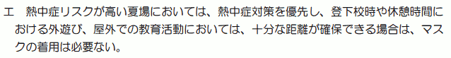
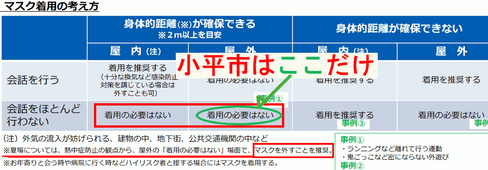

{{first:2022-07-20}}

{{description:小平市議会議員 安竹洋平の令和4年度6月定例会における一般質問の2件目についてまとめています。}}

# （2）管理を容易にするための制限強化ではなく、本当の教育を

<a href="">📄会議録を見る（まだ公開されていません）</a>

<fieldset class="pnt">
<legend><h2> まとめ </h2></legend>

当初、[（1）のいじめ重大事態について](https://yasutakeyohei.com/books/yasutake/ippan/r4/6-gatu/1-judai-jitai-kodomo-chusin.html)だけを質問する予定でしたが、夏を目前に、マスク常用による熱中症や酸欠のリスク、そして引き続き心身の発達リスクを心配する保護者の方々からたくさんの声をいただきました。また、私も、市内を移動中に、子どもたちの心身が心配になるような光景を何度も目の当たりにし、質問をすることにしました。

ただ、（1）の方でほぼすべての時間を費やすことを予想していましたので、再質問はせず、通告書を壇上で読み上げる際に問題点を指摘する形にしました。

3月定例会において全会一致で採択された請願第12号について、市教委は一部をガイドラインに反映してくれたものの、それ以外の部分についてはいつまで経っても動かないところがあります。そのため、さまざまな方法で、請願の趣旨を実現してもらうようアプローチしてきました。残念ながら、その間にも、請願で憂慮していた事態が起きています。

すべてとは言いませんが、怠慢な態度を続けてきた教育委員会の責任は大きいです。

また、ある程度趣旨が浸透してきたと思っていた矢先の4月に、職員の入れ替えがありました。教育部長と教育指導担当部長が変わり、理解されている職員も残ってはいますが、幹部職員にはまた一から説明が必要になりました。6月7日に改訂されたガイドラインには、国の方針よりも厳しい制限を課すことになる内容を含んでいるなど、残念なことも起きています。

なお、[校長会の資料](20220328_kyoikusisaku_renraku_kai_youroku.pdf)を開示して読みましたが、いくつかの学校では、校長も、運営のしやすさを求めて、国の方針よりも制限を強くしようとしている様子が伺われます。

いじめの対応も、特別支援教育もそうですが、知れば知るほど、分からなくなることがあります。市の学校や教育委員会とは、誰のために、何のためにあるのでしょうか。

対応の仕方によっては、子どもたちの一生を左右する可能性があります。職員の幸福感や、やりがいにもつながることです。市長を始め、教育長の責任は重大です。子どもたちの心に伝わるのは、大人が全力で取り組む姿です。再考していただきたいです。

今後も追求します。

---

- 例示の状況を問題と認識しているか → [全学校でガイドラインに基づく指導が重要](#市は上記の状況を問題だと認識しているか)
- 運営都合で安易に制限強くせずきちんと説明を → [国の方針を理解しやすくしてる](#説明しやすいからという理由で安易に制限を強くするのではなく子どもたちに分かるようきちんと説明することこそ本当の教育ではないのか)
- 首相がマスクせず海外高齢者と接するが子ども原則マスクは → [国の方針に基づく](#首相がマスクを外して海外の高齢者も含めた人々と接している一方子どもたちには原則マスク着用を求めているという一見して矛盾した状況をどう捉えどう説明するか)

</fieldset>

<button onclick='showPDF("./20220610-ippan-situmon-yasutake-2.pdf")' class="pdf-view-button">
<i class="fa fa-file-pdf-o" aria-hidden="true"></i> 一般質問通告書
</button>

## 主な質疑

目次

- **[今回質問する理由](#今回質問する理由)**
    - [最近、市内の学校で起きている事例](#最近市内の学校で起きている事例)
    - [マスクをつけていないことを注意する児童](#マスクをつけていないことを注意する児童)
    - [大縄跳びの練習中もマスクをつけたまま](#大縄跳びの練習中もマスクをつけたまま)
    - tips🤔:[大声と3密を避ける科学的な根拠は](#大声と3密を避ける科学的な根拠は)
    - [酸欠や熱中症のリスクをもっと懸念すべき](#酸欠や熱中症のリスクをもっと懸念すべき)
    - [屋外を歩く授業でも基本的にマスク着用と指導があった](#屋外を歩く授業でも基本的にマスク着用と指導があった)
    - [運動会の徒競走で、ほぼ全員がマスクをつけて走っていた](#運動会の徒競走でほぼ全員がマスクをつけて走っていた)
    - [マスクを外したらしゃべらないという指導があった](#マスクを外したらしゃべらないという指導があった)
    - [このようなことを憂慮して請願第12号が全会一致で採択されている](#このようなことを憂慮して請願第12号が全会一致で採択されている)
    - [厚生労働大臣が求めている状況ともまったく違う](#厚生労働大臣が求めている状況ともまったく違う)
    - [大きなひとつの原因は、結局、現場を支える大人たちの考え方や姿勢にあるのではないか](#大きなひとつの原因は結局現場を支える大人たちの考え方や姿勢にあるのではないか)

- **[市は、上記の状況を問題だと認識しているか](#市は上記の状況を問題だと認識しているか)**

- **[説明しやすいからという理由で安易に制限を強くするのではなく、子どもたちに分かるようきちんと説明することこそ、本当の教育ではないのか](#説明しやすいからという理由で安易に制限を強くするのではなく子どもたちに分かるようきちんと説明することこそ本当の教育ではないのか)**
    - [国の「会話をほとんど行わない場合」が、市の学校では「会話しない場合」にすり替わっている](#国の会話をほとんど行わない場合が市の学校では会話しない場合にすり替わっている)
    - [このような改変は、してはならない不当な行為であると認識せよ](#このような改変はしてはならない不当な行為であると認識せよ)
    - [福岡市が黙食を見直す。黙食が強制されているわけではないことも、何度も言ってきたこと](#福岡市が黙食を見直す黙食が強制されているわけではないことも何度も言ってきたこと)
        - tips😫:[福岡市が先に黙食をやめたことで、小平市教育委員会の歴史に残る「恥」が確定しました](#福岡市が先に黙食をやめたことで小平市教育委員会の歴史に残る恥が確定しました)
    - [情報開示で明らかになった教育部長の発言](#情報開示で明らかになった教育部長の発言)

- **[首相がマスクを外して海外の高齢者も含めた人々と接している一方、子どもたちには原則マスク着用を求めているという、一見して矛盾した状況をどう捉え、どう説明するか](#首相がマスクを外して海外の高齢者も含めた人々と接している一方子どもたちには原則マスク着用を求めているという一見して矛盾した状況をどう捉えどう説明するか)**
    - [子ども新聞との会見でも、岸田総理だけノーマスク](#子ども新聞との会見でも岸田総理だけノーマスク)
    - [地方自治法を思い出し、矛盾や機能不全を呈している国や都には抗うべき](#地方自治法を思い出し矛盾や機能不全を呈している国や都には抗うべき)
    - [小平市立学校版感染症予防ガイドライン（6月7日改定版）の明らかな誤りはすぐに修正を](#小平市立学校版感染症予防ガイドライン6月7日改定版の明らかな誤りはすぐに修正を)
        - tips😵:[明らかな誤りを放置する市教委](#明らかな誤りを放置する市教委)
    - [国より制限を強くしようとする、市の不当な姿勢が表れている](#国より制限を強くしようとする市の不当な姿勢が表れている)

{{#include ../../../partials/ippan-situgi-note.md}}

### 今回質問する理由

#### 最近、市内の学校で起きている事例

つい最近、小平市立の小・中学校で起きている事例を紹介する。それぞれ別の学校で起きており、気温が高い日の出来事が多い。氷山の一角と捉える必要がある。

#### マスクをつけていないことを注意する児童

下校途中、ある児童が、マスクをつけていない児童に対して、マスクを外してはいけないと注意し、言われた子がうつむいていた。

本人の特定につながるので詳細は言えないが、実際は、注意した子が大きな誤解をしていて、さらに（本人の心理状態が）心配になる発言もしていた。

#### 大縄跳びの練習中もマスクをつけたまま

また、運動会に向けた大縄跳びの練習で、生徒ほぼ全員がマスクをつけたまま跳んでいた状況もあった。教育委員会に確認したところ、（その学校では）3密になるところで大声を出さないという条件を守って（大縄跳びの練習では）マスクをつけるよう指導しているという話だった。

大声と3密を避ける根拠は、[令和2年7月30日の新型コロナウイルス感染症対策アドバイザリーボードの資料](https://www.mhlw.go.jp/stf/seisakunitsuite/bunya/0000121431_00093.html#h2_free17)にあるとされている。しかし、これはもう2年前のこと。状況はかなり変わっている。いつまで根拠にし続けるのか。

🤔 大声と3密を避ける科学的な根拠は

大声と3密については、[令和2年7月30日の新型コロナウイルス感染症対策アドバイザリーボードの資料](https://www.mhlw.go.jp/stf/seisakunitsuite/bunya/0000121431_00093.html#h2_free17)が根拠になっているということです。読んでみると、次のような記述があります。

> それから、クラスターがいろいろなところで起きているが、可能性としては、場所は違うけれども、3密プラス、大声プラス、換気が悪いというところが相変わらず共通の感染の契機ではないかという仮説があるので、それが本当であれば、そちらをもう一回、言っていく必要があるのではないか。（尾身構成員）

> 東京都を中心に接待を伴う飲食店や会食を介した感染拡大が続いており、地方でもショーパブや昼カラオケなどによるクラスター感染が報道されている。世界保健機関（WHO）は9日に、新型コロナウイルス感染について新たなガイドラインを示し、混雑した換気の悪い環境下における、空気中を漂う微粒子「エアロゾル」を介した感染を認めている。我が国がこれまで取り組んできた、3密の回避、大声を上げる環境の回避、換気の徹底などの必要性が改めて強く示唆される。（直近の感染状況の評価等）

この時点であっても、尾身メンバーですら「仮説」と言っています。また、必要性が「示唆」されるとしているものです。つまり科学的な根拠はないと暗に述べています。

現在は、陽性者の重症化率も、インフルエンザ並みか、もしくはそれ以下に低下しています。特に、子どもたちに至っては、酸欠や熱中症で倒れるリスクの方が高いことは容易に想像できます。

その状況を背景に、テレビでも放送されているように、海外では、コロナは終わっているものと捉え、人々がコロナ以前のように暮らしている国が多くあります。日本はこの過剰な対策をいつまで続けるつもりなのでしょうか。

弱い立場の子どもや高齢者に、しわ寄せが来ていることを、私はどうしても見過ごすことができません。

さんざん私も伊藤議員も言っているように、大人たちは、飲食店で大声で3密の状態で、マスクなしで会話して楽しくやっている。それで感染が増える状況にはない。

それなのに、小平市立学校版感染症予防ガイドラインの中にも、まだ大声で3密を避けるみたいなことが書いてあり、それが原因で、大縄跳びの練習で、生徒ほぼ全員がマスクをつけたまま跳んでいる。かなり危険な状況と思う。

#### 酸欠や熱中症のリスクをもっと懸念すべき

酸欠になったり、熱中症の危険もこれから出てくる。ガイドラインから、大声で3密と書いてあるところは省くことを今検討してもらいたい。でないと、いつになっても省けない。

#### 屋外を歩く授業でも基本的にマスク着用と指導があった

また、屋外を1時間以上歩いて移動する授業で、先生から事前に、基本的にマスクの着用をしてください、苦しい場合は横を向いて深呼吸をしてもよいという指示があった。

その移動中、マスク着用を実質的に強いられていることに怒り出したり、顔が赤くなったり、見るからにつらい様子の児童が何人もいた。具合が悪くなる子もいて、途中で帰ることになったという状況もあった。

#### 運動会の徒競走で、ほぼ全員がマスクをつけて走っていた

また、運動会の徒競走で、4クラスのうち3人以外の全員がマスクをつけたまま走っている状況もあった。先生は「苦しいときはマスクを外してもよい。マスクを外している子がいても、事情があるかもしれないから注意しないこと」と話したが、続けて「ただし、しゃべっていたら注意してもよい」という指示があった。

#### マスクを外したらしゃべらないという指導があった

また、体育の時間に「苦しいときはマスクを外してもよい」と言いながら、「でもしゃべらないこと」という指示があった。

これは本当に氷山の一角。少し集めただけでもこれだけの声が集まるし、実際に私が目撃した状況も含まれている。

#### このようなことを憂慮して請願第12号が全会一致で採択されている

本年3月の定例会では、上記のような状況も憂慮し、請願第12号が全会一致で採択された。市の教育委員会は、この請願事項を一部ガイドラインに反映した。

#### 厚生労働大臣が求めている状況ともまったく違う

また、本年5月20日の記者会見で、厚生労働大臣が次のように述べている。

<blockquote>

屋外で、身体的な距離が確保できない場合で、会話をほとんど行わない場合、こうした場合は、もともと（マスクを）外してよいという考え方ではありました

<a href="https://www.mhlw.go.jp/stf/kaiken/daijin/0000194708_00445.html">令和4年5月20日・後藤厚生労働大臣会見概要</a>

</blockquote>

これまで厚生労働省が出してきた方針は分かりにくいものばかりだが、私がよく読んできたところでは、この発言は正しい。

それなのに、なぜいまだに、先ほど述べた状況があるのか。

#### 大きなひとつの原因は、結局、現場を支える大人たちの考え方や姿勢にあるのではないか

この原因は、市長や教育長を始め、教育委員会、校長先生の消極的な姿勢や、不当な制限の強化もひとつの大きな要因で、つまり、大人の都合や組織運営上の都合が最優先されてしまい、子ども中心の視点が欠落しているのではないか。

そんな疑念をどうしても持たざるを得ないことから、市に問う。

### 市は、上記の状況を問題だと認識しているか

市は、上記した子どもたちの状況を問題だと認識しているか。

小平市立学校版感染症予防ガイドラインでは、
- 教職員は、熱中症などの健康被害を踏まえ、気候の状況や活動内容からマスク着用による健康への影響が大きい場合を適切に判断し、児童・生徒にマスクを外すよう指導すること
- 児童・生徒本人が息苦しいと感じたときなどにはマスクを外すなど、心身の状況に応じて児童・生徒自らが適切に対応できるよう指導すること
- 体育及び保健体育の授業の実施に当たっては、運動時に、身体へのリスクを考慮し、マスクの着用は必要ないこと

を明記している。

すべての市立学校が、ガイドラインに基づいた指導を行うことが重要であると認識している。

### 説明しやすいからという理由で安易に制限を強くするのではなく、子どもたちに分かるようきちんと説明することこそ、本当の教育ではないのか

#### 国の「会話をほとんど行わない場合」が、市の学校では「会話しない場合」にすり替わっている

内閣官房の方針にも、次のように明記されている。

<blockquote>

会話をほとんど行わない場合は、マスクの着用は必要ありません

<a href="https://corona.go.jp/emergency/">新型コロナウイルス感染症対策の基本的対処方針</a>

</blockquote>

これについて教育委員会に尋ねると、子どもには「ほとんど」の判断がつきにくいので、「会話しない場合は」と捉えているといった説明があった。

#### このような改変は、してはならない不当な行為であると認識せよ

これは、国がゼロではないと言っているものを、根拠なくゼロにして制限を強くする不当な行為だ。

また、仮にこの部分を「マスクをつけない場合は会話を控える」とすることも、消極的制限であったものを積極的制限に変えることになる。

市は特に黙食についてこの間違いを犯したままだが、これまでずっと、請願第12号の説明のときにも述べたが、これはやってはならないことだ。

説明しやすいからという理由で安易に制限を強くするのではなく、なぜ「ほとんど」という表現を用いているかを、子どもたちが分かるようにきちんと説明することこそ、本当の教育ではないのか。

教育活動を進めるに当たっては、児童・生徒、保護者、教職員が共通した認識の下、感染症対策に取り組むことが重要であると捉えている。

したがって、小平市立学校版感染症予防ガイドラインには、国の方針で示された言葉で記載した内容であっても、個人によって解釈の差異が生じる懸念のある場合は、その趣旨を踏まえながら、児童・生徒の発達段階に応じて理解しやすい表現で説明することもある。

なお、このことにより国よりも制限を強くしているとの認識はない。

請願の説明でも詳しく述べましたが、国より制限を強くしているのは明確な事実であり、福岡市が黙食をやめたことにより、公的にも確定したのですが、頑なに認めません。

このような強弁を続ける小平市教育委員会には本当に失望します。

#### 福岡市が黙食を見直す。黙食が強制されているわけではないことも、何度も言ってきたこと

この黙食については、つい一昨日のことだが、福岡市が学校給食の黙食を見直すというニュースがあった。学校給食の黙食について継続するかどうかを間もなく市独自に判断するということ。

福岡市の高島市長は、黙食が続く学校給食についてコメントをしている。

<blockquote>

本来は、国が方向性を示し、よりどころをつくっていくことが望ましいとしつつも、現状、黙食は強制されているわけではなく、自治体それぞれが判断できる

<a href="https://web.archive.org/web/20220607105203/https://kbc.co.jp/news/article.php?id=8666794&ymd=2022-06-07">福岡市　学校給食の「黙食」を見直しへ（九州朝日放送・令和4年6月7日）</a>

</blockquote>

これはまさに請願の説明でも述べたことで、黙食は強制されているわけではない。

😫 福岡市が先に黙食をやめたことで、小平市教育委員会の歴史に残る「恥」が確定しました

福岡市の黙食取りやめについては、この一般質問をした6月10日の時点では、次のようなニュースでした。

[福岡市　学校給食の「黙食」を見直しへ　](https://web.archive.org/web/20220607105203/https://kbc.co.jp/news/article.php?id=8666794&ymd=2022-06-07)

このとき、高島市長は
> 現在、福岡市にある九州大学グローバル感染症センターに黙食の是非について諮っている最中で、今後1週間程度で出される回答をみて、方向性を示したい

と話していましたが、その後、正式に確定しました。

[給食の「黙食」見直し・会話認める　福岡市教委が各学校に通知](https://web.archive.org/web/20220721025135/https://rkb.jp/news-rkb/202206142018/)

福岡市の学校では、今後、大声を出さなければ、給食中の会話を認めるということです。福岡市教育委員会は

> 「子どもたちの心の成長につながる『食育』の意味もある」

とも話しています。

小平市は、請願第12号の全会一致での採択という「これ以上ないお膳立て」がありながら、福岡市に先を越されました。何度もこのことは担当の職員に指摘しましたが、まったく改善されませんでした。私は、これは、職員の、「傲慢、怠慢、子どもたちのことを最優先に考えないおためごかしの態度」が最も大きな原因と思っています。小平市教育委員会の歴史に残る恥となりました。

**このような体たらくでありながら、子どもたちに指導する立場にいるなど、おこがましいこと**ではないでしょうか。

少なくとも、福岡市の対応にならい、すぐに対応を変えるべきですが、いっこうに変える気配がありません。怠慢な態度を続けるのであれば、給料として受取っている市税を返納すべきです。残念でなりません。

#### 情報開示で明らかになった教育部長の発言

あるお母さんが情報の開示請求をしたときに出てきたことだが、市内数校の校長先生たちが集まる会議で、当時の教育部長が次のように述べていたことが分かった。

<blockquote>

請願では、市のガイドラインが国に比べて厳しいとのことだった。現場で指導するに当たっては、分かりやすいほうがよいが、東京都が発出している通知も参考にしてはどうか

<a href="20220328_kyoikusisaku_renraku_kai_youroku.pdf">令和4年3月28日・教育施策連絡会での教育部長発言（小平市・開示資料より）</a>

</blockquote>

要は、「現場で指導するに当たり分かりやすいほうがよい」と言っている。子どもたちのことを最優先にしなければならないのに。現場で指導するに当たり分かりやすいことが、子どもたちのためになると思っているのかもしれないが。

これを読んだだけでは、要旨なので、どういう意図で発言したかというところまで分からないが、見た限り、運営のしやすさのほうを考えている発言。

請願の趣旨をちゃんと受け止めていないと感じる。

### 首相がマスクを外して海外の高齢者も含めた人々と接している一方、子どもたちには原則マスク着用を求めているという、一見して矛盾した状況をどう捉え、どう説明するか

国の方針に基づいて感染症対策を行っている市長や教育長として、首相がマスクを外して海外の高齢者も含めた人々と接している一方で、子どもたちには原則マスク着用を求めているという、一見して矛盾した状況をどう捉え、どう説明するか。

教育委員会としては、国の方針に基づき、児童・生徒および教職員の健康及び安全を確保し、学校における感染症の拡大を防止するために、マスクの着用を原則としている。

#### 子ども新聞との会見でも、岸田総理だけノーマスク

これについても、おととい、[岸田首相が、子ども新聞の10人ぐらいの記者に対して記者会見を行った](http://web.archive.org/web/20220608123754/https://twitter.com/kishida230/status/1534514830802964481)。動画で見たが岸田総理はノーマスク。一方で、子どもたちは全員マスクをしている。

私は、こんな映像を見ると、子どもたちをなめるのも大概にしろと、怒りが収まらない。

子どもたちにいろいろな制限を課しておきながら、自分たちはそういうことをしない。そんな国（政府）や都の方針を、小平市として盲信することは、地方自治体の在り方としてよくない。

#### 地方自治法を思い出し、矛盾や機能不全を呈している国や都には抗うべき

地方自治法を思い出してもらいたい。地方自治法には地方公共団体の役割が書かれている。

<blockquote>

地方公共団体は、住民の福祉の増進を図ることを基本として、地域における行政を自主的かつ総合的に実施する役割を広く担うものとする

<a href="https://elaws.e-gov.go.jp/document?lawid=322AC0000000067#Mp-At_1">地方自治法・第1条の2</a>

</blockquote>

国の役割も書いてあるが。地方自治体として、矛盾や機能不全を呈している国や都の方針には、もちろん法律を守りながら、法律の解釈の幅を活用することで、できる限り抗ってもらいたい。そういう気概を持って仕事してほしい。

#### 小平市立学校版感染症予防ガイドライン（6月7日改定版）の明らかな誤りはすぐに修正を

また、[小平市立学校版感染症予防ガイドライン（6月7日改定版）](https://www.city.kodaira.tokyo.jp/kurashi/085/085723.html)には明らかな間違いがある。誰でも分かる間違いなので、すぐ直してほしい。

3ページの最後に次のように書かれている。

> 熱中症リスクが高い夏場においては、熱中症対策を優先し、登下校時や休憩時間における外遊び、屋外での教育活動においては、十分な距離が確保できる場合は、マスクの着用は必要ない

しかしこれは、4ページにも記載がある、文部科学省が示す「マスク着用の考え方」の表やその注記とは違う話になっている。

文部科学省のほうでは、熱中症リスクが高い夏場は、マスク着用は必要ないということではなく、**マスクを外すことを推奨**とされている。大きな間違い。

そもそもここに書く必要がないので、削除するか、文言をしっかり直すか。

😵 明らかな誤りを放置する市教委

子どもたちの夏場のマスク着用について、本年6月7日に改正された市ガイドラインには次のようにあります。

<blockquote>

<a href="https://www.city.kodaira.tokyo.jp/kurashi/085/085723.html">小平市立学校版感染症予防ガイドライン（6月7日改訂版）</a>

</blockquote>

しかし、これは国が求めているものではありません。厚労省と文科省は合同の通知で、次のように明記しています。

<blockquote>

夏場は、熱中症防止の観点から、屋外でマスクの必要のない場面では、マスクを外すことを推奨します。

<a href="https://www.mhlw.go.jp/content/10900000/000942851.pdf">子どものマスク着用について</a>

</blockquote>

また、本年6月10日に出された文科省の事務連絡には、次のように明記されています。

<blockquote>

マスクの着用が不要な場面の例として、体育の授業、運動部活動の活動中、登下校時を取り上げており、これらの場面においては、特に熱中症のリスクが高いことが想定されることから、熱中症対策を優先し、児童生徒に対してマスクを外すよう指導すること

<a href="https://www.mext.go.jp/content/20220610-mxt_kouhou01-000004520_01.pdf">夏季における児童生徒のマスクの着用について（文科省事務連絡・令和4年6月10日）</a>

</blockquote>

「着用は必要ない」では、児童・生徒が着用の可否を選択することになり、消極的対応です。一方、国は「外すよう指導する」として、先生による積極的な対応を求めています。つまり、市の示す対応は、国が求めている対応に対して不十分です。このことは、文科省の担当者に直接電話し、確認しています。 

驚くことに、小平市のガイドラインにも、次のように、上記した文科省のマスク着用の考え方の表が添付されています。

図中に緑色で記載しましたが、小平市は一部の条件だけを出し、不要な「熱中症リスクが高い夏場においては」という文言を追加しています。

子どもたちに根拠のない過剰な制限を課した状態を放置し、かつ、ガイドラインの中に、矛盾した内容を併載していることに、本当に驚きます。

このことは6月10日に一般質問で指摘し、その後も直接、担当部長に指摘しましたが、夏休みに入る時期になっても更新されることなくそのままになっています。すぐに修正できることです。子どもたちに影響が大きい明確な誤りを放置したままなど、ありえないことです。子どもたちを指導するなど、おこがましい。

1問目のいじめ対策でも感じますが、小平市の教育委員会は、いったい何のための組織なのでしょうか。多くの方からご指摘いただいていますが、私も、子どもたちのための組織ではないと感じます。

#### 国より制限を強くしようとする、市の不当な姿勢が表れている

夏が終わっても、熱中症と関係なく、
- 登下校時
- 休憩時間における外遊び
- 屋外での教育活動

等において、十分な距離が確保できる場合はマスク着用の必要はない（と、文部科学省が方針を示している。また、いかなる場面でもマスク着用は強制ではない）。

なぜか文部科学省の制限よりもはるかに強い制限をかけている。私が先ほど指摘したことがそのまま現在のガイドラインにも表れているということ。指摘しておく。

今回は、1件目の[重大事態の質問](https://yasutakeyohei.com/books/yasutake/ippan/r4/6-gatu/1-judai-jitai-kodomo-chusin.html)を中心に時間を使う予定でしたので、こちらは指摘にとどめ、再質問は行いませんでした。

別途時間を取って担当職員に詳しく指摘したガイドラインの誤りなども、このまとめを書いている7月末下旬まで、修正するなど一切の対応がないとは思いませんでした。

以上
