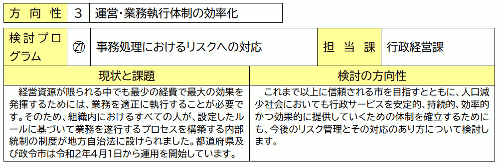

{{first:2022-09-24}}

{{description:小平市議会議員 安竹洋平の令和4年度9月定例会における一般質問の1件目についてまとめています。}}

# いじめ重大事態に関しての、事実に反する答弁について

～教育委員会は何のために存在するのでしょうか～

<a href="">📄会議録を見る（まだ公開されていません）</a>

<fieldset class="pnt">
<legend><h2> まとめ </h2></legend>

[3月定例会の一般質問](https://yasutakeyohei.com/books/yasutake/ippan/r4/3-gatu/2-ijime-taiou-minaosi.html)と[6月定例会の一般質問](https://yasutakeyohei.com/books/yasutake/ippan/r4/6-gatu/1-judai-jitai-kodomo-chusin.html)に引き続き、今回も学校でのいじめ対応に不可欠な重大事態について問いました。特に前回6月の一般質問で教育委員会が「事実に反する答弁」や「不誠実な答弁」をしたことは看過してはならないことですので、細かく追求しました。

今回も教育委員会は、過去の答弁が誤っていたことに直接言及することもなく、市民や議会への謝罪もしませんでした。しかし、実質的には、誤りを認める内容の答弁でした。内部統制の試験運用も8月から始まっています。今後二度と同様な答弁がないことを願います。そして今後の信用関係のためにも当該市民の方々にはきちんと謝罪をしてほしいと思います。

なお、今回、指摘を受け、小平市立の全学校ホームページに重大事態についての情報を新たに掲載してくれたことはひとつ感謝しています。

教育委員会の存在意義も問いました。存在意義には「子ども中心」や「人権を大切にする」といった考えがどこにも含まれていません。法に定められた「事務の執行や管理」が中心なのです。これまで不思議でしょうがなかった数々の作為や不作為も、これですべて説明がつきます。

であれば、極端なことを言えば、教育委員会はこの時代にはもう必要ないのではないでしょうか。各学校や子どもたちの自主性に任せるような流れを新たにつくる中で、（法改正が必要になりますが）事務の執行や管理も直接それぞれの学校が担うようにすればよいのではないかと思います。そうした方が、虚偽の答弁をしたり、不誠実な態度を取らざるを得ない立場に追い込まれてしまう職員にとっても、よいことになるのではないでしょうか。

といってもさまざまな課題があり、すぐには無理でしょうから、少なくとも、教育委員会の存在意義に「子ども中心」だったり「人権を大切にする」といった思想を明文化して含めてほしいと思います。

教育委員会は必要ないのでは、という極端な発想は、けっして「職員が悪いやつらだから潰してしまえ」という意味ではありません。教育委員会がなかった方が、子どもたちだけではなく、職員を含めた多くの人の福祉（人生の幸福度）を高めることになるように感じるからです。

国内や国外の事例も学びつつ、継続して考えます。

---

- 教育委員会の存在意義は → [管理と事務の執行、各学校の取組を積極的に支援](#教育委員会は何のために存在しているか)
- 存在意義に「子ども中心」などは含まれないのか → [当然と考えてやっている](#教育委員会の存在意義には子ども中心人権を大切になどは含まれていないでよいか)
- 前回、3要件の掲載に関し反事実の答弁をしたが → [学校HPに掲載するよう指示した](#前回重大事態の3要件をすべての学校が学校いじめ防止基本方針に記載しているという事実に反する答弁をしたが弁解は)
- 前回、専門家助言に関し反事実の答弁をしたが → [切り替えていなかった](#前回専門家から重大事態として扱うよう助言を受けながら扱わなかった事例の件数について事実に反する答弁をしたが弁解は)
- 間違った対応をしたのになぜ謝罪しない → [当該保護者にどう伝えるかは検討する](#間違った対応をしたならなぜ謝罪しないのか)
- 前回、保護者会で重大事態を説明していると答弁したが → [包含していると考えた](#前回重大事態については保護者会で説明しているという事実に反する答弁をしたが弁解は)
- 前回、3要件等を説明していると答弁した具体的研修は → [（抽象的答弁のみ）](#前回3要件や重大事態のことを初任者研修等で説明していると答弁したが具体的にどの研修か)
- 反事実の答弁をして訂正がない場合内部統制の対象か → [ひとつのリスクで対象](#市や市教育委員会が事実に反する答弁を行いその後議会で訂正がなされないケースは内部統制の対象か)
- 学校いじめ防止基本方針で重大事態の記載見直しは → [本年度中に加筆等する](#学校いじめ防止基本方針で重大事態の記載を見直す予定はあるかあればいつどんな内容か)
- 3要件や、本人・保護者の申立てで始まることも記載を → [すでに全校HP記載を確認](#市や市教育委員会が事実に反する答弁を行いその後議会で訂正がなされないケースは内部統制の対象か)
- 重大事態の扱いは累計何件になったか → [4件になった](#市として重大事態扱いの累計は何件になったか)
- ここ数年で重大事態が増えたのは → [いじめ問題が複雑化し対応困難な事案が増加](#ここ数年で重大事態の扱いが急増している理由は)

</fieldset>

<button onclick='showPDF("./20220909-ippan-situmon-yasutake-1.pdf")' class="pdf-view-button">
<i class="fa fa-file-pdf-o" aria-hidden="true"></i> 一般質問通告書
</button>

## 主な質疑

目次

- [今回質問する理由](#今回質問する理由)
    - [前回の一般質問で事実に反する答弁が複数あった](#前回の一般質問で事実に反する答弁が複数あった)
    - [議会軽視、教育委員会の信用を失わせる行為であり、看過できない](#議会軽視教育委員会の信用を失わせる行為であり看過できない)
    - [しわ寄せは立場の弱い子どもたちに来る](#しわ寄せは立場の弱い子どもたちに来る)
    - [日本語表現のもつあいまいさを自己保身のために使うな](#日本語表現のもつあいまいさを自己保身のために使うな)
    - [ここで正さないと一般質問の仕組みが破綻するので問わざるを得ない](#ここで正さないと一般質問の仕組みが破綻するので問わざるを得ない)
- [教育委員会は何のために存在しているか](#教育委員会は何のために存在しているか)
- [教育委員会の存在意義には、子ども中心、人権を大切になどは含まれていない、でよいか](#教育委員会の存在意義には子ども中心人権を大切になどは含まれていないでよいか)
- [前回、重大事態の3要件をすべての学校が学校いじめ防止基本方針に記載しているという事実に反する答弁をしたが、弁解は](#前回重大事態の3要件をすべての学校が学校いじめ防止基本方針に記載しているという事実に反する答弁をしたが弁解は)
- [前回、専門家から重大事態として扱うよう助言を受けながら扱わなかった事例の件数について事実に反する答弁をしたが、弁解は](#前回専門家から重大事態として扱うよう助言を受けながら扱わなかった事例の件数について事実に反する答弁をしたが弁解は)
- [間違った対応をしたなら、なぜ謝罪しないのか](#間違った対応をしたならなぜ謝罪しないのか)
    - [結局、教育委員会は、管理や事務遂行を重視して成り立っている組織](#結局教育委員会は管理や事務遂行を重視して成り立っている組織)
    - [「子どもを大事に」、「保護者とのコミュニケーションを大事に」などを明文化し、文化浸透を](#子どもを大事に保護者とのコミュニケーションを大事になどを明文化し文化浸透を)
    - [いっそのこと教育委員会がなくなれば、みんな開放されるのでは](#いっそのこと教育委員会がなくなればみんな開放されるのでは)
- [前回、重大事態については保護者会で説明しているという事実に反する答弁をしたが、弁解は](#前回重大事態については保護者会で説明しているという事実に反する答弁をしたが弁解は)
- [前回、3要件や重大事態のことを初任者研修等で説明していると答弁したが、具体的にどの研修か](#前回3要件や重大事態のことを初任者研修等で説明していると答弁したが具体的にどの研修か)
- [市や市教育委員会が事実に反する答弁を行い、その後議会で訂正がなされないケースは、内部統制の対象か](#市や市教育委員会が事実に反する答弁を行いその後議会で訂正がなされないケースは内部統制の対象か)
    - tips🔍:[小平市における内部統制の試行運用](#小平市における内部統制の試行運用)
    - [「子ども中心」の思想を教育委員会の仕組みに入れ込んで](#子ども中心の思想を教育委員会の仕組みに入れ込んで)
- [学校いじめ防止基本方針で重大事態の記載を見直す予定はあるか。あれば、いつ、どんな内容か](#学校いじめ防止基本方針で重大事態の記載を見直す予定はあるかあればいつどんな内容か)
- [3要件のことや、本人や保護者からの申し立てで重大事態の扱いが始まることもちゃんと含めるか](#3要件のことや本人や保護者からの申し立てで重大事態の扱いが始まることもちゃんと含めるか)
- [市として重大事態扱いの累計は何件になったか](#市として重大事態扱いの累計は何件になったか)
- [ここ数年で重大事態の扱いが急増している理由は](#ここ数年で重大事態の扱いが急増している理由は)

{{#include ../../../partials/ippan-situgi-note.md}}

### 今回質問する理由

#### 前回の一般質問で事実に反する答弁が複数あった

本年6月定例会（以下、前回と呼ぶ）の、いじめ重大事態に関する私の一般質問に対し、事実に基づかない、もしくは事実に反する答弁が複数あった。

#### 議会軽視、教育委員会の信用を失わせる行為であり、看過できない

これは議会軽視であり、市民に誤った情報を与えることであり、事実が判明した際には教育委員会の信用を失わせることになる行為であり、看過 できない。

#### しわ寄せは立場の弱い子どもたちに来る

私たち議員が、さまざまな機会に質問する理由は、市や市教育委員会が抱える課題や問題を明らかにし、その解決に向け、市民の協力を得ながら、ともに尽力するためである。

その場しのぎとも捉えられるような、事実に基づかない答弁は、その流れを逆行させる。改善が遅れることで影響を受けるのは市民であり、特に立場の弱い子どもたちだ。

#### 日本語表現のもつあいまいさを自己保身のために使うな

なお、そのようなことはないことを願うが、仮に、日本語表現のもつあいまいさや解釈の幅を自己保身のために利用するような姿勢があるならば、特に子どもを指導する立場の教育委員会として、あり得ないことと思う。

以上の理由から、重大事態に関して事実確認を再び行うとともに、市教育委員会の姿勢を問う。

#### ここで正さないと一般質問の仕組みが破綻するので問わざるを得ない

本来、このようなことに時間を費やしたくはないが、ここで正さなければ、答弁が信用できなくなり、一般質問の仕組みが破綻するため、問わざるを得ないものである。

#### 教育委員会は何のために存在しているか

市長と教育長は、教育委員会が何のために存在していると考えているか。

教育委員会は、地方自治法において、普通地方公共団体に置かなければならないとされている委員会であり、学校その他の教育機関を管理し、学校の組織編制、教育課程、教科書その他の教材の取扱、及び教育職員の身分取扱に関する事務を行い、並びに社会教育その他教育、学術、及び文化に関する事務を管理し、及びこれを執行する機関であると認識している。

また、教育委員会では、いじめの問題の解決に向けて、各学校の実態に応じて、個別案件の支援、効果的な研修の実施、組織体制・相談体制の充実などの、各学校の取組を積極的に支援するものと認識している。

この「～などの各学校の取組を積極的に支援」については見たことがなく、どこかに明文化されたものなのか、何を根拠にしているのか、確認します。

教育委員会は、教育の政治的中立性や継続性、安定性の確保、地域住民の意向の反映などを行うため、市長から独立した機関として設置されている。

地方教育行政の組織及び運営に関する法律に基づき、市の教育に関する事務について、自らの判断と責任において、誠実に管理し、および執行する機関であると認識している。

##### 教育委員会の存在意義には、子ども中心、人権を大切になどは含まれていない、でよいか

結局、地方自治法等で書かれている教育委員会の存在意義には
- 子どもを大切にしよう
- 子ども中心でいこう
- 人権を大切にしよう

そういったことは含まれていないということでよいか。

法律に基づいたことを答弁している。子どもたちのことに対し、大切に考えてやっていくというのは当然のことと考えている。

教育委員会がいろんな問題を起こすのはどうしてかと思っていたが、結局、そういったことは明文化されていない。

教育委員会の役割ではないというところがわかった。そこが一番問題と感じる。

#### 前回、重大事態の3要件をすべての学校が学校いじめ防止基本方針に記載しているという事実に反する答弁をしたが弁解は

前回、重大事態の3要件について、「すべての学校が（学校いじめ防止基本方針に）記載しているはず。ただ、議員はそれを確認しているということなので、改めて確認する必要があると今認識した」という[答弁があった](https://yasutakeyohei.com/books/yasutake/ippan/r4/6-gatu/1-judai-jitai-kodomo-chusin.html#%E6%94%B9%E3%82%81%E3%81%A6%E8%81%9E%E3%81%8F%E3%81%8C%E9%87%8D%E5%A4%A7%E4%BA%8B%E6%85%8B%E3%81%AE3%E8%A6%81%E4%BB%B6%E3%81%AB%E3%81%A4%E3%81%84%E3%81%A6%E8%A8%98%E8%BC%89%E3%81%8C%E3%81%82%E3%82%8B%E3%81%AE%E3%81%AF%E3%81%99%E3%81%B9%E3%81%A6%E3%81%AE%E5%AD%A6%E6%A0%A1%E3%81%A7%E3%81%AF%E3%81%AA%E3%81%84%E3%81%A7%E3%82%88%E3%81%84%E3%81%8B)。

その確認の結果、答弁どおり、すべての学校の学校いじめ防止基本方針に重大事態の3要件が記載されていたか。

すべての学校のいじめ防止基本方針を確認したところ、いじめの重大事態の調査を実施する3つの要件に関する記載が不十分であった学校があったことから、いじめの重大事態の定義や、調査を実施する要件等について、学校ホームページに掲載するよう指示した。

すべての学校が記載しているはずと答弁いただいたが、結局、たったの1校しか3要件について書かれていなかった。つまり、間違えた答弁だったということ。

間違えた答弁でしたということを一切答弁では発言しないが、事実として間違えた答弁だった。

#### 前回、専門家から重大事態として扱うよう助言を受けながら扱わなかった事例の件数について事実に反する答弁をしたが、弁解は

前回、「専門家や有識者から重大事態として扱うよう助言を受けながら、重大事態として扱わなかった事例の件数は」という質問に対し、「そのような事例はないものと捉えている」という[答弁があった](https://yasutakeyohei.com/books/yasutake/ippan/r4/6-gatu/1-judai-jitai-kodomo-chusin.html#%E3%81%93%E3%82%8C%E3%81%BE%E3%81%A7%E8%A6%81%E4%BB%B6%E3%82%92%E6%BA%80%E3%81%9F%E3%81%97%E3%81%AA%E3%81%8C%E3%82%89%E3%81%BE%E3%81%9F%E3%81%AF%E9%87%8D%E5%A4%A7%E4%BA%8B%E6%85%8B%E3%81%A8%E3%81%97%E3%81%A6%E6%89%B1%E3%81%86%E3%82%88%E3%81%86%E5%B0%82%E9%96%80%E5%AE%B6%E7%AD%89%E3%81%8B%E3%82%89%E5%8A%A9%E8%A8%80%E3%82%92%E5%8F%97%E3%81%91%E3%81%AA%E3%81%8C%E3%82%89%E9%87%8D%E5%A4%A7%E4%BA%8B%E6%85%8B%E3%81%A8%E3%81%97%E3%81%A6%E6%89%B1%E3%82%8F%E3%81%AA%E3%81%8B%E3%81%A3%E3%81%9F%E4%BA%8B%E4%BE%8B%E3%81%AE%E4%BB%B6%E6%95%B0%E3%81%AF)。

しかし私の認識では少なくとも1件あり、事実に反する答弁だ。

これは「専門家や有識者から助言を受けたからという理由では重大事態として扱わなかった事例はあるが、その後、別の理由により、最終的に重大事態として扱うことになった。そのため、質問に対する答弁としては、事例がないということになる」という趣旨の答弁だったということでよいか。

専門家や有識者からの助言があった時点では、重大事態調査に切り替えず、当該児童・生徒への支援、および加害児童・生徒等への指導を最優先としたのち、いじめ防止対策推進法の規定に基づき、重大事態としての調査を開始したため、そのような事例はないと答弁した。

定例会初日の、教育長任命の議案では、今の答弁とかなり違うような内容で、白倉部長から「誤った対応だった」というふうな発言があった。それをもう一度確認させてもらいたい。

当時そこに私はいなかったということで、指摘された内容からしては、少し認識が甘かったというような形で答弁したと考えている。

##### 間違った対応をしたなら、なぜ謝罪しないのか

その後、今後二度と起きないようにしますと答弁されたので、間違っていた対応だったということ。間違っていた対応だとしたら、当事者の方に謝罪等しないのか。

専門家からのご指摘は、重く受け止めるべきであったと考えている。ただ、当時は当該児童の支援をまずは優先すべきと考え、支援に注力をしてきた経緯があった。

しかしながら、並行して重大事態として取り扱うべきであったと認識している。

当該の保護者の方へどのようにお伝えするかは検討していく。

普通に謝ればよいだけだと思う。

白倉部長が述べたような、今後二度と置きないようにしますといったことを、そのまま当事者の方に説明すればよい。それだけでずいぶん教育委員会の対応が改善される。

##### 結局、教育委員会は、管理や事務遂行を重視して成り立っている組織

なぜ今のような答弁になるかというと、先ほどの質問で明らかになったように、教育委員会は、基本的に管理のこと、事務遂行がスムーズにいくことを重視して成り立っている組織なのかなと。

だから、子どもや保護者の心情などは重視していないのかなと。先ほどの答弁で納得できるというか、残念なところと思うが。

##### 「子どもを大事に」、「保護者とのコミュニケーションを大事に」などを明文化し、文化浸透を

小平市はそういった考えを改め、「子どもを大事にする」、「保護者とのコミュニケーションを大事にする」、そういったことを、何らかの形で明文化し、文化を浸透させてもらいたい。

さもなければ、文科省の通達や指導を各学校に浸透させていくだけであれば、教育委員会は、そろそろ時代として不要になる、そういうことになるのではないか。

職員も、事務の遂行が容易になるとか、組織運営上の問題が生じないようにするというところを最重視するがために、そういう答弁になったり、保護者に謝罪しない、というところと思う。

子どもたちのことを中心に考える組織に変われば、多分そういった対応も変わる。

##### いっそのこと教育委員会がなくなれば、みんな開放されるのでは

もしくは、教育委員会がなくなれば、職員もそういったところから解放され、もっと自分たちの思ったように仕事ができるようになるのではないかと思う。

#### 前回、重大事態については保護者会で説明しているという事実に反する答弁をしたが、弁解は

前回、重大事態については保護者会で「説明している」と[答弁があった](https://yasutakeyohei.com/books/yasutake/ippan/r4/6-gatu/1-judai-jitai-kodomo-chusin.html#%E4%BF%9D%E8%AD%B7%E8%80%85%E4%BC%9A%E3%81%A7%E9%87%8D%E5%A4%A7%E4%BA%8B%E6%85%8B%E3%81%AE%E3%81%93%E3%81%A8%E3%81%AF%E8%AA%AC%E6%98%8E%E3%81%97%E3%81%A6%E3%81%84%E3%82%8B%E3%81%8B)。

しかし、その後、複数の保護者から、いじめ防止基本方針の説明は受けたが、重大事態の説明は受けていないという証言を得ており、これも事実と反する答弁がなされたことになる。

前回の答弁は、次の1から4のどれに該当するか。

- tips1:「重大事態について、すべての保護者会で説明している」という意味。  
　  
この場合、説明されている具体的な保護者会がある事実を把握したうえでの答弁だったか。

- tips2:「重大事態について、すべてかどうかは分からないが、一部の保護者会で説明している」という意味。  
　  
この場合、私が前回質問の前置きで「いじめ防止基本方針のことを説明しただけでは重大事態のことを説明したことにはならない」と説明したことを、聞き洩らしたか忘れたための答弁なのか。

- tips3:「保護者会で、いじめ防止基本方針について説明するよう全校に指導している。ただし、重大事態について取り出して説明するよう指導しているわけではないし、実際に重大事態について取り出して説明がなされているかは分からない」という意味。

- tips4:それ以外の意味。

同じ質問を繰り返さずに済む見解を問う。

各学校に対し、学校いじめ防止基本方針について保護者会等で説明するよう周知している。

各学校のいじめ防止基本方針の中に、重大事態の対応について記載されていることから、基本方針についての説明が重大事態の対応についての説明を包含しているとの考えから、保護者会等において説明していると答弁した。

結局、事実として、間違いを認めるということ（けっしてそうは言わないが）。

#### 前回、3要件や重大事態のことを初任者研修等で説明していると答弁したが、具体的にどの研修か

前回、3要件のことや重大事態のことを初任者研修等で説明していると[答弁した](https://yasutakeyohei.com/books/yasutake/ippan/r4/6-gatu/1-judai-jitai-kodomo-chusin.html#%E6%95%99%E8%81%B7%E5%93%A1%E3%81%AE%E7%A0%94%E4%BF%AE%E4%BC%9A%E3%81%A7%E3%82%82%E9%87%8D%E5%A4%A7%E4%BA%8B%E6%85%8B%E3%81%AE%E3%81%93%E3%81%A8%E3%82%92%E6%AD%A3%E7%A2%BA%E3%81%AB%E7%90%86%E8%A7%A3%E3%81%A7%E3%81%8D%E3%82%8B%E3%82%88%E3%81%86%E3%81%A1%E3%82%83%E3%82%93%E3%81%A8%E8%AA%AC%E6%98%8E%E3%82%92%E3%81%97%E3%81%A6%E3%81%84%E3%82%8B%E3%81%AE%E3%81%8B)が、具体的にどの研修か。

若手教員育成研修会において、研修テキストの内容に基づき、いじめの重大事態に関する理解を深める機会を設けている。

また、生活指導の担当教員を対象とした研修会においても、東京都が作成した資料に基づいた研修を実施している。

初任者研修の資料をもらったが、重大事態のことは項目として書かれているが、本当に3要件のことを説明しているのか、分かりやすく説明しているか、まったく分からない。

結局、そういったことを確認せずに答弁した。これも問題。

#### 市や市教育委員会が事実に反する答弁を行い、その後議会で訂正がなされないケースは内部統制の対象か

市や市教育委員会の行った答弁が、事実に反することが明らかになり、その後議会で訂正がなされないケースを考える。

答弁の誤りについて追及が行われ、職員がその対応に時間を費やしたり、組織としての信用を失うことで業務遂行に支障が生じたりする可能性がある。

そのようなケースは内部統制の対象になるか。ならない場合、その理由と、自浄作用が働く別の仕組みの有無は。

本市では、地方自治法上の内部統制制度としての取組ではないが、総合的にリスク管理を行っていくための仕組みの構築に向けて、事務処理におけるリスクへの対応として本年8月から試行運用を開始した。

この取組においては、市の行財政運営や行政サービスに支障が生じ、市民からの信頼を損ねることにつながりかねないリスク全般を管理の対象としており、議会における答弁の誤りもひとつのリスクと考えられる。

誤った答弁をしない仕組みは特段ないが、誠実かつ間違えのない答弁を行うことは、説明員としては当然に認識している。

まさに今回のケースが該当する。調べてもらいたい。

🔍 小平市における内部統制の試行運用

行政経営課に確認しました。

令和2年4月1日から、地方自治法において、都道府県と政令市に「内部統制に関する方針の策定」と「その方針に基づいた必要な体制の整備」が義務付けられています。一方、小平市のような政令市以外の市区町村では、これがいまのところ義務ではなく努力義務とされています。

<blockquote>

都道府県知事及び（略）指定都市（略）の市長は、その担任する事務のうち次に掲げるものの管理及び執行が法令に適合し、かつ、適正に行われることを確保するための方針を定め、及びこれに基づき必要な体制を整備しなければならない。

- tips一:財務に関する事務その他総務省令で定める事務
- tips二:前号に掲げるもののほか、その管理及び執行が法令に適合し、かつ、適正に行われることを特に確保する必要がある事務として当該都道府県知事又は指定都市の市長が認めるもの

② 市町村長（指定都市の市長を除く。略）は、その担任する事務のうち次に掲げるものの管理及び執行が法令に適合し、かつ、適正に行われることを確保するための方針を定め、及びこれに基づき必要な体制を整備するよう努めなければならない。

- tips一:前項第一号に掲げる事務  
- tips二:前号に掲げるもののほか、その管理及び執行が法令に適合し、かつ、適正に行われることを特に確保する必要がある事務として当該市町村長が認めるもの

<a href="https://elaws.e-gov.go.jp/document?lawid=322AC0000000067#Mp-At_150">地方自治法第150条</a>

</blockquote>

そうした状況の中、小平市では、[第1期経営方針推進プログラムの27項](https://www.city.kodaira.tokyo.jp/kurashi/files/91261/091261/att_0000001.pdf#page=23)に、事務処理におけるリスクへの対応として内部統制の検討を含めています。

この検討プログラムは、令和3年度から令和6年度までの4年間実施されます。前半2年間で「実際にどうやっていくか」を検討し、後半2年間で「実施するかどうか」を見極めるのだそうです。

令和4年8月には、庁内向けガイドラインがつくられ、市民や市に時間や人的コストが発生するような事案について、課長に報告が上がったものを、課長決裁のうえ、行政経営課に報告してもらう、といった方針を定めているようです。

それ以外、ざっくりとですが、次のような状況を確認しました。

- 内部統制はきちんとやろうとするとボリュームがあり、簡単にはできない
- コンサルにかなりの委託料を払って内部統制を始めている自治体も多いが、小平市はそういうところにコストをかけるのではなく、できるだけ今ある仕組みを活用しながら、できるだけ市民に迷惑をかけるリスクを減らしていき、実質的に事務ミスをなくしていく方針で始めており、完全なる内部統制ではない
- 試行運用では、これから発生する事務処理のミスなどについて、これまで所管の中で解決していたものを行政経営課に報告してもらう流れにしている
- 行政経営課に報告が上がったものを事細かに共有するのではなく、事案と発生状況などをまとめたものを全庁共有し、各課の自分ごととして、同じことを起こさないようにしてもらうことを目指している
- 過去に起きたことを検討するのではなく、これから起こることに対応する
- 庁内向けガイドラインを庁内に告知した令和4年8月より前を起点とした事案については対象としていない
- [経営方針推進委員会](https://www.city.kodaira.tokyo.jp/kurashi/087/087463.html)委員である公認会計士から、内部統制が民間企業で始まった経緯の話もあった。形としてやっているだけだと意味がない。市としてどうやったら効果的にやっていけるかということで試行運用に取り組んでいる

私が認識している中では、令和3年度注に発生し、内部統制の試行運用の対象になっていたはずの事案が次の2つあります。聞いてみると、これらの事案は、まだ小平市にはこういった事案に対処する部署がないため、内部統制の検討を進めてきた行政経営課がその一貫として対応してきた、ということだそうです。言ってみれば「試行運用のテスト」として対応していたものなのだそうです。

- 高額介護サービス費の支給誤り（令和3年9月に発生）
- [新型コロナウイルスワクチン副反応の救済申請に関する誤った対応](https://yasutakeyohei.com/books/yasutake/ippan/r4/3-gatu/1-mizukara-rissuru-sikumi.html)の2つの事案が

今回の教育委員会による重大事態に関する虚偽の答弁については、起点が令和4年6月（の一般質問）であり、令和4年8月より前のこととなるため、対象にならないそうです。であるならば、「試行運用のテスト」の範疇でもよいので対応してもらいたいところです。

内部統制は、市において自浄作用を働かせるための重要な仕組みのひとつになるはずです。注視していきます。

##### 「子ども中心」の思想を教育委員会の仕組みに入れ込んで

教育委員会は、これまでも私たち議員だけではなく、保護者の方々にも事実に反することや事実確認をしないことを、自分たちの都合のよいような形で答えているのではないか、そういう疑念が湧いている。

いじめに関してご相談いただく中では、そういう話が、必ずと言ってよいほど出てくる。ちゃんとその自浄作用を働かせてもらいたい。

その際、仕組みの問題として、子どもを中心にとか、子どもたちのためにといったところを、何らかの形で入れ込んでもらいたい。

#### 学校いじめ防止基本方針で重大事態の記載を見直す予定はあるか。あれば、いつ、どんな内容か

学校いじめ防止基本方針において、重大事態の記載を見直す予定はあるか。あれば、対象となる学校の範囲はどこで、どのような内容を想定し、いつ改訂する予定か。

本年度中の改定に向け、すべての市立学校において、いじめの重大事態の定義や調査を実施する要件の加筆等を中心に見直していく。

#### 3要件のことや、本人や保護者からの申し立てで重大事態の扱いが始まることもちゃんと含めるか

3要件のことや、特に本人や保護者からの申し立てでも、重大事態の扱いが始まるということはちゃんと含めてもらえるか。

そのことは、すでに学校のホームページに全校が記載していることを確認した。

#### 市として重大事態扱いの累計は何件になったか

本年7月（と8月）の教育委員会定例会で、新たな重大事態が報告されている。これで市として重大事態扱いの累計は何件になったか。

教育委員会としていじめの重大事態として扱っている累計件数は4件。

#### ここ数年で重大事態の扱いが急増している理由は

ここ数年で重大事態の扱いが急増している理由は。

重大事態の件数が増えている理由は、いじめの問題が複雑化し、対応が困難な事案が増えているものと認識している。

以上

