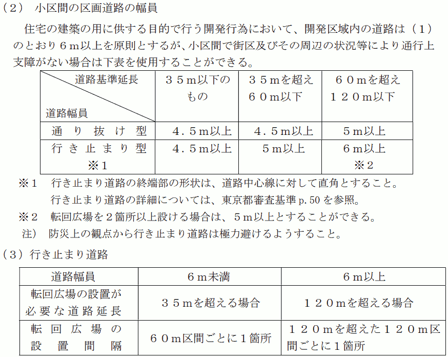

{{first:2022-09-24}}

{{description:小平市議会議員 安竹洋平の令和4年度9月定例会における一般質問の2件目についてまとめています。}}

# 東京サレジオ学園北側の大規模開発について

～まちづくりには事業主と周辺住民との充分な話し合いが不可欠～

<a href="https://ssp.kaigiroku.net/tenant/kodaira/SpMinuteView.html?council_id=1337&schedule_id=5&minute_id=31&is_search=true">📄会議録を見る</a>

<fieldset class="pnt">
<legend><h2> まとめ </h2></legend>

東京サレジオ学園北側の土地約9,200㎡がトヨタホーム（株）に売却され、土地利用構想が示されました。最低限の敷地面積で宅地が並び、市や都の整備基準では原則設けないこととされている行き止まり道路が全長約250mも続く案です。

周辺住民は、市の[開発ガイドブックに明示されている](#結局は話し合いが重要)とおりに、事業者との自主的な話し合いの機会を求めてきました。しかし、事業者から断られ続けてきました。条例にある事業主の責務「市民とともにまちづくりを行う」が守られていない状況です。

その後、事業者からは改案が示されたものの、事業者がこれまで周辺住民との話し合いに応じなかったことが原因で軋轢が生じています（[その後についてはこちら](#その後)）。

住民は過剰な要求をしてきたわけではありません。まちづくりには話し合いが不可欠です。その観点から、市に問いました。

---

- 事業者はどうすれば市民とまちづくりしたことに → [自主的協議や建築協定など](#条例第5条の事業主の責務について具体的にどうすれば市民とともにまちづくりを行ったことになるか)
- 市長が袋路状道路を認めるのはどういう場合か → [都の審査基準に合う場合](#市長が袋路状道路を安全上支障がないと認めるのはどういう場合か)
- 最後の転回広場から行き止まりまでの間隔が基準違反では → [これから](#最後の転回広場から行き止まりまでの間隔が基準に違反しているのでは)
- 32.5m以内のルール違反でも許可された事例があるということか → [その通り](#325m以内というルールに違反していても許可された事例があるということか)
- 都の審査基準を守らなくても許可が下りることがあるのか → [都度判断で](#東京都の審査基準を守らなくても許可が下りることがあるのか)
- 袋路状道路として市内最長を更新する前例をつくってよいのか → [255mがあった](#袋小路として市内最長を更新するような前例をつくってよいのか)
- 「紛争の予防に努める」とは → [条例に基づいた対応、周辺住民への真摯な対応](#条例第18条2項紛争の予防に努めるとはどのような行為を想定しているか)
- 市は事業者にどんな関与をしているか → [自主的に話し合いを重ねるよう指導](#市が事業者に対し住民との話し合いの機会を設けるよう促すなど何らかの関与は行っているか)
- 過去に調整会は何回あったか → [大規模で1回、中規模で1回](#条例が制定されてから土地利用構想に係る調整会が開催された総回数は)

</fieldset>

<button onclick='showPDF("./20220909-ippan-situmon-yasutake-2.pdf")' class="pdf-view-button">
<i class="fa fa-file-pdf-o" aria-hidden="true"></i> 一般質問通告書
</button>

## 主な質疑

目次

- [用語について](#用語について)
- [今回質問する理由](#今回質問する理由)
    - [概要](#概要)
        - tips📅:[質問時点での進捗状況](#質問時点での進捗状況)
    - [（新着情報）9月1日、事業者から、隣接住民と話し合いを行うと連絡があった](#新着情報9月1日事業者から隣接住民と話し合いを行うと連絡があった)
    - [東京サレジオ学園のすばらしい環境](#東京サレジオ学園のすばらしい環境)
    - [東京サレジオ学園が北側の土地を売却することになった理由](#東京サレジオ学園が北側の土地を売却することになった理由)
        - tips🔍:[児童養護施設に関する国の方針](#児童養護施設に関する国の方針)
    - [事業者の構想に対し、隣接住民から指摘されている問題](#事業者の構想に対し隣接住民から指摘されている問題)
- [条例第5条の事業主の責務について、具体的にどうすれば、市民とともにまちづくりを行ったことになるか](#条例第5条の事業主の責務について具体的にどうすれば市民とともにまちづくりを行ったことになるか)
    - [結局は話し合いが重要](#結局は話し合いが重要)
    - [住民から求めても話し合いが実現していなかった](#住民から求めても話し合いが実現していなかった)
    - [「調整会で話し合えばよい」という誤った認識](#調整会で話し合えばよいという誤った認識)
    - [市からの再三の依頼で、遅まきながら話し合いが行われることに](#市からの再三の依頼で遅まきながら話し合いが行われることに)
- [市長が袋路状道路を安全上支障がないと認めるのはどういう場合か](#市長が袋路状道路を安全上支障がないと認めるのはどういう場合か)
- [「東京都の審査基準を満たす場合は認める」と書けばよいのでは](#東京都の審査基準を満たす場合は認めると書けばよいのでは)
- [「市長が認める場合」は、「市長が独自に判断して決めた場合」ではないのか](#市長が認める場合は市長が独自に判断して決めた場合ではないのか)
- [最後の転回広場から行き止まりまでの間隔が基準に違反しているのでは](#最後の転回広場から行き止まりまでの間隔が基準に違反しているのでは)
- [32.5m以内というルールに違反していても許可された事例があるということか](#325m以内というルールに違反していても許可された事例があるということか)
- [東京都の審査基準を守らなくても許可が下りることがあるのか](#東京都の審査基準を守らなくても許可が下りることがあるのか)
    - tips🔍:[法に違反していなければ、審査基準を満たさなくともよい場合も](#法に違反していなければ審査基準を満たさなくともよい場合も)
- [袋小路として市内最長を更新するような前例をつくってよいのか](#袋小路として市内最長を更新するような前例をつくってよいのか)
    - tips🔍:[小平市内で200m以上ある行き止まり道路のリスト](#小平市内で200m以上ある行き止まり道路のリスト)
- [ネットワーク化の重要性は都の基準にも書かれている](#ネットワーク化の重要性は都の基準にも書かれている)
- [災害時活動困難度の道路ネットワーク密度不足率といった指標も、助言等に活かせないか](#災害時活動困難度の道路ネットワーク密度不足率といった指標も助言等に活かせないか)
- [条例第18条2項「紛争の予防に努める」とは、どのような行為を想定しているか](#条例第18条2項紛争の予防に努めるとはどのような行為を想定しているか)
- [市が事業者に対し、住民との話し合いの機会を設けるよう促すなど、何らかの関与は行っているか](#市が事業者に対し住民との話し合いの機会を設けるよう促すなど何らかの関与は行っているか)
- [条例が制定されてから、土地利用構想に係る調整会が開催された総回数は](#条例が制定されてから土地利用構想に係る調整会が開催された総回数は)

{{#include ../../../partials/ippan-situgi-note.md}}

### 用語について

ここでは、以下3つを同じ意味で用いています。

- 行き止まり道路
- 袋路状道路（ふくろじじょうどうろ）
- 袋小路（ふくろこうじ）

### 今回質問する理由

#### 概要

本年、上水南町4丁目の東京サレジオ学園北側の土地約9,200㎡が、トヨタホーム（株）に売却されることとなった。

黄色で囲んだあたりが売却地です。

[小平市開発事業における手続及び基準等に関する条例](https://www.city.kodaira.tokyo.jp/reiki/reiki_honbun/g135RG00001187.html)（以下、条例と呼ぶ）に従い、土地利用構想届出がなされた。

その後、本年6月25日に、事業計画の概要に関する説明会が開催され、7月に、周辺住民からさまざまな意見書が提出された。

条例に定める手続き上、今は、事業者からの見解書提出を待っている段階である。

**📅 質問時点での進捗状況**

一般質問を行った令和4年9月9日時点での大規模開発手続きの進捗状況は、次の開発の手続きフロー図で「次ココ」と書いてある手前です（クリック／タップで拡大します）。

なお、フロー図を見ると調整会の後に開催されるように見える土地利用審議会は、今回、調整会より前に行われました。住民からの意見書を受領した後の8月9日に開催されています。

実は、土地利用審議会の開催時期について、条例（下記）に記載がありません。ほかの案件と一緒に審議するなど、開催時期は前後するようです。

<blockquote>

**（土地利用構想に係る指導又は助言）**

市長は、第8条第2項の規定による土地利用構想の届出があった場合において、安全で快適なまちづくりを推進するために必要があると認めるときは、大規模開発事業主に対し、都市計画マスタープランの方針に適合させるために必要な指導又は助言を行うことができる。

2　市長は、前項の指導又は助言を行うに当たっては、第42条第1項に規定する小平市土地利用審議会の意見を聴くことができる。

<a href="">小平市開発事業における手続及び基準等に関する条例 第14条</a>

</blockquote>

今回のやり取りで、フロー図の表記が誤解を招くことが判明したため、修正を検討しているようです。

条例第5条に、事業主の責務が次のとおり記載されている。

<blockquote>

事業主は、安全で快適なまちづくりを推進するため、開発事業を行うに当たっては、その内容を[都市計画マスタープラン](https://www.city.kodaira.tokyo.jp/kurashi/index07005003.html)の方針に適合させ、自らも地域社会の一員としての社会的使命を自覚し、市民とともにまちづくりを行うものとする

<a href="https://www.city.kodaira.tokyo.jp/reiki/reiki_honbun/g135RG00001187.html#e000000117">小平市開発事業における手続及び基準等に関する条例 第5条（事業主の責務）</a>

</blockquote>

まさに、市民とともにまちづくりを行ってほしいという願いをもつ周辺住民が、[小平市民等提案型まちづくり条例](https://www.city.kodaira.tokyo.jp/kurashi/017/017256.html)を活用し、地区まちづくり協議会設立に向け準備会を登録するなどの活動と並行して、事業者に話し合いの機会を求めている。しかし、実現していない状況がある。そこで、市に質問する。

#### （新着情報）9月1日、事業者から、隣接住民と話し合いを行うと連絡があった

なお、この9月1日付で、事業者より、隣接されている住民の方々と話し合いするという連絡があったことをここでお知らせしておく。

ここにきて、事業者からやっと、住民の求めに応じて話し合いをするというお知らせをいただきました。しかし、隣接している住民のみが対象の予定です。

その後の顛末を見ると痛感しますが、本来、事業者のためにも、もっと早い時期から、隣接住民だけではなく周辺住民も含めた話し合いを行う必要があると思います。

でなければ、市民とともにまちづくりはできません。

#### 東京サレジオ学園のすばらしい環境

中を見せていただいたが、東京サレジオ学園は、非常にすばらしい環境。

サレジオ会創立者の[ドン・ボスコ（ジョヴァンニ・メルキオッレ・ボスコ）](https://ja.wikipedia.org/wiki/%E3%83%A8%E3%83%8F%E3%83%8D%E3%83%BB%E3%83%9C%E3%82%B9%E3%82%B3)氏は、青少年の教育には優れた教育者と豊かな教育環境が必要であり、「人間は幼い日の心象に焼き付けられたイメージを生涯持ち続ける」とされた。

親と別れて家を離れた子どもたちの心に、できるだけ美しい原風景を残したいという思いを持たれていたそうだが、まさにそういったことが実現されている場所と感じた。

#### 東京サレジオ学園が北側の土地を売却することになった理由

ただ、外観からは分かりにくいが、建物が老朽化して年間の維持費がかかっている。

また、国の方針で、児童養護施設は、より小規模で、家庭的な環境にしようとなってきた。

東京サレジオ学園は、今100人弱のお子さんがいて小規模ではないので、国の方針に基づいて政策誘導的な措置が行われ、措置費や総助金等の見直しが行われている。

たとえば20人から30人の児童養護施設で国から100もらえるとすると、東京サレジオの施設では66くらいしかもらえない。

また、自立支援専門のソーシャルワーカーや心理職といった専門職の数も、小規模施設と東京サレジオ学園規模の施設とで同じ人数しか付けてもらえない、そういった理由で経営が厳しくなってくるところがある。

🔍 児童養護施設に関する国の方針

調べ切れていませんが、国の方針については、次の資料がまとまっていると思います。

里親や小規模施設の、家庭的な環境で子どもに育ってもらおうという趣旨のようです。しかし、一方で、里親を転々とすることになる子どもがいたり、結局コスト削減なのではないかという声もあります。別途調査が必要と思います。

<blockquote>

**小規模化と施設機能の地域分散化による家庭的養護の推進**

- 児童養護施設の7割が大舎制で、定員100人を超えるような大規模施設もあることから、家庭的養護の強力な推進が必要である。
- 今後は、施設の小規模化と施設機能の地域分散化を進め、
    1. 「本体施設のケア単位の小規模化」を進め、本体施設は、全施設を小規模グループケア化（オールユニット化）をしていく。
    1. 「本体施設の小規模化」を進め、当面、本体施設は、全施設を定員45人以下にしていく。（45人以下は現在の小規模施設加算の基準）
    1. 「施設によるファミリーホームの開設や支援、里親の支援」を推進し、施設機能を地域に分散させ、施設を地域の社会的養護の拠点にしていく。
- 将来の児童養護施設の姿は、一施設につき、小規模グループケア6か所までと小規模児童養護施設1か所を持ち、小規模グループケアは本体施設のユニットケア型のほか、できるだけグループホーム型を推進する。また、1施設につき概ね2か所以上のファミリーホームを開設又は支援するとともに、里親支援を行う。

**本体施設の高機能化**

- 児童養護施設については、本体施設を大胆に小規模化し、施設機能を地域分散化していくとともに、本体施設は高機能化する、という将来の方向性を明確にする。

**社会的養護の整備量の将来像**

- 日本の社会的養護は、現在、9割が乳児院や児童養護施設で、1割が里親やファミリーホームであるが、これを、今後、十数年をかけて、
    1. 概ね3分の1が、里親及びファミリーホーム
    1. 概ね3分の1が、グループホーム
    1. 概ね3分の1が、本体施設(児童養護施設は全て小規模ケア)

という姿に変えていく。

<a href="https://www.mhlw.go.jp/seisakunitsuite/bunya/kodomo/kodomo_kosodate/syakaiteki_yougo/dl/working4.pdf">児童養護施設等の小規模化及び家庭的養護
の推進のために（概要）・社会保障審議会児童部会社会的養護専門委員会とりまとめ
平成24年11月</a>

</blockquote>

<blockquote>

平成27年度を始期として平成41年度までの15年間で、施設の本体施設、グループホーム、里親等の割合を3分の1ずつにしていく目標を達成していくことを目指し、都道府県は施設に要請して「家庭的養護推進計画」を策定させるとともに、都道府県は、平成41年度末の社会的養護を必要とする児童の見込み数や里親等委託率の引き上げのペースを考慮して確保すべき事業量を設定したうえで、施設と調整を行った上で「都道府県推進計画」を」策定する。

<a href="https://www.mhlw.go.jp/seisakunitsuite/bunya/kodomo/kodomo_kosodate/syakaiteki_yougo/dl/working3.pdf">児童養護施設等の小規模化及び家庭的養護の推進について　厚生労働省雇用均等・児童家庭局長通知（平成24年11月30日）</a>について概要を示している<a href="https://www.pref.osaka.lg.jp/attach/5934/00145433/shiryo4%20.pdf">大阪府の資料</a>から抜粋

</blockquote>

そういったことと、施設の老朽化等も影響し、北側の土地を売ることになったという状況。

#### 事業者の構想に対し、隣接住民から指摘されている問題

その後、土地が実際に売却されることになり、事業者であるトヨタホームから事業構想が出てきた。

隙間なくみっちり建てる構想で、行き止まり道路が全長約243mある。これは市内でも最長級。

1戸あたりの敷地面積約120㎡が57戸分。小平市の整備基準では平均120㎡以上とされているので、実質的に最小の敷地面積。

<blockquote>

法第33条第4項の規定による事業区域内において予定される建築物の敷地面積の最低限度は、次に掲げる事業面積の区分に応じて当該各号に定めるとおりとする。

(1)　事業面積が3,000㎡以上の場合は、次に掲げる要件の全てを満たすものとする。

ア　120㎡ある敷地の数が全敷地数の70%あること。

イ　一の敷地の最低面積が110㎡あること。

ウ　全敷地の平均面積が120㎡あること。

<a href="https://www.city.kodaira.tokyo.jp/reiki/reiki_honbun/g135RG00001187.html#e000000539">小平市開発事業における手続及び基準等に関する条例 第32条（最低敷地面積）</a>

</blockquote>

令和4年6月25日の説明会で示された基本構想をもとに作成したイメージ図です。

その後、9月下旬に事業者から新たな構想が提出されています。

#### 条例第5条の事業主の責務について、具体的にどうすれば、市民とともにまちづくりを行ったことになるか

条例第5条の、事業主の責務について、具体的にたとえばどういったことをすれば、市民とともにまちづくりを行ったことになると考えるか。

市としては、事業主と周辺住民が、相手の立場を尊重し、譲り合いの精神を持って自主的に協議を行うことや、地域にまちづくりの課題があった場合については、課題解決のために、相互に建築協定などの検討をすることを考えている。

##### 結局は話し合いが重要

結局、開発事業者と周辺住民との間で、実質的な話し合いをしてくださいということ。ガイドブックにもそう書いてある。

<blockquote>

<a href="https://www.city.kodaira.tokyo.jp/kurashi/043/043425.html">ガイドブック：開発事業に関する説明を受けるにあたって（小平市・平成29年1月改訂）</a>

</blockquote>

事業主の責務として、実質的に協議することを求めているということであれば、たとえば住民から話し合いの求めがあれば、可能な限り応じる必要がある。

市の条例で定められた説明会とは別のところで話し合いの場に参加していただくという必要性があったはずだが、そうなってはいなかった。

これでは事業主の責務を果たしているとは言えない状況だった。

##### 住民から求めても話し合いが実現していなかった

周辺住民からは、かなりの回数、話し合いの場を設けてくださいというようなメッセージを事業主に送っていた。しかしなかなか受け入れてもらえなかった。

事業者としては、話し合いに応じると、再現なく要望が出て、抱えきれなくなるという懸念があったのかもしれないが。

##### 「調整会で話し合えばよい」という誤った認識

また、事業者は「調整会が話し合いの場」という認識でいた。ガイドブックにもあるとおり、調整会は、事業主の責務として求められているような自主的な協議の場ではない。

##### 市からの再三の依頼で、遅まきながら話し合いが行われることに

市からも再三、事業者に話し合いの場を設けるよう伝えていたようだ。9月1日には、はっきりした形で、事業者に対し、調整会とは別の形で設ける話し合いの場に参加してくださいといった依頼をメールで伝えてくれた。

それを受けた形になっているが、事業者として、調整会後に、別途、隣接住民の方々との話し合いの場を設けるというお知らせがあった。

これは、ひとつよかったこと。再三催促してくれた都市計画課の方には感謝している。今後、同じようなことがあった場合、（市からの再三にわたる依頼や強い依頼があったこと）は、よい事例になる。ありがたい。

この場ではこう発言しましたが、実際は「調整会後」では、あまりにも遅く、「隣接住民」だけでは、話し合いの対象が狭すぎます。しかも隣接住民と個別に話し合いをするということです。

事業者の責務を果たすためには、もっと早期に、周辺住民が集まった場で、話し合いを行う必要があります。

市の働きかけがあって話し合いの場が設けられるという意味では「前例としてよいこと」ではあるものの、タイミングと対象については前例としてはなりません。

#### 市長が袋路状道路を安全上支障がないと認めるのはどういう場合か

本年6月に事業者から示された構想では、袋路状道路が設けられている。その距離は市内で最長級。

大規模土地取引行為の届け出に対する市長の助言や、本年8月9日に行われた小平市土地利用審議会での答申案では、安全な避難路を確保するため、道路のネットワーク化を求めている。

令和4年8月9日に行われた土地利用審議会で示された答申案はこちらです。

<blockquote>

1. 建物の壁面後退等により既存住宅への日影や圧迫感の低減に努めるとともに、周辺住民に対して、造成計画や工事方法等について十分な説明を行い、理解が得られるように丁寧な対応に努めること。
1. 届出対象地は、主に第一種低層住居専用地域であり、緑豊かな土地であることから、公園や各宅地に植栽を行う等、緑化の推進を図ること。また、公園の整備にあたっては、既存樹木を活かすなど、市と十分協議を行うこと。
1. 届出対象地内には高低差があることから、隣接地の状況を考慮し、安全性が十分に確保された造成計画とすること。また、安全な避難路を確保するため、道路をネットワーク化するとともに、新設する公園を既存の道路へ歩行者の通り抜けが可能な形状とすること。
1. 車両や歩行者の通行が増加することが見込まれることから、道路の新設にあたっては、既存道路との接続部の安全対策や転回広場の設置等、周辺の交通状況及び敷地形状も踏まえた交通安全対策を施すこと。
1. 工事中においては、騒音、振動等及び工事車両による周辺生活環境に及ぼす影響を低減するよう努めること。また、教育施設が隣接していることから、工事車両の通行経路等の安全対策について、当該施設と十分調整を図ること。

<a href="https://www.city.kodaira.tokyo.jp/kurashi/086/086847.html">令和4年度 第2回 小平市土地利用審議会議事要録（令和4年8月9日実施）</a>・<a href="https://www.city.kodaira.tokyo.jp/kurashi/files/86847/086847/att_0000006.pdf#page=11">11ページ</a>

</blockquote>

その根拠となる条例の施行規則別表第6には、道路の整備基準として「両端が他の道路に接続すること」とある。一方で、ただし書きに「市長が周囲の状況により避難及び通行の安全上支障がないと認めたときは、袋路状道路とすることができる」ともある。

<blockquote>

次に掲げる事項を基本として整備すること。ただし、この基準をそのまま適用することが適当でないと市長が認めたときは、この基準によらないことができる。

(1)　両端が他の道路に接続すること。ただし、市長が周囲の状況により避難及び通行の安全上支障がないと認めたときは、袋路状道路(その一端のみが他の道路に接続したものをいう。以下同じ。)とすることができる。

(2)　(1)ただし書の規定により袋路状道路とするときは、必要に応じて自動車の転回広場を設置すること。

<a href="https://www.city.kodaira.tokyo.jp/reiki/reiki_honbun/g135RG00001188.html#e000001430">小平市開発事業における手続及び基準等に関する条例施行規則・別表第6</a>

</blockquote>

袋路状道路について、市長が避難および通行の安全上支障がないと認めるのは、具体的にどういう場合か。

大きく3つのケースに分けられる。

1. 開発区域内の道路の原則的な幅員が6m以上のケース。道路の延長が120mを超える場合には、120m区間ごとに、転回広場を1箇所設置する必要がある。また、道路の延長が60mを超え、120m以下の場合にも、原則、道路の幅員を6m以上にする必要があるが、転回広場を2箇所以上設置する場合には、道路の幅員を5m以上にすることが可能。
1. 道路の延長が35mを超え、60m以下で、道路の幅員が5m以上のケース。このケースについては、転回広場を1箇所設置する必要がある。
1. 道路の延長が35m以下で、道路の幅員が4.5m以上のケース。

これは、[開発事業の手引き（令和3年4月改定版）](https://www.city.kodaira.tokyo.jp/kurashi/052/052711.html)の[27ページ](https://www.city.kodaira.tokyo.jp/kurashi/files/52711/052711/att_0000037.pdf#page=6)に記載されている、[東京都審査基準（令和2年4月版）の内容](https://www.toshiseibi.metro.tokyo.lg.jp/bosai/kaihatsu/pdf/kaihatsu12.pdf#page=29)です。

#####  「東京都の審査基準を満たす場合は認める」と書けばよいのでは

結局、東京都の審査基準ということ。であれば、市長が避難および通行の安全上、支障がないと認める場合とはどういうことか。

「東京都の審査基準を満たす場合は認める」と書けばよいのではないか。

東京都の基準によると、歩行者専用道路や公園などを設置することにより人が通り抜けできることが望ましいとしつつも、避難および車両の通行に支障がないよう配慮して転回広場を設置することで、避難および通行の安全上支障がないとしている。

<blockquote>

道路は通り抜けを原則とする。袋路状の道路は、通過交通が生じる心配はなく、配置計画の質が高ければ良好な住環境の形成が可能である等の利点もあるが、防災上の観点からみて好ましいものではない。

やむを得ず行き止まり道路とする場合には、避難と車両の通行に支障のないように配慮して、自動車が転回できるスペース（転回広場）を設置する。また、歩行者専用道路、公園あるいは他の道路に接続する幅員2m以上のフットパスや避難通路などを設け、人が通り抜けできるようにすることが望ましい。

<a href="https://www.toshiseibi.metro.tokyo.lg.jp/bosai/kaihatsu/">都市計画法の規定に基づく開発行為の許可等に関する審査基準及び、宅地造成等規制法の規定に基づく宅地造成に関する工事の許可の審査基準（令和4年4月1日版）</a>／<a href="https://www.toshiseibi.metro.tokyo.lg.jp/bosai/kaihatsu/pdf/kaihatsu12.pdf#page=30">50ページ</a>

</blockquote>

やむを得ず、の前提があっての話なんですよね…。

市においても、東京都の審査基準に準じ、道路の延長に応じて転回広場を設置した場合には、避難および通行の安全上支障がないものと認めている。

##### 「市長が認める場合」は、「市長が独自に判断して決めた場合」ではないのか

「市長が認める場合」と書かれていると、避難および通行の安全上支障がないといったことを市長が独自に判断して決めるとも読めるが、そういう意味ではないということでよいか。

市長は小平市の代表者。組織的な市としての判断を下すときには、要綱上、条例上、市としての判断を表記するときには、市長が判断するとしている。

（事前の情報交換の中では）特殊な事例などがあった場合も、総合的な判断で認める可能性があるので、市長が、という表現を使っているとも聞いた。

##### 最後の転回広場から行き止まりまでの間隔が基準に違反しているのでは

東京都の審査基準には次のとおり書かれている。

<blockquote>

5 行き止まり道路

（2）転回広場の設置間隔

転回広場を1箇所設置する場合は、原則として起点から 35m（幅員6m以上の道路にあっては60m）以上終点寄りの位置に設置すること。複数個設置する場合は、1個は終端部付近に設置し残余は原則として等分に配置すること。

◎転回広場の配置例

○ 幅員6m以上（120mを超える場合）

 ※（240m＜L≦360m：接続先道路から終端までの距離）

L1：60m 以上 ①：5.5m 以上 32.5m 以内

<a href="https://www.toshiseibi.metro.tokyo.lg.jp/bosai/kaihatsu/">都市計画法の規定に基づく開発行為の許可等に関する審査基準及び、宅地造成等規制法の規定に基づく宅地造成に関する工事の許可の審査基準（令和4年4月1日版）</a>／<a href="https://www.toshiseibi.metro.tokyo.lg.jp/bosai/kaihatsu/pdf/kaihatsu12.pdf#page=30">51ページ</a>

</blockquote>

つまり、袋小路で道路延長が今回の構想のように240mより長く360m以下の場合、行き止まりに一番近い転回広場は、上図①にあるように、行き止まりの端から32.5m以内の間隔を空けて設置しなければならない。

しかし、今回事業者から提示されている構想では、最後の転回広場から行き止まりまでの間隔を測ると約41mある。これは周辺住民の方が見つけられたことで、よく気付かれたなと思うが。

基準に違反していることにならないか。

今現在、土地利用構想の手続き段階。今後土地利用構想の手続きが終了し、開発事業の手続きを開始する際に、事業主が東京都と市に事前相談書を提出し、整備基準に基づいて今後協議が行われる。

今回、東京都の基準にはあるが、市にはまだ基準がないので、東京都の基準の内容まで指導することは難しい。

今後、東京都の指導により不可となった場合については、当然許可はおりないので、再度協議をやり直すことになると考えている。

市の基準と東京都の基準で差異がある理由は。

東京都の基準を参考にしているが、細かいところまで市が全部を求めているというところではない。

最終的には東京都の許可によるので東京都基準によるが、その前段で、市の同意を条件として、市の基準があり、さらに東京都の基準があるということ。

差異としては、東京都と市の考え方が若干違うのかなというところ。

##### 32.5m以内というルールに違反していても許可された事例があるということか

この32.5m以内にしなければならないというルールに関しては、違反していたとしても、東京都は認可を出す可能性があるという考えでよいか。

市にはその基準がなく、東京都の方にあるので、東京都が最終的な判断をして許可を出すが、今までもそういう事例はあるということで伺っている。

事例があるというのはどういうことか。32.5m以内を超えて許可された事例があるということでよいか。

そのとおり。

のちほど確認したところ、事例があると答えたのは事業者だそうです。

##### 東京都の審査基準を守らなくても許可が下りることがあるのか

そうすると、東京都の審査基準をどこまで守ればよいか分からなくなってくるが、どういうことか。

現地の状況や地形に合わせてその都度判断をしていくということで許可が下りている。

🔍 法に違反していなければ、審査基準を満たさなくともよい場合も

小平市の開発に関して審査を行う、多摩建築指導事務所の開発指導二課に電話で確認しました。

残念ながら、法に違反していなければ、審査基準を満たさなくとも許される場合があるようです。

❓ 32.5m以内という基準を満たしていなくとも許可が出るのか。

- 当該の開発については、審査の手続きで調整中。案件について、結論がどうなのかはお答えできない
- 指摘の、審査基準マニュアルP51については、P50に記載の「都市計画法施行規則第 24条第5号」が法律。そのほかの数字は、こちらでの基準。
- 法律は命令なので、そこに抵触している場合は許可にならない。
- 32.5mについては、法律ではなく、指導の部分なので、必ずしも絶対とは言えない。案件を見て判断していく。
- 書かれているとおりにしてくださいと言う場合もあるが、そうではない場合もある。
- 事業者に伝えていることではないが、最終的には、法律に抵触していないものであれば、我々としては許可せざるを得ないところがある。

❓ 5.5m以上、32.5m以内としているが、この数字の根拠は。

- P51に記載されている5.5mや32.5mといった数字の根拠については、明確に書いているものがない。
- 5.5mの方は、同P53に示されているように、切り返しができるように5.5mになっていると思われる。
- 32.5mの方は、建築基準法施行令第144条の4に「道に関する基準」があり、ここに35mという数字が出てくるので、それを準用しながら決められたものと思われる。

##### 袋小路として市内最長を更新するような前例をつくってよいのか

これも、32.5m以内を見つけた方が確認されたことだが、今回構想のケースは、市内にある袋小路の長さとして最長級の1つのようだ。

🔍 小平市内で200m以上ある行き止まり道路のリスト

ある方が、小平市内で200m以上ある行き止まり道路のリストをつくってくださいました。次のマップに赤線でひいた道路です。

距離はマップ上の目測です。

<iframe src="https://www.google.com/maps/d/embed?mid=1mPM7noeXhAKNqhdoq85Gdkv045Yw9ZE&ehbc=2E312F" width="600" height="450" style="width:100%;max-width:600px;"></iframe>

1. 約255m：花小金井3丁目
1. 約249m：花小金井3丁目
1. 約245m：鈴木町
1. 約245m：花小金井3丁目
1. 約243m：東京サレジオ学園北側開発地
1. 約236m：回田町
1. 約234m：花小金井3丁目
1. 約227m：上水本町1丁目
1. 約216m：回田町
1. 約203m：小川町1丁目

ちなみに、このうち回田町約236mの道路は、[令和元年9月定例会で指摘した開発](https://yasutakeyohei.com/books/yasutake/ippan/r1/9-gatu/tochi-jourei-keisi.html)に関係した道路です。

また、200mを超える袋小路としては、平成21年以降では最長になるのだそうだ。市の条例は平成29年1月1日に施行されている。その施工以降で最長の袋小路になってしまうのではないか。

袋小路の最長を更新するような前例をつくってしまってよいのか。

道路課の方で、袋路状道路という区分方法で、台帳をまとめているわけではないが、平成16年度に開発で築造された袋路状道路を、職員が地図を全部塗りつぶしてチェックしたうえで確認できた範囲では、市立花小金井北地域センターの東側、東京街道沿い、この延長が255m強あった。

##### ネットワーク化の重要性は都の基準にも書かれている

袋路状の道路はとにかくネットワーク化してくださいということは、東京都の審査基準にも書いてある。

<blockquote>

道路は通り抜けを原則とする。袋路状の道路は、通過交通が生じる心配はなく、配置計画の質が高ければ良好な住環境の形成が可能である等の利点もあるが、防災上の観点からみて好ましいものではない。

やむを得ず行き止まり道路とする場合には、避難と車両の通行に支障のないように配慮して、自動車が転回できるスペース（転回広場）を設置する。また、歩行者専用道路、公園あるいは他の道路に接続する幅員2m以上のフットパスや避難通路などを設け、人が通り抜けできるようにすることが望ましい。

<a href="https://www.toshiseibi.metro.tokyo.lg.jp/bosai/kaihatsu/">都市計画法の規定に基づく開発行為の許可等に関する審査基準及び、宅地造成等規制法の規定に基づく宅地造成に関する工事の許可の審査基準（令和4年4月1日版）</a>／<a href="https://www.toshiseibi.metro.tokyo.lg.jp/bosai/kaihatsu/pdf/kaihatsu12.pdf#page=30">50ページ（再掲）</a>

</blockquote>

そういったことを重視して計画を立てなければならないが、現段階の構想はそうなっていない。

##### 災害時活動困難度の道路ネットワーク密度不足率といった指標も、助言等に活かせないか

5年に1回、東京都が測定を行っている災害時活動困難度というのがある。道路の整備状況によって、災害時の活動困難度を考慮した危険度の指標だ。

この危険度を計算する際に、袋小路の場合は、「道路ネットワーク密度不足率」という数字が非常に高くなる。

今回の構想に関して道路ネットワーク密度不足率を計算すると、全国的にもかなり上位になる。

こういった指標も考慮し、市からの指導や、市長や土地利用審議会の具体的な助言に生かしていけないかと思うが、どうか。

重々承知しているが、まだ土地利用構想の段階。詳細については今後また判断をして、窓口協議でやる。

土地利用構想の段階では、ほぼ概略なので、そういう理念はあるが、最後のところまで指導していくことはなかなか難しいと考えている。

#### 条例第18条2項「紛争の予防に努める」とは、どのような行為を想定しているか

条例第18条2項に「事業主は、前項の規定による説明を行うに当たっては、紛争の予防に努めなければならない」とある。紛争の予防に努めるとは、具体的にたとえばどのような行為を想定しているか。

本事業のような大規模開発事業では、小平市開発事業における手続き及び基準等に関する条例において、士地利用構想の届出制度を規定しており、計画が固まる前の構想の段階で、周辺住民に対し、まちづくりの観点から意見を聞くことができる制度を設けている。

また、周辺住民の意見と、事業主の見解を調整する場を市が設ける調整会を規定しており、開発事業の手続が始まる前の紛争予防に努めている。

なお、東京サレジオ学園北側の大規模開発については、現在、土地利用構想の届出に関する手続の段階であり、今後、開発事業の手続に入った場合には、条例第18条第2項の規定に基づき、工期や工法、作業時間、工事車両の規模、および通行経路、生活環境に及ぼす影響、およびその対策などについて、事業主が周辺住民に対し丁寧に説明を行うこととなる。

市としては、条例に基づいた対応のほか、その都度、周辺住民の疑問や不安について真蟄に対応することなどが、紛争予防の具体的な行為であると認識している。

#### 市が事業者に対し、住民との話し合いの機会を設けるよう促すなど、何らかの関与は行っているか

市の都市計画課によるガイドブック「開発事業に関する説明を受けるにあたって」には、開発事業によって生じやすい住民と事業主における問題は、当事者間の自主的な話し合いにより解決することが基本であると記載されている。これは条例第5条の、事業者の責務に関する部分でもある。住民から求めても話し合いの機会が設けられない場合などに、市が事業者に対し、住民との話し合いの機会を設けるよう促すなど、何らかの関与は行っているか。

本開発行為に関して、これまで市では条例の規定に限らず、複数回にわたり、周辺住民との話し合いの場を自主的に持ち、住民の意見や要望等に耳を傾け、話し合いを重ねながら、地域の特性に配慮した事業計画とするよう、事業主に指導している。

#### 条例が制定されてから、土地利用構想に係る調整会が開催された総回数は

これまでに、条例が制定されてから、市で土地利用構想に係る調整会が開催された総回数は。

平成28年の条例改正時に調整会に関する規定を追加して以降、大規模開発事業の土地利用構想にかかるものが1回、中規模開発事業にかかるものが1回の合計2回開催している。

以上

## その後

### 令和4年9月27日：事業者の見解書が縦覧開始

9月27日に、見解書で事業者から新たな構想が示されました。

主な変更点は次のところです。

- 北側と西側の宅地周辺に、緩衝帯として、提供公園まで続く1.5m幅の通路を設ける
- この新設通路は[（通行）地役権](https://elaws.e-gov.go.jp/document?lawid=129AC0000000089#Mp-Pa_2-Ch_6)として設定する
- 西側のL字カーブにクルドサックが設ける
- 直線道路の中央付近にツリーサークルが設ける
- 上記の変更に伴い、総戸数が3戸減って54戸となり、宅地面積が広がる区画もある

しかし、次のような大きな問題があるため、周辺住民は、事業者との話し合いと構想の再検討を求めています。

- 地盤面の高さが全体的に高くなり、意見書と真逆の対応になっている、その理由も明かされていない
- 地盤面の高さが全体的に高くなり、既存住宅を見下ろす形になっている
- 新たに設けられた通路は誰でも入れるため防犯上の懸念が大きい
- 新たに設けられた通路から、既存住宅が覗き込める状況になっている
- 新たに設けられた通路に地役権が設定されているため、今後の土地利用状況が不明
- 意見書に示された環境保全に関する懸念に、まったく回答がない

周辺住民が何度も求めてきたように、早い時期から話し合いができていれば、お互いにとって、もっとよい形で開発につなげていけるはずです。

### 令和4年9月30日：政和会から文書質問

政和会が9月30日に文書質問を出してくれました。約1週間後の10月7日に市から回答が得られました。

1. 土地利用審議会での答申会長案に対して、対応状況は
    - tips→:市へ答申されているが、各手続を経てから事業主に助言するので、現時点では事業主に示していない
1. 市民側の意見が事業計画変更に間に合わないのでは
    - tips→:調整会後に周辺住民から直接要望を聞いて総合的に勘案しながら計画策定を勧めていきたいと聞いていることから、調整会後に一切変更を受け付けないことはないと捉えている。
1. 周辺住民が納得いくまで説明や対応したうえで工事へ進むのか
    - tips→:市開発条例に基づいた調整会や住民説明会において、住民の意見や要望等に耳を傾け、話し合いを重ねながら問題を解決していくことが条例における手続きの基本。市としても周辺住民と自主的な話し合いをするよう引き続き事業主に指導していく。
1. 今後の説明方法と内容は
    - tips→:隣接住民への個別説明や周辺住民へのポスティングの際に、直接問い合わせできるよう、担当者の連絡先を提示すると聞いている。市としても話し合いの中で事業主と周辺住民が相互の立場を尊重し、譲り合いの精神をもって課題解決に向き合ってもらいたい。
1. 周辺住民に悪影響が及ぶような開発地盤面を高くすることについて市の見解は
    - tips→:意見書を反映するため事業主が考慮の末、変更したもの。この変更が周辺住民に及ぼす影響は、今後、事業主と周辺住民との話し合いで解決するよう指導していく。

