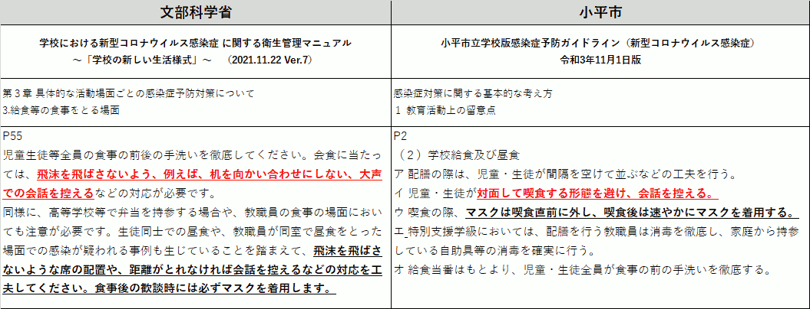

{{first:2022-09-24}}

{{description:小平市議会議員 安竹洋平の令和4年度9月定例会における一般質問の5件目についてまとめています。}}

# 誤りのあるガイドライン修正と、福岡市に倣い黙食を終わりに

<a href="">📄会議録を見る（まだ公開されていません）</a>

<fieldset class="pnt">
<legend><h2> まとめ </h2></legend>

令和4年8月23日の生活文教委員会・事務報告で、市立学校における新型コロナウイルス感染症に係る9月以降の対応について、

> 体育の授業や登下校等では、子どもたちの心身の健康を優先し、マスクを外すよう指導します

> マスク着用の有無により、差別や偏見が生じることがないよう指導します

という報告がありました。その後、保護者に同内容を含んだメールも送信されています。

これらの対応は、本年2月28日に全会一致で採択された請願第12号（安竹が筆頭紹介議員を務めました）など、かねてから求めてきたことであり、続けて対応していただいていることは大変ありがたいです。

しかし、現状を見れば分かりますが、教育委員会や学校の対応は不十分です。

また、福岡市のように、黙食をやめた自治体もあります。

請願第12号の説明でも詳しく述べましたが、そもそも国の方針には「黙食」という概念すらありません。もともと国が求めてきたのは「大声での会話を控える」という、ゆるい制限なのです。これは、文科省の担当課にも直接電話で確認しています。**東京都や小平市が根拠なく勝手に拡大解釈し、子どもたちに黙食を強いている状況です**。

小平市は、請願が全会一致で採択されているという最高のお膳立てがあるにもかかわらず、福岡市や、そのほかの自治体に遅れを取っています。これは小平市教育委員会の大きな恥なのですが、どうもピンときていないようです。

私から伝えるべきことは、具体的に、何度も伝えてきました。十分に改善されるまで、今後も常に指摘し続けます。

---

- マスク外す指導の具体的方法は → [授業前・中や下校前に一斉指導、個別に声掛け](#体育の授業や登下校時に具体的にどのような方法でマスクを外す指導をするか)
- マスク差別偏見防止の具体的方法は → [集会等で一斉指導、個別に声掛け](#マスク着用の有無により差別や偏見が生じることがないよう具体的にどのように指導するか)
- 指導の実施状況をどう確認するか → [学校訪問する機会等に確認](#これらの指導が実際に実施されていることを教育委員会としてどのように確認するか)
- 6月から問題のあるガイドラインを修正しないのは → [次回改訂の際に整合性を図る](#問題が生じているのになぜガイドラインを修正しないのか)
- 「東京都が黙食徹底を指導」しているとする文書は → [8月18日付の通知など](#東京都として黙食の徹底という指導があるとしたがその指導はいつのどの文書で行われているか)

</fieldset>

<button onclick='showPDF("./20220909-ippan-situmon-yasutake-5.pdf")' class="pdf-view-button">
<i class="fa fa-file-pdf-o" aria-hidden="true"></i> 一般質問通告書
</button>

## 主な質疑

目次

- [今回質問する理由](#今回質問する理由)
- [体育の授業や登下校時に、具体的に、どのような方法で、マスクを外す指導をするか](#体育の授業や登下校時に具体的にどのような方法でマスクを外す指導をするか)
- [マスク着用の有無により、差別や偏見が生じることがないよう、具体的に、どのように指導するか](#マスク着用の有無により差別や偏見が生じることがないよう具体的にどのように指導するか)
- [これらの指導が実際に実施されていることを、教育委員会としてどのように確認するか](#これらの指導が実際に実施されていることを教育委員会としてどのように確認するか)
- [問題が生じているのに、なぜガイドラインを修正しないのか](#問題が生じているのになぜガイドラインを修正しないのか)
- [東京都として黙食の徹底という指導があるとしたが、その指導は、いつの、どの文書で行われているか](#東京都として黙食の徹底という指導があるとしたがその指導はいつのどの文書で行われているか)

{{#include ../../../partials/ippan-situgi-note.md}}

### 今回質問する理由

本年8月23日の生活文教委員会・事務報告において、市立学校における新型コロナウイルス感染症に係る9月以降の対応について、

> 体育の授業や登下校等では、子どもたちの心身の健康を優先し、マスクを外すよう指導します

> マスク着用の有無により、差別や偏見が生じることがないよう指導します

との報告があった。

その後、保護者に同内容を含んだメールが送信されている。

これらの対応は、本年2月28日に全会一致で採択された請願第12号（市立小・中学生の健全な成長、発達のための教育活動を求めることについて）など、かねてから求めてきたことであり、対応していただいていることは大変ありがたい。

一方で、[本年6月定例会の一般質問](https://yasutakeyohei.com/books/yasutake/ippan/r4/6-gatu/2-hontouno-kyouikuwo.html)でも指摘した、小平市立学校版感染症予防ガイドライン令和4年6月7日版の誤りについては修正される様子がなく、またそのときにも指摘した、福岡市ではやめている黙食も、小平市では終わる気配がない。

そこで、質問する。

#### 体育の授業や登下校時に、具体的に、どのような方法で、マスクを外す指導をするか

体育の授業や登下校時に、具体的に、どのような方法で、マスクを外す指導をするか。

児童・生徒の発達の段階に応じて、
- 授業開始前
- 授業中
- 下校前

に一斉指導するとともに、児童・生徒の様子や事情に応じて、個別に声掛けをしている。

#### マスク着用の有無により、差別や偏見が生じることがないよう、具体的に、どのように指導するか

マスク着用の有無により、差別や偏見が生じることがないよう、具体的に、どのように指導するか。

- アレルギーや心身の状況等の理由により、マスクを着用できない児童・生徒
- 常時マスクを着用することで不安や不調等を感じる児童・生徒

がいることについて、児童・生徒の発達の段階に応じて、
- 全校朝会
- 学年集会
- 学級活動

等の機会に、一斉指導するとともに、児童・生徒の様子や事情に応じて個別に声掛けをしている。

#### これらの指導が実際に実施されていることを、教育委員会としてどのように確認するか

これらの指導が実際に実施されていることを、教育委員会としてどのように確認するか。

学校を訪問する機会等に確認し、必要に応じて、指導・助言していく。

#### 問題が生じているのに、なぜガイドラインを修正しないのか

[本年6月定例会の一般質問](https://yasutakeyohei.com/books/yasutake/ippan/r4/6-gatu/2-hontouno-kyouikuwo.html)で指摘したように、

<blockquote>

エ 熱中症リスクが高い夏場においては、熱中症対策を優先し、登下校時や休憩時間における外遊び、屋外での教育活動においては、十分な距離が確保できる場合は、マスクの着用は必要ない。

<a href="https://www.city.kodaira.tokyo.jp/kurashi/files/85723/085723/att_0000016.pdf#page=4">小平市立学校版感染症予防ガイドライン（令和4年6月7日版）P3</a>

</blockquote>

は、文科省や厚労省が求めているものとは異なる対応であり、趣旨からしても間違っている。

一方、今回の指導は、文科省や厚労省が求めているものに沿った「外すよう指導する」であるが、同ガイドラインには記載がない。

この2点の問題が生じているのに、なぜ同ガイドラインを修正しないのか。

次回の改訂の際には、ガイドラインに記載している表現と、文部科学省、および厚生労働省が示している表現、並びに市立学校における9月以降の対応に関するお知らせの表現との整合性を図っていく。

つまり、「**間違えた情報を掲載していても問題ないガイドラインである**」という理解でよいのかなと思います。

そのようなガイドラインに従わなくてはならないとしたらアホらしい、と思うのは私だけでしょうか。

#### 東京都として黙食の徹底という指導があるとしたが、その指導は、いつの、どの文書で行われているか

本年8月23日の生活文教委員会事務報告で、給食について、東京都として黙食の徹底という指導があるので、黙食を継続せざるを得ないと考えている旨の発言があったが、具体的に、いつの時点の、どの文書で、そのような指導が行われているか。

東京都からは複数回にわたり、黙食を含めた新型コロナウイルス感染症対策に関する通知が発出されている。

直近では、本年8月18日付で、東京都教育委員会教育長名で、夏季休業明けにおける新型コロナウイルス感染症対策についての通知が発出されている。

当該文書では、児童・生徒への指導のひとつとして、昼食時は対面形式にならないようにし、食事中は会話をしないこととされている。

この該当資料がインターネット上には見当たりませんので、教育委員会に出してもらいます。

以上

