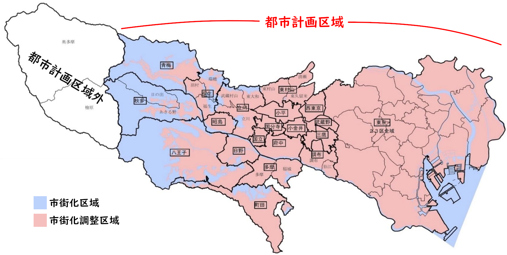

<a href="../../index.md">小平市議 安竹洋平の主張等</a> > <a href="../index.md">その他</a> > まちづくり条例勉強会

{{first:2021-04-19}}

# まちづくり条例勉強会

## 1. 都市計画

### 都市計画とは

> 都市計画とは、都市の健全な発展と秩序ある整備を図るための、
>
> ① 土地利用  
> ② 都市施設の整備  
> ③ 市街地開発事業
> 
> に関する計画のこと。
>
> （[都市計画法第4条第1項](https://elaws.e-gov.go.jp/document?lawid=343AC0000000100)より）

#### ① 土地利用
土地利用とは、土地の状態や用途といった利用状況のこと。都市計画法では次の分類がある。

- 区域区分  
都市計画区域（市街化区域、市街化調整区域）  
非線引き都市計画区域

B. 地域地区  
C. 有休土地転換利用促進地区  
D. 地区計画等

##### A. 区域区分

土地は、都市計画区域、都市計画区域外に分けられる。

<table class="bordered">
<thead>
<tr><th colspan="2">都市計画区域</th><th>市街化 区域</th><th>市街化調整 区域</th></tr>
</thead>
<tbody>
<tr><td colspan="2">東京都市計画区域（東京都区部）</td><td>あり</td><td>あり （河川敷）</td></tr>
<tr><th rowspan="19">多 摩 部 19 都 市 計 画</th><td>八王子都市計画区域（八王子市）</td><td>あり</td><td>あり</td></tr>
<tr><td>立川都市計画区域 （立川市、武蔵村山市、東大和市）</td><td>あり</td><td>あり</td></tr>
<tr><td>武蔵野都市計画区域（武蔵野市）</td><td>あり</td><td>あり</td></tr>
<tr><td>三鷹都市計画区域（三鷹市）</td><td>あり</td><td>あり</td></tr>
<tr><td>府中都市計画区域（府中市）</td><td>あり</td><td>あり</td></tr>
<tr><td>調布都市計画区域 （調布市、狛江市）</td><td>あり</td><td>あり</td></tr>
<tr><td>青梅都市計画区域（青梅市）</td><td>あり</td><td>あり</td></tr>
<tr><td>昭島都市計画区域（昭島市）</td><td>あり</td><td>あり</td></tr>
<tr><td>町田都市計画区域（町田市）</td><td>あり</td><td>あり</td></tr>
<tr><td>小金井都市計画区域（小金井市）</td><td>あり</td><td>あり</td></tr>
<tr><td>日野都市計画区域（日野市）</td><td>あり</td><td>あり</td></tr>
<tr><td>小平都市計画区域（小平市）</td><td>あり</td><td>あり</td></tr>
<tr><td>国分寺都市計画区域（国分寺市）</td><td>あり</td><td>あり</td></tr>
<tr><td>東村山都市計画区域（東村山市、清瀬市、東久留米市）</td><td>あり</td><td>あり</td></tr>
<tr><td>国立都市計画区域（国立市）</td><td>あり</td><td>あり</td></tr>
<tr><td>西東京都市計画区域（西東京市）</td><td>あり</td><td>あり</td></tr>
<tr><td>福生都市計画区域（福生市、瑞穂町、羽村市）</td><td>あり</td><td>あり</td></tr>
<tr><td>多摩都市計画区域（多摩市、稲城市）</td><td>あり</td><td>あり</td></tr>
<tr><td>秋多都市計画区域（あきる野市、日の出町）</td><td>あり</td><td>あり</td></tr>
<tr><td></td><td>あり</td><td>あり</td></tr>
<tr><td></td><td>あり</td><td>あり</td></tr>
<tr><td></td><td>あり</td><td>あり</td></tr>
<tr><td></td><td>あり</td><td>あり</td></tr>
</tbody>
</table>

＊東京都には、非線引き都市計画区域はありません。

（島しょ部6都市計画）

大島都市計画区域（大島町）
八丈都市計画区域（八丈島）
三宅都市計画区域（三宅島）
神津都市計画区域（神津島）
新島都市計画区域（新島）
小笠原都市計画区域（父島、母島）

1. 都市計画区域

都市計画区域は「一体の都市として総合的に整備し、開発し、及び保全する必要がある区域（第5条）」で、都道府県が指定する。ただし複数の都道府県にまたがる場合は国土交通大臣が指定する。

東京都においては次のように分類されている。

### 都道府県が定める都市計画

**都が定める都市計画の決定手続**  
<object data="./images/machizukuri-1.svg" type="image/svg+xml" class="svgimage" alt="都が定める都市計画の決定手続">
    お使いのブラウザではSVG画像が表示されません
</object>

### 市町村が定める都市計画

区市町村が定める都市計画の決定手続

### 都市計画への市民参加

## 多摩26市のまちづくり条例

<table class="sortable">
<thead>
<tr><th>市</th><th>条例</th><th>地区計画制度</th></tr>
</thead>
<tbody>
<tr><th>八王子市</th><td><a href="https://www.city.hachioji.tokyo.jp/shisei/001/006/001/004/p009639.html">八王子市地区まちづくり推進条例</a></td><td></td></tr>
<tr><th>立川市</th><td><a href="https://www.city.tachikawa.lg.jp/fukushisomu/kenko/fukushi/kekaku/tokyoto.html">（東京都福祉のまちづくり条例）</a></td><td></td></tr>
<tr><th>武蔵野市</th><td><a href="http://www.city.musashino.lg.jp/shisei_joho/jigyosha/1011316/1011318.html">武蔵野市まちづくり条例</a></td><td></td></tr>
<tr><th>三鷹市</th><td><a href="https://www.city.mitaka.lg.jp/c_categories/index05005009.html">三鷹市まちづくり条例</a></td><td></td></tr>
<tr><th>青梅市</th><td>（青梅市開発行為等の基準および手続に関する条例）</td><td></td></tr>
<tr><th>府中市</th><td><a href="https://www.city.fuchu.tokyo.jp/gyosei/hosin/jyorei/tiikimatidukuri/index.html">府中市地域まちづくり条例</a></td><td></td></tr>
<tr><th>昭島市</th><td></td><td></td></tr>
<tr><th>調布市</th><td><a href="https://www.city.chofu.tokyo.jp/www/contents/1176118940375/index.html">調布市ほっとするふるさとをはぐくむ街づくり条例</a></td><td></td></tr>
<tr><th>町田市</th><td><a href="https://www.city.machida.tokyo.jp/kurashi/sumai/toshikei/tikunomatidukuri/matidukurijourei/toshikeisei_20040411_02.html">町田市住みよい街づく<td></td>り条例</a></td><td></td></tr>
<tr><th>小金井市</th><td><a href="https://www.city.koganei.lg.jp/shisei/seisakukeikaku/machitoshi/machizukuri/machizukuri.html">小金井市まちづくり条例</a></td><td></td></tr>
<tr><th>小平市</th><td><a href="https://www.city.kodaira.tokyo.jp/kurashi/017/017256.html">小平市市民提案型まちづくり条例</a></td><td></td></tr>
<tr><th>日野市</th><td><a href="https://www.city.hino.lg.jp/shisei/machidukuri/kaihatsu/1005227.html">日野市まちづくり条例</a></td><td></td></tr>
<tr><th>東村山市</th><td><a href="https://www.city.higashimurayama.tokyo.jp/smph/shisei/keikaku/bunya/shisei/jichikihon/index.html">（東村山市みんなで進めるまちづくり基本条例）<<td></td>/a></td><td></td></tr>
<tr><th>国分寺市</th><td><a href="https://www.city.kokubunji.tokyo.jp/kurashi/koutsuu/jourei/1002248.html">国分寺市まちづくり条例</a></td><td></td></tr>
<tr><th>国立市</th><td><a href="https://www.city.kunitachi.tokyo.jp/machi/keikaku/machizukurijyourei/index.html">国立市まちづくり条例</a></td><td></td></tr>
<tr><th>福生市</th><td></td><td></td></tr>
<tr><th>狛江市</th><td><a href="https://www.city.komae.tokyo.jp/index.cfm/46,98424,366,2218,html">狛江市まちづくり条例</a></td><td></td></tr>
<tr><th>東大和市</th><td><a href="https://www.city.higashiyamato.lg.jp/index.cfm/36,0,379,649,html">東大和市街づくり条例</a></td><td></td></tr>
<tr><th>東久留米市</th><td><a href="https://www.city.higashikurume.lg.jp/shisei/sesaku/toshi/takuchi/1002424.html">東久留米市宅地開発等に関する条例</a></td><td></td></tr>
<tr><th>武蔵村山市</th><td><a href="https://www.city.musashimurayama.lg.jp/shisei/toshi/machizukuri/1002800/index.html">まちづくり条例</a></td><td></td></tr>
<tr><th>多摩市</th><td><a href="https://www.city.tama.lg.jp/0000004208.html">多摩市街づくり条例</a></td><td></td></tr>
<tr><th>稲城市</th><td></td><td></td></tr>
<tr><th>羽村市</th><td></td><td></td></tr>
<tr><th>あきる野市</th><td></td><td></td></tr>
<tr><th>西東京市</th><td></td><td></td></tr>
</tbody>
</table>

## 国分寺市まちづくり条例の全体構成

### 章構成
* 令和3年4月19日時点

1. 第1章（総則）
1. 第2章（まちづくり基本計画案）
1. 第3章（まちづくり市民会議）
1. 第4章（協働のまちづくり）
1. 第5章（秩序あるまちづくり）
1. 第6章（協調協議のまちづくり）
1. 第7章（まちづくりの支援等）
1. 第8章（補則）
1. 第9章（罰則）

### 1-1. 都市政策の主な歴史

<table class="nenpyou">
<thead>
<tr><th>年</th><th>条例</th></tr>
</thead>
<tbody>
<tr><td>明治21年</td><td>

**[📜東京市区改正条例](http://www.archives.go.jp/exhibition/digital/henbou/contents/32.html) 制定**  
- 東京の道路整備に重点を置いた条例
- 大正7年に5大市（大阪、名古屋、京都、横浜、神戸）にも準用

</td></tr>
<tr><td>大正8年</td><td>

**[📜（旧）都市計画法](https://www.digital.archives.go.jp/img/140806)、[市街地建築物法](https://www.digital.archives.go.jp/img/1679866) 制定**
- （旧）都市計画法：
  - 都市計画が行政の重要な仕事に位置付けられる
  - 『交通、衛生、保安、経済等に関し永久に公共の安寧を維持し又は福利を増進するための重要施設の計画』
  - 当初は6大市（東京、大阪、名古屋、京都、横浜、神戸）に適用。大正12年、札幌ほか25都市に適用。昭和8年に全国拡大
- 市街地建築物法：
  - 建築基準法の前身
  - 日本が近代国家となって初の、建築に関する全国的法律（[参考](https://www2.ashitech.ac.jp/arch/osakabe/semi/hourei.html)）
  - 昭和9年、建築線と敷地、適用区域の指定に関する改正
  - 昭和13年、住居専用地区・工業専用地区・高さ制限・道路幅に関する改正により、戸建住宅地、大規模工業地帯が形成
  - 昭和25年に廃止。建築基準法に

</td></tr>
<tr><td>昭和21年</td><td>

**📜日本国憲法公布**

</td></tr>
<tr><td>昭和43年</td><td>

**[📜都市計画法](https://elaws.e-gov.go.jp/document?lawid=343AC0000000100)制定**

都市計画の内容及びその決定手続、都市計画制限、都市計画事業その他都市計画に関し必要な事項を定めることにより、都市の健全な発展と秩序ある整備を図り、もつて国土の均衡ある発展と公共の福祉の増進に寄与することを目的とする法律。

人口および産業の都市集中に伴い、都市とその周辺地域において、市街地が無秩序に拡散。公害の発生等、都市環境の悪化と、公共投資の非効率の弊害が生じていることを背景に制定される。

- 旧法は廃止
- 都市計画決定権限の、都道府県知事または市町村への委譲
- **都市計画の住民参加手続きの導入**
  - [都が定める都市計画の決定手続]()、[市区町村が定める都市計画の決定手続]()参照
- 区域区分（市街化区域、市街化調整区域）の創設
- 開発許可制度の創設
- 容積率制限の採用

</td></tr>
<tr><td>昭和44年</td><td>

**[📜都市再開発法](https://elaws.e-gov.go.jp/document?lawid=344AC0000000038)制定**

市街地の計画的な再開発に関し必要な事項を定めることにより、都市における土地の合理的かつ健全な高度利用と都市機能の更新とを図り、もつて公共の福祉に寄与することを目的とする法律。

</td></tr>
<tr><td>昭和47年</td><td>

**[📜都市公園等整備緊急措置法](https://www.shugiin.go.jp/internet/itdb_housei.nsf/html/houritsu/06819720615067.htm)の制定**

都市公園の緊急かつ計画的整備を促進するための、都市公園整備5箇年計画の策定。都市化の急激な進展に伴う緑地とオープンスペースの減少が背景にある。

- レクリエーションの場所の不足、都市構造の公害や災害に対する脆弱化、都市環境の悪化。
- 都市の基幹的な生活環境基盤施設である都市公園の緊急かつ計画的な整備による都市環境の改善の必要性。

</td></tr>
<tr><td>昭和47年</td><td>

**📘日本列島改造論（田中角栄）**

</td></tr>
<tr><td>昭和48年</td><td>

**[📜都市緑地保全法（後の都市緑地法）](https://elaws.e-gov.go.jp/document?lawid=348AC0000000072)の制定**

- 緑地保全地区制度の創設
- 緑化協定制度の創設

</td></tr>
<tr><td>昭和49年</td><td>

**[地域振興整備公団](https://www.shugiin.go.jp/internet/itdb_housei.nsf/html/houritsu/07219740601069.htm)の発足**

</td></tr>
<tr><td>昭和49年</td><td>

**[📜生産緑地法](https://elaws.e-gov.go.jp/document?lawid=349AC0000000068)の制定**

生産緑地地区に関する都市計画に関し必要な事項を定めることにより、農林漁業との調整を図りつつ、良好な都市環境の形成に資することを目的とする法律。

- 農地等で、良好な生活環境の確保に相当の効用を持ち、公共施設等の予定地として適するものを対象とする生産緑地地区制度の創設

</td></tr>
<tr><td>昭和50年</td><td>

**[📜大都市地域における住宅地等の促進に関する特別措置法](https://elaws.e-gov.go.jp/document?lawid=350AC0000000067_20180401_429AC0000000026)の制定**

- 大都市圏域ごとに、国の関係行政機関、都府県および指定都市により宅地開発協議会を組織
- 土地区画整理促進区域制度等の創設
- 特定土地区画整理事業等の創設

</td></tr>
<tr><td>昭和50年</td><td>

**[宅地開発公団](https://www.shugiin.go.jp/internet/itdb_housei.nsf/html/houritsu/07519750625045.htm)の発足**

</td></tr>
<tr><td>昭和54年</td><td>

「長期的視点に立った都市整備の基本方向について」（都市計画中央審議会答申第8号）

</td></tr>
<tr><td>昭和55年</td><td>

**[都市計画法・建築基準法の一部改正](https://www.shugiin.go.jp/internet/itdb_housei.nsf/html/houritsu/09119800501035.htm)**

- 地区計画制度の創設

地区計画とは、地区の課題や特徴を踏まえ、住民と区市町村とが連携しながら、地区の目指すべき将来像を設定し、その実現に向けて都市計画に位置付けて「まちづくり」を進めていく手法です。（[東京都都市整備局サイトより](https://www.toshiseibi.metro.tokyo.lg.jp/kenchiku/chiku/chiku_1.htm)）

「地区計画」は「都市計画」と対比される言葉です。都市計画が、都市全体の計画を定めるのに対し、地区計画は都市の中の一定の範囲である地区レベルに合った詳細な街の計画を定めます。（[イクラ不動産サイトより](https://iqrafudosan.com/channel/district-plans)）

</td></tr>
<tr><td>昭和56年</td><td>

**[住宅・都市整備公団](https://ja.wikipedia.org/wiki/%E4%BD%8F%E5%AE%85%E3%83%BB%E9%83%BD%E5%B8%82%E6%95%B4%E5%82%99%E5%85%AC%E5%9B%A3)の発足**

</td></tr>
<tr><td>平成3年</td><td>

土地税制改革

- 地価税の創設や土地保有課税・譲渡益課税の強化等

</td></tr>
<tr><td>平成4年6月</td><td>

建築基準法とともに改正（平成4年6月）
・住居系用途地域を従前の3地域から7地域に細分化
・市町村の都市計画に関する基本的な方針（市町村マスタープラン）の創設
地価高騰に対応して住環境の適切な保護を基調としたきめ細かなまちづくりを推進するため

</td></tr>
<tr><td>平成9年</td><td>

密集市街地における防災街区の整備の促進に関する法律の制定 

</td></tr>
<tr><td>平成9年</td><td>

環境影響評価法の制定

</td></tr>
<tr><td>平成10年</td><td>

平成１０年改正
地方分権推進の中で、
・特別用途地区制度、地区計画制度等を含む改正

</td></tr>
<tr><td>平成11年</td><td>

都市計画の決定手続きの改正

</td></tr>
<tr><td>平成12年</td><td>

・都市計画マスタープランの充実
・線引き制度及び開発制度の見直し
・良好な環境の確定のための制度の充実
・都市計画区域外における開発行為及び建築行為に対する規制の導入
・既成市街地の再整備のための制度の導入
・都市計画決定システムの合理化

</td></tr>
<tr><td>平成13年</td><td>

市街化調整区域での既存宅地制度（第43条第1項6号）が廃止となり、新たに一定の要件を都道府県等が条例で定め、建築を許容する制度が新設された（第34条第1項8号の3及び8号の4）

</td></tr>
<tr><td>平成14年</td><td>

都市再生特別措置法の制定
・都市再生緊急整備地域を政令で定め、都市再生本部が整備方針を決定
・ 用途地域等に基づく規制を適用除外とする都市再生特別地区を創設
・ 民間事業者等による都市計画の提案制度等を創設

</td></tr>
<tr><td>平成15年</td><td>

「国際化、情報化、高齢化、人口減少等 21 世紀の
新しい潮流に対応した都市再生のあり方につい
て」（社会資本整備審議会答申） 

</td></tr>
<tr><td>平成15年</td><td>

平成１５年都市計画法改正
・都市計画提案制度の創設
土地所有者やまちづくりＮＰＯ法人等が、一定規模以上の一団の土地について、土地所有者の３分の２以
上の同意等、一定の要件を満たした場合に、都道府県や市町村に都市計画の決定や変更を提案でき
るもので、住民のまちづくりへの参画促進が期待されます。

</td></tr>
<tr><td>平成16年</td><td>

平成１６年都市再生特別措置法の一部改正
・ 地方の自主性、裁量性を大幅に拡大した都市再生のための交付金（まちづくり交付金）制度を創設
・ 都道府県の有する都市計画決定権限等の市町村への移譲
・ NPO 法人等が実施する事業等を都市再生整備計画に位置付け、支援

</td></tr>
<tr><td>平成16年</td><td>

・ 景観計画の策定
・ 景観計画区域等における行為規制
・ 景観重要公共施設の整備
・ 景観協定の締結

</td></tr>
<tr><td>平成18年</td><td>

都市計画法・建築基準法の一部改正　平成１８年成立
大規模集客施設の郊外への出店を大幅に規制することが目指された。
建築基準法が改正され、床面積1万平方メートル超の大規模集客施設の進出は、原則として「近隣商業」、「商業」、「準工業」にしか許容されないこととなった（2007年11月末に完全施行）。
・ 工業地域、白地地域等において大規模集客施設の立地を原則として禁止
・ 市街化調整区域内において大規模開発を許可できる基準の廃止、病院、学校等の公共公益施設を開発許可等の対象化 

</td></tr>
<tr><td>平成18年</td><td>

「新しい時代の都市計画はいかにあるべきか」（社会資本整備審議会第一次答申） 

</td></tr>
<tr><td>平成20年</td><td>

地域における歴史的風致の維持及び向上に関する法律案の国会提出

</td></tr>
<tr><td>平成20年</td><td>

京都議定書目標達成計画の改定
・ 集約型・低炭素型都市構造の実現（追加）
・ 下水道における省エネルギー対策、汚泥資源等の新エネルギーとしての有効利用（追加）
・ 下水汚泥焼却施設における燃焼高度化
・ 都市緑化等ヒートアイランド対策
・ エネルギーの面的利用の推進 

</td></tr>
<tr><td>平成29年</td><td>

平成29年4月都市計画法改正
・１３番目の用途地域として、田園住居地域が設けられる（平成30年4月施行）
田園住居地域は、都市の構成要素としての農
地を都市計画に本格的に位置付ける制度であって、生産緑地以外の市街化区域内農地について建築
等を規制し、農業利用と調和した低層住宅の良好な居住環境を保護することを目的としている

</td></tr>
<tr><td>平成年</td><td>

</td></tr>
<tr><td>平成年</td><td>

</td></tr>

</tbody>
</table>

