<a href="../../index.md">小平市議 安竹洋平の主張等</a> > <a href="../index.md">その他</a> > まちづくり条例勉強会

{{first:2021-04-19}}

# まちづくり条例勉強会

## 1. 都市計画

### 都市計画とは

> 都市計画とは、都市の健全な発展と秩序ある整備を図るための、
>
> ① 土地利用  
> ② 都市施設の整備  
> ③ 市街地開発事業
> 
> に関する計画のこと。
>
> （[都市計画法第4条第1項](https://elaws.e-gov.go.jp/document?lawid=343AC0000000100)より）

#### ① 土地利用
土地利用とは、土地の状態や用途といった利用状況のことです。

法的には、次のような分類で順に詳細な取り決めがなされています。

1. 都市計画区域
1. 市街化区域と市街化調整区域
1. 地域地区
1. （有休土地転換利用促進地区）
1. （被災市街地復興推進地域）
1. 地区計画等

##### 都市計画区域

都市計画区域は「一体の都市として総合的に整備し、開発し、及び保全する必要がある区域（第5条）」で、都道府県が指定するものです。ただし複数の都道府県にまたがる場合は国土交通大臣が指定します。

東京都の都市計画区域は、次の図や下表のとおりです。

##### 市街化区域と市街化調整区域

市街化区域は「すでに市街地を形成している区域及びおおむね10年以内に優先的かつ計画的に市街化を図るべき区域（第7条第2項）」で、市街化調整区域は「市街化調整区域は、市街化を抑制すべき区域（第7条第3項）」です。市街化調整区域では原則として住宅を建てることはできず、農林漁業用の建物の建築や、一定規模以上の計画的開発以外は許可されません。

市街化区域と市街化調整区域の区分を設定することを「区域区分」と言い、都道府県の判断で必要に応じて定めることができます。ただし、政令指定都市の場合は、必ず区域区分を定めなければなりません。

次の表に示すように、小平都市計画区域は全域が市街化区域であり、市街化調整区域はありません。

<table class="bordered slim">
<thead>
<tr><th colspan="2">都市計画区域</th><th>市街化 区域</th><th>市街化調整 区域</th></tr>
</thead>
<tbody>
<tr><td colspan="2">東京都市計画区域（東京都区部）</td><td>あり</td><td>あり（河川敷）</td></tr>
<tr><th rowspan="19">多 摩 部 19 都 市 計 画</th><td>八王子都市計画区域（八王子市）</td><td>あり</td><td>あり</td></tr>
<tr><td>立川都市計画区域 （立川市、武蔵村山市、東大和市）</td><td>あり</td><td>あり</td></tr>
<tr><td>武蔵野都市計画区域（武蔵野市）</td><td>あり</td><td>なし</td></tr>
<tr><td>三鷹都市計画区域（三鷹市）</td><td>あり</td><td>なし</td></tr>
<tr><td>府中都市計画区域（府中市）</td><td>あり</td><td>あり（河川敷）</td></tr>
<tr><td>調布都市計画区域 （調布市、狛江市）</td><td>あり</td><td>あり（河川敷）</td></tr>
<tr><td>青梅都市計画区域（青梅市）</td><td>あり</td><td>あり</td></tr>
<tr><td>昭島都市計画区域（昭島市）</td><td>あり</td><td>あり</td></tr>
<tr><td>町田都市計画区域（町田市）</td><td>あり</td><td>あり</td></tr>
<tr><td>小金井都市計画区域（小金井市）</td><td>あり</td><td>なし</td></tr>
<tr><td>日野都市計画区域（日野市）</td><td>あり</td><td>あり</td></tr>
<tr><td>小平都市計画区域（小平市）</td><td>あり</td><td>なし</td></tr>
<tr><td>国分寺都市計画区域（国分寺市）</td><td>あり</td><td>なし</td></tr>
<tr><td>東村山都市計画区域 （東村山市、清瀬市、東久留米市）</td><td>あり</td><td>あり</td></tr>
<tr><td>国立都市計画区域（国立市）</td><td>あり</td><td>あり</td></tr>
<tr><td>西東京都市計画区域（西東京市）</td><td>あり</td><td>なし</td></tr>
<tr><td>福生都市計画区域 （福生市、瑞穂町、羽村市）</td><td>あり</td><td>あり</td></tr>
<tr><td>多摩都市計画区域 （多摩市、稲城市）</td><td>あり</td><td>あり</td></tr>
<tr><td>秋多都市計画区域 （あきる野市、日の出町）</td><td>あり</td><td>あり</td></tr>
<tr><th rowspan="6">島 し ょ 部 6 都 市 計 画</th><td>大島都市計画区域（大島町）</td><td>あり</td><td>あり</td></tr>
<tr><td>八丈都市計画区域（八丈島）</td><td></td><td></td></tr>
<tr><td>三宅都市計画区域（三宅島）</td><td></td><td></td></tr>
<tr><td>神津都市計画区域（神津島）</td><td></td><td></td></tr>
<tr><td>新島都市計画区域（新島）</td><td></td><td></td></tr>
<tr><td>小笠原都市計画区域 （父島、母島）</td><td></td><td></td></tr>
</tbody>
</table>

##### 地域地区

都市計画区域には地域地区を定めることができる（第8条第1項）とされており、下表に示した20の地域地区が決められています。

この地域地区は（東京都の場合）、東京23区に関しては東京都、それ以外は各市町村が決定します。

<table class="bordered slim">
<thead>
<tr><th>種類</th><th colspan="2">制限内容</th></tr>
</thead>
<tbody>
<tr><th>用途地域</th><td>13種類に分け、土地の利用の方法（用途）を制限する</td></tr>
<tr><th>特別用途地区</th><td>全国一律の用途地域に分類するだけでなく、地方公共団体の条例により用途地域による建築物の制限を強化（もしくは緩和）することができるようにした地区</td></tr>
<tr><th>特例容積率適用地区</th><td>容積率の限度からみて未利用となっている容積の活用を促進して、土地の高度利用を図るために定める地区</td></tr>
<tr><th>特定用途制限地域</th><td>準都市計画区域もしくは非線引区域において、良好な住環境をつくるため、または良好な住環境を保っていくため、住環境にそぐわない建物を制限する</td></tr>
<tr><th>高層住居誘導地区</th><td>都心に高層住宅の建築を誘導することで、居住人口の都心回帰を促すことを目的とする地区</td></tr>
<tr><th>高度地区・高度利用地区</th><td>高度地区とは建築物の高さを定めた地区のことで、高度利用地区とは住宅密集市街地などにおいて、細分化された敷地を統合し一体的な再開発を行なうことで、高層ビル群を建てれるようにした地区</td></tr>
<tr><th>特定街区</th><td>都市基盤の整った街区などにおいて、細分化された敷地を統合し一体的な再開発を行なうことで、高層ビル群を建てれるようにした地区</td></tr>
<tr><th>都市再生特別地区</th><td>用途制限や建ぺい率・容積率・高さの最高限度・斜線制限・日影規制などのあらゆる規制を除外でき、新たに定めることができる地区</td></tr>
<tr><th>防火地域・準防火地域</th><td>火災の被害が起きやすい地域、そして火災を防ぐために予防しなければならない地域に定められる</td></tr>
<tr><th>特定防災街区整備地区</th><td>市街地において老朽化した木造住宅等が密集し、地震やそれに伴う火災等の災害に対して、延焼防止や特定防災機能（近隣住民が避難するための整備された道路や避難公園等）が確保がされていない地区に、防災機能を確保するために定められる地区</td></tr>
<tr><th>景観地区・準景観地区</th><td>市街地の良好な景観を保存・継承していきたい地区に定められる</td></tr>
<tr><th>風致地区</th><td>都市に残された水や緑など、良好な自然的景観を守り、都市における風致を維持するために定められる地区</td></tr>
<tr><th>駐車場整備地区</th><td>駐車場を設けることが必要とされた地区</td></tr>
<tr><th>臨港地区</th><td>港湾の管理運営を円滑に行うために、取扱う貨物に応じて目的別に商港区等の分区を指定し、各分区における構造物を制限する地区</td></tr>
<tr><th>歴史的風土特別保存地区</th><td>古都の歴史的風土を保存するために指定される区域</td></tr>
<tr><th>第1種歴史的風土保存地区・第2種歴史的風土保存地区</th><td>飛鳥時代の遺跡等の歴史的遺産を保存するために、奈良県明日香村内に指定されている地区。明日香村全域を2つに区分して定めており、特に重要な部分といえる高松塚古墳、石舞台古墳などの周辺地区が第1種歴史的風土保存地区、その他の地区が第2種歴史的風土保存地区となっている</td></tr>
<tr><th>特別緑地保存地区</th><td>寺社の鎮守の森や歴史的な建築物の屋敷林などの市街地に残る貴重な林など、都市にある良好な自然的環境となる緑地において、建築行為など一定の行為の制限を設け保全する地区</td></tr>
<tr><th>流通業務地区</th><td>流通業務施設（トラックターミナル・鉄道の貨物駅・卸売市場・倉庫など）以外の施設の建設を制限する地区</td></tr>
<tr><th>生産緑地地区</th><td>市街化区域内の農地を残すために、売買や建築を制限する地区</td></tr>
<tr><th>伝統的建造物群保存地区</th><td>城下町、宿場町、門前町など全国各地に残る歴史的な集落・町並みの保存を図るための地区</td></tr>
<tr><th>航空機騒音障害防止地区・航空機騒音障害防止特別地区</th><td>成田空港周辺の航空機の著しい騒音が及ぶ地域に指定され、住宅等の新築、増改築を行う場合は、防音工事が義務づけられている</td></tr>
</tbody>
</table>

このうち、用途地域は「市街化区域については、少なくとも用途地域を定めるものとし、市街化調整区域については、原則として用途地域を定めないものとする（第13条第7項）」とされている、特に重要なものです。

下表に示すとおり13の用途地域が都市計画法で定められています。各用途地域での制限は、建築基準法で定められています。

<table class="bordered slim">
<thead>
<tr><th>大分類</th><th>用途地域名</th><th colspan="2">制限内容</th></tr>
</thead>
<tbody>
<tr><th rowspan="8">住居系</th><th>第一種低層 住居専用地域</th><td>低層住宅のための地域で、小規模なお店や事務所をかねた住宅や、小中学校などが建てられる。</td><td rowspan="13">↑ 宅 地 環 境 優 先       店 舗 工 場 優 先 ↓</td></tr>
<tr><th>第二種低層 住居専用地域</th><td>主に低層住宅のための地域で、小中学校などのほか、150㎡までの一定のお店などが建てられる。</td></tr>
<tr><th>第一種中高層 住居専用地域</th><td>中高層住宅のための地域で、病院・大学・500㎡までの一定のお店などが建てられる。</td></tr>
<tr><th>第二種中高層 住居専用地域</th><td>主に中高層住宅のための地域で、病院・大学などのほか、1500㎡までの一定のお店や事務所など必要な利便施設が建てられる。</td></tr>
<tr><th>第一種 住居地域</th><td>住居の環境を守るための地域で、3000㎡までの店舗・事務所・ホテルなどは建てられる。</td></tr>
<tr><th>第二種 住居地域</th><td>主に住居の環境を守るための地域で、店舗・事務所・ホテル・カラオケボックスなどは建てられる。</td></tr>
<tr><th>田園 住居地域</th><td>都市部における貴重な田園風景とそれがもたらす周辺の良好な低層住宅の環境を守る地域で、その地域で生産された農産物を使用する場合は500㎡までのお店が建てられる。</td></tr>
<tr><th>準 住居地域</th><td>道路の沿道において、自動車関連施設などの立地と、これと調和した住居の環境を保護するための地域。</td></tr>
<tr><th rowspan="2">商業系</th><th>近隣 商業地域</th><td>まわりの住民が日用品の買物などをするための地域で、住宅や店舗のほかに小規模の工場も建てられる。</td></tr>
<tr><th>商業地域</th><td>銀行・映画館・飲食店・百貨店などが集まる地域で、住宅や小規模の工場も建てられる。</td></tr>
<tr><th rowspan="3">工業系</th><th>準 工業地域</th><td>主に軽工業の工場やサービス施設等が立地する地域で、危険性・環境悪化が大きい工場のほかはほとんど建てられる。</td></tr>
<tr><th>工業地域</th><td>どんな工場でも建てられる地域で、住宅やお店は建てられるが、学校・病院・ホテルなどは建てられない。</td></tr>
<tr><th>工業専用地域</th><td>工場のための地域で、どんな工場でも建てられるが、住宅・お店・学校・病院・ホテルなどは建てられない。</td></tr>
</tbody>
</table>

##### 地区計画等

さらに、都市計画区域には、地区計画等を定めることができる（第12条の4）とされています。地区計画等とは、下表に示した5つの地区計画のことです。

<table class="bordered slim">
<thead>
<tr><th>種類</th><th>制限内容</th></tr>
</thead>
<tbody>
<tr><th>地区計画</th><td>住民が主体となってつくる、建物や道路、公園等に関する独自のルール</td></tr>
<tr><th>防災街区整備 地区計画</th><td>密集市街地における火災の延焼拡大を抑制し、まちの不燃化を図るため、建物の構造に一定の基準を設けて、燃えにくい建物にするなど防火性能を高めることを目的とした地区計画</td></tr>
<tr><th>沿道 地区計画</th><td>幹線道路のうち交通騒音が著しく沿道に相当数の住居が密集している道路（沿道整備道路）の沿道の地区について、緑地帯などの緩衝帯の整備、沿道の建築物の建築の規制などにより、騒音被害の防止を図ろうとする地区計画</td></tr>
<tr><th>集落 地区計画</th><td>市街化調整区域・非線引区域の農業振興地域内の農村集落において、農家の兼業化や農家と非農家の混在化に伴う虫食い的な農地転用等による営農条件の悪化や建築物のバラ建ちの防止を図ろうとする地区計画</td></tr>
<tr><th>歴史的風致維持向上 地区計画</th><td>歴史的風致にふさわしい建築物等の整備・利活用と市街地の保全を総合的に行なうことを目的とする地区計画</td></tr>
</tbody>
</table>

地区計画等の制限内容は、住民が主体となって、各自治体の条例によって定められます。

#### ② 都市施設
都市施設とは、「都市計画区域については、都市計画に、次に掲げる施設を定めることができる。（法第11条第1項）」とされているもので、次の14項目が定められています。

<table class="bordered slim">
<thead>
<tr><th>項</th><th>内容</th></tr>
</thead>
<tbody>
<tr><th>一</th><td>道路、都市高速鉄道、駐車場、自動車ターミナルその他の交通施設</td></tr>
<tr><th>二</th><td>公園、緑地、広場、墓園その他の公共空地</td></tr>
<tr><th>三</th><td>水道、電気供給施設、ガス供給施設、下水道、汚物処理場、ごみ焼却場その他の供給施設又は処理施設</td></tr>
<tr><th>四</th><td>河川、運河その他の水路</td></tr>
<tr><th>五</th><td>学校、図書館、研究施設その他の教育文化施設</td></tr>
<tr><th>六</th><td>病院、保育所その他の医療施設又は社会福祉施設</td></tr>
<tr><th>七</th><td>市場、と畜場又は火葬場</td></tr>
<tr><th>八</th><td>一団地の住宅施設（一団地における五十戸以上の集団住宅及びこれらに附帯する通路その他の施設をいう。）</td></tr>
<tr><th>九</th><td>一団地の官公庁施設（一団地の国家機関又は地方公共団体の建築物及びこれらに附帯する通路その他の施設をいう。）</td></tr>
<tr><th>十</th><td>流通業務団地</td></tr>
<tr><th>十一</th><td>一団地の津波防災拠点市街地形成施設（津波防災地域づくりに関する法律（平成二十三年法律第百二十三号）第二条第十五項に規定する一団地の津波防災拠点市街地形成施設をいう。）</td></tr>
<tr><th>十二</th><td>一団地の復興再生拠点市街地形成施設（福島復興再生特別措置法（平成二十四年法律第二十五号）第三十二条第一項に規定する一団地の復興再生拠点市街地形成施設をいう。）</td></tr>
<tr><th>十三</th><td>一団地の復興拠点市街地形成施設（大規模災害からの復興に関する法律（平成二十五年法律第五十五号）第二条第八号に規定する一団地の復興拠点市街地形成施設をいう。）</td></tr>
<tr><th>十四</th><td>その他政令で定める施設</td></tr>
</tbody>
</table>

#### ③ 市街地開発事業

## 都市計画の決定

### 都道府県が定める都市計画

次に掲げる都市計画は都道府県が、その他の都市計画は市町村が定める（法第15条第1項）。

<table class="bordered slim">
<thead>
<tr><th>項</th><th>内容</th></tr>
</thead>
<tbody>
<tr><th>一</th><td>都市計画区域の整備、開発及び保全の方針に関する都市計画</td></tr>
<tr><th>二</th><td>区域区分に関する都市計画</td></tr>
<tr><th>三</th><td>都市再開発方針等に関する都市計画</td></tr>
<tr><th>四</th><td>地域地区に関する都市計画</td></tr>
<tr><th>五</th><td>一の市町村の区域を超える広域の見地から決定すべき地域地区として政令で定めるもの又は一の市町村の区域を超える広域の見地から決定すべき都市施設若しくは根幹的都市施設として政令で定めるものに関する都市計画</td></tr>
<tr><th>六</th><td>市街地開発事業に関する都市計画</td></tr>
<tr><th>七</th><td>市街地開発事業等予定区域に関する都市計画</td></tr>
</tbody>
</table>

**都が定める都市計画の決定手続**  
<object data="./images/machizukuri-1.svg" type="image/svg+xml" class="svgimage" alt="都が定める都市計画の決定手続">
    お使いのブラウザではSVG画像が表示されません
</object>

### 市区町村が定める都市計画

- 用途地区（12種類）
- 特別用途地区
- 都道府県が定める場合以外の風致地区
- 地区計画等

**市区町村が定める都市計画の決定手続**  
<object data="./images/machizukuri-5.svg" type="image/svg+xml" class="svgimage" alt="市区町村が定める都市計画の決定手続">
    お使いのブラウザではSVG画像が表示されません
</object>

### 都市計画への市民参加

#### 都市計画区域マスタープラン
正式には「都市計画区域の整備、開発及び保全の方針（第6条の2第1項）」と言います。

人口、人や物の動き、土地の利用の仕方、公共施設の整備などについて将来の見通しや目標を明らかにし、将来のまちをどのようにしていきたいかを具体的に定めるものです。
具体的には、次のような内容を定めます。

- 都市計画の目標
- 区域区分（市街化区域と市街化調整区域との区分）の決定の有無及び当該区分を決めるときはその方針
- 土地利用、都市施設の整備及び市街地開発事業に関する主要な都市計画の決定の方針

#### 市町村マスタープラン
正式には「市町村の都市計画に関する基本的な方針（第18条第2項）」と言います。

市町村マスタープランは、住民に最も近い立場にある市町村が、その創意工夫のもとに住民の意見を反映し、まちづくりの具体性ある将来ビジョンを確立し、地区別のあるべき「まち」の姿を定めるものです。

また、市町村マスタープランは、当該市町村を含む都市計画区域マスタープラン、議会の議決を経て定められた当該市町村の建設に関する基本構想に即したものとなっています。

> **（市町村の都市計画に関する基本的な方針）**
>
> **第十八条の二**　市町村は、議会の議決を経て定められた当該市町村の建設に関する基本構想並びに都市計画区域の整備、開発及び保全の方針に即し、当該市町村の都市計画に関する基本的な方針（以下この条において「基本方針」という。）を定めるものとする。
>
> **２**　市町村は、基本方針を定めようとするときは、あらかじめ、公聴会の開催等住民の意見を反映させるために必要な措置を講ずるものとする。
>
> **３**　市町村は、基本方針を定めたときは、遅滞なく、これを公表するとともに、都道府県知事に通知しなければならない。
>
> **４**　市町村が定める都市計画は、基本方針に即したものでなければならない。

##### 小平市都市計画マスタープラン（平成29年3月）
「小平市都市計画マスタープラン　平成29年（2017年）3月」は、平成26年度から約3か年をかけて、見直し検討委員会、まちづくりカフェ、まちづくりサロン、市民アンケート調査、市内中学校のご協力など、さまざまな取組みを進めながら策定しました。

目標年次：平成29年度から平成38年度までの10か年

- 全体構想
- 地域別構想（西・中央・東）

『前マスタープランでは、マスタープランの実現化に向けた基本的な考え方として、「連携と協働のまちづくり」を掲げ、市民、事業者、市の連携と協働により、住宅都市こだいらにふさわしい都市空間や環境の形成をめざしたまちづくりの推進を図るとし、これにより平成22年10月に「小平市民等提案型まちづくり条例」を策定しました。この条例は、身近な地区の個性や魅力のある住みよいまちづくりを進めるため、市民が主体となって土地利用に関する計画の策定などに向けた活動の仕組みを定めています。』

##### 小平市民等提案型まちづくり条例
<!--
- 条例の目的  
  都市計画マスタープランに掲げる将来の都市像を実現するため
- 地区まちづくり  
  地区まちづくり準備会、地区まちづくり協議会、推進地区、推進地区まちづくり協議会、地区まちづくり計画の案の策定と縦覧、地区まちづくり計画の認定、地区まちづくりルール、指導及び勧告等
- 地区まちづくりに対する支援  
  情報の提供、地区まちづくり準備会及び地区まちづくり協議会等への支援
- 小平市地区まちづくり審議会
- 法定制度の活用  
  地区計画等、地区計画等の原案の申出等、都市計画の決定等の提案団体、建築協定

> **(地区まちづくり準備会)**
>
> **第6条**　地区住民等は、次条第4項に規定する地区まちづくり協議会の設立を準備するための団体を組織し、市長に対し、規則で定めるところにより登録を申請することができる。
>
> **3**　市長は、必要があると認めるときは、前項の登録を受けた団体に対し、活動内容の報告を求めることができる。

> **(地区まちづくり協議会)**
>
> **第7条**　地区住民等は、地区まちづくりの推進を目的とする団体を組織し、市長に対し、規則で定めるところにより認定を申請することができる。
>
> **3**　市長は、前項の認定をするときは、あらかじめ地区まちづくり審議会の意見を聴かなければならない。
>
> **4**　市長は、必要があると認めるときは、第2項の認定を受けた団体に対し、活動内容の報告を求めることができる。
-->

## 多摩26市のまちづくり条例

<table class="bordered slim">
<thead>
<tr><th>市</th><th>条例</th><th>地区計画制度</th></tr>
</thead>
<tbody>
<tr><th>八王子市</th><td><a href="https://www.city.hachioji.tokyo.jp/shisei/001/006/001/004/p009639.html">八王子市地区まちづくり推進条例</a></td><td></td></tr>
<tr><th>立川市</th><td><a href="https://www.city.tachikawa.lg.jp/fukushisomu/kenko/fukushi/kekaku/tokyoto.html">（東京都福祉のまちづくり条例）</a></td><td></td></tr>
<tr><th>武蔵野市</th><td><a href="http://www.city.musashino.lg.jp/shisei_joho/jigyosha/1011316/1011318.html">武蔵野市まちづくり条例</a></td><td></td></tr>
<tr><th>三鷹市</th><td><a href="https://www.city.mitaka.lg.jp/c_categories/index05005009.html">三鷹市まちづくり条例</a></td><td></td></tr>
<tr><th>青梅市</th><td>（青梅市開発行為等の基準および手続に関する条例）</td><td></td></tr>
<tr><th>府中市</th><td><a href="https://www.city.fuchu.tokyo.jp/gyosei/hosin/jyorei/tiikimatidukuri/index.html">府中市地域まちづくり条例</a></td><td></td></tr>
<tr><th>昭島市</th><td></td><td></td></tr>
<tr><th>調布市</th><td><a href="https://www.city.chofu.tokyo.jp/www/contents/1176118940375/index.html">調布市ほっとするふるさとをはぐくむ街づくり条例</a></td><td></td></tr>
<tr><th>町田市</th><td><a href="https://www.city.machida.tokyo.jp/kurashi/sumai/toshikei/tikunomatidukuri/matidukurijourei/toshikeisei_20040411_02.html">町田市住みよい街づくり条例</a></td><td></td></tr>
<tr><th>小金井市</th><td><a href="https://www.city.koganei.lg.jp/shisei/seisakukeikaku/machitoshi/machizukuri/machizukuri.html">小金井市まちづくり条例</a></td><td></td></tr>
<tr><th>小平市</th><td><a href="https://www.city.kodaira.tokyo.jp/kurashi/017/017256.html">小平市市民提案型まちづくり条例</a></td><td></td></tr>
<tr><th>日野市</th><td><a href="https://www.city.hino.lg.jp/shisei/machidukuri/kaihatsu/1005227.html">日野市まちづくり条例</a></td><td></td></tr>
<tr><th>東村山市</th><td><a href="https://www.city.higashimurayama.tokyo.jp/smph/shisei/keikaku/bunya/shisei/jichikihon/index.html">（東村山市みんなで進めるまちづくり基本条例）</a></td><td></td></tr>
<tr><th>国分寺市</th><td><a href="https://www.city.kokubunji.tokyo.jp/kurashi/koutsuu/jourei/1002248.html">国分寺市まちづくり条例</a></td><td></td></tr>
<tr><th>国立市</th><td><a href="https://www.city.kunitachi.tokyo.jp/machi/keikaku/machizukurijyourei/index.html">国立市まちづくり条例</a></td><td></td></tr>
<tr><th>福生市</th><td></td><td></td></tr>
<tr><th>狛江市</th><td><a href="https://www.city.komae.tokyo.jp/index.cfm/46,98424,366,2218,html">狛江市まちづくり条例</a></td><td></td></tr>
<tr><th>東大和市</th><td><a href="https://www.city.higashiyamato.lg.jp/index.cfm/36,0,379,649,html">東大和市街づくり条例</a></td><td></td></tr>
<tr><th>東久留米市</th><td><a href="https://www.city.higashikurume.lg.jp/shisei/sesaku/toshi/takuchi/1002424.html">東久留米市宅地開発等に関する条例</a></td><td></td></tr>
<tr><th>武蔵村山市</th><td><a href="https://www.city.musashimurayama.lg.jp/shisei/toshi/machizukuri/1002800/index.html">まちづくり条例</a></td><td></td></tr>
<tr><th>多摩市</th><td><a href="https://www.city.tama.lg.jp/0000004208.html">多摩市街づくり条例</a></td><td></td></tr>
<tr><th>稲城市</th><td></td><td></td></tr>
<tr><th>羽村市</th><td></td><td></td></tr>
<tr><th>あきる野市</th><td></td><td></td></tr>
<tr><th>西東京市</th><td></td><td></td></tr>
</tbody>
</table>

<!--

## 国分寺市まちづくり条例の全体構成

### 章構成
* 令和3年4月19日時点

1. 第1章（総則）
1. 第2章（まちづくり基本計画案）
1. 第3章（まちづくり市民会議）
1. 第4章（協働のまちづくり）
1. 第5章（秩序あるまちづくり）
1. 第6章（協調協議のまちづくり）
1. 第7章（まちづくりの支援等）
1. 第8章（補則）
1. 第9章（罰則）

### 1-1. 都市政策の主な歴史

<table class="nenpyou">
<thead>
<tr><th>年</th><th>条例</th></tr>
</thead>
<tbody>
<tr><td>明治21年</td><td>

**[📜東京市区改正条例](http://www.archives.go.jp/exhibition/digital/henbou/contents/32.html) 制定**  
- 東京の道路整備に重点を置いた条例
- 大正7年に5大市（大阪、名古屋、京都、横浜、神戸）にも準用

</td></tr>
<tr><td>大正8年</td><td>

**[📜（旧）都市計画法](https://www.digital.archives.go.jp/img/140806)、[市街地建築物法](https://www.digital.archives.go.jp/img/1679866) 制定**
- （旧）都市計画法：
  - 都市計画が行政の重要な仕事に位置付けられる
  - 『交通、衛生、保安、経済等に関し永久に公共の安寧を維持し又は福利を増進するための重要施設の計画』
  - 当初は6大市（東京、大阪、名古屋、京都、横浜、神戸）に適用。大正12年、札幌ほか25都市に適用。昭和8年に全国拡大
- 市街地建築物法：
  - 建築基準法の前身
  - 日本が近代国家となって初の、建築に関する全国的法律（[参考](https://www2.ashitech.ac.jp/arch/osakabe/semi/hourei.html)）
  - 昭和9年、建築線と敷地、適用区域の指定に関する改正
  - 昭和13年、住居専用地区・工業専用地区・高さ制限・道路幅に関する改正により、戸建住宅地、大規模工業地帯が形成
  - 昭和25年に廃止。建築基準法に

</td></tr>
<tr><td>昭和21年</td><td>

**📜日本国憲法公布**

</td></tr>
<tr><td>昭和43年</td><td>

**[📜都市計画法](https://elaws.e-gov.go.jp/document?lawid=343AC0000000100)制定**

都市計画の内容及びその決定手続、都市計画制限、都市計画事業その他都市計画に関し必要な事項を定めることにより、都市の健全な発展と秩序ある整備を図り、もつて国土の均衡ある発展と公共の福祉の増進に寄与することを目的とする法律。

人口および産業の都市集中に伴い、都市とその周辺地域において、市街地が無秩序に拡散。公害の発生等、都市環境の悪化と、公共投資の非効率の弊害が生じていることを背景に制定される。

- 旧法は廃止
- 都市計画決定権限の、都道府県知事または市町村への委譲
- **都市計画の住民参加手続きの導入**
  - [都が定める都市計画の決定手続]()、[市区町村が定める都市計画の決定手続]()参照
- 区域区分（市街化区域、市街化調整区域）の創設
- 開発許可制度の創設
- 容積率制限の採用

</td></tr>
<tr><td>昭和44年</td><td>

**[📜都市再開発法](https://elaws.e-gov.go.jp/document?lawid=344AC0000000038)制定**

市街地の計画的な再開発に関し必要な事項を定めることにより、都市における土地の合理的かつ健全な高度利用と都市機能の更新とを図り、もつて公共の福祉に寄与することを目的とする法律。

</td></tr>
<tr><td>昭和47年</td><td>

**[📜都市公園等整備緊急措置法](https://www.shugiin.go.jp/internet/itdb_housei.nsf/html/houritsu/06819720615067.htm)の制定**

都市公園の緊急かつ計画的整備を促進するための、都市公園整備5箇年計画の策定。都市化の急激な進展に伴う緑地とオープンスペースの減少が背景にある。

- レクリエーションの場所の不足、都市構造の公害や災害に対する脆弱化、都市環境の悪化。
- 都市の基幹的な生活環境基盤施設である都市公園の緊急かつ計画的な整備による都市環境の改善の必要性。

</td></tr>
<tr><td>昭和47年</td><td>

**📘日本列島改造論（田中角栄）**

</td></tr>
<tr><td>昭和48年</td><td>

**[📜都市緑地保全法（後の都市緑地法）](https://elaws.e-gov.go.jp/document?lawid=348AC0000000072)の制定**

- 緑地保全地区制度の創設
- 緑化協定制度の創設

</td></tr>
<tr><td>昭和49年</td><td>

**[地域振興整備公団](https://www.shugiin.go.jp/internet/itdb_housei.nsf/html/houritsu/07219740601069.htm)の発足**

</td></tr>
<tr><td>昭和49年</td><td>

**[📜生産緑地法](https://elaws.e-gov.go.jp/document?lawid=349AC0000000068)の制定**

生産緑地地区に関する都市計画に関し必要な事項を定めることにより、農林漁業との調整を図りつつ、良好な都市環境の形成に資することを目的とする法律。

- 農地等で、良好な生活環境の確保に相当の効用を持ち、公共施設等の予定地として適するものを対象とする生産緑地地区制度の創設

</td></tr>
<tr><td>昭和50年</td><td>

**[📜大都市地域における住宅地等の促進に関する特別措置法](https://elaws.e-gov.go.jp/document?lawid=350AC0000000067_20180401_429AC0000000026)の制定**

- 大都市圏域ごとに、国の関係行政機関、都府県および指定都市により宅地開発協議会を組織
- 土地区画整理促進区域制度等の創設
- 特定土地区画整理事業等の創設

</td></tr>
<tr><td>昭和50年</td><td>

**[宅地開発公団](https://www.shugiin.go.jp/internet/itdb_housei.nsf/html/houritsu/07519750625045.htm)の発足**

</td></tr>
<tr><td>昭和54年</td><td>

「長期的視点に立った都市整備の基本方向について」（都市計画中央審議会答申第8号）

</td></tr>
<tr><td>昭和55年</td><td>

**[都市計画法・建築基準法の一部改正](https://www.shugiin.go.jp/internet/itdb_housei.nsf/html/houritsu/09119800501035.htm)**

- 地区計画制度の創設

地区計画とは、地区の課題や特徴を踏まえ、住民と区市町村とが連携しながら、地区の目指すべき将来像を設定し、その実現に向けて都市計画に位置付けて「まちづくり」を進めていく手法です。（[東京都都市整備局サイトより](https://www.toshiseibi.metro.tokyo.lg.jp/kenchiku/chiku/chiku_1.htm)）

「地区計画」は「都市計画」と対比される言葉です。都市計画が、都市全体の計画を定めるのに対し、地区計画は都市の中の一定の範囲である地区レベルに合った詳細な街の計画を定めます。（[イクラ不動産サイトより](https://iqrafudosan.com/channel/district-plans)）

</td></tr>
<tr><td>昭和56年</td><td>

**[住宅・都市整備公団](https://ja.wikipedia.org/wiki/%E4%BD%8F%E5%AE%85%E3%83%BB%E9%83%BD%E5%B8%82%E6%95%B4%E5%82%99%E5%85%AC%E5%9B%A3)の発足**

</td></tr>
<tr><td>平成3年</td><td>

土地税制改革

- 地価税の創設や土地保有課税・譲渡益課税の強化等

</td></tr>
<tr><td>平成4年6月</td><td>

建築基準法とともに改正（平成4年6月）
・住居系用途地域を従前の3地域から7地域に細分化
・市町村の都市計画に関する基本的な方針（市町村マスタープラン）の創設
地価高騰に対応して住環境の適切な保護を基調としたきめ細かなまちづくりを推進するため

</td></tr>
<tr><td>平成9年</td><td>

密集市街地における防災街区の整備の促進に関する法律の制定 

</td></tr>
<tr><td>平成9年</td><td>

環境影響評価法の制定

</td></tr>
<tr><td>平成10年</td><td>

平成１０年改正
地方分権推進の中で、
・特別用途地区制度、地区計画制度等を含む改正

</td></tr>
<tr><td>平成11年</td><td>

都市計画の決定手続きの改正

</td></tr>
<tr><td>平成12年</td><td>

・都市計画マスタープランの充実
・線引き制度及び開発制度の見直し
・良好な環境の確定のための制度の充実
・都市計画区域外における開発行為及び建築行為に対する規制の導入
・既成市街地の再整備のための制度の導入
・都市計画決定システムの合理化

</td></tr>
<tr><td>平成13年</td><td>

市街化調整区域での既存宅地制度（第43条第1項6号）が廃止となり、新たに一定の要件を都道府県等が条例で定め、建築を許容する制度が新設された（第34条第1項8号の3及び8号の4）

</td></tr>
<tr><td>平成14年</td><td>

都市再生特別措置法の制定
・都市再生緊急整備地域を政令で定め、都市再生本部が整備方針を決定
・ 用途地域等に基づく規制を適用除外とする都市再生特別地区を創設
・ 民間事業者等による都市計画の提案制度等を創設

</td></tr>
<tr><td>平成15年</td><td>

「国際化、情報化、高齢化、人口減少等 21 世紀の
新しい潮流に対応した都市再生のあり方につい
て」（社会資本整備審議会答申） 

</td></tr>
<tr><td>平成15年</td><td>

平成１５年都市計画法改正
・都市計画提案制度の創設
土地所有者やまちづくりＮＰＯ法人等が、一定規模以上の一団の土地について、土地所有者の３分の２以
上の同意等、一定の要件を満たした場合に、都道府県や市町村に都市計画の決定や変更を提案でき
るもので、住民のまちづくりへの参画促進が期待されます。

</td></tr>
<tr><td>平成16年</td><td>

平成１６年都市再生特別措置法の一部改正
・ 地方の自主性、裁量性を大幅に拡大した都市再生のための交付金（まちづくり交付金）制度を創設
・ 都道府県の有する都市計画決定権限等の市町村への移譲
・ NPO 法人等が実施する事業等を都市再生整備計画に位置付け、支援

</td></tr>
<tr><td>平成16年</td><td>

・ 景観計画の策定
・ 景観計画区域等における行為規制
・ 景観重要公共施設の整備
・ 景観協定の締結

</td></tr>
<tr><td>平成18年</td><td>

都市計画法・建築基準法の一部改正　平成１８年成立
大規模集客施設の郊外への出店を大幅に規制することが目指された。
建築基準法が改正され、床面積1万平方メートル超の大規模集客施設の進出は、原則として「近隣商業」、「商業」、「準工業」にしか許容されないこととなった（2007年11月末に完全施行）。
・ 工業地域、白地地域等において大規模集客施設の立地を原則として禁止
・ 市街化調整区域内において大規模開発を許可できる基準の廃止、病院、学校等の公共公益施設を開発許可等の対象化 

</td></tr>
<tr><td>平成18年</td><td>

「新しい時代の都市計画はいかにあるべきか」（社会資本整備審議会第一次答申） 

</td></tr>
<tr><td>平成20年</td><td>

地域における歴史的風致の維持及び向上に関する法律案の国会提出

</td></tr>
<tr><td>平成20年</td><td>

京都議定書目標達成計画の改定
・ 集約型・低炭素型都市構造の実現（追加）
・ 下水道における省エネルギー対策、汚泥資源等の新エネルギーとしての有効利用（追加）
・ 下水汚泥焼却施設における燃焼高度化
・ 都市緑化等ヒートアイランド対策
・ エネルギーの面的利用の推進 

</td></tr>
<tr><td>平成29年</td><td>

平成29年4月都市計画法改正
・１３番目の用途地域として、田園住居地域が設けられる（平成30年4月施行）
田園住居地域は、都市の構成要素としての農
地を都市計画に本格的に位置付ける制度であって、生産緑地以外の市街化区域内農地について建築
等を規制し、農業利用と調和した低層住宅の良好な居住環境を保護することを目的としている

</td></tr>
<tr><td>平成年</td><td>

</td></tr>
<tr><td>平成年</td><td>

</td></tr>

</tbody>
</table>

-->